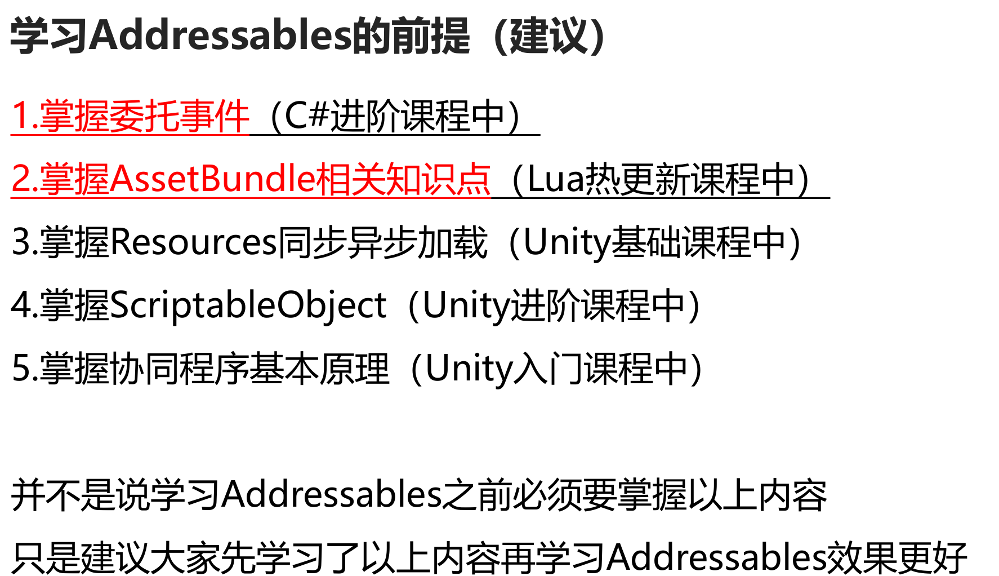
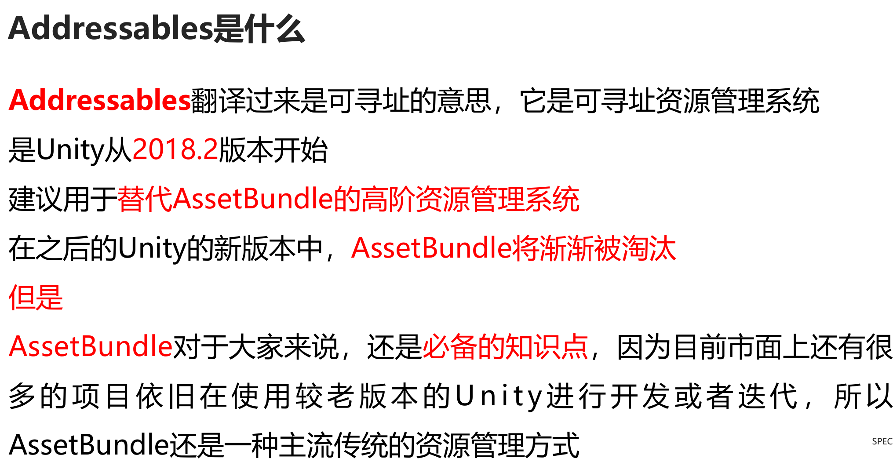
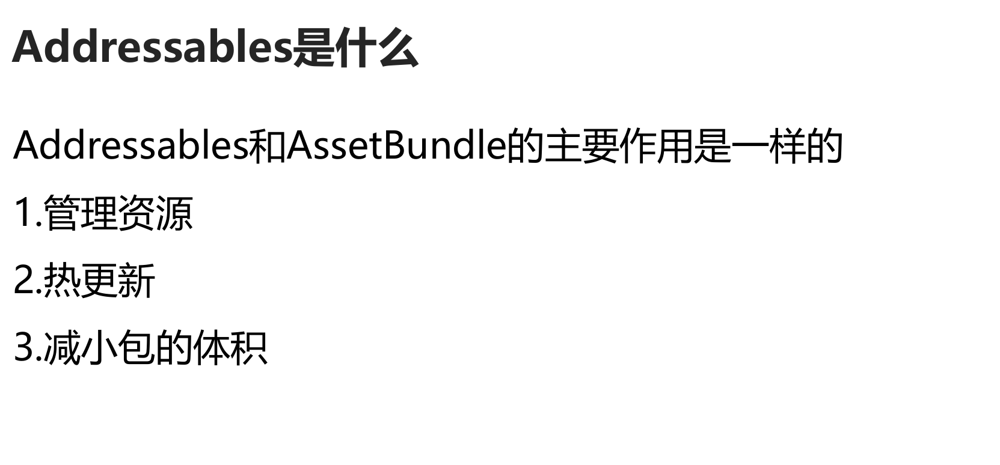
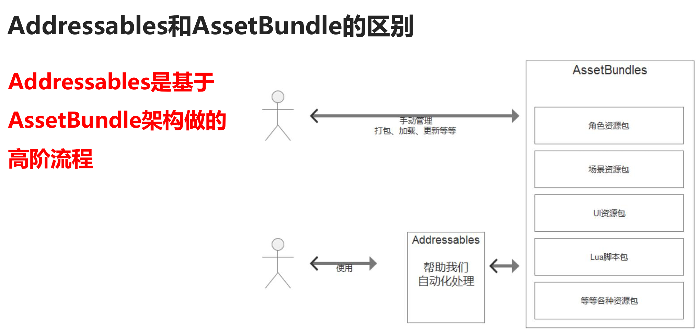
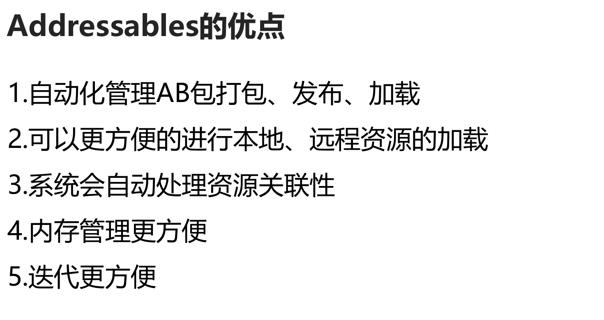
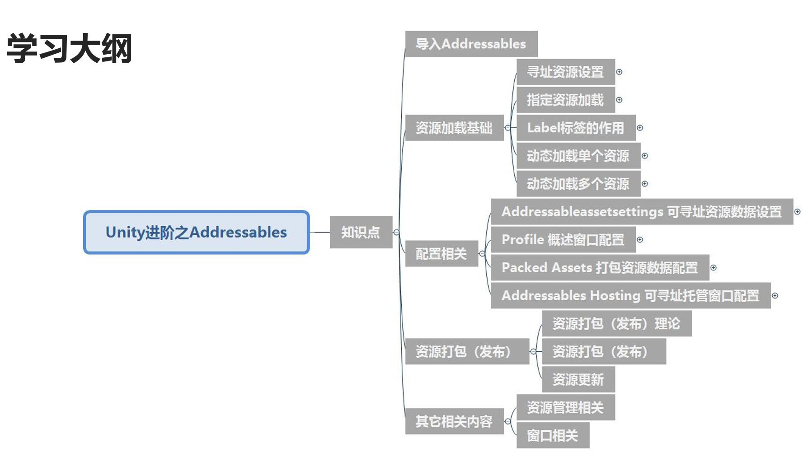
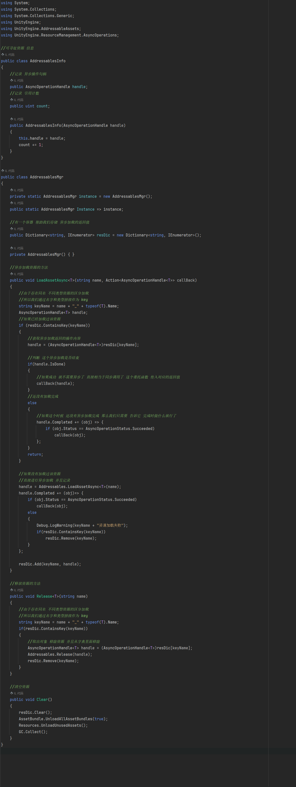
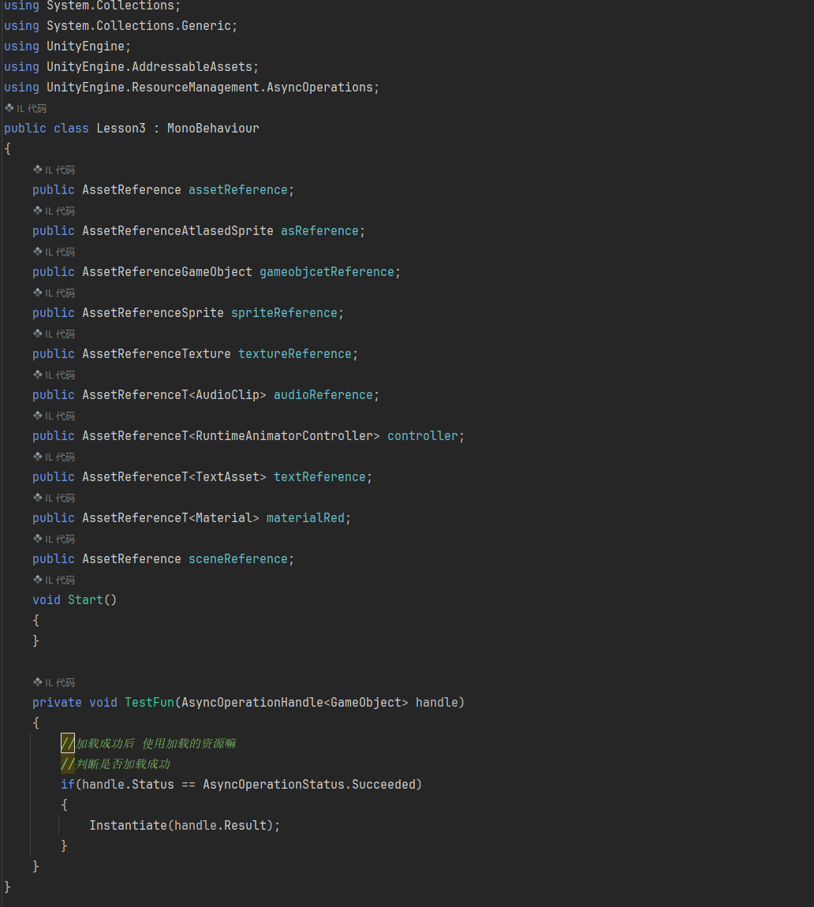

## 一、Addressable概述

### ①概述

### ②导入Addressable

#### 导入Addressable

##### 知识点一 导入Addressables包 

- 1.打开Window——>Package Manager窗口 
- 2.设置包为Unity Registry 
- 3.找到Addressables包 进行安装

##### 知识点二 创建配置相关文件 

- 方法一：打开资源组窗口 
- 1.Window——>Asset Management——>Addressables——>Groups 
- 2.在窗口中点击 Create Addressables Settings按钮 创建配置文件 
  
- 方法二：在Inspector窗口中为资源勾选Addressable 
- 如果没有创建过配置相关文件，这时会自动创建相关文件

## 二、资源加载基础

### ①寻址资源设置

##### 知识点一 让资源变为可寻址资源 

- 方法一：选中资源，勾选Inspector窗口中的Addressable 
- 方法二：选中资源，拖入Addressables Groups窗口中 
  
- 注意： 
- 1.C#代码无法作为可寻址资源 
- 2.Resources文件夹下资源如果变为寻址资源，会移入Resources_moved文件夹中 
-   原因：Resources文件夹下资源会最终打包出去，如果变为可寻址资源意味着想通过Addressables进行管理 
-   那么它就没有必要通过Resources方式去加载和打包，所以会自动迁移，避免重复打包，浪费空间 
  
- 右键选择资源时菜单内容 
- Move Addressables to Group：将该资源放入到现有的另一个组中 
- Move Addressables to New Gourp：使用与当前组相同设置创建一个新租，并将该资源放入该新组中 
- Rmove Addressables：移除资源，该资源会变为不可寻址资源 
- Simplify Addressable Names：简化可寻址资源名，会删除名称中的路径和拓展，简化缩短名称 
- Copy Address to Clipboard：将地址复制到剪贴板 
- Change Address：改名 
- Create New Group：创建新租

##### 知识点二 资源组窗口讲解 

  
- ###### 资源信息（关键） 
- 1.GroupName\Addressable Name：分组名\可寻址名（可重名，描述资源） 
- 2.Path：路径（不可重复，资源定位） 
- 3.Labels：标签（可重复、可用于区分资源种类，例如青铜装备、黄金装备） 

  
- ###### 创建分组相关 
- Create――>Group 
- Packed Assets:打包资源分组 
- Blank(no schema):空白（无架构） 
- 区别：Packed Assets默认自带默认打包加载相关设置信息，Blank没有相关信息需要自己关联 
  
- 组对于我们来说意义重大，之后在资源打包时，一个组可以作为一个或多个AB包 
  
- 关于组设置相关信息，之后详细讲解 

  
- ###### 选中某一组后右键 
- Remove Group(s):移除组，组中所有资源恢复为不可寻址资源 
- Simplify Addressable Names:简化可寻址名称，会删除名称中的路径和拓展，简化缩短名称 
- Set as Default:设置为默认组，当直接勾选资源中的Addressable时，会自动加入该组 
- Inspect Group Setting:快速选中关联的组相关配置文件 
- Rename:重命名 
- Create New Group:创建新组 

  
- ###### 配置概述相关 
- Manage Profiles：管理配置文件 
- 可以配置打包目标、本地远程的打包加载路径等等信息（之后再详细讲解） 

  
- ###### Tools工具相关 
- Inspect System Settings：检查系统设置 
- Check for content Update Restrictions:检查内容更新限制 
- Window：打开Addressables相关窗口 
- Groups View：分组视图相关 
-   Show Sprite and Subobject Addressable：显示可寻址对象的精灵和子对象，一般想要看到图集资源内内容时可以勾选该选项 
-   Group Hierarchy with Dashes：带破折号的组层次结构 

  
- ###### Play Mode Script播放模式脚本（编辑模式下如何运行） 
- 确定在编辑器播放模式下运行游戏时，可寻址系统如何访问可寻址资源 
- Use Asset Database（fastest）： 
- 使用资源数据库（最快的），一般在开发阶段使用，使用此选项时，您不必打包可寻址内容，它会直接使用文件夹中的资源 
- 在实际开发时，可以不使用这种模式，这种模式没有测试的意义 
  
- Simulate Groups（advanced）： 
- 模拟组（后期），一般在测试阶段使用，分析布局和依赖项的内容，而不创建AB包 
- 通过ResourceManager从资产数据库加载资产，就像通过AB包加载一样 
- 通过引入时间延迟，模拟远程资产绑定的下载速度和本地绑定的文件加载速度 
- 在开发阶段可以使用这个模式来进行资源加载 
  
- Use Existing Build（requires built groups）：
- 正儿八经的从AB包加载资源 
- 使用现有AB包（需要构建AB包），一般在最终发布测试阶段使用 
- 从早期内容版本创建的AB包加载资产 
- 在使用此选项之前，必须使用生成脚本（如默认生成脚本）打包资源 
- 远程内容必须托管在用于生成内容的配置文件的RemoteLoadPath上 

  
- ###### Build（构建打包相关） 
- New Build：构建AB包资源（相当于打包资源分组） 
- Update a Previour Build：更新以前的版本 
- Clean Build：清空之前的构建资源

##### 知识点三 资源名注意事项 

- 1.资源路径一定不允许相同（后缀不同，名字相同可以） 
- 2.资源名我们可以随意修改 
- 3.之后在加载资源时我们可以使用名字和标签作为双标识加载指定资源

##### 知识点四 资源分组 

- 我们可以按规则将资源进行分组 
- 比如：角色、装备、怪物、UI等等

### ②指定资源加载

##### 知识点一 资源准备 

- 我们准备一些常用的各类型的资源 
- 1.GameObject预设体 
- 2.精灵图片 
- 3.图集 
- 4.贴图 
- 5.材质球 
- 6.配置文件（json、xml、txt、2进制） 
- 7.Lua脚本 
- 8.音效 
- 9.Animator Controller 动画状态机控制文件 
- 10.场景

##### 知识点二 Addressables中的资源标识类 

- 命名空间：using UnityEngine.AddressableAssets; 
  
- AssetReference                通用资源标识类 可以用来加载任意类型资源 
- AssetReferenceAtlasedSprite   图集资源标识类 
- AssetReferenceGameObject      游戏对象资源标识类 
- AssetReferenceSprite          精灵图片资源标识类 
- AssetReferenceTexture         贴图资源标识类 
- AssetReferenceTexture2D 
- AssetReferenceTexture3D 
- AssetReferenceT<>             指定类型标识类 
  
- 通过不同类型标识类对象的申明 我们可以在Inspector窗口中筛选关联的资源对象

##### 知识点三 加载资源 
- 注意：所有Addressables加载相关都使用异步加载 
- 需要引用命名空间：using UnityEngine.ResourceManagement.AsyncOperations; 
- *AsyncOperationHandle\<GameObject> handle = assetReference.LoadAssetAsync\<GameObject>();* 
- 加载成功后使用 
- 1.通过事件函数传入的参数判断加载是否成功 并且创建 
- 2.通过资源标识类对象判断 并且创建 
  
- 通过异步加载返回值 对完成进行事件监听 
- *handle.Completed += TestFun;* 
  
- *assetReference.LoadAssetAsync\<GameObject>().Completed += (handle) =>* 
- *{* 
- 使用传入的参数（建议） 
- 判断是否加载成功 
-     *if (handle.Status == AsyncOperationStatus.Succeeded)* 
-     *{*
-         *GameObject cube = Instantiate(handle.Result);* 
-     一定资源加载过后 使用完后 再去释放 
-         *assetReference.ReleaseAsset();* 
  
-         *materialRed.LoadAssetAsync().Completed += (obj) =>* 
-         *{* 
-             *cube.GetComponent\<MeshRenderer>().material = obj.Result;* 
-             这样会造成使用这个资源的对象 资源丢失 
-             *materialRed.ReleaseAsset();* 
  
-             这个异步加载传入对象的资源 
-             *print(obj.Result);* 
-             这个是 资源标识类的资源 
-             *print(materialRed.Asset);* 
-         *};* 
-     *}* 
-     使用标识类创建 
-     *if(assetReference.IsDone)* 
-     *{* 
-         *Instantiate(assetReference.Asset);* 
-     *}*
- *};* 
  
- *audioReference.LoadAssetAsync().Completed += (handle) =>* 
- *{* 
-     使用音效 
- *}*

#### 知识点四 加载场景 

- *sceneReference.LoadSceneAsync().Completed += (handle) =>* 
- *{* 
-     初始化场景的一些信息 
-     *print("场景加载结束");* 
- *};*

#### 知识点五 释放资源 

- 释放资源相关API 
- ReleaseAsset 
- 写在这不合理 
- assetReference.ReleaseAsset(); 
- 1.释放资源方法后,资源标识类中的资源会置空，但是AsyncOperationHandle类中的对象不为空 
- 2.释放资源不会影响场景中被实例化出来的对象，但是会影响使用的资源

#### 知识点六 直接实例化对象 

- 只适用于 想要实例化的 对象 才会直接使用该方法 一般都是GameObject预设体 
- gameobjcetReference.InstantiateAsync();

#### 知识点七 自定义标识类 

- 自定义类 继承AssetReferenceT\<Material>类 即可自定义一个指定类型的标识类 
- 该功能主要用于Unity2020.1之前，因为之前的版本不能直接使用AssetReferenceT泛型字段

#### 知识点八 总结 

- 1.我们可以根据自己的需求选择合适的标识类进行资源加载 
- 2.资源加载和场景加载都是通过异步进行加载 
- 3.需要注意异步加载资源使用时必须保证资源已经被加载成功了，否则会报错

### ③Label标签的作用

##### 知识点一 我们会经常使用指定资源加载的方式加载资源吗？ 

- 并不会经常使用，要根据实际情况 

- 我们上节课学了加载指定资源 
- 但是这种模式我们必须在脚本中声明各种标识类来指定加载的资源,不够灵活,做一些小项目没问题 
- 但是在实际商业项目开发中，很多时候加载什么资源都是根据配置文件决定的，往往都是动态加载 
- 所以我们需要学习根据名字或标签去加载对应的资源，这样我们就可以读表进行加载

##### 知识点二 添加标签

##### 知识点三 标签的作用 

- 首先需要强调 
- 我们之后学习动态加载资源时 
- 是可以通过名和标签来加载资源的 
  
- ###### 举例说明 1 
- 游戏装备中有一顶帽子：Hat 
- 但是它可以有不同的品质，比如：红、绿、白、蓝 
- 那么我们可以为这个帽子添加多个材质球资源（或者贴图资源） 
- 这些图都可以叫做：Hat_Mat（或者Hat_Tex） 
- 他们可以同名，我们可以通过标签Label来区分他们 
- 他们的Label可以是：Red、Green、White、Blue 
  
- ###### 举例说明 2 
- 游戏中我们经常根据设备好坏来选择不同质量的图片或者模型 
- 比如：高清、标清、超清 
- 不同标准下的资源会有所不同，比如模型面数更低、贴图质量更低 
- 但是在不同标准下，这些模型的命名应该是同样的 
- 比如角色1，在高清、标清、超清下它的资源名都是角色1 
- 它的Label可以是：HD、SD、FHD 
  
- ###### 举例说明 3 
- 游戏中我们经常在逢年过节时更换游戏中模型和UI的显示 
- 比如：中秋节、春节、圣诞节 
- 不同节日时角色或者UI等等资源看起来是不同的 
- 但是在不同节日下，这些资源的命名应该都是同样的规范 
- 比如登录面板，在中秋节、春节、圣诞节时它的资源名都是 登录面板 
- 它的Label可以是：MidAutumn、Spring、Christmas 
  
- ###### 总结：相同作用的不同资源（模型、贴图、材质、UI等等） 
- 我们可以让他们的资源名相同 
- 通过标签Label区分他们来加载使

##### 知识点四 通过标签相关特性约束标识类对象 

- 特性[AssetReferenceUILabelRestriction()]

##### 知识点五 总结 

- 相同作用的不同资源 
- 我们可以让他们的资源名相同 
- 通过标签Label区分他们来用途 
- 用于之后的动态加载 
  
- 利用名字和标签可以单独动态加载某个资源 
- 也可以利用它们共同决定加载哪个资源

### ④动态加载单个资源

##### 知识点一 通过资源名或标签名动态加载单个资源 

- ==命名空间==： 
- ==UnityEngine.AddressableAssets== 和 ==UnityEngine.ResourceManagement.AsyncOperations ==
- *handle = Addressables.LoadAssetAsync\<GameObject>("Cube");* 
- *handle.Completed += (handle) =>* 
- *{* 
-     判断加载成功 
-     *if (handle.Status == AsyncOperationStatus.Succeeded)* 
-     *Instantiate(handle.Result);* 
  
-     一定要是 加载完成后 使用完毕后 再去释放 
-     不管任何资源 只要释放后 都会影响之前在使用该资源的对象 
-     //*Addressables.Release(handle);* 
- }; 
  
- *Addressables.LoadAssetAsync\<GameObject>("Red").Completed += (handle) =>* 
- { 
-     判断加载成功 
-     *if (handle.Status == AsyncOperationStatus.Succeeded)* 
-     *Instantiate(handle.Result);* 
- }; 
  
- 注意： 
- 1.如果存在同名或同标签的同类型资源，我们无法确定加载的哪一个，它会自动加载找到的第一个满足条件的对象 
- 2.如果存在同名或同标签的不同类型资源，我们可以根据泛型类型来决定加载哪一个

##### 知识点二 释放资源 

- 需要指定要释放哪一个返回值 
- 写在这是否合理？ 
- 不合理 
- Addressables.Release(handle);

##### 知识点三 动态加载场景 

- 参数一：场景名 
- 参数二：加载模式 （叠加还是单独,叠加就是两个场景一起显示,单独就是只保留新加载的场景，正常情况为单独） 
- 参数三：场景加载是否激活，如果为false，加载完成后不会直接切换，需要自己使用返回值中的ActivateAsync方法 
- 参数四：场景加载的异步操作优先级 
- *Addressables.LoadSceneAsync("SampleScene", UnityEngine.SceneManagement.LoadSceneMode.Single, false).Completed += (obj)=> {* 
- 比如说 手动激活场景 
-     *obj.Result.ActivateAsync().completed += (a) =>* 
-     *{* 
-         然后再去创建场景上的对象 
  
-         然后再去隐藏 加载界面 
  
-         注意：场景资源也是可以释放的，并不会影响当前已经加载出来的场景，因为场景的本质只是配置文件 
-         *Addressables.Release(obj);* 
-     *};* 
- *};*

##### 知识点四 总结 

- 1.根据名字或标签加载单个资源相对之前的指定加载资源更加灵活 
-   主要通过Addressables类中的静态方法传入资源名或标签名进行加载 
-   注意： 
-   1-1.如果存在同名或同标签的同类型资源，我们无法确定加载的哪一个，它会自动加载找到的第一个满足条件的对象 
-   1-2.如果存在同名或同标签的不同类型资源，我们可以根据泛型类型来决定加载哪一个 
  
- 2.释放资源时需要传入之前记录的AsyncOperationHandle对象 
-   注意：一定要保证资源使用完毕过后再释放资源 
  
- 3.场景异步加载可以自己手动激活加载完成的场景

### ⑤动态加载多个资源

##### 知识点一 根据资源名或标签名加载多个对象 

- 加载资源 
- 参数一：资源名或标签名 
- 参数二：加载结束后的回调函数 
- 参数三：如果为true表示当资源加载失败时，会自动将已加载的资源和依赖都释放掉；如果为false，需要自己手动来管理释放 
- *AsyncOperationHandle<IList\<Object>> handle = Addressables.LoadAssetsAsync\<Object>("Red", (obj) =>* 
- *{* 
-     *print(obj.name);* 
- *});* 
  
- 如果要进行资源释放管理 那么我们需要使用这种方式 要方便一些 
- 因为我们得到了返回值对象 就可以释放资源了 
- *handle.Completed += (obj) =>* 
- *{* 
-     *foreach (var item in obj.Result)* 
-     *{*
-         *print(item.name);* 
-     *}* 
- 释放资源 
-     *Addressables.Release(obj);* 
- *};* 
- 注意：我们还是可以通过泛型类型，来筛选资源类型

##### 知识点二 根据多种信息加载对象 

- 参数一：想要加载资源的条件列表（资源名、Lable名） 
- 参数二：每个加载资源结束后会调用的函数，会把加载到的资源传入该函数中 
- 参数三：可寻址的合并模式，用于合并请求结果的选项。 
- 如果键（Cube，Red）映射到结果（[1,2,3]，[1,3,4]），数字代表不同的资源 
- None：不发生合并，将使用第一组结果 结果为[1,2,3] 
- UseFirst：应用第一组结果 结果为[1,2,3] 
- Union：合并所有结果 结果为[1,2,3,4] 
- Intersection：使用相交结果 结果为[1,3] 
- 参数四：如果为true表示当资源加载失败时，会自动将已加载的资源和依赖都释放掉 
-       如果为false，需要自己手动来管理释放 
- *List\<string> strs = new List\<string>() { "Cube", "HD" };* 
- *Addressables.LoadAssetsAsync\<Object>(strs, (obj) => {* 
- *print(obj.name);* 
- *}, Addressables.MergeMode.Intersection);* 
  
- 注意：我们还是可以通过泛型类型，来筛选资源类型

##### 总结 

- 1.可以根据 资源名或标签名+资源类型 来加载所有满足条件的对象 
- 2.可以根据 资源名+标签名+资源类型+合并模式 来加载指定的单个或者多个对象

