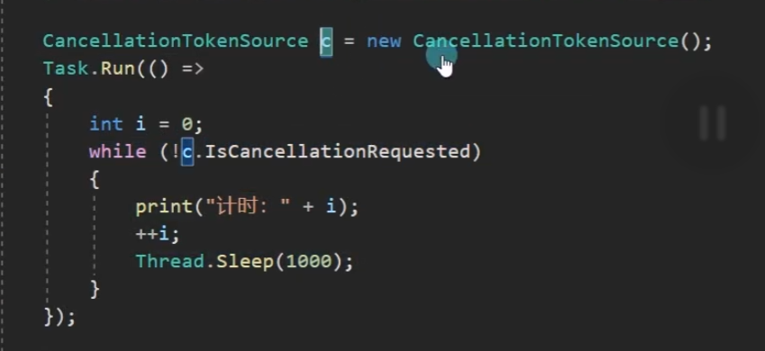

## Unity跨平台的基本原理

### ①.了解.Net相关知识


### ②.Unity跨平台的基本原理


### ③Unity跨平台的基本原理(IL2CPP)

#### Unity跨平台的基本原理(IL2CPP)


### ③IL2CPP模式可能存在的问题处理

#### IL2CPP模式可能存在的问题处理

##### 知识点一 ——安装Unity IL2CPP打包工具

- 在Unityhub中下载 IL2CPP打包相关工具


##### 知识点二 ——IL2CPP打包存在的问题——类型裁剪

- IL2CPP在打包时会自动对Unity工程的DLL进行裁剪，将代码中没有引用到的类型裁剪掉，
- 以达到减小发布后包的尺寸的目的
- 然而在实际使用过程中，很多类型有可能会被意外剪裁掉，
- 造成运行时抛出找不到某个类型的异常
- 特别是通过反射等方式在编译时无法得知的函数调用，在运行时都很有可能遇到问题

- ### 解决方案：

- 1.IL2CPP处理模式时，将PlayerSetting -> Other Setting -> Managed Stripping Level(代码剥离)设置为Low
- Disable:Mono模式下才能设置为不删除任何代码
- Low:默认低级别，保守的删除代码，删除大多数无法访问的代码，同时也最大程度减少剥离实际使用的代码的可能性
- Medium:中等级别，不如低级别剥离谨慎，也不会达到高级别的极端
- Hight:高级别，尽可能多的删除无法访问的代码，优先优化尺寸减小。如果选择该模式一般需要配合link.xml使用

- 2.通过Unity提供的link.xml方式来告诉Unity引擎，哪些类型是不能够被剪裁掉的
- 在Unity工程的Assets目录中（或其任何子目录中）建立一个叫Link.xml的XML文件


##### 知识点三 —— IL2CPP打包存在的问题——泛型问题
- 我们上节课提到了IL2CPP和Mono最大的区别是 不能在运行时动态生成代码和类型
- 就是说 泛型相关的内容，如果你在打包生成前没有把之后想要使用的泛型类型显示使用一次
- 那么之后如果使用没有被编译的类型，就会出现找不到类型的报错

- 举例：List\<A>和List\<B>中A和B是我们自定义的类，
- 我能必须在代码中显示的调用过，IL2CPP才能保留List\<A>和List\<B>两个类型。
- 如果在热更新时我们调用List\<C>，但是它之前并没有在代码中显示调用过，
- 那么这时就会出现报错等问题。主要就是因为JIT和AOT两个编译模式的不同造成的
- List\<A> list = new List\<A>();
- List\<B> list2 = new List\<B>();

- 解决方案：
- 泛型类：声明一个类，然后在这个类中声明一些public的泛型类变量
- 泛型方法：随便写一个静态方法，在将这个泛型方法在其中调用一下。这个静态方法无需被调用
- 这样做的目的其实就是在预言编译之前让IL2CPP知道我们需要使用这个内容

## 二、C#各版本新功能和语法

### ①C#1~4功能和语法

#### 命名和可选参数、动态类型等

##### 知识点一 最低支持的C#版本

- 只要是Unity 5.5及以上的版本
- 就支持C# 4版本

##### 知识点二 C# 1~4的功能和语法有哪些？

- 注意：在这里不会提及所有的内容
-     主要会提及Unity开发中会用到的一些功能和特性
-     对于一些不适合在Unity中使用的内容会省略

- C# 1 —— 委托、事件（C#进阶套课）

- C# 2 —— 泛型、匿名方法、迭代器、可空类型（C#进阶套课）

- C# 3 ——
- 隐式类型、对象集合初始化、Lambda表达式、匿名类型（C#进阶套课）
- 自动实现属性、拓展方法、分部类（C#核心套课）
- Linq相关的表达式树（以后专门讲）

- C# 4 ——
- 泛型的协变和逆变（C#进阶套课）
- 命名和可选参数
- 动态类型

##### 知识点三 补充未讲解全面的内容 命名和可选参数

- 有了命名参数，我们将不用匹配参数在所调用方法中的顺序
- 每个参数可以按照参数名字进行指定
- *Test(1, 1.2f, true);*
- *Test(f: 3.3f, i: 5, b: false);*
- *Test(b: false, f: 3.4f, i: 3);*

- 命名参数可以配合可选参数使用,让我们做到跳过其中的默认参数直接赋值后面的默认参数
- *Test2(1, true, "234");*
- *Test2(1, s: "234");*

- 好处：可以让我们更方便的调用函数，少写一些重载函数

##### 知识点四 补充未讲解的内容 动态类型

- 关键词：dynamic
- 作用：通过dynamic类型标识变量的使用和对其成员的引用绕过编译时类型检查
-      改为在运行时解析这些操作。
-      在大多数情况下，dynamic类型和object类型行为类似
-      任何非Null表达式都可以转换为dynamic类型。
-      dynamic类型和object类型不同之处在于，
-      编译器不会对包含类型 dynamic 的表达式的操作进行解析或类型检查
-      编译器将有关该操作信息打包在一起，之后这些信息会用于在运行时评估操作。
-      在此过程中，dynamic 类型的变量会编译为 object 类型的变量。
-      因此，dynamic 类型只在编译时存在，在运行时则不存在。

- 注意：1.使用dynamic功能 需要将Unity的.Net API兼容级别切换为.Net 4.x
-      2.IL2CPP 不支持 C# dynamic 关键字。它需要 JIT 编译，而 IL2CPP 无法实现
-      3.动态类型是无法自动补全方法的，我们在书写时一定要保证方法的拼写正确性
-         所以该功能我们只做了解，不建议大家使用

- 举例说明：
- *dynamic dyn = 1;*
- *object obj = 2;*

- *dyn += 2;*

- *print(obj.GetType());*
- *print(dyn.GetType());*
- *print(dyn);*

- *object t = new Test1();*
- *dynamic tmp = t;*
- *tmp.TestTest();*

- 好处：动态类型可以节约代码量，当不确定对象类型，但是确定对象成员时，可以使用动态类型
-      通过反射处理某些功能时，也可以考虑使用动态类型来替换它


##### 总结

- C# 1~4版本中的功能和语法
- 大多数我们已经在C#四部曲中学习完毕
- 命名和可选参数可以帮助我们少写一些重载函数
- 动态类型可以让我们在某些情况下节约代码量
- 但是由于要使用.Net 4.x，并且IL2CPP不支持，所以不建议使用它，但是如果有特殊需求不得不用，那我们只有退而求其次

### ②C#5功能和语法

#### 1. 回顾线程，学习线程池

##### 知识点一 C#5的新增功能和语法有哪些 

- 1.调用方信息特性（C#进阶套课——特性） 
- 2.异步方法async和await 
  
- 在学习异步方法async和await之前 
- 我们必须补充一些知识点 
- 1.线程和线程池 
- 2.Task类 
- 我们这节课先来回顾和学习线程和线程池

##### 知识点二 回顾知识点——线程 

- 1.Unity支持多线程 
- 2.Unity中开启的多线程不能使用主线程中的对象 
- 3.Unity中开启多线程后一定记住关闭 
- t = new Thread(()=> { 
-     while (true) 
-     { 
-         print("123"); 
-         Thread.Sleep(1000); 
-     } 
- }); 
- t.Start(); 
- print("主线程执行");

##### 知识点三 补充知识点——线程池 

- 命名空间：System.Threading 
- 类名：ThreadPool（线程池） 
  
- 在多线程的应用程序开发中，频繁的创建删除线程会带来性能消耗，产生内存垃圾 
- 为了避免这种开销C#推出了 线程池ThreadPool类 
  
- ThreadPool中有若干数量的线程，如果有任务需要处理时，会从线程池中获取一个空闲的线程来执行任务 
- 任务执行完毕后线程不会销毁，而是被线程池回收以供后续任务使用 
- 当线程池中所有的线程都在忙碌时，又有新任务要处理时，线程池才会新建一个线程来处理该任务， 
- 如果线程数量达到设置的最大值，任务会排队，等待其他任务释放线程后再执行 
- 线程池能减少线程的创建，节省开销，可以减少GC垃圾回收的触发 
  
- 线程池相当于就是一个专门装线程的缓存池（Unity小框架套课中有对缓存池的详细讲解） 
- 优点：节省开销，减少线程的创建，进而有效减少GC触发 
- 缺点：不能控制线程池中线程的执行顺序，也不能获取线程池内线程取消/异常/完成的通知 
  
- ThreadPool是一个静态类 
- 里面提供了很多静态成员 
- 其中相对重要的方法有 
  
- 1.获取可用的工作线程数和I/O线程数 
- *int num1;* 
- *int num2;* 
- *ThreadPool.GetAvailableThreads(out num1, out num2);* 
- *print(num1);* 
- *print(num2);* 

  
- 3.设置线程池中可以同时处于活动状态的 工作线程的最大数目和I/O线程的最大数目 
-   大于次数的请求将保持排队状态，知直到线程池线程变为可用 
-   更改成功返回true，失败返回false 
- *if(ThreadPool.SetMaxThreads(20, 20))* 
- *{* 
-     *print("更改成功");* 
- *}* 
  
- 2.获取线程池中工作线程的最大数目和I/O线程的最大数目 
- *ThreadPool.GetMaxThreads(out num1, out num2);* 
- *print(num1);* 
- *print(num2);* 
  
- 5.设置 工作线程的最小数目和I/O线程的最小数目 
- *if(ThreadPool.SetMinThreads(5, 5))* 
- *{*
-     *print("设置成功");* 
- *}* 
- 4.获取线程池中工作线程的最小数目和I/O线程的最小数目 
- *ThreadPool.GetMinThreads(out num1, out num2);* 
- *print(num1);* 
- *print(num2);* 
  
- 6.将方法排入队列以便执行，当线程池中线程变得可用时执行 
  
- *ThreadPool.QueueUserWorkItem((obj) =>* 
- *{* 
-     *print(obj);* 
-     *print("开启了一个线程");* 
- *}, "123452435345");* 
  
- *for (int i = 0; i < 10; i++)*  
- *{* 
-     *ThreadPool.QueueUserWorkItem((obj) =>* 
-     *{* 
-         *print("第" + obj + "个任务");* 
-     *}, i);* 
- *}* 
  
- *print("主线程执行");*

##### 总结 

- 线程池 是一个C#写好的 装线程的缓存池 
  
- 优点：可以在我们频繁的需要创建删除线程时提高性能，节约内存 
- 缺点：不能控制线程池中线程的执行顺序，也不能获取线程池内线程取消/异常/完成的通知


#### 2.Task任务类

##### 知识点一 认识Task 

- 命名空间：System.Threading.Tasks 
- 类名：Task 
- Task顾名思义就是任务的意思 
- Task是在线程池基础上进行的改进，它拥有线程池的优点，同时解决了使用线程池不易控制的弊端 
- 它是基于线程池的优点对线程的封装，可以让我们更方便高效的进行多线程开发 
  
- 简单理解： 
- Task的本质是对线程Thread的封装，它的创建遵循线程池的优点，并且可以更方便的让我们控制线程 
- 一个Task对象就是一个线程

##### 知识点二 创建无返回值Task的三种方式 

- 1.通过new一个Task对象传入委托函数并启动 
- *Task t1 = new Task(() =>* 
- *{* 
-     *int i = 0;* 
-     *while (isRuning)* 
-     *{* 
-         *print("方式一:" + i);* 
-         *++i;* 
-         *Thread.Sleep(1000);* 
-     *}* 
- *});* 
- *t1.Start();* 
  
- 2.通过Task中的Run静态方法传入委托函数 
- *Task t2 = Task.Run(() =>* 
- *{* 
-     *int i = 0;* 
-     *while (isRuning)* 
-     *{* 
-         *print("方式二:" + i);* 
-         *++i;* 
-         *Thread.Sleep(1000);* 
-     *}* 
- *});* 
  
- 3.通过Task.Factory中的StartNew静态方法传入委托函数 
- *Task t3 = Task.Factory.StartNew(() =>* 
- *{* 
-     *int i = 0;* 
-     *while (isRuning)* 
-     *{* 
-         *print("方式三:" + i);*  
-         *++i;* 
-         *Thread.Sleep(1000);* 
-     *}* 
- *});*

##### 知识点三 创建有返回值的Task 

- 1.通过new一个Task对象闯入委托函数并启动 
- *t1 = new Task<\int>(() =>* 
- *{* 
-     *int i = 0;* 
-     *while (isRuning)* 
-     *{* 
-         *print("方式一:" + i);* 
-         *++i;* 
-         *Thread.Sleep(1000);* 
-     *}* 
-     *return 1;* 
- *});* 
- *t1.Start();* 
  
- - 2.通过Task中的Run静态方法传入委托函数 
- *t2 = Task.Run<\string>(() =>* 
- *{* 
-     *int i = 0;* 
-     *while (isRuning)* 
-     *{* 
-         *print("方式二:" + i);* 
-         *++i;* 
-         *Thread.Sleep(1000);* 
-     *}* 
-     *return "1231";* 
- *});* 
  
- - 3.通过Task.Factory中的StartNew静态方法传入委托函数  
- *t3 = Task.Factory.StartNew\<float>(() =>* 
- *{* 
-     *int i = 0;* 
-     *while (isRuning)* 
-     *{* 
-         *print("方式三:" + i);* 
-         *++i;* 
-         *Thread.Sleep(1000);* 
-     *}* 
-     *return 4.5f;* 
- *});* 
  
  
- 获取返回值 
- 注意： 
- ==Resut获取结果时会阻塞线程 ==
- ==即如果task没有执行完成 ==
- ==会等待task执行完成获取到Result ==
- ==然后再执行后边的代码,也就是说 执行到这句代码时 由于我们的Task中是死循环== 
- # 主线程就会被卡死 
- *print(t1.Result);* 
- *print(t2.Result);* 
- *print(t3.Result);* 
  
- *print("主线程执行");*

##### 知识点四 同步执行Task 

- 刚才我们举的例子都是通过多线程异步执行的 
- 如果你希望Task能够同步执行 
- 只需要调用Task对象中的RunSynchronously方法 
- 注意：需要使用 new Task对象的方式，因为Run和StartNew在创建时就会启动 
  
- *Task t = new Task(()=> {* 
-     *Thread.Sleep(1000);* 
-     *print("哈哈哈");* 
- *});* 
- *- t.Start();*
- *t.RunSynchronously();* 
- *print("主线程执行");* 
- 不Start 而是 RunSynchronously

##### 知识点五 Task中线程阻塞的方式（任务阻塞） 

- 1.Wait方法：等待任务执行完毕，再执行后面的内容 
- *Task t1 = Task.Run(() =>* 
- *{* 
- *for (int i = 0; i < 5; i++)* 
- *{* 
-     *print("t1:" + i);* 
- *}});* 
  
- *Task t2 = Task.Run(() =>* 
- *{* 
- *for (int i = 0; i < 20; i++)* 
- *{        print("t2:" + i);* 
- *}});* 
- *t2.Wait();* 
  
- 2.WaitAny静态方法：传入任务中任意一个任务结束就继续执行  
- *Task.WaitAny(t1, t2);* 
  
- 3.WaitAll静态方法：任务列表中所有任务执行结束就继续执行  
- *Task.WaitAll(t1, t2);* 
  
- *print("主线程执行");*

##### 知识点六 Task完成后继续其它Task（任务延续） 

- 1.==WhenAll静态方法 + ContinueWith方法==：传入任务完毕后再执行某任务 
- *Task.WhenAll(t1, t2).ContinueWith((t) =>* 
- *{* 
-     *print("一个新的任务开始了");* 
-     *int i = 0;* 
-     *while (isRuning)* 
-     *{* 
-         *print(i);* 
-         *++i;* 
-         *Thread.Sleep(1000);* 
-     *}* 
- *});* 
  
- *Task.Factory.ContinueWhenAll(new Task[] { t1, t2 }, (t) =>* 
- *{* 
-     *print("一个新的任务开始了");* 
-     *int i = 0;* 
-     *while (isRuning)* 
-     *{* 
-         *print(i);* 
-         *++i;* 
-         *Thread.Sleep(1000);* 
-     *}* 
- *});*

- 2.==WhenAny静态方法 + ContinueWith方法==：传入任务只要有一个执行完毕后再执行某任务 
- *Task.WhenAny(t1, t2).ContinueWith((t) =>* 
- *{* 
-     *print("一个新的任务开始了");* 
-     *int i = 0;* 
-     *while (isRuning)* 
-     *{* 
-         *print(i);* 
-         *++i;* 
-         *Thread.Sleep(1000);* 
-     *}* 
- *});* 
  
- *Task.Factory.ContinueWhenAny(new Task[] { t1, t2 }, (t) =>* 
- *{* 
-     *print("一个新的任务开始了");* 
-     *int i = 0;* 
-     *while (isRuning)*  
-     *{* 
-         *print(i);* 
-         *++i;* 
-         *Thread.Sleep(1000);* 
-     *}* 
- *})*
##### 知识点七 取消Task执行 

- 方法一：通过加入bool标识 控制线程内死循环的结束 
  
- 方法二：通过==CancellationTokenSource==取消标识源类 来控制 
- CancellationTokenSource对象可以达到延迟取消、取消回调等功能 

- *CancellationTokenSource c = new CancellationTokenSource();* 
- 
- 
- 延迟取消 
- *c.CancelAfter(5000);* 
- 取消回调 
- *c.Token.Register(() =>* 
- *{* 
- *print("任务取消了");* 
- *});* 
- *Task.Run(() =>* 
- *{* 
-     *int i = 0;* 
-     *while (!c.==IsCancellationRequested==)* 
-     *{ 
-         *print("计时：" + i);*
-         *++i; 
-         *Thread.Sleep(1000);*
-     *}
- *});*
  

- 
````ad-tip

此处取消回调为  取消了Task的执行后

````

##### 总结 

- 1.Task类是基于Thread的封装 
- 2.Task类可以有返回值，Thread没有返回值 
- 3.Task类可以执行后续操作，Thread没有这个功能 
- 4.Task可以更加方便的取消任务，Thread相对更加单一 
- 5.Task具备ThreadPool线程池的优点，更节约性能

#### 异步方法async和await关键字

##### 知识点一 什么是同步和异步 

- 同步和异步主要用于修饰方法 
- 同步方法： 
- 当一个方法被调用时，调用者需要等待该方法执行完毕后返回才能继续执行 
- 异步方法： 
- 当一个方法被调用时立即返回，并获取一个线程执行该方法内部的逻辑，调用者不用等待该方法执行完毕 
  
- 简单理解异步编程 
- 我们会把一些不需要立即得到结果且耗时的逻辑设置为异步执行，这样可以提高程序的运行效率 
- 避免由于复杂逻辑带来的的线程阻塞

##### 知识点二 什么时候需要异步编程 

- 需要处理的逻辑会严重影响主线程执行的流畅性时 
- 我们需要使用异步编程 
- 比如： 
- 1.复杂逻辑计算时 
- 2.网络下载、网络通讯 
- 3.资源加载时 
- 等等

##### 知识点三 异步方法async和await 

- async和await一般需要配合Task进行使用 
- async用于修饰函数、lambda表达式、匿名函数 
- await用于在函数中和async配对使用,主要作用是等待某个逻辑结束 
- 此时逻辑会返回函数外部继续执行，直到等待的内容执行结束后，再继续执行异步函数内部逻辑 
- 在一个async异步函数中可以有多个await等待关键字 
- TestAsync(); 
  
- print("主线程逻辑执行"); 
  
- 使用async修饰异步方法 
- 1.在异步方法中使用await关键字（不使用编译器会给出警告但不报错），否则异步方法会以同步方式执行 
- 2.异步方法名称建议以Async结尾 
- 3.异步方法的返回值只能是void、Task、Task<> 
- 4.异步方法中不能声明使用ref或out关键字修饰的变量 
  
- 使用await等待异步内容执行完毕（一般和Task配合使用） 
- 遇到await关键字时 
- 1.异步方法将被挂起 
- 2.将控制权返回给调用者 
- 3.当await修饰内容异步执行结束后，继续通过调用者线程执行后面内容 
  
- 举例说明 
- 1.复杂逻辑计算（利用Task新开线程进行计算 计算完毕后再使用 比如复杂的寻路算法） 
- CalcPathAsync(this.gameObject, Vector3.zero); 
  
- 2.计时器 
- Timer();  
- print("主线程逻辑执行"); 
  
- 3.资源加载(Addressables的资源异步加载是可以使用async和await的) 
  
- 注意：Unity中大部分异步方法是不支持异步关键字async和await的，我们只有使用协同程序进行使用 
- 虽然官方 不支持 但是 存在第三方的工具（插件）可以让Unity内部的一些异步加载的方法 支持 异步关键字 
- https:- github.com/svermeulen/Unity3dAsyncAwaitUtil  
  
- 虽然Unity中的各种异步加载对异步方法支持不太好 
- 但是当我们用到.Net 库中提供的一些API时，可以考虑使用异步方法 
- 1.Web访问：HttpClient 
- 2.文件使用：StreamReader、StreamWriter、JsonSerializer、XmlReader、XmlWriter等等 
- 3.图像处理：BitmapEncoder、BitmapDecoder 
- 一般.Net 提供的API中 方法名后面带有 Async的方法 都支持异步方法

##### 总结 

- 异步编程async和await是一个比较重要的功能 
- 我们可以利用它配合Task进行异步编程 
  
- 虽然Unity自带的一些异步加载原本是不支持 异步方法关键字的 
- 但是可以利用别人写好的第三方工具 让他们支持 大家可以根据自己的需求 选择性使用


