## InputSystem概述

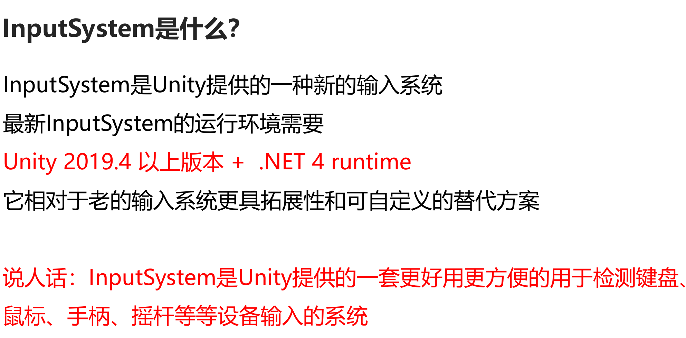
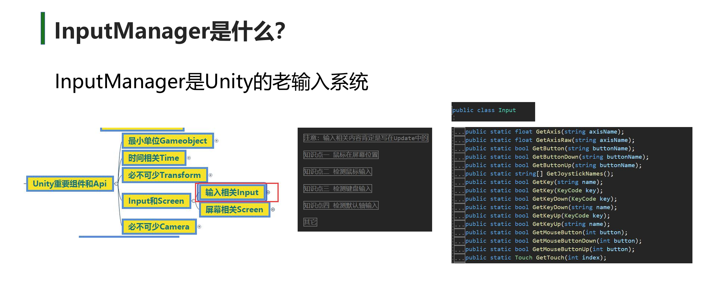
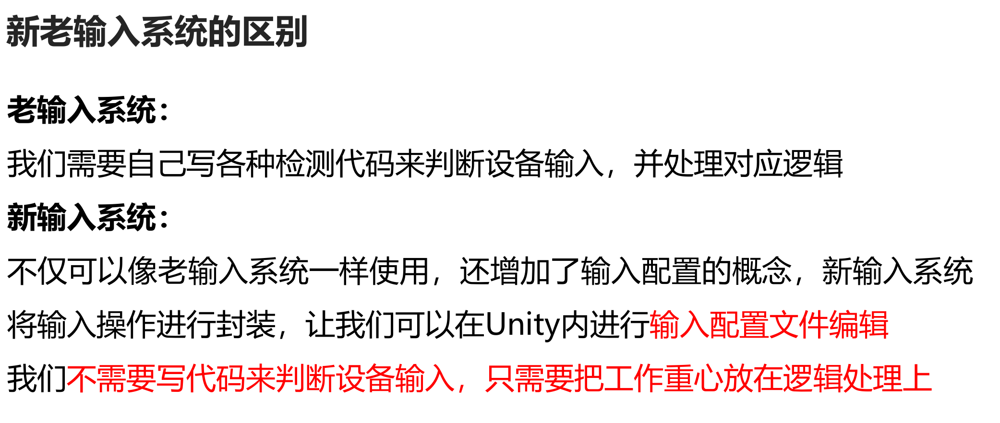
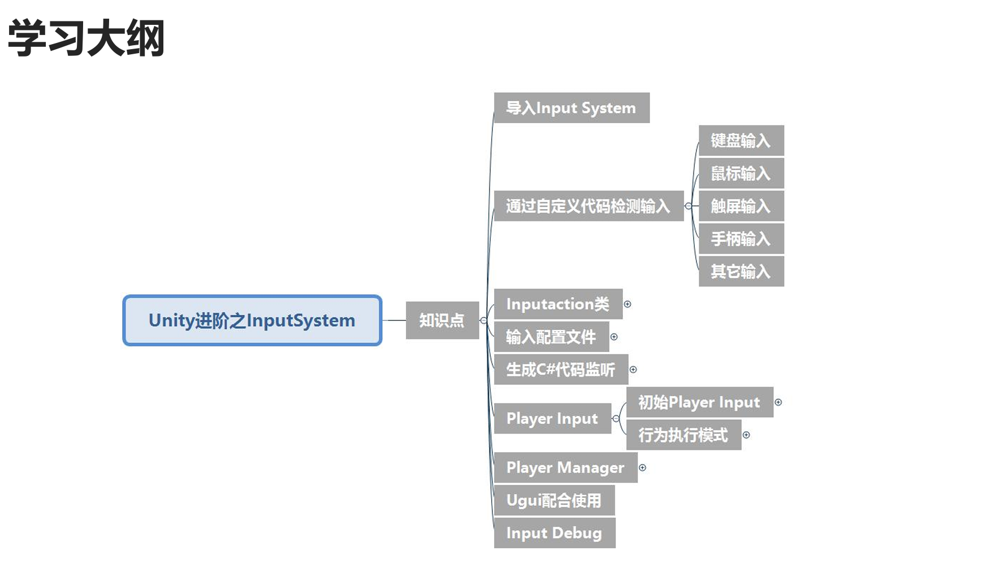
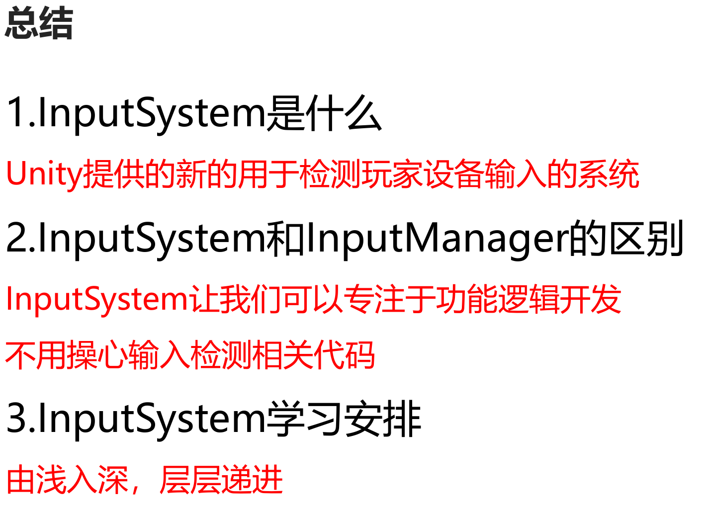

## InputSystem

### ①InputSystem导入

##### 知识点一 InputSystem包导入 

- packageManager中导入Input System
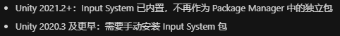

##### 知识点二 选择开启哪一种输入模式 

- 选择InputSystem和 老InputManager的启用情况 
-   File——>Build Setting——>Player Setting——>Other——>Active Input Handling 
-   可以同时启用也可以只启用其中之一,每次启用后会重启Unity

### ②代码检测输入

#### 1.键盘输入

##### 知识点一 获取当前键盘设备(需要引用命名空间) 

- 新输入系统 提供了对应的输入设备类 帮助我们对某一种设备输入进行检测 
- Keyboard keyBoard = Keyboard.current;

##### 知识点二 单个按键 按下抬起长按 

- 首先要得到某一个按键 通过键盘类对象 点出 各种按键 来获取 
- keyBoard.aKey 
- 按下 
- *if(keyBoard.enterKey.wasPressedThisFrame)* 
- *{* 
  
- *}* 
- 抬起 
- *if(keyBoard.dKey.wasReleasedThisFrame)* 
- *{* 

- *}* 

- 长按 
- *if(keyBoard.spaceKey.isPressed)* 
- *{* 
  
- **}

##### 知识点三 通过事件监听按键按下 

- 通过给keyboard对象中的 文本输入事件 添加委托函数 
- 便可以获得每次输入的内容 
- *keyBoard.onTextInput += (c) =>* 
- *{* 
-     *print("通过lambda表达式" + c);* 
- *};* 
- *keyBoard.onTextInput += TextInput;* 
- *keyBoard.onTextInput -= TextInput;*


##### 练习题

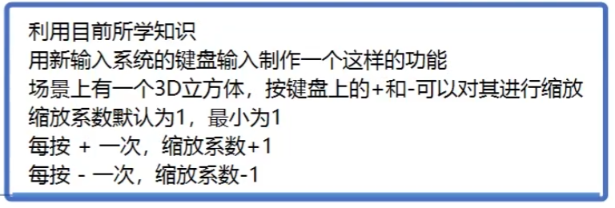

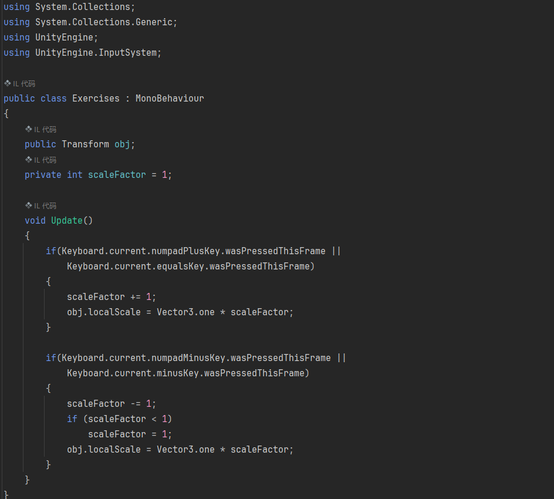


#### 2.鼠标输入

##### 知识点一 获取当前鼠标设备（需要引用命名空间） 

- Mouse mouse = Mouse.current;

##### 知识点二 鼠标各键位 按下 抬起 长按 

- 鼠标左键 
- mouse.leftButton 
- 鼠标右键 
- mouse.rightButton 
- 鼠标中键 
- mouse.middleButton 
- 鼠标 向前向后键 
- mouse.forwardButton; 
- mouse.backButton; 
  
- 按下 
- *if(mouse.leftButton.wasPressedThisFrame)* 
- *{* 
  
- *}* 
- 抬起 
- *if(mouse.leftButton.wasReleasedThisFrame)* 
- *{* 
  
- *}* 
- 长按 
- *if(mouse.rightButton.isPressed)* 
- *{* 

- *}*

##### 知识点三 鼠标位置相关 

- 获取当前鼠标位置 
- mouse.position.ReadValue(); 
- 得到鼠标两帧之间的一个偏移向量 
- mouse.delta.ReadValue(); 
  
- 鼠标中间 滚轮的方向向量 
- mouse.scroll.ReadValue();
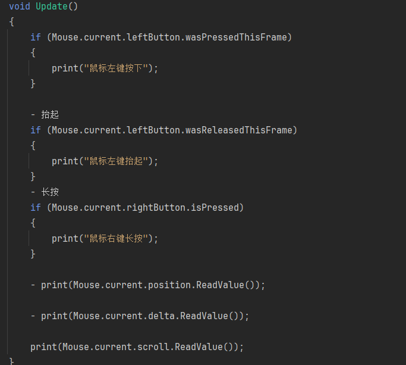

##### 练习题 
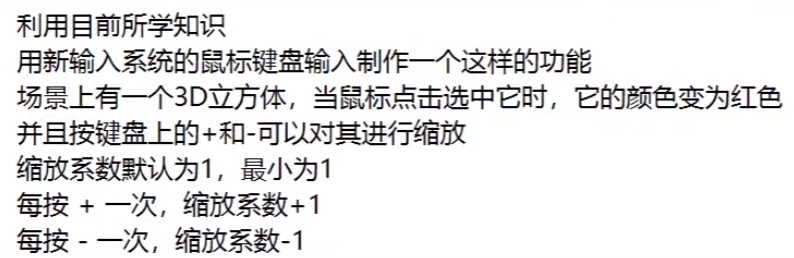
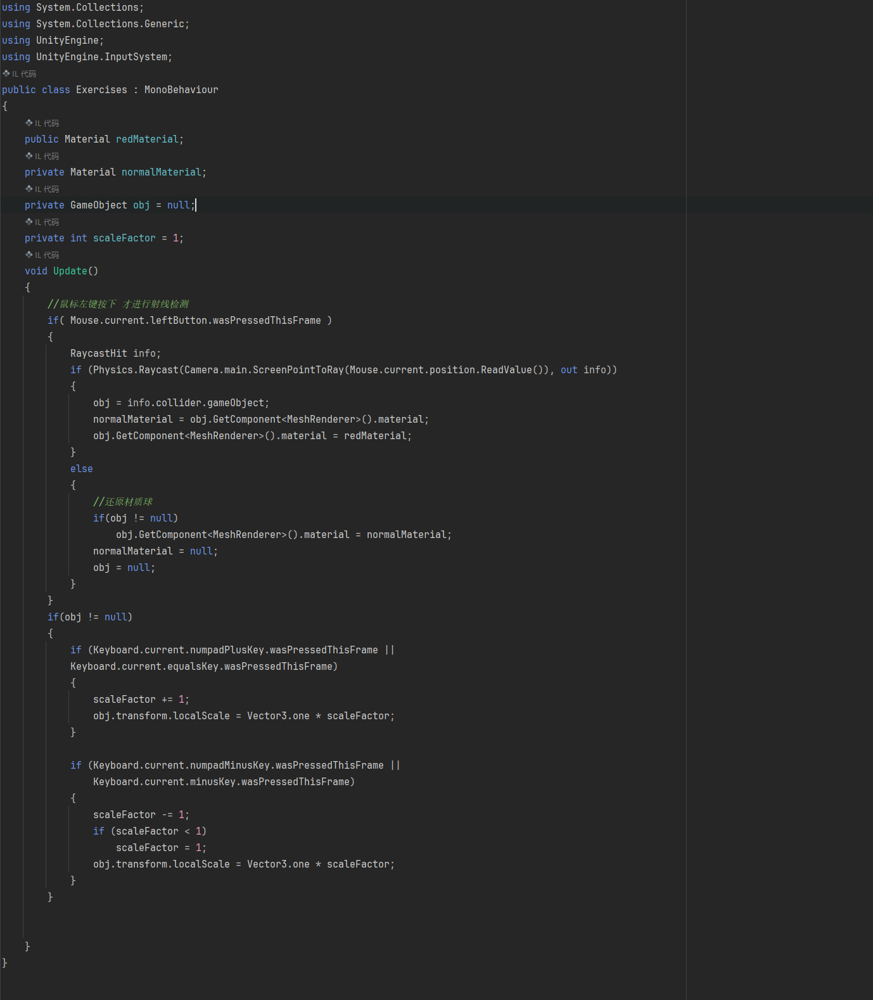

#### 3.触屏输入

##### 知识点一 获取当前触屏设备 

- *Touchscreen ts = Touchscreen.current;* 
- 由于触屏相关都是在移动平台或提供触屏的设备上使用 
- 所以在使用时最好做一次判空 
- *if (ts == null)* 
-     *return;*

##### 知识点二 得到触屏手指信息 

- 得到触屏手指数量 
- *print(ts.touches.Count);* 
- 得到单个触屏手指 
- *ts.touches[1]* 
- 得到所有触屏手指 
- *foreach (var item in ts.touches)* 
- *{* 
- *}*

##### 知识点三 手指按下 抬起 长按 点击 

- 获取指定索引手指 
- *TouchControl tc = ts.touches[0];* 
- 按下 抬起 
- *if(tc.press.wasPressedThisFrame)* 
- *{* 
  
- *}* 
- *if(tc.press.wasReleasedThisFrame)* 
- *{* 

- *}* 
- 长按 
- *if(tc.press.isPressed)* 
- *{* 
  
- *}* 
  
- 点击手势 
- *if(tc.tap.isPressed)* 
- *{* 
  
- *}* 
  
- 连续点击次数 
- *print(tc.tapCount);*

##### 知识点四 手指位置等相关信息 
- 位置 
- *print(tc.position.ReadValue());* 
- 第一次接触时位置 
- *print(tc.startPosition.ReadValue());* 
- 接触区域大小 
- *tc.radius.ReadValue();* 
- 偏移位置 
- *tc.delta.ReadValue();* 
  
- 得到当前手指的 状态（阶段） 
- *UnityEngine.InputSystem.TouchPhase tp = tc.phase.ReadValue();* 
- *switch (tp)* 
- *{* 
-     ==无 ==
-     *case UnityEngine.InputSystem.TouchPhase.None:* 
-         *break;* 
-     ==开始接触 ==
-     *case UnityEngine.InputSystem.TouchPhase.Began:* 
-         *break;* 
-     ==移动 ==
-     *case UnityEngine.InputSystem.TouchPhase.Moved:* 
-         *break;* 
-     ==结束 ==
-     *case UnityEngine.InputSystem.TouchPhase.Ended:* 
-         *break;* 
-     ==取消 ==
-     *case UnityEngine.InputSystem.TouchPhase.Canceled:* 
-         *break;* 
-     ==*静止* ==
-     *case UnityEngine.InputSystem.TouchPhase.Stationary:* 
-         *break;* 
-     ==默认==
-     *default:* 
-         *break;* 
- *}*

#### 4.手柄输入

##### 知识点一 获取当前手柄 

- Gamepad gamePad = Gamepad.current; 
- if (gamePad == null) 
- return;

##### 知识点二 手柄摇杆 

- 摇杆方向 
- 左摇杆 
- *print(gamePad.leftStick.ReadValue());* 
- 右摇杆 
- *print(gamePad.rightStick.ReadValue());* 
  
- 摇杆按下 
- 右摇杆 按下抬起长按相关 
- *gamePad.rightStickButton* 
- 左摇杆 
- *if(gamePad.leftStickButton.wasPressedThisFrame)* 
- *{*
  
- *}*
- *if(gamePad.leftStickButton.wasReleasedThisFrame)* 
- *{* 
  
- *}* 
- *if(gamePad.leftStickButton.isPressed)* 
- *{* 

- *}*

##### 知识点三 手柄方向键 

- 对应手柄上4个方向键 上下左右 
- *gamePad.dpad.left* 
- *gamePad.dpad.right* 
- *gamePad.dpad.up* 
- *gamePad.dpad.down* 
- *if(gamePad.dpad.left.wasPressedThisFrame)* 
- *{* 

- *}* 
- *if(gamePad.dpad.left.wasReleasedThisFrame)* 
- *{* 

- *}* 
- *if(gamePad.dpad.left.isPressed)* 
- *{* 
  
- *}*

##### 知识点四 手柄右侧按键 
- 通用 
- Y、△ 
- gamePad.buttonNorth 
- A、X 
- gamePad.buttonSouth 
- X、□ 
- gamePad.buttonWest 
- B、○ 
- gamePad.buttonEast 
  
- wasPressedThisFrame 
- wasReleasedThisFrame 
- isPressed 
  
- 手柄右侧按钮 x ○ △ □ A B Y - ○ 
- gamePad.circleButton 
- △ 
- gamePad.triangleButton 
- □ 
- gamePad.squareButton 
- X 
- gamePad.crossButton 
- x 
- gamePad.xButton 
- a 
- gamePad.aButton 
- b 
- gamePad.bButton 
- Y 
- gamePad.yButton

##### 识点五 手柄中央按键 

- 中央键 
- gamePad.startButton 
- gamePad.selectButton 
  
- wasPressedThisFrame 
- wasReleasedThisFrame 
- isPressed

##### 知识点六 手柄肩部按键 

- 左上右上 肩部键位 
- 左右前方肩部键 
- gamePad.leftShoulder 
- gamePad.rightShoulder 
  
- 左右后方触发键 
- gamePad.leftTrigger 
- gamePad.rightTrigger 
  
- wasPressedThisFrame 
- wasReleasedThisFrame 
- isPressed
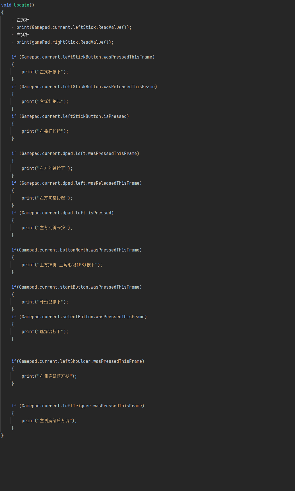

#### 5.其它输入

##### 知识点一 新输入系统中的输入设备类 

- 常用的 
- Keyboard—键盘 
- Mouse—鼠标 
- Touchscreen—触屏 
- Gamepad—手柄 
  
- 其它 
- Joystick—摇杆 
- Pen—电子笔 
  
- Sensor（传感器） 
- https://docs.unity3d.com/Packages/com.unity.inputsystem@1.2/manual/Sensors.html#accelerometer 
- Gyroscope—陀螺仪 
- GravitySensor—重力传感器 
- 加速传感器 
- 光照传感器 
- 等等

##### 知识点二 关于没有细讲的设备 

- 对于我们没有细讲的设备 
- 平时在开发中不是特别常用 
- 如果想要学习他们的使用 
- 最直接的方式就是看官方的文档 
- 或者直接进到类的内部查看具体成员 
- 通过查看变量名和方法名即可了解使用方式 
  
- *UnityEngine.InputSystem.Gyroscope g = UnityEngine.InputSystem.Gyroscope.current;* 
- *g.angularVelocity.ReadValue()*

##### 知识点三 注意事项 

- 新输入系统的设计初衷就是想提升开发者的开发效率 
- 我们不提倡写代码来处理输入逻辑 
- 之后我们学了配置文件相关知识后 
- 都是通过配置文件来设置监听（监视窃听）的输入事件类型 
- 我们只需要把工作重心放在输入触发后的逻辑处理 
  
- 所以我们目前讲解的知识都是为了之后最准备 
- 实际开发中使用较少

### ③InputAction类

#### InputAction类

##### 知识点一 InputAction是什么？ 

- 顾名思义，InputAction是InputSystem帮助我们封装的输入动作类 
- 它的主要作用，是不需要我们通过写代码的形式来处理输入 
- 而是直接在Inspector窗口编辑想要处理的输入类型 
- 当输入触发时，我们只需要把精力花在输入触发后的逻辑处理上 
  
- 我们在想要用于处理输入动作的类中
- 申明对应的InputAction类型的成员变量（注意：需要引用命名空间UnityEngine.InputSystem）

##### 知识点二 InputAction参数相关

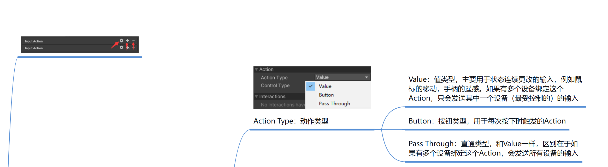
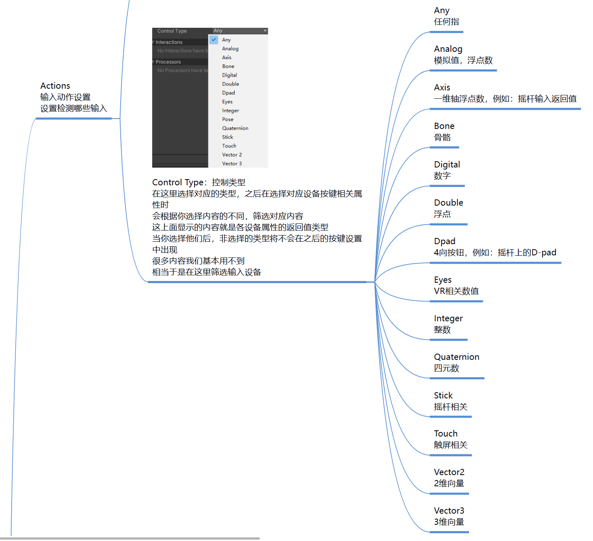
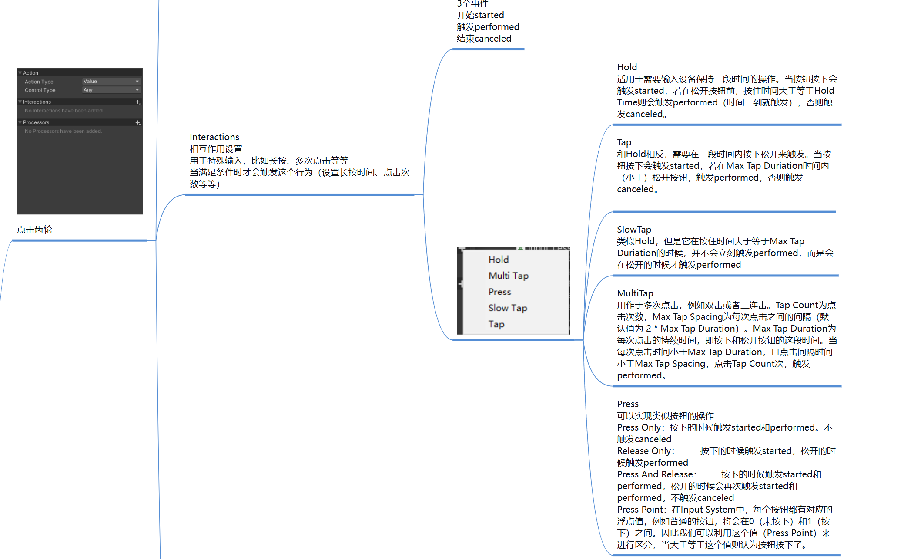
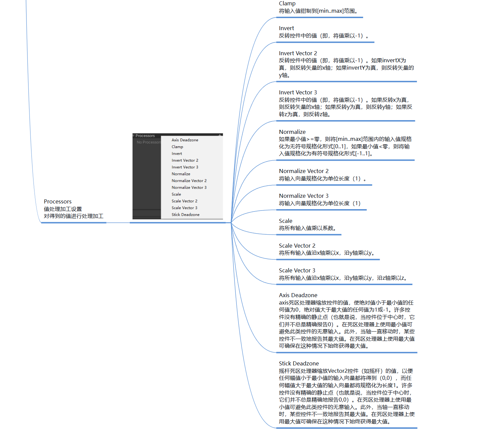
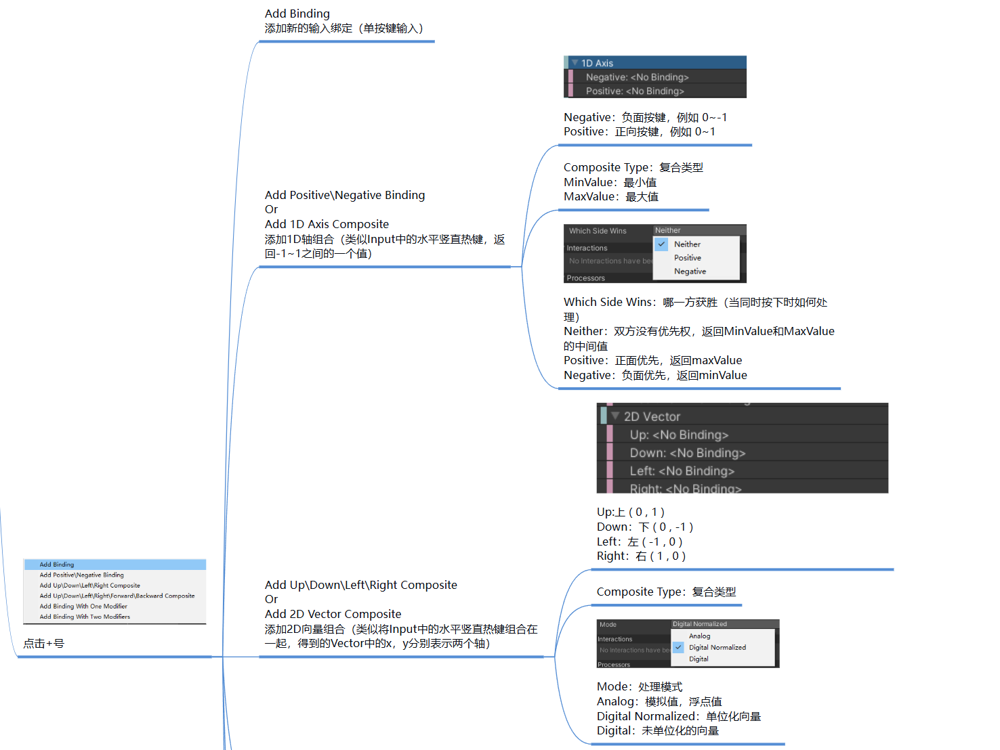
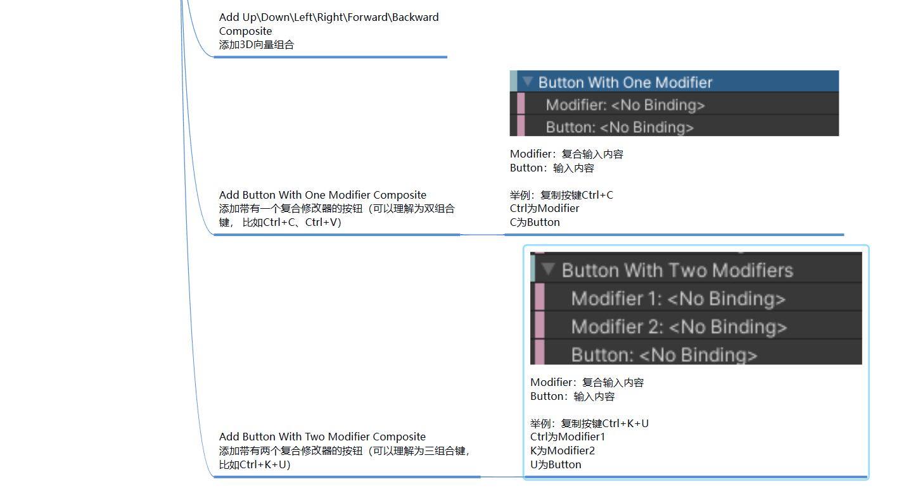
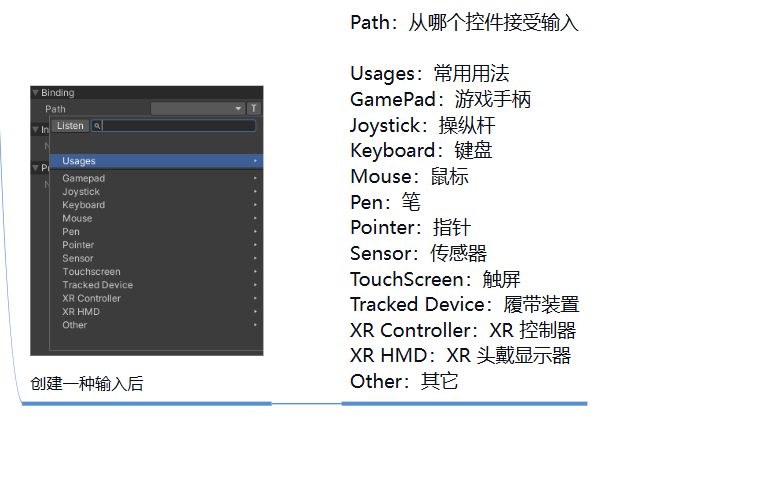
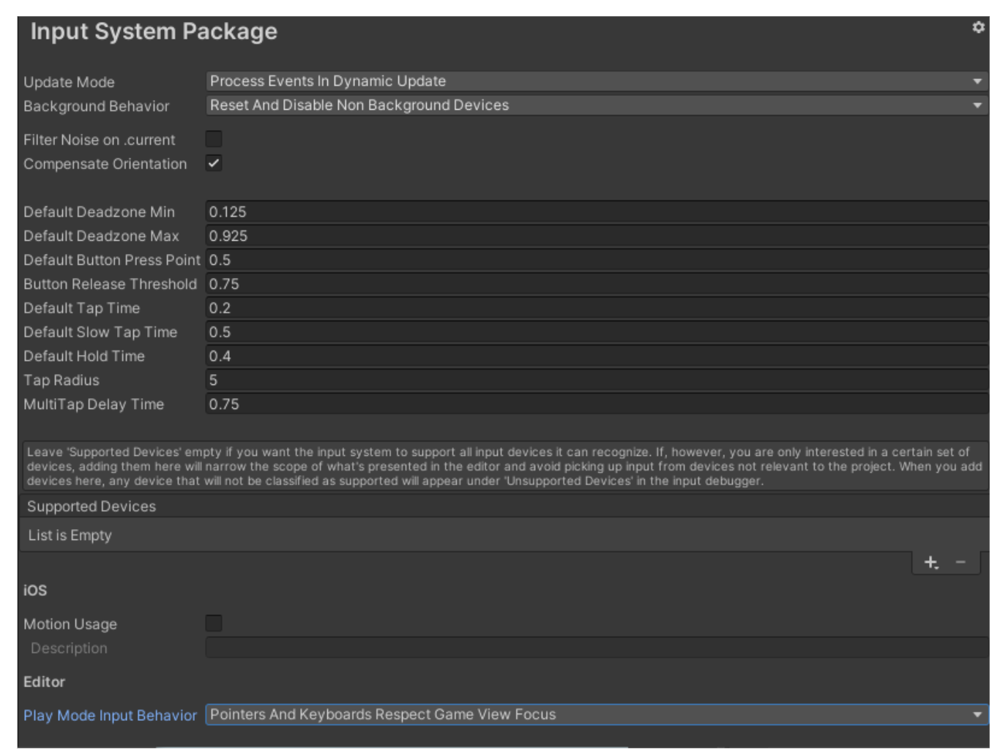
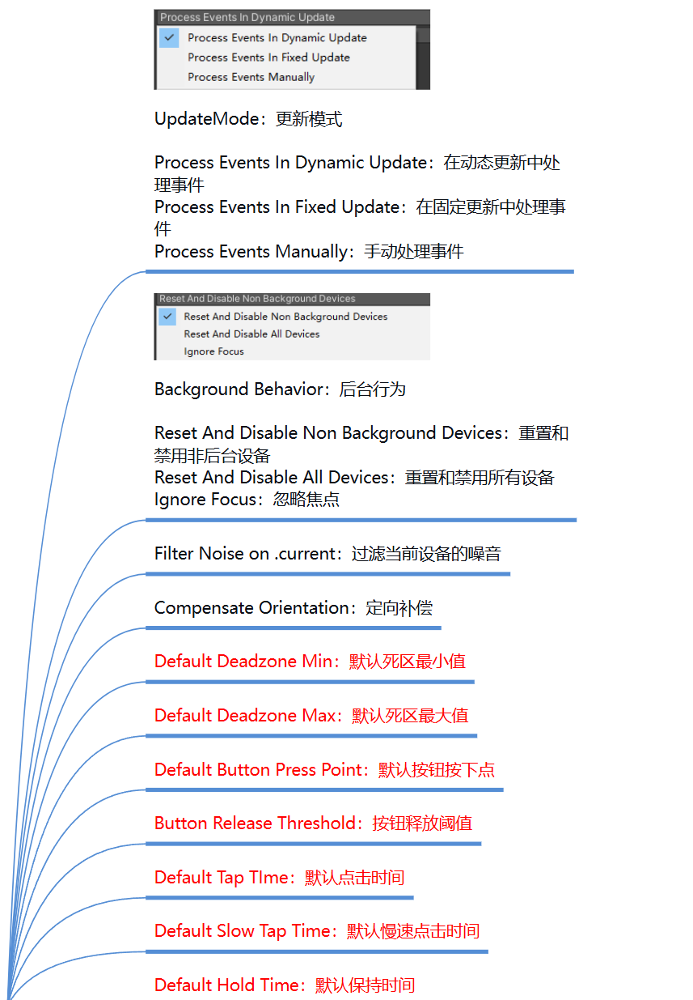
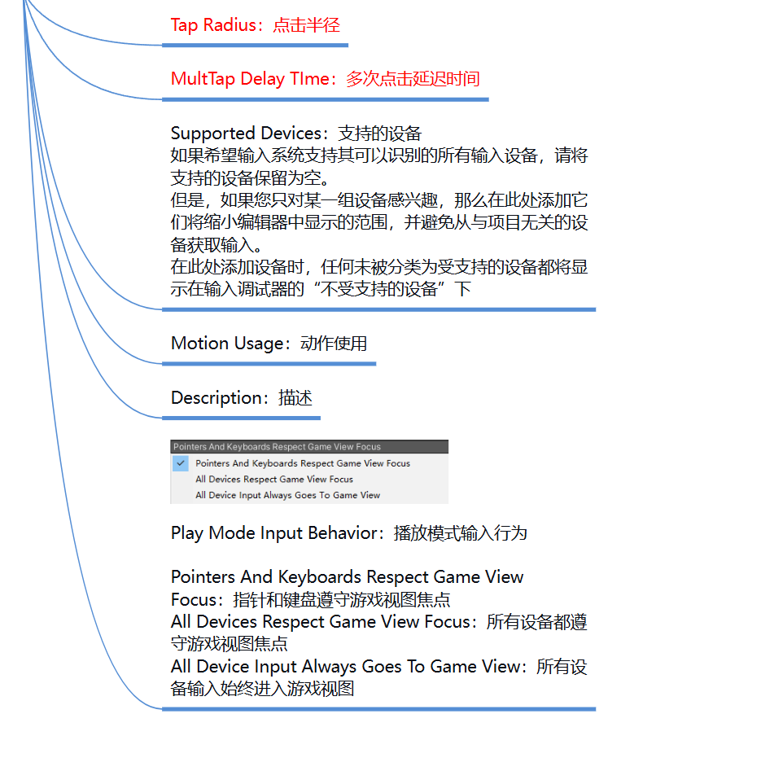

##### 知识点三 InputAction的使用 
- 1.启用输入检测 
- *move.Enable();* 
  
- 2.操作监听相关 
- 开始操作 
- *move.started += TestFun;* 
  
- 真正触发 
- *move.performed += (context) =>* 
- *{* 
-     *print("触发事件调用");* 
-     当前状态 
-     没有启用 Disabled 
-     等待 Waiting 
-     开始 Started 
-     触发 Performed 
-     结束 Canceled 
-     *context.phase* 
-     *print(context.phase);* 
  
-     动作行为信息 
-     *print(context.action.name);* 
  
-     控件(设备)信息 
-     *print(context.control.name);* 
  
-     获取值 
-     *context.ReadValue\<float>* 
  
-     持续时间 
-     *print(context.duration);* 
   
-     开始时间 
-     *print(context.startTime);* 
-  }; 
  
- 结束操作 
- move.canceled += (context) => 
- { 
-     print("结束事件调用"); 
- }; 
  
- 3.关键参数 CallbackContext 
- 当前状态 
  
- 动作行为信息 
  
- 控件信息 
  
- 获取值 
  
- 持续时间 
  
- 开始时间 
  
  
- *axis.Enable();* 
- *vector2D.Enable();* 
- *vector3D.Enable();* 
  
- *btnOne.Enable();* 
- *btnOne.performed += (context) =>* 
- *{* 
-     *print("组合键触发");* 
- *};*

##### 知识点四 特殊输入设置 

- 1.Input System 基础设置（一些默认值设置） 
- 2.设置特殊输入规则


### ④输入动作配置文件

#### 输入配置文件

##### 知识点一 什么是输入配置文件？ 

- 输入系统中提供了一种输入配置文件 
- 你可以理解它是InputAction的集合 
- 可以在一个文件中编辑多个InputAction的信息 
  
- 里面记录了想要处理的行为和动作（也就是InputAction的相关信息） 
- 我们可以在其中自己定义 InputAction（比如：开火、移动、旋转等） 
- 然后为这个InputAction关联对应的输入动作 
- 
- 之后将该配置文件和PlayerInput进行关联 
- PlayerInput会自动帮助我们解析该文件 
- 当触发这些InputAction输入动作时会以分发事件的形式通知我们执行行为

##### 知识点二 编辑输入配置文件 

- 1.在Project窗口右键Create创建InputActions配置文件 
- 2.双击创建出的文件 
- 3.进行配置

##### 知识点三 配置窗口参数相关

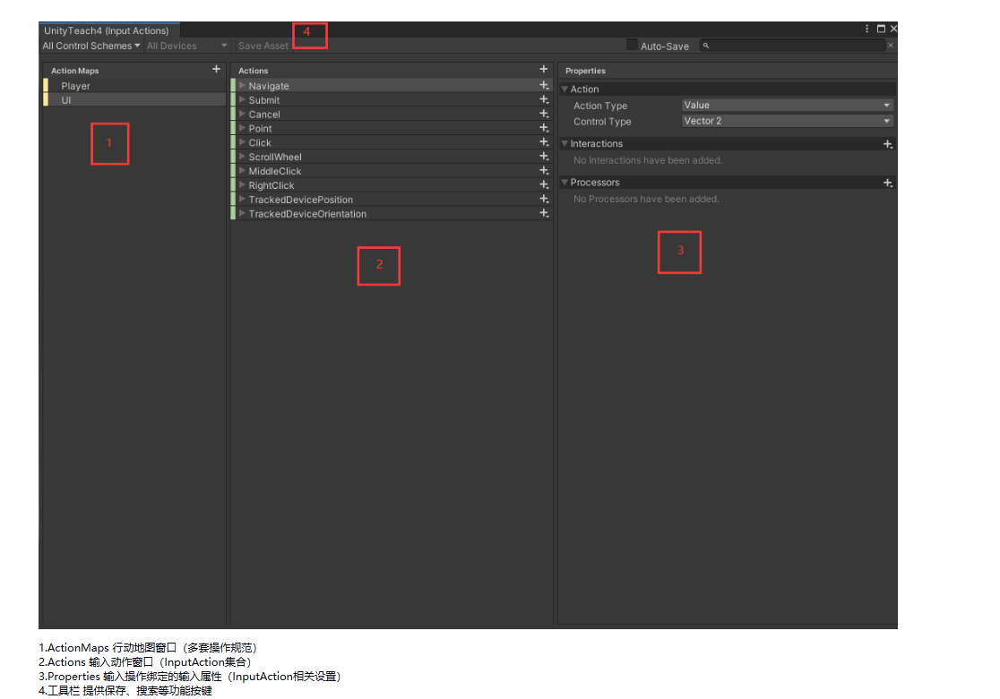
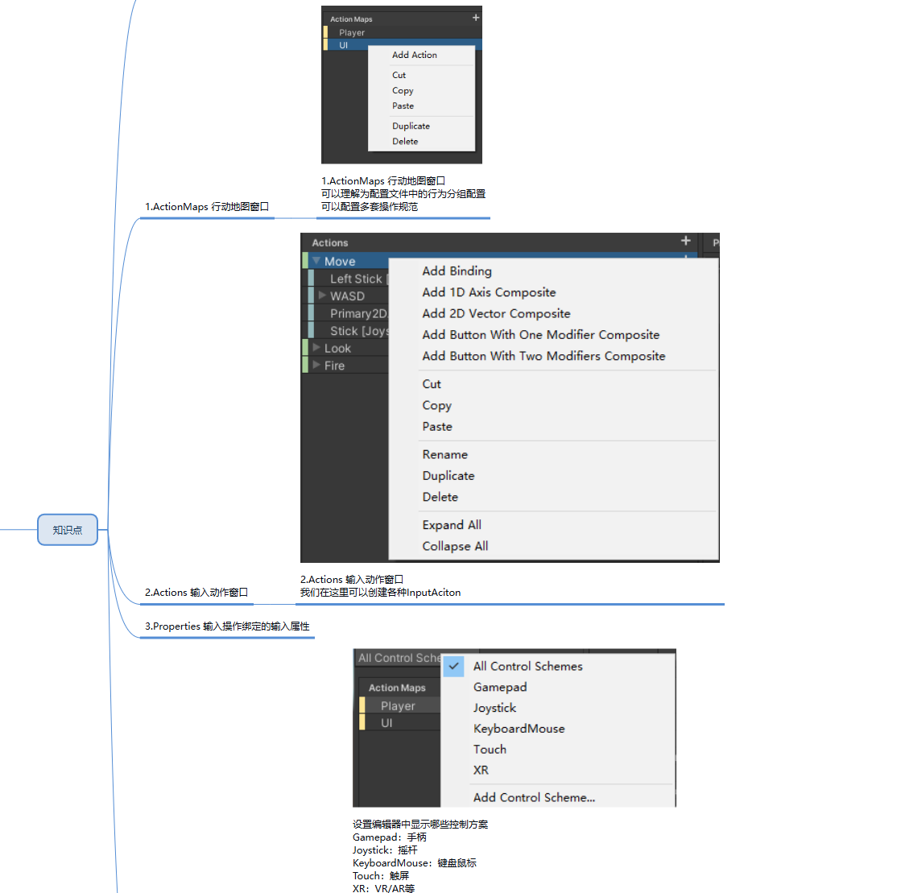
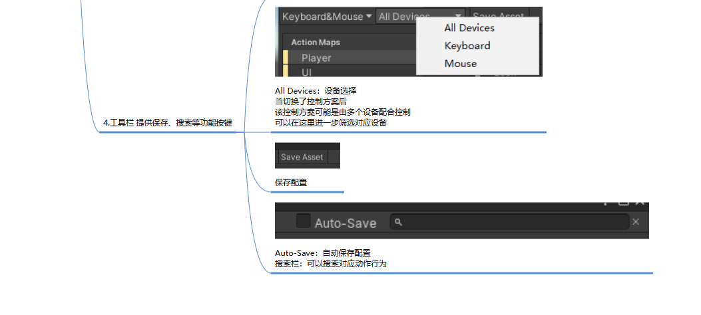

### ⑤输入配置文件生成C#代码

#### 输入配置文件生成C#代码
##### 知识点一 根据配置文件生成C#代码 

- 1.选择InputActions文件 
- 2.在Inspector窗口设置生成路径，类名，命名空间 
- 3.应用后生成代码

##### 知识点二 使用C#代码进行监听 

- 1.创建生成的代码对象 
- *input = new Lesson9Input();* 
- 2.激活输入 
- *input.Enable();* 
- 3.事件监听 
- *nput.Action1.Fire.performed += (context) =>* 
- *{* 
-     *print("开火");* 
- *};* 
  
- *input.Action2.Space.performed += (context) =>* 
- *{* 
-     *print("跳跃");* 
- *}*

    ### ⑥PlayerInput

#### 1.认识PlayerInput

##### 知识点一 PlayerInput是什么？ 

- PlayerInput是InputSystem提供的 
- 专门用于接受玩家输入来处理自定义逻辑的组件 
  
- 主要工作原理 
- 1.配置输入文件（InputActions文件） 
- 2.通过PlayerInput关联配置文件，它会自动解析该配置文件 
- 3.关联对应的响应函数，处理对应逻辑 
  
- 好处： 
- 不需要自己进行相关输入的逻辑书写 
- 通过配置文件即可配置想要监听的对应行为 
- 让我们专注于输入事件触发后的逻辑处理

##### 知识点二 添加PlayerInput组件 

- 选择任意对象（一般为一个玩家对象） 
- 为其添加PlayerInput组件

##### 知识点三 PlayerInput参数相关
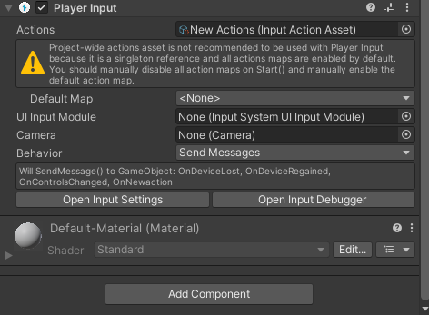

````ad-tip
Actions:行为

一套输入动作和玩家相关联，帮助我们监听一些按键的输入

 Defaullt Control Scheme:默认启用哪一个控制方案
 
 Default Actions Map:默认启用哪一个行为映射方案
 
 Behavior:如何通知游戏对象上执行对应逻辑 
 
 SendMessage:将逻辑脚本挂载在其自身或子对象上，会通过SendMessage通知执行对应函数
 
 BroadcastMessage:将逻辑脚本挂载在其自身或子对象上，会通过BroadcastMessage通知执行对应函数
 
 Invoke UnityEvent Actions:通过拖拽脚本关系关联函数指明想要执行的函数逻辑
 
 InvoKe CSharp Events:通过C#事件监听处理对应逻辑，通过获取PlayerInput进行事件监听
````

#### 2.PlayerInput行为执行模式

##### 知识点一 Send Messages- 在自定义脚本中 

- 申明名为 "On+行为名" 的函数 
- 没有参数 或者 参数类型为InputValue 
- 将该自定义脚本挂载到PlayerInput依附的对象上 
- 当触发对应输入时 会自动调用函数 
  
- 并且还有默认的3个和设备相关的函数可以调用 
- 设备注册(当控制器从设备丢失中恢复并再次运行时会触发)：OnDeviceRegained(PlayerInput input) 
- 设备丢失（玩家失去了分配给它的设备之一，例如，当无线设备耗尽电池时）：OnDeviceLost(PlayerInput input) 
- 控制器切换：OnControlsChanged(PlayerInput input)

#####  知识点二 Broadcast Messages

- 基本和SendMessage规则一致
- 唯一的区别是，自定义脚本不仅可以挂载在PlayerInput依附的对象上 
- 还可以挂载在其子对象下

##### 知识点三 Invoke Unity Events

- 该模式可以让我们在Inspector窗口上通过拖拽的形式关联响应函数 
- 但是注意：响应函数的参数类型 需要改为 InputAction.CallbackContext

##### 知识点四 Invoke C Sharp Events
- 1.获取PlayerInput组件 

- *PlayerInput input = this.GetComponent\<PlayerInput>();* 
- 2.获取对应事件进行委托函数添加 
- *input.onDeviceLost += OnDeviceLost;* 
- *input.onDeviceRegained += OnDeviceRegained;* 
- *input.onControlsChanged += OnControlsChanged;* 
- *input.onActionTriggered += OnActionTrigger;* 
  
- *input.currentActionMap\["Move"].ReadValue\<Vector2>()* 
- *3.当触发输入时会自动触发事件调用对应函数*

##### 知识点五 关键参数InputValue和InputAction.CallbackContext 

- InputValue 
- 是否按下 
  
- 得到具体返回值 
- value.Get<>


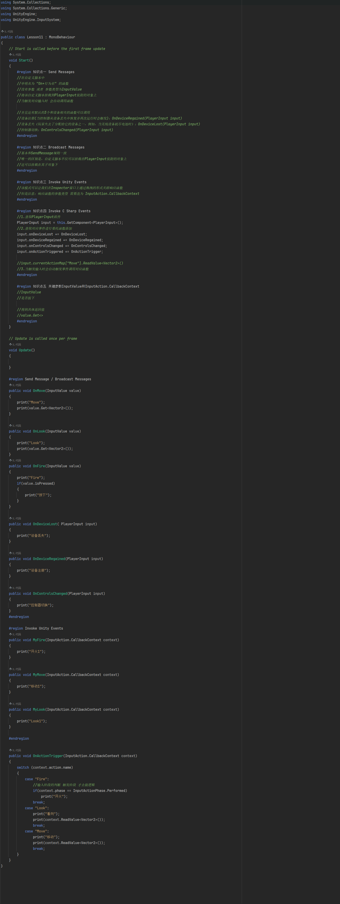

##### 练习题

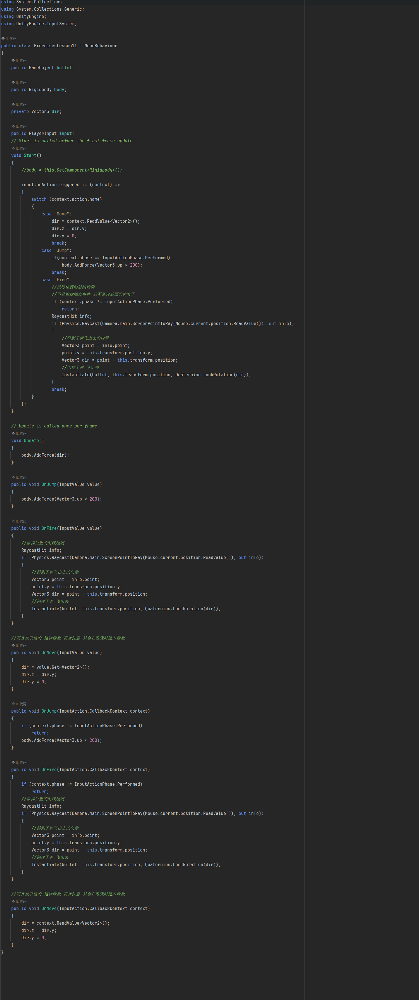

### ⑦PlayerInputManager

#### PlayerInputManager

##### 知识点一 PlayerInputManager的作用 

- PlayerInputManager 组件主要是用于管理本地多人输入的输入管理器 
- 它主要管理玩家加入和离开

##### 知识点二 组件添加及参数相关

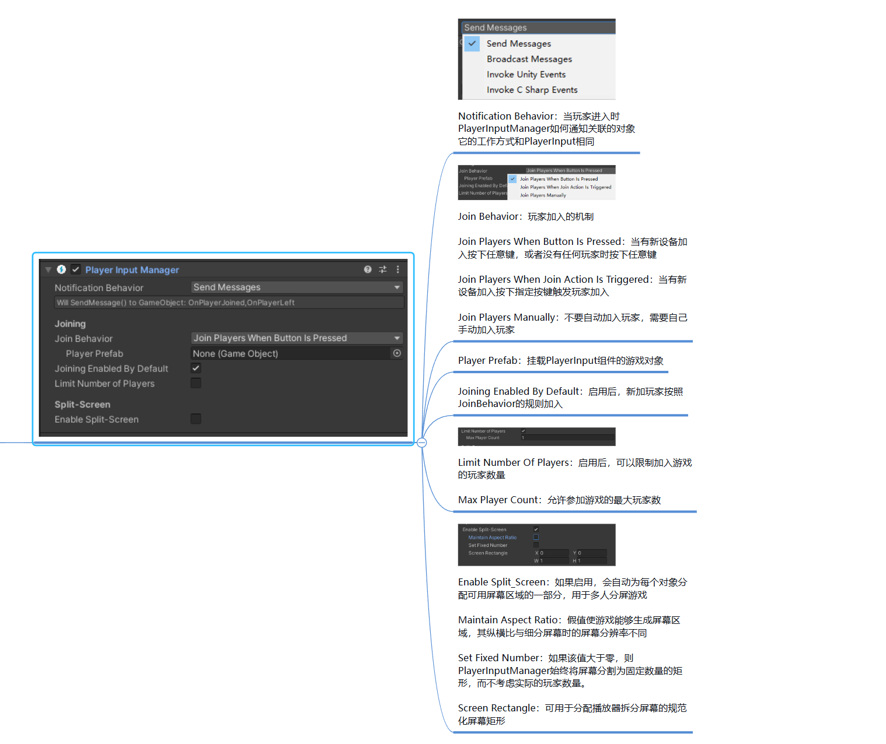

##### 知识点三 PlayerInputManager使用 

- 获取PlayerInputManager 
- *PlayerInputManager.instance* 
- 玩家加入时 
- *- PlayerInputManager.instance.onPlayerJoined += (playerInput) =>* 
- *{*
-     *print("创建了一个玩家");* 
- *};* 
- *玩家离开时*  
- *PlayerInputManager.instance.onPlayerLeft += (playerInput) =>* 
- *{* 
-     *print("离开了一个玩家");* 
- *};*
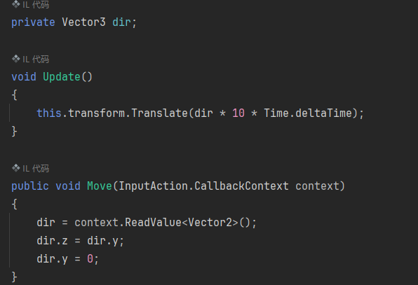

### ⑧UGUI配合使用

#### UGUI配合使用

##### 知识点一 InputSystem对UI的支持 

- 1.新输入系统InputSystem不支持IMGUI（GUI）注意：编辑器代码不受影响 
-   如果当前激活的是InputSystem，那么OnGUI中的输入判断相关内容不会被触发 
-   你必须要选择Both或者只激活老输入系统InputManager才能让OnGUI中内容有用

##### 知识点二 UGUI中的新输入系统输入模块参数相关

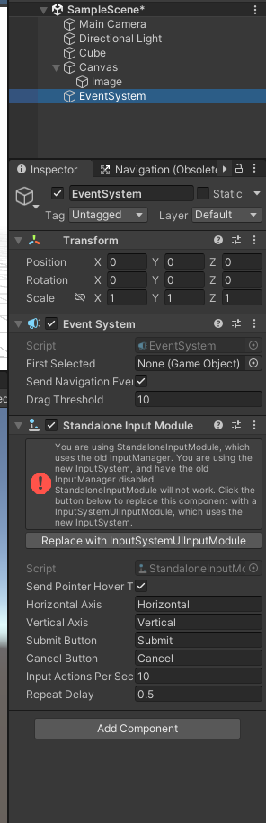
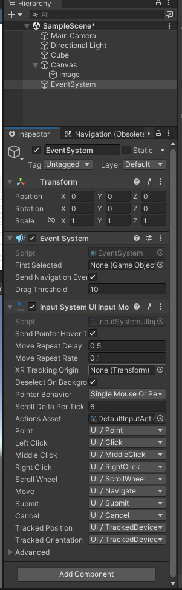
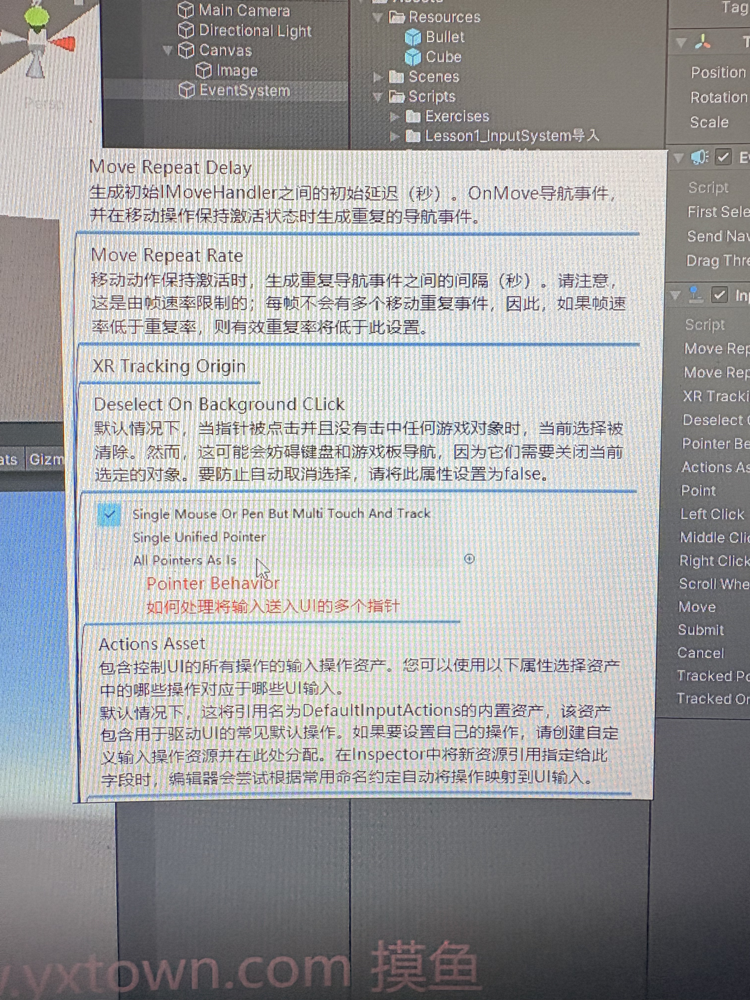
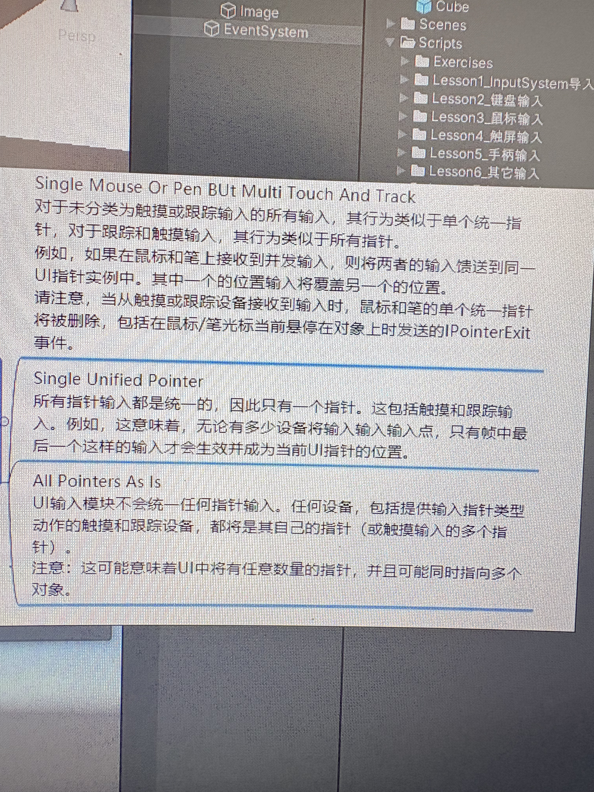
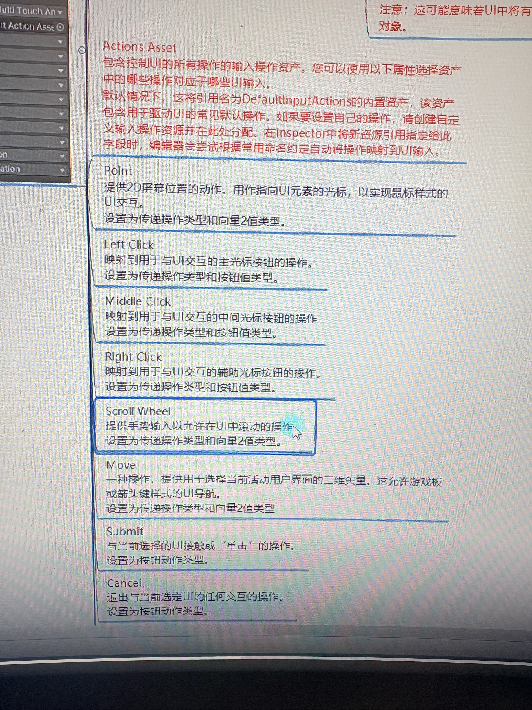
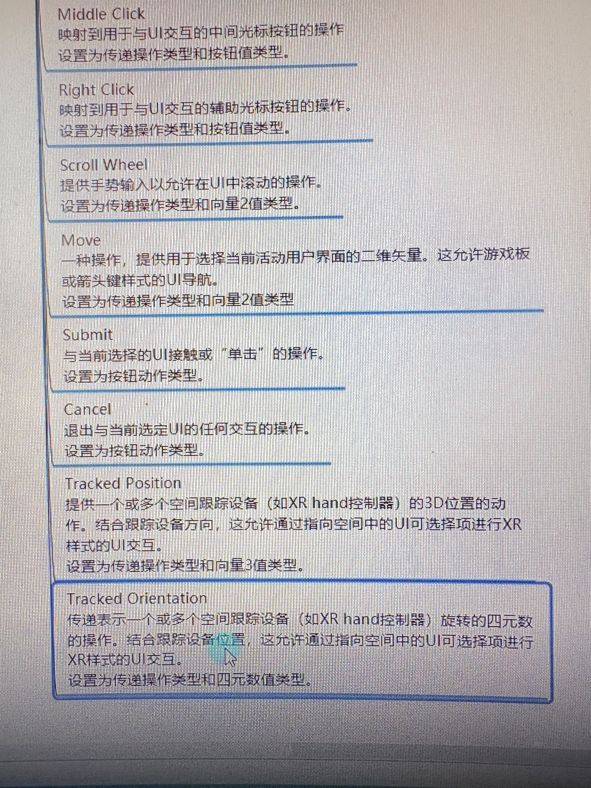

##### 知识点三 VR相关中使用新输入系统注意事项 

- 如果想在VR项目中使用新输入系统配合UGUI使用 
- 需要在Canvas对象上添加Tracked Device Raycaster组件

##### 知识点四 多人游戏使用多套UI 

- 如果同一设备上的多人游戏，每个人想要使用自己的一套独立UI 
- 需要将EventSystem中的EventSystem组件替换为Multiplayer Event System组件 
  
- 与EventSystem组件不同，可以在场景中同时激活多个MultiplayerEventSystem。 
- 这样，您可以有多个玩家，每个玩家都有自己的InputSystemUIInputModule和MultiplayerEventSystem组件 
- 每个玩家都可以有自己的一组操作来驱动自己的UI实例。 
- 如果您正在使用PlayerInput组件，还可以设置PlayerInput以自动配置玩家的InputSystemUIInputModule以使用玩家的操作 
- MultilayerEventSystem组件的属性与事件系统中的属性相同 
- 此外，MultiplayerEventSystem组件还添加了一个playerRoot属性，您可以将其设置为一个游戏对象 
- 该游戏对象包含此事件系统应在其层次结构中处理的所有UI可选择项

##### 知识点五 On-Screen组件相关 

- On-Screen组件可以模拟UI和用户操作的交互 
- 1.On-Screen Button：按钮交互 
- 2.On-Screen Stick：摇杆交互

##### 知识点六 更多内容 

- 可查看官方文档了解更多新输入系统和UI配合使用的相关内容 
- https://docs.unity3d.com/Packages/com.unity.inputsystem@1.2/manual/UISupport.html


### ⑨InputDebug
#### InputDebug

##### 知识点一 什么是Input Debug 

- InputDebug顾名思义是输入调试器的意思 
- 我们可以通过输入调试窗口检测输入相关信息 
- 当我们的输入不按预期工作时，可以通过它来排查问题

##### 知识点二 打开InputDebug窗口 

- 1.Window(窗口)->Analysis(分析)->Input Debugger(输入调试器) 
- 2.PlayerInput组件->Open Input Debugger

##### 知识点三 窗口上的信息

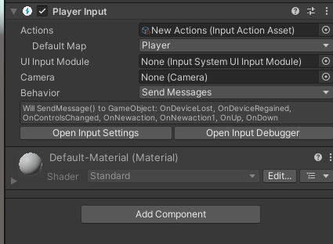
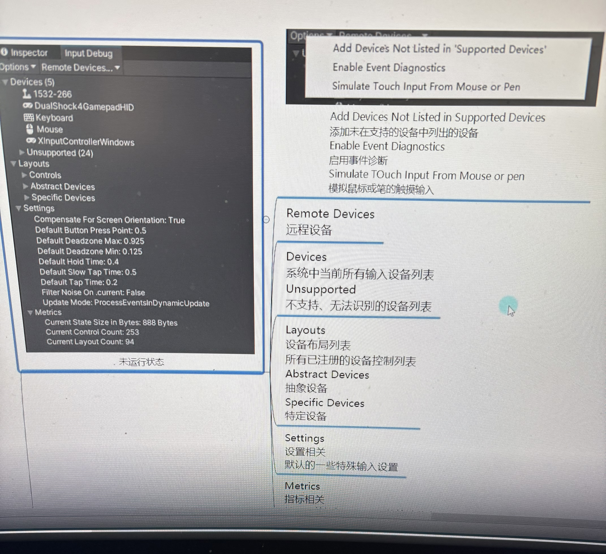
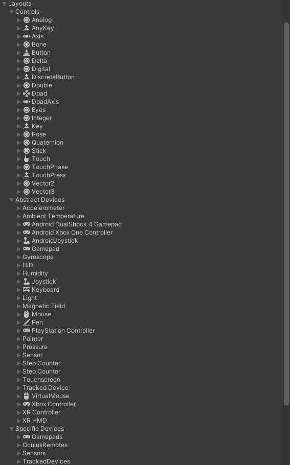
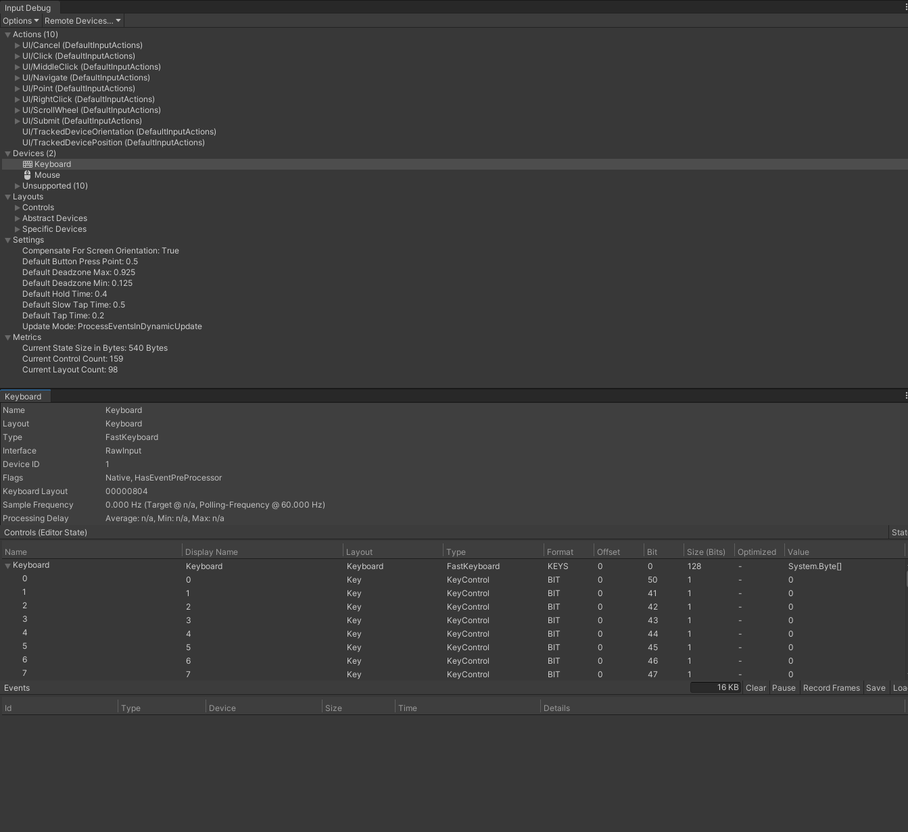

## 综合练习题

### ①、补充知识点

#### 1.获取任意键输入的信息

##### 知识点一 回顾学过的获取任意键输入的方法 

- 1.键盘任意键按下 
- *input.Enable();* 
- *input.performed += (context) =>* 
- *{* 
-     *print("123");* 
-     *print(context.control.name);* 
-     *print(context.control.path);* 
- *};* 
- - 2.键盘任意键按下字符 
- *Keyboard.current.onTextInput += (c) =>* 
- *{* 
-     *print(c);* 
- *};*

##### 识点二 InputSystem中专门用于任意键按下的方案 

- 如果用Call 按键盘会报错 但是也能正常执行 
- 用CallOnce 只会执行一次 但是不会报错 
- *InputSystem.onAnyButtonPress.CallOnce((control) =>* 
- *{* 
-     *print(control.path);* 
-     *print(control.name);* 
- *});*

#### 2.通过Json数据加载配置文件

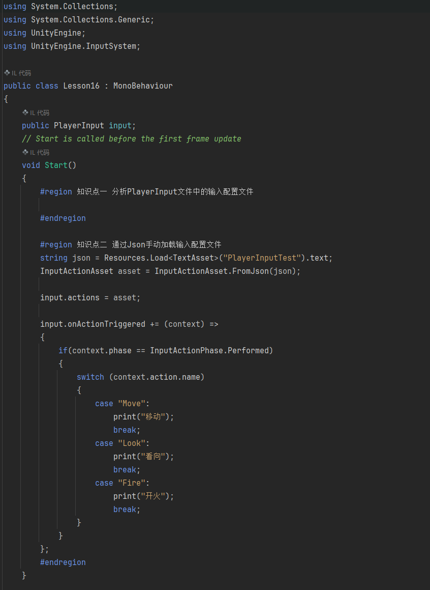
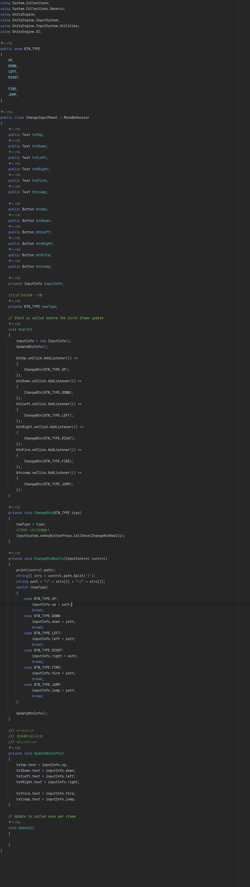

### ②改建练习

#### 1.记录改键
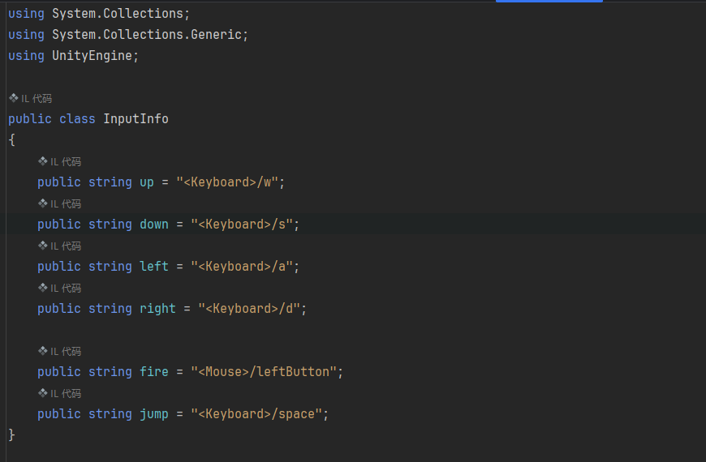


#### 2.实现改键功能

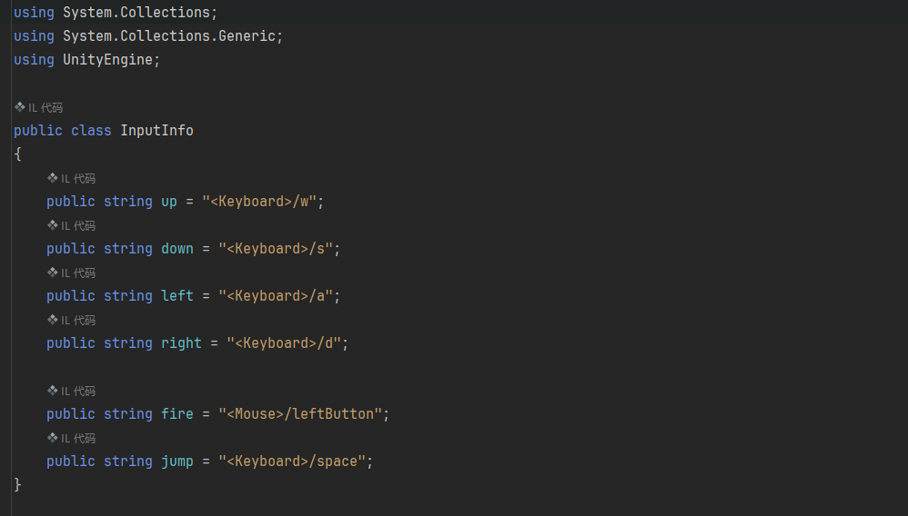
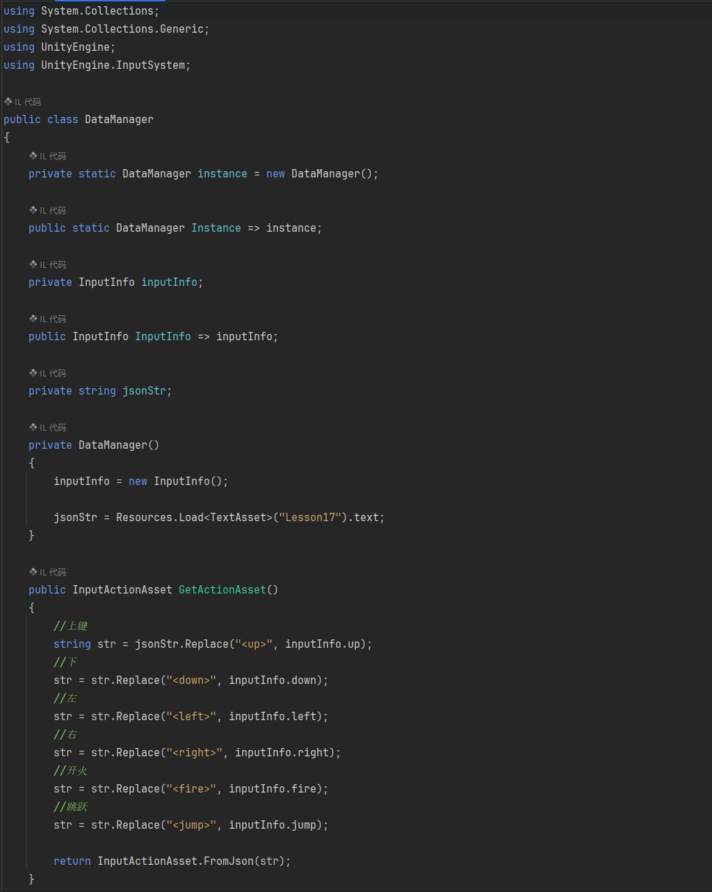
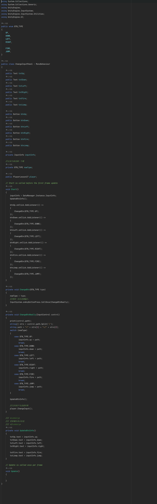
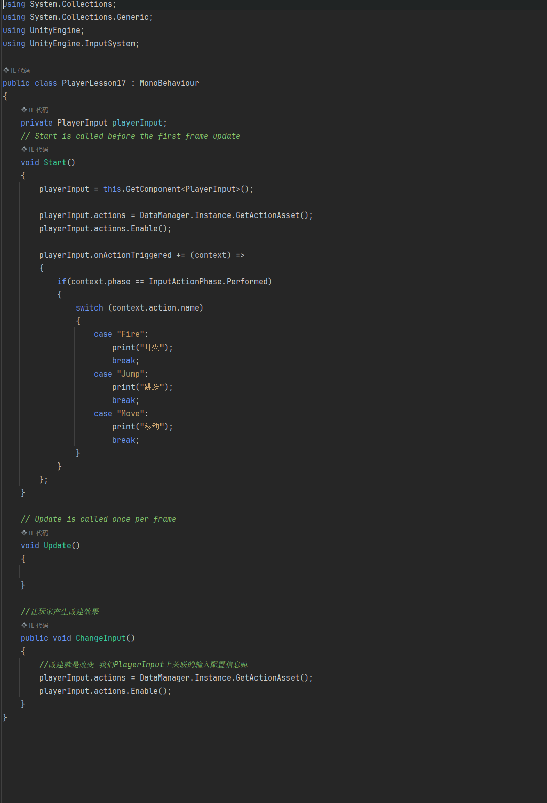


