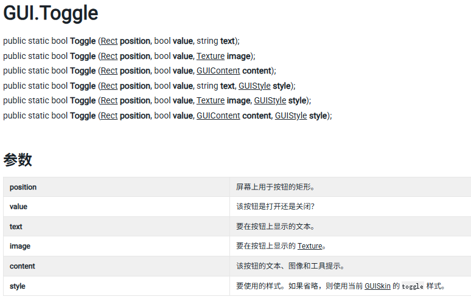
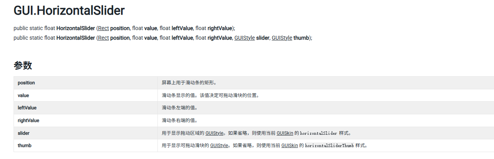
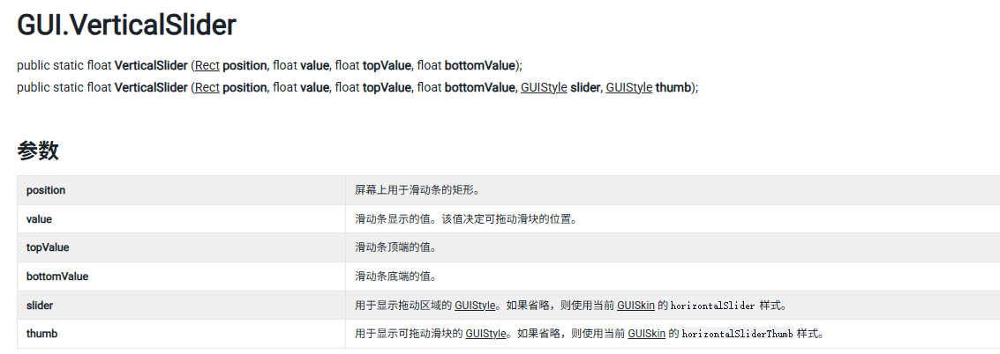
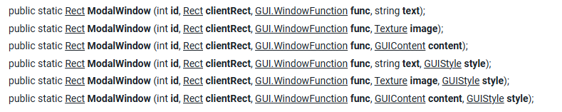
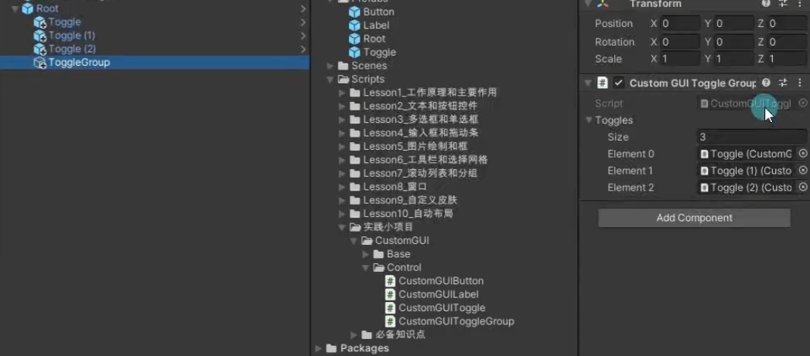
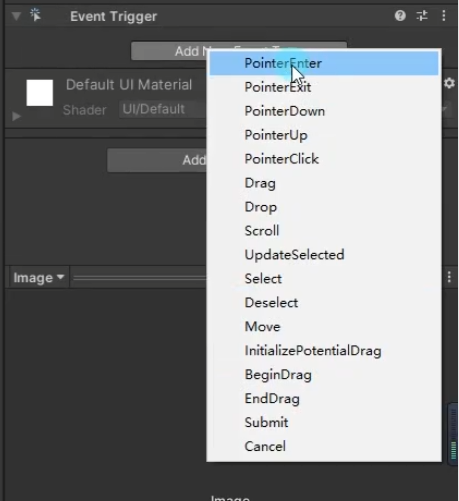
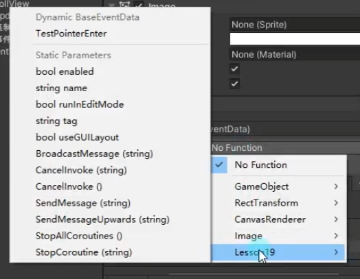

# GUI

## 文本和控件按钮
### 一、GUI控件绘制的共同点
1. 都是GUI公共类中提供的**静态函数**，**直接调用**即可
2. 他们的**参数**都大同小异
    **位置**参数： Rect参数 x y位置 w h 尺寸
    显示**文本**： String参数
    **图片**信息： Texture参数
    **综合**信息： GUIContent
    **自定义**样式： GUIStyle

### 二、 文本控件
//基本使用
```c#
//基本使用
GUI.Label(new Rect (0,0,100,20),"xxxxxx");   //位置+文本信息
GUI.Label(rect,tex);                         //位置+图片    需public申明
//综合使用
GUI.Label(rect1,content);                    //位置+综合信息（文本、图片、）
//可以获取当前鼠标或者键盘选中的GUI控件 对应的tooltip
Debug.Log(GUI.tooptip);
//自定义样式
```

### 三、按钮控件
//基本使用
//综合使用
//自定义样式
```C#
if(GUI.Button(btnRect.btnContent,btnStyle))
{
//处理点击按钮的逻辑   必须在按钮范围内 按下并抬起  才算一次点击
Debug.Log(按钮被点击);
}

//只要在长按按钮范围内 按下鼠标 就会一直返回true
if（GUI.RepeatButton(GUI.Button(btnRect.btnContent)）
{
Debug.Log("长按按钮被点击);
}
```
## 多选框和单选框
### 一、多选框


```c#
private bool isSel;    //私有申明一个siSel标志符 而不是直接写死bool值
private bool isSel2;   //若不申明 GUI状态每帧更新 点击后bool值会变但 下一帧会立马变回申明状态

//普通样式
isSel =  GUI.Toggle(new Rect(0,0,100,30),isSel,"效果开关")

//自定义样式
//修改固定宽高 fixedWidth和fixedHeight (如果直接改width 和 height 响应区域也会跟着改变)
//修改从GUIStyle边缘到内容起始处的空间 padding 
isSel2 = GUI.Toggle(new Rect(0,0,100,30),isSel,"音效开关"，style)
```

### 二、单选框
```C# 
private int nowSelIndex = 1;


//单选框的实现  基于多选框
//关键： 通过一个Int标识用来决定是否选中
if(GUI.Toggle(new Rect(0,100,100,30),nowSelIndex == 1,"选项一"))
{
nowSelIndex = 1;
}

if(GUI.Toggle(new Rect(0,140,100,30),nowSelIndex == 2,"选项二"))
{
nowSelIndex = 2;
}

if(GUI.Toggle(new Rect(0,180,100,30),nowSelIndex == 3,"选项三"))
{
nowSelIndex = 3;
}
```

## 输入框和拖动条

### 一、 输入框 
```C#
private string inputStr="";
private string inputPW ="";

//普通输入    //此处若不写inputStr=  则会每帧更新 临时输入的内容会变成初内容 
            //此处实际效果为  每帧将当前输入的内容返回给输入框用于对其赋值
inputStr = GUI.TextField(new Rect(0,0,100,30),inputStr)

//密码输入
inputPW = GUI.PasswordField(new Rect(0,50,100,30),inputPW,'*')
```

### 二、拖动条

#### 水平拖动条

``` C#
private float nowValue = 0.5f;

//当前值
//最小值 left
//最大值 right
nowValue = GUI.HorizontalSlider(new Rect)(0,100,100,50),nowValue，0,1)
```

#### 竖直拖动条

```C#

nowValue = GUI.verticalSlider(new Rect)(0,150,50,100),nowValue，0,1)

```

## 图片绘制和框

### 一、 图片绘制
```C#
public Rect     texPos;
public Texture  tex;


//ScaleMode
//ScaleAndCrop:通过宽高比来计算图片 但是会进行裁剪
//ScaleToFit:自动根据宽高比进行计算 不会拉变形 会一直保持图片完全显示的状态
//StretchToFill:始终填充满你传入的Rect范围

//alpha 是用来 控制 图片是否开启透明通道的

//imageAspect 自定义宽高比 如果不填 默认为0 就会使用 图片原始宽高

GUI.DrawTexture(texPcs,tex,mode,alpha,wh)

```

### 二、框绘制

```C#
public Rect texPos;

public Texture BoxTexure

GUI.Box(texPos," ") //简单文本显示框

GUI.Box(texPos,BoxTexure)//显示带纹理的框

GUI.Box(texPos,"自定义样式",style)//自定义框的外观
```

## 工具栏和选择网格

### 一、工具栏 

```C#
private int toolbarIndex = 0;
private string[] toolbarInfos = new string[]{"选项一"，"选项二"，"选项三"};

toolbarIndex = GUI.Toolbar(new Rect(0,0,300,30), toolbarIndex,toolbarInfos)
//工具栏可以帮助我们根据不同的返回索引 来处理不同的逻辑

switch(toolbarIndex)
{
case 0 :
    break;
case 1 :
    break;
case 2 :
    break;
}
```

### 二、选择网格

```C#
private int selGridIndex = 0;
private string[] toolbarInfos = new string[]{"选项一"，"选项二"，"选项三"};

//相对toolbar多了一个参数 xCount 代表 水平方向最多显示的按钮数量
GUI.SelectionGrid(new Rect(0,50,200,30),selGridIndex,toolbarInfos，3)
```

## 滚动列表和分组

### 一、分组

```C#
//用于批量控制组件位置
//可以理解为 包裹着的控件加了一个父对象
//可以通过控制分组来控制包裹控件的位置
public Rect groupPos;


GUI.BeginGroup(groups);


GUI.Button(new Rect(0,0,100,50),"测试按钮")


GUI.EndGroup();


```

### 滚动列表

``` C#
public  Rect  scPos;
public  Rect  showPos;
private Vector2  nowPos;

public static Vector2 BeginScrollView(Rect position, Vector2 scrollPosition, Rect viewRect, bool alwaysShowHorizontal, bool alwaysShowVertical, GUIStyle horizontalScrollbar, GUIStyle verticalScrollbar);

//position : 屏幕上用于滚动视图的矩形区域。
 
//scrollPosition: 视图在 X 和 Y 方向上滚动的像素距离。   
//viewRect: 在滚动视图内使用的矩形区域。  
//horizontalScrollbar 和 verticalScrollbar: （可选）用于水平和垂直滚动条的 GUIStyle。如果省略，则使用当前 GUISkin 的样式。 
//alwaysShowHorizontal 和 alwaysShowVertical: （可选）指示是否始终显示水平和垂直滚动条。


nowPos = GUI.BeginScrollView(scPsos,nowPos,showPos)


GUI.EndScrollView();
```

## 窗口

### 一、窗口的基本使用 

```C#

public static [Rect] Window (int id, [Rect] clientRect, [GUI.WindowFunction] func, [string] text, [GUIStyle] style
public static [Rect] Window (int id, [Rect] clientRect, [GUI.WindowFunction] func, [Texture] image, [GUIStyle] style
public static [Rect] Window (int id, [Rect] clientRect, [GUI.WindowFunction] func, [GUIContent] title, [GUIStyle] style;

| Style      | （可选）用于窗口的样式。如果省略，则使用当前 GUISkin 的 window 样式。 
|------------|--------------------------------------------------------------
| id         | 窗口的 ID 编号（只要保证唯一，可以使用任意值）。                
| clientRect | 表示窗口位置和大小的屏幕矩形。                             
| func       | 显示窗口内容的脚本函数。                                
| text       | 要在窗口内呈现的文本。                                 
| image      | 要在窗口内呈现的图像。                                 
| content    | 要在窗口内呈现的 GUIContent。                        
| style      | 窗口的样式信息。                                    
| title      | 窗口标题栏中显示的文本。                                

//第一个参数 id 是窗口的唯一ID 不要和别的窗口重复
//委托参数 是用于 绘制窗口用的函数 传入即可
GUI.Window(1,new Rect(100,100,200,150),DrawWindow,"测试窗口")
//id 有一个重要作用 除了区分不同窗口 还可以在一个函数中去处理多个窗口的逻辑
GUI.Window(2,new Rect(100,100,200,150),DrawWindow,"测试窗口")
private void DrawWindow
{
    switch(id)
    {
        case 1:
        GUI.Button(new Rect(0,30,30,20),"1")
        break;
        
        case 2:
        GUI.Button(new Rect(0,30,30,20),"2")
        break;
        
        case 3:
        GUI.Button(new Rect(0,30,30,20),"3")
        break;
        
        case 4:
        //该API 写在窗口函数中调用 可以让窗口被拖动
        //传入Rect参数的重载 作用是 决定窗口中哪一部分位置可以被拖动
        //默认不填就是无参重载 默认窗口的所有位置都能被拖动
        GUI.Dragwindow（）;
        break;
    } 
}
```

### 二、模态窗口 



```C#
//模态窗口 可以让其它控件不再有用
//可以理解成该窗口在最上层 其他按钮都点击不到 
//只能点击该窗口上的控件

GUI.ModalWindow(1,new Rect(300m100m200m150),DrawWindow,"模态窗口")
```

### 三、拖动窗口

```C#

private Rect drawWinPos = new Rect(400,400,200,150);

//位置赋值 只是前提  (具体case 4 看窗口的基本使用的Drawwindow函数)
dragWinPos = GUI.Window(4,dragWinPos,DrawWindow,拖动窗口)
```

## 自定义皮肤

### 一、全局颜色

```C#
//全局的着色颜色 影响背景和文本颜色
GUI.color = Color.red;
//文本着色颜色  会和全局颜色相乘
GUI.contentColor = Color.yellow;
//背景元素着色元素 会和全局颜色相乘
GUI.backgroundColor = Color.red;
```

### 二、整体皮肤样式

```C#
public GUISkins skin;

GUI.skin = skin;
//虽然设置了皮肤 但是绘制时 如果使用GUIStyle参数 皮肤就没有

//它可以帮助我们整套的设置 自定义样式
//相对单个控件设置Style要方便一些
```

## GUIlayout自动布局

### 一、GUIlayout 自动布局

```C#
//主要用于进行编辑器开发 若果用它来做游戏UI不太合适
GUILayout.BeginGroup(new Rect(100,100,100,100));
GUILayout.BeginHorizontal(); /GUILayout.BeginVertical();

GUILayout.Button("123");
GUILayout.Button("234");
GUILayout.Button("345",GUILayout.ExoandWidth(false));

GUILayout.EndHorizontal(); /GUILayout.EndVertical();
GUILayout.EndGroup();
```

### 二、GUIlayoutOption

```C#
//控件的固定宽高
GUILayout.Width(300);
GUILayout.Height(200);

//允许控件的最小宽高
GUILayout.MinWidth(50);
GUILayout.MinHeight(50);

//允许控件的最大宽高
GUI.Layout.MaxWidth(100);
GUI.Layout.MaxHeight(100);
//允许或禁止水平拓展
GUILayout.ExpandWidth（true）;允许
GUILayout.ExpandWidth(false);禁止
GUILayout.ExpandHeight(true);允许
GUILayout.ExpandHeight(false);禁止
```

## 实践部分
### 一、编辑器模式下执行脚本
```C#
[ExecuteAlways]
```

### 二、控制位置信息类

```C# 
//对齐方式枚举
public enum  E_Alignment_Type 
    {
        Up,
        Down,
        Left,
        Right,
        Center,
        Left_Up,
        Left_Down,
        Right_Up,
        Right_Down,
    }

[System.Serializable]
public class CustomGUIPos
{
    
    //该位置信息 用来返回给外部 用于绘制控件
    private Rect rpos = new Rect(0,0,100,100)
    
    //屏幕九宫格对齐方式
    public E_Alignment_Type screen_Alignment_Type;
    //控件中心对齐方式
    public E_Alignment_Type control_Alignment_Type;
    //偏移位置
    public Vector2 pos;
    //宽高
    public float width = 100;
    public float height = 50;
    //用于计算的 中心点 成员变量
    private Vector2 centerPos;
    
    //计算中心点偏移的方法
    private void CalcCenterPos()
        {
            switch(control_Alignment_Type)
            {
                case E_Alignment_Type.Up:
                    centerPos.x = -width/2;
                    centerPos.y = 0;
                    break;
                    
                case E_Alignment_Type.Down:
                    centerPos.x = -width/2;
                    centerPos.y = -height;
                    break;
                    
                case E_Alignment_Type.Left:
                    centerPos.x = 0;
                    centerPos.y =-height/2;
                    break;
                    
                case E_Alignment_Type.Right:
                    centerPos.x = -width;
                    centerPos.y = -height/2;
                    break;
                    
                case E_Alignment_Type.Center:
                    centerPos.x = -width/2;
                    centerPos.y = -height/2;
                    break;
                    
                case E_Alignment_Type.Left_Up:
                    centerPos.x = 0;
                    centerPos.y = 0;
                    break;
                    
                case E_Alignment_Type.Left_Down:
                    centerPos.x = 0;
                    centerPos.y = -height;
                    break;
                    
                case E_Alignment_Type.Right_Up:
                    centerPos.x = -width;
                    centerPos.y = 0;
                    break;
                    
                case E_Alignment_Type.Right_Down:
                    centerPos.x = -width;
                    centerPos.y = - height;  
                    break;  
                    
            }
        }
    
    //计算最终相对坐标位置的方法
    private void CalPos()
        {
            switch(screen_Alignment_Type)
            {
                case E_Alignment_Type.Up:
                    rPos.x = Screen.width/2 + centerPos.x + pos.x;
                    rPos.y = 0 + centerPos.y + pos.y;
                    break;
                
                case E_Alignment_Type.Down:
                    rPos.x = Screen.width/2 + centerPos.x + pos.x;
                    rPos.y = Screen.height + centerPos.y - pos.y;
                   break;
                   
                case E_Alignment_Type.Left:
                    rPos.x = 0 + centerPos.x + pos.x;
                    rPos.y = Screen.height/2 + centerPos.y + pos.y;
                   break;
                   
                case E_Alignment_Type.Right:
                    rPos.x = Screen.width + centerPos.x - pos.x;
                    rPos.y = Screen.height/2 + centerPos.y + pos.y;
                    break;
                    
                case E_Alignment_Type.Center:
                    rPos.x = Screen.width/2 + centerPos.x + pos.x;
                    rPos.y = Screen.height/2 + centerPos.y + pos.y;
                   break;
                   
                case E_Alignment_Type.Left_Up:
                    rPos.x = 0 + centerPos.x + pos.x;
                    rPos.y = 0 + centerPos.y + pos.y;
                    break;
                    
                case E_Alignment_Type.Left_Down:
                    rPos.x = 0 + centerPos.x + pos.x;
                    rPos.y = Screen.height + centerPos.y - pos.y;
                   break;
                   
                case E_Alignment_Type.Right_Up:
                    rPos.x = Screen.width + centerPos.x - pos.x;
                    rPos.y = 0 + centerPos.y + pos.y;
                   break;
                   
                case E_Alignment_Type.Right_Down:
                    rPos.x = Screen.width + centerPos.x - pos.x;
                    rPos.y = Screen.height + centerPos.y - pos.y;
                    break;  
                      
            }
        }
    
    //得到最终绘制的位置和宽高
    public Rect Pos
        {
            get
            {
                //进行计算
                //计算中心点偏移
                CalcCenterPos();
                //计算 相对屏幕坐标点
                CalcPos();
                //宽高直接赋值 发回给外部 别人直接使用来绘制控件
                rPos.width = width;
                rPos.height = height;
                return rPos ;   
            }
        }

}
```

### 三、控件父类(GUIControl)
```C#

    public enum E_Style_OnOff
    {
        On,
        Off,
    }
    public class CustomGUIControl : MonoBehaviour
    {
        //提取控件的共同表现
        //位置信息
        public CustomGUIPos guiPos;
        //显示内容信息
        public GUIContent content;
        //自定义样式
        public GUIstyle style;
        //自定义样式是否启用的开关
        public E_Style_OnOff styleOnOrOff = E_Style_OnOff.off;
        
        private void OnGUI()
        {
            case E_Style_OnOff.On:
                StyleOnDraw();
                break;
            case E_Style_OnOff.Off:
               StyleOffDraw();
                break;
        }
        
        protected virtual void StyleOnDraw
        {
            GUI.Button(guiPos.Pos, content, style);
        }
        
        protected virtual void StyleOffDraw
        {
             GUI.Button(guiPos.Pos, content);
        }
    }

```

### 四、所见即所得的绘制顺序)(GUIRoot)

```C#


private void OnGUI()                    public void DrawGUI()            
{                                       {
    case E_Style_OnOff.On:                case E_Style_OnOff.On:
        StyleOnDraw();                      StyleOnDraw();
        break;                 ==>          break;  
    case E_Style_OnOff.Off:               case E_Style_OnOff.Off:
       StyleOffDraw();                      StyleOffDraw();
        break;                              break;
}                                       }

protected virtual void StyleOnDraw
{
    GUI.Button(guiPos.Pos, content, style);
}

protected virtual void StyleOffDraw
{
     GUI.Button(guiPos.Pos, content);
}

//上述代码节选自 控件父类

[ExecuteAlways]
public class CustonGUIRoot : MonoBehaviour
{
    //用于存储子对象 所有GUI控件的容器
    private CustomGUIControl allControls;
    
    void Start
    {
        allControls = this.GetComponentsInChildren<CustomGUIControl>（）;
    }
    
    private void OnGUI()
    {
        //通过每一次绘制前 得到所有子对象控件的 父类脚本
        //这句代码会浪费性能 因为每次GUI都会获取所有控件对应的脚本
        //编辑状态下 才会一直运行
        if(!Application.isPlaying)
        {
            allControls = this.GetComponentsInChildren<CustomGUIControl>（）;
        }
        for(int i =0; i< allControls.Length;i++)
        {
            allControls[i].DrawGUI();
        }
        
    
    }

}


```

### 五、自定义文本和控件按钮 (GUILabel)

```C#
public abstract class CustomGUIControl : MonoBehaviour
    {
        //提取控件的共同表现
        //位置信息
        public CustomGUIPos guiPos;
        //显示内容信息
        public GUIContent content;
        //自定义样式
        public GUIstyle style;
        //自定义样式是否启用的开关
        public E_Style_OnOff styleOnOrOff = E_Style_OnOff.off;
        
        private void OnGUI()
        {
            case E_Style_OnOff.On:
                StyleOnDraw();
                break;
            case E_Style_OnOff.Off:
               StyleOffDraw();
                break;
        }
        
        protected abstract void StyleOnDraw
        {
        }
        
        protected abstract void StyleOffDraw
        {
        }
}


public class CustomGUILabel : CustomGUIControl 
{
    protected override void StyleOffDraw()
    {
        GUI.Label(guiPos.Pos,Content)
    }
    
    protected override void StyleOnDraw()
    {
        GUI.Label(guiPos.Pos,content,style)
    }
}

public  class CustomGUIButton :CustomGUIControl
{
    //提供给外部 用于响应 按钮点击的实践 只要在外部给予了响应函数 就会执行
    public event UnityAction clickEvent
    
    protected override void StyleOffDraw()
    {
        if(GUI.Label(guiPos.Pos,Content))
        {
            clickEvent?.Invoke();
        }
    }
    
    protected override void StyleOnDraw()
    {
        if(GUI.Label(guiPos.Pos,content,style))
        {
            clickEvent?.Invoke;
        }
    }
}

```

### 六、自定义多选框控件

```C#
public class CustomGUIToggle : CustomGUIControl
{
    public bool isSel;
    
    public event UnityAction<bool> changeValue;
    
    private bool isOldSel;
    
    protected override void StyleOffDraw()
        {
            isSel = GUI.Toggle(guiPos.Pos,isSel,content);
            //只有变化时 才告诉外部去执行函数 否则没有必要一直告诉同一个值
            if(isOldSel != isSel)
            {
                changeValue?.Invoke(isSel)
                isOldSel = isSel;
            }
        }
        
        protected override void StyleOnDraw()
        {
           isSel = GUI.Toggle(guiPos.Pos,isSel,content.style)
        }
}


```

### 七、自定义单选框控件


```C#
public class CustomGUIToggleGroup :MonoBehaviour
{
    public CustomGUIToggle[] toggles;
    
    //记录上一次为true的 toggle
    private CustomGUIToggle frontToggle;
    
    void Start()
    {
        if(toggles.Length == 0)
        {
            return;
        }
        
        //通过遍历 来为多个 多选框 天界 监听事件函数
        //当函数中做处理
        //当一个为true时 另外两个变成false
        fof(int i = 0; i<toggles.Length; i++)
        {
            CustomGUIToggle toggle = toggles[i];
            toggle.changValue += (value) =>
            {
                    //当传入的 value 是true时 需要把另外两个变成false
                    if（value）
                    {
                        for(int j = 0; j<toggles.Length; j++)
                        {
                                //这里有闭包 toggle就是上一个函数中神明的变量
                                //改变了它的生命周期
                            if(toggles[j] != toggle)
                            {
                                toggles[j].isSel = false; 
                            }
                        }
                        //记录上一次为true的toggle
                        frontToggle = toggle;
                    }
                    else if(toggle == frontToggle)
                    {
                        toggle.isSel = true;
                    }
            }
        }
    }
}
```

### 八、自定义输入框和拖动条控件

```C#
//自定义输入框
public class CustomGUIInput : CustomGUIControl
{
    
    public event UnityAction<string> textChang;
    
    private string oldStr = "";
    
    protected override void StyleOffDraw()
        {
           content.text = GUI.TextField(guiPos.Pos,content.txt);
           if（oldStr != content.text）
           {
               textChange?.Invoke(oldStr);
               oldStr = content .text;
           }
        }
        
        protected override void StyleOnDraw()
        {
           content.text = GUI.TextField(guiPos.Pos,content.txt,style);
           if（oldStr != content.text）
           {
               textChange?.Invoke(oldStr);
               oldStr = content .text;
           }
        }
}
```

```C#
//拖动条
public enum E_Slider_Type.Up
{
    horizontal,
    Vertical;
}

public class CustomGUISlider : CustomGUIControl
{
    //最小值
    public float minValue = 0;
    //最大值
    public float maxValue = 0;
    //当前值
    public float nowCalue = 0;
    //水平还是竖直样式
    public E_Slider_Type type = E_Slifer_Type.Horizontal;
    
    public event UnityAction<float>  changeValue;
    
    private float oldValue = 0;
    
    punblic GUIStyle styleThumb;
    //小按钮的style
    protected override void StyleOffDraw()
        {
            switch(type)
            {
                case E_Slifer_Type.Horizontal:
                    nowValue =GUI.HorizontalSlider(guiPos.Pos,nowValue,minValue,maxValue)
                case E_Slifer_Type.Vertical;
                    nowValue =GUI.VerticalSlider(guiPos.Pos,nowValue,minValue,maxValue)
            }
            
           if(oldValue != nowValue)
           {
               changeValue?.Invoke(nowValue);
               oldValue = nowValue;
           }
        }
        
        protected override void StyleOnDraw()
        {
           switch(type)
            {
                case E_Slifer_Type.Horizontal:
                    nowValue =GUI.HorizontalSlider(guiPos.Pos,nowValue,minValue,maxValue,style,styleThumb)
                case E_Slifer_Type.Vertical;
                    nowValue =GUI.VerticalSlider(guiPos.Pos,nowValue,minValue,maxValue,style,styleThumb)
            }
            
            if(oldValue != nowValue)
           {
               changeValue?.Invoke(nowValue);
               oldValue = nowValue;
           }
        }
    
}

```

### 九、自定义图片绘制和面板功能演示

```C#

public class CustomGUITexture : CustomGUIControl
{
    public ScaleMode scaleMode = ScaleMode.StretchToFill;
    protected override void StyleOffDraw()
        {
               GUI.DrawTexture(guiPos.Pos,content.image,ScaleMode);
        }
        
        protected override void StyleOnDraw()
        {
           
            
            if(oldValue != nowValue)
           {
               GUI.DrawTexture(guiPos.Pos,content.image,ScaleMode,style);
           }
        }
    
}
```

```C#
public class TestBeginPanel :MonoBehaviour
{
    public CustomGUIButton btnBegin;
    public CustomGUIButton btnEnd;
    public CustomGUIButton btnClose;
    
    void Start()
    {
        btnBegin.clickEvent += () =>
        {
            Debug.Log("点击开始按钮")
        }
        
        btnEnd.clickEvent += () =>
        {
            Debug.Log("结束按钮点击")
        }
        
        btnClose.clickEvent += () =>
        {
            Debug.Log("关闭按钮")
        }
    }
}
```


# UGUI

Unity内置的右键Create->UI创建 一旦创建UI组件会自动创建Canvas和EventSystem。在 **Game窗口->Stats(Statistics)->Batches**就是DrawCall的数量。

## 一、组件核心

**Canvas** 负责渲染所有的子UI，不在Canvas的UI渲染不了，场景上允许有多个Canvas以设置不同的渲染和分辨率适应，但是一般情况只有一个。参数如下：  
RenderMode渲染模式

- 默认ScreenSpaceOverlay屏幕空间，UI始终在前。WorldSpace世界空间3D模式（VRAR常用，游戏不常用）
    - PixelPerfect无锯齿精确渲染，性能换效果(图集够清楚就不用)    - SortOrder控制多个Canvas的渲染顺序，越小的在越前
    - ScreenSpaceCamera屏幕空间摄像机模式，3D物体可以显示在UI之前。
        - RenderCamera使用屏幕空间时的参数。
            - 一般 ==不推荐使用主摄像机，使用单独UI摄像机ClearFlags->DepthOnly，CullingMask->UI，去掉音频监听，主摄像机CullingMask不渲染UI层，以便控制UI和3D物体先后顺序==
            - 3D物体和粒子想要显示在前面就直接扔UI摄像机下面，改变大小，粒子有单独的OrderInLayer。或者使用右键Create->**RenderTexture**，设置好摄像机，挂载到RawImage。
        - PlaneDistance控制UI层离摄像机远近
        - SortingLayer+SortingOrder层和层内Order对多个Canvas排序（回忆一下层排序的方法
    - WorldSpace 作为一个对象存在场景内，很多时候在世界中做跟随角色血条用
        - 使用世界空间的时候，既处理元素与其他元素的位置，又要处理相对摄像机视角位置，不同设备分辨率又不一样很麻烦
    
**CanvasScaler** 用于画布缩放分辨率自适应。注意他不负责位置由RectTransform去负责。选中指定Canvas之后在RectTransform中可以看到**宽高**和**缩放系数**，符合公式 ==宽高x缩放系数=分辨率==  
更改这个组件本质上来说就是**屏幕分辨率**和**参考分辨率**经过**不同算法**计算得出**缩放系数**然后参与RectTransform计算  
UIScaleMode
- ConstantPixelSize默认UI始终固定大小(用的少，除非用代码计算
    - ScaleFactor 手动指定RectTransform的缩放系数
    - ReferencePixelsPerUnit参考单位像素 符合公式 ==UI原始尺寸=图片大小(像素)/(PixelsPerUnit/ReferencePixelsPerUnit)==
- **ScaleWithScreenSize**缩放模式
    - ReferenceResolution参与分辨率自适应的计算(美术出图的标准分辨率
        - ScreenMatchMode
            - Expand：拓展画布的宽或高使其高于参考分辨率，可能产生黑边。 ==缩放系数=Mathf.Min(屏幕宽/参考分辨率宽，屏幕高/参考分辨率高); 画布尺寸=屏幕尺寸/缩放系数==
            - Shrink：裁剪画布区域根据宽高比**放大**画布，可能产生裁剪。 ==缩放系数=Mathf.Max(屏幕宽/参考分辨率宽，屏幕高/参考分辨率高); 画布尺寸=屏幕尺寸/缩放系数==
            - MatchWidthOrHeight：以宽高或者二者的平均值作为参考来缩放画布区域(使用对数计算)复习到的时候最好还是看看效果
                - Match竖屏游戏=0 保证宽度优先，高了上下会有黑边，矮了左右会被裁剪，但是保持UI缩放大小不变
                - Match横屏游戏=1 保证高度优先，宽了左右会有黑边，窄了左右会被裁剪，但是保持UI缩放大小不变
    - ConstantPhysicalSizeUI始终保持相同物理大小
        - PhysicalUnit使用什么单位计算
        - 后面三个都是DPI的设置FallbackScreenDPI获取不到系统DPI的回滚值，DefaultSpriteDPI美术出图的参考DPI ReferencePixelsPerUnit单位参考像素
            - ==新单位参考像素=单位参考像素xPhysicalUnit/DefaultSpriteDPI== 然后再用这个新单位参考像素执行ConstantPixelSize的计算
            - 和ConstantPixelSize相比都不会进行缩放有多大显示多大，会根据DPI调整大小以保持物理像素一样
    - 使用建议一般使用ScaleWithScreenSize，存在横竖屏切换就Expand或Shrink，否则就MatchWidthOrHeight
    
    **GraphicRaycaster** 检测UI输入事件的射线发射器，是通过**图形**不是通过刚体碰撞器完成的。屏幕空间摄像机模式下面参数才能起效
    
    - IgnoreReversedGraphics是否忽略反转图形，如果元素XY被反转过，能不能被响应点击。
    - BlockingObjects 会被哪些碰撞器挡住射线
    - BlockingMask 和第二个配合，可以指定某些层的挡住射线，其他不能
    
    **EventSystem** 事件系统，管理输入事件都会被它轮询检测并分发给UI控件
    
    - First Selected：一开始就的焦点，可以设置到哪个对象上
    - SendNavigationEvents：是否允许导航事件键盘wasd在元素间移动焦点
    - DragThreshold：拖拽操作的阈值（移动多少像素算拖拽）
    
    **StandaloneInputModule** 一般不会进行修改，相当于UGUI和InputManager对接的模块。注意下面参数
    
    - InputActionsPerSecond每秒允许持续输入的数量
    - RepeatDelay触发持续输入生效的时间，持续摁下多久才会被认为是持续输入
    
    **RectTransform** 继承了Transform每个UI组件上都有

Anchor锚点，默认为(0.5,0.5),PosX和PosY的距离是中心点Pivot相对于锚点Anchor的距离，左边的更改也是更改锚点的预设。  
当我们进行分辨率位置自适应的时候，是以Anchor为坐标原点计算的。当Anchor被分开是一个范围的时候，LeftTopRightBottom是UI元素相对于父元素的margin距离，会跟随父矩形拉伸而拉伸，一般只有背景图对齐的时候才会用。  
使用快捷设置的时候，按住Shift点击鼠标左键可以同时设置轴心点(相对自身矩形)；按住Alt点击鼠标左键可以同时设置位置。  
挂载到UI元素上的脚本使用`this.transform as RectTransform` 使用里氏替换原则父类装子类，类型转换一下就可以了。

## 二、控件
**Panel** 此组件就挂载了一个Image，基本上就是分组用的，可以设置遮罩射线等。  
**Image** 参数注意 RaycastTarget是否响应射线检测响应，会拦截射线后面的UI元素没有响应了。ImageType使用Sliced最好是在SpriteEditor中先规定九宫格的线，PixelsPerUnitMultiplier可以设置像素对应大小。Tiled经常会用来做填充。Filled经常用来做CD缓冲或者血条效果。

**RawImage** 一般用作大图,不需要打图集的图片，Texture支持的格式比较多。UVRect是控制图的偏移，只展示图性能消耗小

**Text** 字体过大RectTransform太小会直接消失，BestFit会自动调整字体大小，可以规定字体最大最小。注意 **经常出现Text的RectTransform挡住按钮的情况，出问题检查一下**。边缘线`Outline`和阴影`Shadow`组件可以添加效果。2020某版本后TMP是UGUI默认使用的文本组件

**Button** 挂了一个Button和Image，子对象是Text，如果按钮的图片上已经有字了可以删除Text子对象。修改button的图一般是拿Button的Image改Sprite  
按钮的点击必须是**在按钮内点击并抬起算一次**。注意参数

- Navigation相当于是否参与在元素间移动焦点，点击下面的Visualize可以在场景窗口查看导航连线。
    - Transition
        - TragetGraphic控制的使用哪张图片作为按钮图片，
        - ColorHint剩余参数基本都是控制的是按钮的过渡颜色(选中，焦点，禁用)
        - SpriteSwap就是每种状态使用不同的Sprite
        - Animation没每种状态播放不同的动画，直接AutoGenerateAnimation生成一个状态机，事件也自动绑定，剩下的State绑定AnimationClip就好了
    
    **Toggle** 单选,多选控件。BackGround是未勾选的图片，勾选的图片是它的子对象CheckMark控制，更改这两个对象上的Image组件就可以。  
    用一个空对象(任何对对象都可以)挂载**ToggleGroup**，在Toggle的Group选择此Group可以达到在Group内单选的效果。
    
    **InputField** 输入框，下面的对象Placeholder和Text，用来提示输入和存储输入的Text
    
    - **TextComponent和Placeholder关联了子对象Placeholder和Text**
    - 先看本体挂载的TMP
        - ContentType可以限制输入的东西，比如限制只能输入整数小数密码等等，LineType是不是允许多行等设置。
        - CaretBlinkRate CaretWidth CustomCaretColor光标闪烁频率，宽度，光标颜色
    
    **Slider** 滑动条下面的子对象有Background背景，Fill填充，Handle滑块 分别挂载了一个image组件组成的。分别绑定了连个React
    
    - Direction 可以设置滑动条的方向
    - WholeNumbers只能选整数
    
    **ScrollBar** 一般不单独用，会和ScrollView配合使用。自身挂载的Image是后面图片的背景，Handle是滑块的图。
    
    - NumberOfSteps 可以改变这个滑块为多少次的滑动而不是平滑的值，0就是平滑滑动
    - Size滑块大小 **ScrollView** 滚动视图，但挂载组件名字是ScrollRect。子组件由Viewport，ScrollbarHorizontal，ScrollbarVertical三部分组成，后两个是俩ScrollBar。Viewport和ScrollView都挂载了一个Image。
    - Content 默认绑定你在Viewport下的Content，是所有要显示内容的父对象。Viewport多大显示的内容范围就有多大。
    - MovementType能不能拖动，会不会回弹，Elasticity使用回弹的时候控制回弹的系数，越大回弹越慢
    - Inertia使用惯性，DecelerationRate使用惯性拖动完之后会像有惯性一样移动一小点距离
    - ScrollSensitivity 滚动快慢系数
    - 一般 人物装备只能单横或者竖，地图可以左右随便拖
    - 如果不需要横或者竖向滚动，删除对应的Scrollbar后，记得绑定的地方Missing置为None，否则可能出bug **Dropdown** 下拉列表由一个Label，Arrow，和Template(ScrollView)模板组成，调整模板样式，会自动根据模板样式和Options的内容生成下拉Item。自己挂载的Image可以修改背景图，修改Arrow的Image可以修改箭头，Lable的Text是在Options中规定的
    - Template关联的下拉列表，这下拉列表只负责展示，真正存储内容是在Options中的文本和图片，点击的item传对应的index value，可以通过代码获取value
    - CaptionText 关联的显示Label
    - CaptionImage 也可以关联显示图片
    - ItemText ItemImage 选中时获取当前所选选项的哪个子对象
    - value 当前选项的索引值，和下面的Options列表配合使用。
    - AlphaFadeSpeed 下拉表显示隐藏时，淡入淡出速度
    
## 三、事件接口

可以让组件添加自定义的事件监听，比如给文本控件额外添加点击双击等。UGUI中提供了常用的事件接口。挂载的脚本类需要继承指定接口然后类中实现指定的方法，挂载的控件会自动调用，事件检测

- `PointerEnterHandler`接口实现函数`OnPointerEnter` - 当指针进入对象时调用 （鼠标进入）移动设备上不存在
    - `IPointerExitHandler`接口实现函数`OnPointerExit` - 当指针退出对象时调用 （鼠标离开）移动设备上不存在
    - `IPointerDownHandler`接口实现函数`OnPointerDown` - 在对象上按下指针时调用 （按下）
    - `IPointerUpHandler`接口实现函数`OnPointerUp` - 松开指针时调用（在指针正在点击的游戏对象上调用）（抬起）
    - `IPointerClickHandler`接口实现函数`OnPointerClick` - 在同一对象上按下再松开指针时调用 （点击）
    - `IBeginDragHandler`接口实现函数`OnBeginDrag` - 即将开始拖动时在拖动对象上调用 （开始拖拽）
    - `IDragHandler`接口实现函数`OnDrag` - 发生拖动时在拖动对象上调用 （拖拽中）
    - `IEndDragHandler`接口实现函数`OnEndDrag` - 拖动完成时在拖动对象上调用 （结束拖拽）  
        携带的参数是继承BaseEventData的`PointerEventData`注意的参数看代码。  
        使用组件EventTrigger挂载到组件上，把需要回调的函数统一声明在Panel的脚本中，拖进去选择自己想要回调的函数，同样能达到效果。但是参数是BaseEventData类型as类型转换一下就行。（也可以用代码但是我感觉会比较麻烦不写了

**控件和事件API演示**

``` C#
   public class Test1 : MonoBehaviour,IPointerClickHandler,IPointerEnterHandler,IPointerExitHandler // 继承事件接口
   {
        void Start()
        {
            //Image
            Image image = GetComponent<Image>();  
            image.sprite = Resources.Load<Sprite>("t1");  //  从Resources中加载资源替换掉sprite
            RectTransform rectTrans = this.transform as RectTransform;//  点进去看比transform多了多少属性  
            rectTrans.sizeDelta = new Vector2(80, rectTrans.sizeDelta.y); // 不能直接修改某一个属性，只能一次性赋值  
        
            // Text
            TextMeshProUGUI t = GetComponent<TextMeshProUGUI>();  
            t.text = "test";  
        
            // Button
            Button btn = GetComponent<Button>();  
            //  也可以RemoveListener(FunctionName)  
            //  RemoveAllListener() 无法移除Editor中拖拽的  
            btn.onClick.AddListener(() =>  //  委托绑定
            {  
                Debug.Log("click!");  
            });
        
            // toggle
            Toggle tog = GetComponent<Toggle>();
            tog.isOn = true; //  toggle是否被选中
            tog.onValueChanged.AddListener((bool on)=> // 绑定事件响应
            {
                Debug.Log($"toggle changed to {on}");
            }); 
        
            //  toggleGroup
            ToggleGroup g = GetComponent<ToggleGroup>();
            g.allowSwitchOff = false;
            foreach (Toggle activeToggle in g.ActiveToggles()) //  获得备选中toggle
            {
                Text text = activeToggle.GetComponentInChildren<Text>();
                Debug.Log($" toggle {activeToggle.name} label {text.text} on is {activeToggle.isOn}");
            }
        
            // inputField
            InputField inf = this.GetComponent<InputField>();
            print(inf.text);
            inf.text ="112222222";
            inf.onValueChanged.AddListener(delegate { print(inf.text); }); // 值改变的时候获取内容
            inf.onEndEdit.AddListener(delegate { print($"结束输入 {inf.text}"); }); //  按回车结束输入的时候
        
            // Slider
            Slider sdr = this.GetComponent<Slider>();
            print(sdr.value); // 获取slider当前的值
            sdr.value = 0.5f; //  初始化一个值
            sdr.onValueChanged.AddListener((v) => { print(v); }); // 接收一个float
        
            // ScrollBar  
            Scrollbar scb = this.GetComponent<Scrollbar>();  
            scb.value = 1.0f;  
            scb.size = 0.2f;  
            scb.onValueChanged.AddListener((v) => { scb.value = v; }); // 监听事件
            
            // ScrollView
            ScrollRect srr = this.GetComponent<ScrollRect>();  
            srr.content.sizeDelta = new Vector2(200, 2/00); // 改变content大小，可以拖多少都是根绝它来  
            srr.normalizedPosition = new Vector2(0, 0.5f); // 不需要计算横着没拖，竖着拖了一半的效果  
            srr.onValueChanged.AddListener((xypos)=>{Debug.Log(xypos);}); // 传入的是Vector2，表示横x竖y拖动到了那个地方(百分比
        
            // Dropdown  
            Dropdown dd = GetComponent<Dropdown>();  
            print(dd.value); // 当前选中了哪个  
            print(dd.options[dd.value].text); // 用options获取当前选中的元素  
            dd.options.Add(new Dropdown.OptionData() { text = "OP" }); // 通过代码去添加一个选项。可以传图片文字等  
            dd.onValueChanged.AddListener((int value) => { Debug.Log($"current choose index {value}"); });
        }
        //  事件接口
        public void OnPointerClick(PointerEventData eventData)
        {
            print($"pointer info : " +
                  $"{eventData.position} " + //  屏幕座标系鼠标的位置
                  $"{eventData.pointerId} " + //  左中右哪个键点击
                  $"{eventData.pressPosition} " + // 屏幕座标系鼠标点击的位置
                  $"{eventData.delta} " + // 拖动增量
                  $"{eventData.clickTime} " + // 点击时系统时间
                  $"{eventData.clickCount}"); //  点了几次
            print(eventData.pressEventCamera); // 最后一个点击事件关联的摄像机
            print(eventData.enterEventCamera); // 最后一个鼠标进入事件关联的摄像机
            Debug.Log("pointer click");
        }
    
        public void OnPointerEnter(PointerEventData eventData)
        {
            Debug.Log("pointer enter");
        }
    
        public void OnPointerExit(PointerEventData eventData)
        {
            Debug.Log("pointer leave");
        }
        
        //EventTrigger事件触发器 拖拽版
        
        public void TestPointerDown(BaseEventData eventData)  
        {  
            PointerEventData pointerData = eventData as PointerEventData;  //父类转换成子类 来调用子类方法
            if (pointerData != null)  
            {       
                Debug.Log("Pointer Down at position: " + pointerData.position);  
            }
        }
        
        //EventTrigger事件触发器 代码版
        public EventTrigger et;  //EventTrigger继承了事件监听接口中所有接口 让外部进行处理 自己负责管理   
                                 //其中申明了List<Entry（翻译：入口）>  triggers 用来装Entry类型
        void Start()  
        {  
            EventTrigger.Entry entry = new EventTrigger.Entry();  //Entry是EventTrigger中申明的方法  里面有eventID和callback两个对象
            entry.eventID = EventTriggerType.PointerUp;           //eventID是一个EventTriggerType类型的枚举 calback是TriggerEvent类型的回调函数
            entry.callback.AddListener((data) =>  
            {  
               print("Pointer Up");   
            });  
            et.triggers.Add(entry);  //代码最终将会在拖拽的对象上动态创建一个监听事件 来检测按键抬起
            
            
            entry = new EventTrigger.Entry();     //如果需要额外添加监听事件 则需要额外new一个entry来添加（最终读取的是List<Entry>类型的列表里的数据 ）
            entry.eventID = EventTriggerType.Drag;         //Unity 的 EventTrigger 会遍历 triggers 列表并执行每个 entry.callback 中的所有监听器。
            entry.callback.AddListener((data) =>      //如果不new则会对同一个entry调用两次，而这个entry上挂载了两次监听器 最后会调用2*2=4次
            {  
               print("Drag");   
            });  
            et.triggers.Add(entry); 
        }
        }
        
        
   }
   
   ```

  **事件触发器**   **拖拽模式下**    需要先在组件对象上添加Eventtrigger组件 然后选择事件类型 再把组件依附对象上的脚本挂在上去 监听到的时候触发
  

## 四、零散知识点

**图集** 设置详细用法在基础SpriteAltas中，UGUI可以不打就能用，NGUI需要先打图集才能用Edit->PorjectSettings->Editor->SpritePacker，Enabled是运行和构建都打，EnabledForBuilds是只构建打。  
创建一个SpriteAltas，因为是UI图集取消AllowRotation和TightPacking。==相同图集的图堆叠，只会有一次DrawCall但是如果如果AABA这样堆叠打断了批处理，这样就多2次DrawCall==，Text等也会打断，插入到中间且重叠会增加DrawCall

**坐标转换** 使用这函数可以制作摇杆`RectTransformUtility.ScreenPointToLocalPointInRectangle`,此函数的作用是把屏幕上的点转换为以某元素为原点的点，下例

制作摇杆
```c#
private void JoyDrag(BaseEventData data)
{
    PointerEventData eventData = data as PointerData;
    //通过加上鼠标偏移位置让图标动起来
    imJoy.Poisition += new Vector3(erventData.delta.x, eventData.delta.y,0)
    //有专门的参数 得到相对于锚点的点
    if(imgJoy.anchoredPosition.magnitude > 170)
    {
        //单位向量 * 长度 = 临界位置
        imgJoy.anchoredPosition = imgJoy.anchoredPosition.normalized * 170;
    }
    
    player.Move(imgJoy.anchoredPosition)
}
```


```C# 
using UnityEngine.EventSystems;

    public class Lesson20 : MonoBehaviour，IDragHandler
    {
        void Start()
        {
            //RectTransformUtility 公共类是一个RectTransform辅助类
            //主要用于进行一些坐标的转换等操作
            //其中对于我们来说最重要的函数是  将屏幕空间上的点 转换成UI本地坐标下的点
            
            //方法：RectTransformUtility.ScreenPointToLocalPointInRectangle
            //参数一： 相对父对象
            //参数二： 屏幕点
            //参数三： 摄像机
            //参数四： 最终得到的点
            //一般配合拖拽事件使用
            
            
        }
        
        public void OnDrag(PointerEventData eventData)
        {
            Vector2 nowPos;
            
            RectTransformUtility.ScreenPointToLocalPointInRectangle（
            this.transform as RectTransform
            eventData.postion,
            eventData.enterEventCamera,
            out nowPos
            ）;
            
            this.transform.localPosition = nowPos;
            
            if(imgJoy.anchoredPosition.magnitude > 170)
            {
            //单位向量 * 长度 = 临界位置
                imgJoy.anchoredPosition = imgJoy.anchoredPosition.normalized * 170;
            }
    
            player.Move(imgJoy.anchoredPosition);
        
    }
    
```

**遮罩** 一般是和Image配合使用，在父对象上挂载Mask组件，想要被遮罩的Image勾上Maskable，子UI对象都会被遮罩。此时带Mask对象的Image组件关联的图片，透明的地方被遮罩，不透明的地方显示。  
注意: **RectMask是通过RectTransform矩形判断停留在应用阶段，消耗低但是只能遮罩RectTransform的矩形部分**。

**异形按钮** 不规则的图片。
    
- 按钮的**Image子对象**RectTransform覆盖的区域会把事件传递给父按钮组件。于是我们可以创建一个小的透明的Buttion，让不规则的图完全遮住他，把TargetGraphic关联到需要显示按钮图片的Sprite，然后再在这个按钮下创建多个Image拼出不太精确的此图片的轮廓。节省内存，笨但好用
- 使用透明度阈值检测，Button修改Sprite，把Sprite的ReadWriteEnable设为打开；设置这个Button->Image组件的`img.alphaHitTestMinimumThreshold = 0.1f;` 效果就是此图片透明通道必须有值的才能响应检测，而且不会拦截射线

## 五、自动布局空间

**CanvasGroup** 组件，给Panle控件挂载可以用来整体淡入淡出和禁用，主要参数Interactable是否启用不影响射线拦截 BlocksRaycasts 进行射线检测，如果不进行射线检测，那么如果后面有被遮挡的UI就可以接收到。IgnoreParentGroups忽略父级的CanvasGroup对自己的影响。

在UI元素的Inspector中，切换到LayoutProperties,里面的属性就是自动布局使用的属性不懂的问问GPT，其实不太重要，知道有影响就行。主要有两个`VerticalLayoutGroup`，`HorizontalLayoutGroup`组件参数差不多。

- padding盒模型不说了，Spacing 子元素间距，ChildAlignment 对齐方式
    - ControlChildSize自动缩放子对象以充满父对象的空间
    - UseChildScale如果不考虑子对象的缩放，一般子对象不会缩放知道就行。
    - ChildForceExpand平均分割空间每个空间固定填充一个元素
    - 在子元素上添加**LayoutElement**组件可以规定元素跟随缩放的最小最大值
        - 缩放到比Min小or比Preferred的大的时候元素不会继续跟随缩放  
            `GridLayoutGroup`是网格布局组件，说点和上面两个参数不一样的。
    - StartCorner 从哪个角开始排列
    - StartAxis 沿哪个轴排列
    - ChildAlignment 九宫格对齐方式
    - Constraint默认自适应，可以手动规定多少行和列 `ContentSizeFitter` 内容大小自适应组件，自动调整RectTransform大小适应，一般在Text或者配合其他组件使用，比如搭配ScrollContentView固定宽度然后根据物品多少自动设置高度
    - 默认Unconstrained不调整。
    - Min使用LayoutPorperties中的min宽度
    - **Preferred Size** 使用LayoutPorperties偏好宽度,可以根据子元素占据大小调整  
        `AspectRatioFitter`这个了解就行，可以让元素自己根据宽或者高调整大小，可以自定义宽高比；也可以适应父对象。
    
## 六、源码简单解析

[UGUI源码深度剖析_哔哩哔哩_bilibili](https://www.bilibili.com/video/BV17W4y1d7dY)

[ChatGPT](https://chatgpt.com/c/68bd1002-4110-8333-854d-03b2da9f803e)

## 七、常见Case实现

ViewContent下拉，在Content中使用ContentSizeFitter+LayoutGrop/GrideLayout动态下拉和伸缩 对照目录查漏补缺[Fetching Title#hno5](https://www.sikiedu.com/my/course/468)

---

## 八、UI经验总结

📝Note

**UI经验总结**  
UI动态生成的思路。一个经典的权衡问题，提示框弹出来的时候，用代码控制是一个按钮还是两个按钮，如果是一个按钮就居中两个按钮就排布；或者做两个面板，分别调用。  
如果使用动态生成的思路，应该写一个按钮栏父对象+HorizontalLayout，然后写一个按钮类，传入指定的文字图片Action返回按钮Object挂到按钮栏上。

>    UI控件主要学习三个事情:UI控件使用，事件响应，分辨率自适应(大小 位置)  
>    做UI其实就三件事，**数据准备->拼界面->写逻辑**  
>    在UI中一般都是用一个单独的根对象避免和其他的对象混合管理增加管理难度，命名最好有规范，比如`btnBegine`一看就知道这是啥，写C#写多了直接大驼峰罢

