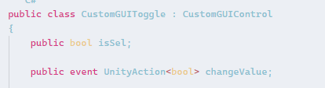

# GUI

## 文本和控件按钮
### 一、GUI控件绘制的共同点
1. 都是GUI公共类中提供的**静态函数**，**直接调用**即可
2. 他们的**参数**都大同小异
    **位置**参数： Rect参数 x y位置 w h 尺寸
    显示**文本**： String参数
    **图片**信息： Texture参数
    **综合**信息： GUIContent
    **自定义**样式： GUIStyle

### 二、 文本控件
//基本使用
```c#
//基本使用
GUI.Label(new Rect (0,0,100,20),"xxxxxx");   //位置+文本信息
GUI.Label(rect,tex);                         //位置+图片    需public申明
//综合使用
GUI.Label(rect1,content);                    //位置+综合信息（文本、图片、）
//可以获取当前鼠标或者键盘选中的GUI控件 对应的tooltip
Debug.Log(GUI.tooptip);
//自定义样式
```

### 三、按钮控件
//基本使用
//综合使用
//自定义样式
```C#
if(GUI.Button(btnRect.btnContent,btnStyle))
{
//处理点击按钮的逻辑   必须在按钮范围内 按下并抬起  才算一次点击
Debug.Log(按钮被点击);
}

//只要在长按按钮范围内 按下鼠标 就会一直返回true
if（GUI.RepeatButton(GUI.Button(btnRect.btnContent)）
{
Debug.Log("长按按钮被点击);
}
```
## 多选框和单选框
### 一、多选框


```c#
private bool isSel;    //私有申明一个siSel标志符 而不是直接写死bool值
private bool isSel2;   //若不申明 GUI状态每帧更新 点击后bool值会变但 下一帧会立马变回申明状态

//普通样式
isSel =  GUI.Toggle(new Rect(0,0,100,30),isSel,"效果开关")

//自定义样式
//修改固定宽高 fixedWidth和fixedHeight (如果直接改width 和 height 响应区域也会跟着改变)
//修改从GUIStyle边缘到内容起始处的空间 padding 
isSel2 = GUI.Toggle(new Rect(0,0,100,30),isSel,"音效开关"，style)
```

### 二、单选框
```C# 
private int nowSelIndex = 1;


//单选框的实现  基于多选框
//关键： 通过一个Int标识用来决定是否选中
if(GUI.Toggle(new Rect(0,100,100,30),nowSelIndex == 1,"选项一"))
{
nowSelIndex = 1;
}

if(GUI.Toggle(new Rect(0,140,100,30),nowSelIndex == 2,"选项二"))
{
nowSelIndex = 2;
}

if(GUI.Toggle(new Rect(0,180,100,30),nowSelIndex == 3,"选项三"))
{
nowSelIndex = 3;
}
```

## 输入框和拖动条

### 一、 输入框 
```C#
private string inputStr="";
private string inputPW ="";

//普通输入    //此处若不写inputStr=  则会每帧更新 临时输入的内容会变成初内容 
            //此处实际效果为  每帧将当前输入的内容返回给输入框用于对其赋值
inputStr = GUI.TextField(new Rect(0,0,100,30),inputStr)

//密码输入
inputPW = GUI.PasswordField(new Rect(0,50,100,30),inputPW,'*')
```

### 二、拖动条

#### 水平拖动条

``` C#
private float nowValue = 0.5f;

//当前值
//最小值 left
//最大值 right
nowValue = GUI.HorizontalSlider(new Rect)(0,100,100,50),nowValue，0,1)
```

#### 竖直拖动条

```C#

nowValue = GUI.verticalSlider(new Rect)(0,150,50,100),nowValue，0,1)

```

## 图片绘制和框

### 一、 图片绘制
```C#
public Rect     texPos;
public Texture  tex;


//ScaleMode
//ScaleAndCrop:通过宽高比来计算图片 但是会进行裁剪
//ScaleToFit:自动根据宽高比进行计算 不会拉变形 会一直保持图片完全显示的状态
//StretchToFill:始终填充满你传入的Rect范围

//alpha 是用来 控制 图片是否开启透明通道的

//imageAspect 自定义宽高比 如果不填 默认为0 就会使用 图片原始宽高

GUI.DrawTexture(texPcs,tex,mode,alpha,wh)

```

### 二、框绘制

```C#
public Rect texPos;

public Texture BoxTexure

GUI.Box(texPos," ") //简单文本显示框

GUI.Box(texPos,BoxTexure)//显示带纹理的框

GUI.Box(texPos,"自定义样式",style)//自定义框的外观
```

## 工具栏和选择网格

### 一、工具栏 

```C#
private int toolbarIndex = 0;
private string[] toolbarInfos = new string[]{"选项一"，"选项二"，"选项三"};

toolbarIndex = GUI.Toolbar(new Rect(0,0,300,30), toolbarIndex,toolbarInfos)
//工具栏可以帮助我们根据不同的返回索引 来处理不同的逻辑

switch(toolbarIndex)
{
case 0 :
    break;
case 1 :
    break;
case 2 :
    break;
}
```

### 二、选择网格

```C#
private int selGridIndex = 0;
private string[] toolbarInfos = new string[]{"选项一"，"选项二"，"选项三"};

//相对toolbar多了一个参数 xCount 代表 水平方向最多显示的按钮数量
GUI.SelectionGrid(new Rect(0,50,200,30),selGridIndex,toolbarInfos，3)
```

## 滚动列表和分组

### 一、分组

```C#
//用于批量控制组件位置
//可以理解为 包裹着的控件加了一个父对象
//可以通过控制分组来控制包裹控件的位置
public Rect groupPos;


GUI.BeginGroup(groups);


GUI.Button(new Rect(0,0,100,50),"测试按钮")


GUI.EndGroup();


```

### 滚动列表

``` C#
public  Rect  scPos;
public  Rect  showPos;
private Vector2  nowPos;

public static Vector2 BeginScrollView(Rect position, Vector2 scrollPosition, Rect viewRect, bool alwaysShowHorizontal, bool alwaysShowVertical, GUIStyle horizontalScrollbar, GUIStyle verticalScrollbar);

//position : 屏幕上用于滚动视图的矩形区域。
 
//scrollPosition: 视图在 X 和 Y 方向上滚动的像素距离。   
//viewRect: 在滚动视图内使用的矩形区域。  
//horizontalScrollbar 和 verticalScrollbar: （可选）用于水平和垂直滚动条的 GUIStyle。如果省略，则使用当前 GUISkin 的样式。 
//alwaysShowHorizontal 和 alwaysShowVertical: （可选）指示是否始终显示水平和垂直滚动条。


nowPos = GUI.BeginScrollView(scPsos,nowPos,showPos)


GUI.EndScrollView();
```

## 窗口

### 一、窗口的基本使用 

```C#

public static [Rect] Window (int id, [Rect] clientRect, [GUI.WindowFunction] func, [string] text, [GUIStyle] style
public static [Rect] Window (int id, [Rect] clientRect, [GUI.WindowFunction] func, [Texture] image, [GUIStyle] style
public static [Rect] Window (int id, [Rect] clientRect, [GUI.WindowFunction] func, [GUIContent] title, [GUIStyle] style;

| Style      | （可选）用于窗口的样式。如果省略，则使用当前 GUISkin 的 window 样式。 
|------------|--------------------------------------------------------------
| id         | 窗口的 ID 编号（只要保证唯一，可以使用任意值）。                
| clientRect | 表示窗口位置和大小的屏幕矩形。                             
| func       | 显示窗口内容的脚本函数。                                
| text       | 要在窗口内呈现的文本。                                 
| image      | 要在窗口内呈现的图像。                                 
| content    | 要在窗口内呈现的 GUIContent。                        
| style      | 窗口的样式信息。                                    
| title      | 窗口标题栏中显示的文本。                                

//第一个参数 id 是窗口的唯一ID 不要和别的窗口重复
//委托参数 是用于 绘制窗口用的函数 传入即可
GUI.Window(1,new Rect(100,100,200,150),DrawWindow,"测试窗口")
//id 有一个重要作用 除了区分不同窗口 还可以在一个函数中去处理多个窗口的逻辑
GUI.Window(2,new Rect(100,100,200,150),DrawWindow,"测试窗口")
private void DrawWindow
{
    switch(id)
    {
        case 1:
        GUI.Button(new Rect(0,30,30,20),"1")
        break;
        
        case 2:
        GUI.Button(new Rect(0,30,30,20),"2")
        break;
        
        case 3:
        GUI.Button(new Rect(0,30,30,20),"3")
        break;
        
        case 4:
        //该API 写在窗口函数中调用 可以让窗口被拖动
        //传入Rect参数的重载 作用是 决定窗口中哪一部分位置可以被拖动
        //默认不填就是无参重载 默认窗口的所有位置都能被拖动
        GUI.Dragwindow（）;
        break;
    } 
}
```

### 二、模态窗口 


```C#
//模态窗口 可以让其它控件不再有用
//可以理解成该窗口在最上层 其他按钮都点击不到 
//只能点击该窗口上的控件

GUI.ModalWindow(1,new Rect(300m100m200m150),DrawWindow,"模态窗口")
```

### 三、拖动窗口

```C#

private Rect drawWinPos = new Rect(400,400,200,150);

//位置赋值 只是前提  (具体case 4 看窗口的基本使用的Drawwindow函数)
dragWinPos = GUI.Window(4,dragWinPos,DrawWindow,拖动窗口)
```

## 自定义皮肤

### 一、全局颜色

```C#
//全局的着色颜色 影响背景和文本颜色
GUI.color = Color.red;
//文本着色颜色  会和全局颜色相乘
GUI.contentColor = Color.yellow;
//背景元素着色元素 会和全局颜色相乘
GUI.backgroundColor = Color.red;
```

### 二、整体皮肤样式

```C#
public GUISkins skin;

GUI.skin = skin;
//虽然设置了皮肤 但是绘制时 如果使用GUIStyle参数 皮肤就没有

//它可以帮助我们整套的设置 自定义样式
//相对单个控件设置Style要方便一些
```

## GUIlayout自动布局

### 一、GUIlayout 自动布局

```C#
//主要用于进行编辑器开发 若果用它来做游戏UI不太合适
GUILayout.BeginGroup(new Rect(100,100,100,100));
GUILayout.BeginHorizontal(); /GUILayout.BeginVertical();

GUILayout.Button("123");
GUILayout.Button("234");
GUILayout.Button("345",GUILayout.ExoandWidth(false));

GUILayout.EndHorizontal(); /GUILayout.EndVertical();
GUILayout.EndGroup();
```

### 二、GUIlayoutOption

```C#
//控件的固定宽高
GUILayout.Width(300);
GUILayout.Height(200);

//允许控件的最小宽高
GUILayout.MinWidth(50);
GUILayout.MinHeight(50);

//允许控件的最大宽高
GUI.Layout.MaxWidth(100);
GUI.Layout.MaxHeight(100);
//允许或禁止水平拓展
GUILayout.ExpandWidth（true）;允许
GUILayout.ExpandWidth(false);禁止
GUILayout.ExpandHeight(true);允许
GUILayout.ExpandHeight(false);禁止
```

## 实践部分
### 一、编辑器模式下执行脚本
```C#
[ExecuteAlways]
```

### 二、控制位置信息类

```C# 
//对齐方式枚举
public enum  E_Alignment_Type 
    {
        Up,
        Down,
        Left,
        Right,
        Center,
        Left_Up,
        Left_Down,
        Right_Up,
        Right_Down,
    }

[System.Serializable]
public class CustomGUIPos
{
    
    //该位置信息 用来返回给外部 用于绘制控件
    private Rect rpos = new Rect(0,0,100,100)
    
    //屏幕九宫格对齐方式
    public E_Alignment_Type screen_Alignment_Type;
    //控件中心对齐方式
    public E_Alignment_Type control_Alignment_Type;
    //偏移位置
    public Vector2 pos;
    //宽高
    public float width = 100;
    public float height = 50;
    //用于计算的 中心点 成员变量
    private Vector2 centerPos;
    
    //计算中心点偏移的方法
    private void CalcCenterPos()
        {
            switch(control_Alignment_Type)
            {
                case E_Alignment_Type.Up:
                    centerPos.x = -width/2;
                    centerPos.y = 0;
                    break;
                    
                case E_Alignment_Type.Down:
                    centerPos.x = -width/2;
                    centerPos.y = -height;
                    break;
                    
                case E_Alignment_Type.Left:
                    centerPos.x = 0;
                    centerPos.y =-height/2;
                    break;
                    
                case E_Alignment_Type.Right:
                    centerPos.x = -width;
                    centerPos.y = -height/2;
                    break;
                    
                case E_Alignment_Type.Center:
                    centerPos.x = -width/2;
                    centerPos.y = -height/2;
                    break;
                    
                case E_Alignment_Type.Left_Up:
                    centerPos.x = 0;
                    centerPos.y = 0;
                    break;
                    
                case E_Alignment_Type.Left_Down:
                    centerPos.x = 0;
                    centerPos.y = -height;
                    break;
                    
                case E_Alignment_Type.Right_Up:
                    centerPos.x = -width;
                    centerPos.y = 0;
                    break;
                    
                case E_Alignment_Type.Right_Down:
                    centerPos.x = -width;
                    centerPos.y = - height;  
                    break;  
                    
            }
        }
    
    //计算最终相对坐标位置的方法
    private void CalPos()
        {
            switch(screen_Alignment_Type)
            {
                case E_Alignment_Type.Up:
                    rPos.x = Screen.width/2 + centerPos.x + pos.x;
                    rPos.y = 0 + centerPos.y + pos.y;
                    break;
                
                case E_Alignment_Type.Down:
                    rPos.x = Screen.width/2 + centerPos.x + pos.x;
                    rPos.y = Screen.height + centerPos.y - pos.y;
                   break;
                   
                case E_Alignment_Type.Left:
                    rPos.x = 0 + centerPos.x + pos.x;
                    rPos.y = Screen.height/2 + centerPos.y + pos.y;
                   break;
                   
                case E_Alignment_Type.Right:
                    rPos.x = Screen.width + centerPos.x - pos.x;
                    rPos.y = Screen.height/2 + centerPos.y + pos.y;
                    break;
                    
                case E_Alignment_Type.Center:
                    rPos.x = Screen.width/2 + centerPos.x + pos.x;
                    rPos.y = Screen.height/2 + centerPos.y + pos.y;
                   break;
                   
                case E_Alignment_Type.Left_Up:
                    rPos.x = 0 + centerPos.x + pos.x;
                    rPos.y = 0 + centerPos.y + pos.y;
                    break;
                    
                case E_Alignment_Type.Left_Down:
                    rPos.x = 0 + centerPos.x + pos.x;
                    rPos.y = Screen.height + centerPos.y - pos.y;
                   break;
                   
                case E_Alignment_Type.Right_Up:
                    rPos.x = Screen.width + centerPos.x - pos.x;
                    rPos.y = 0 + centerPos.y + pos.y;
                   break;
                   
                case E_Alignment_Type.Right_Down:
                    rPos.x = Screen.width + centerPos.x - pos.x;
                    rPos.y = Screen.height + centerPos.y - pos.y;
                    break;  
                      
            }
        }
    
    //得到最终绘制的位置和宽高
    public Rect Pos
        {
            get
            {
                //进行计算
                //计算中心点偏移
                CalcCenterPos();
                //计算 相对屏幕坐标点
                CalcPos();
                //宽高直接赋值 发回给外部 别人直接使用来绘制控件
                rPos.width = width;
                rPos.height = height;
                return rPos ;   
            }
        }

}
```

### 三、控件父类(GUIControl)
```C#

    public enum E_Style_OnOff
    {
        On,
        Off,
    }
    public class CustomGUIControl : MonoBehaviour
    {
        //提取控件的共同表现
        //位置信息
        public CustomGUIPos guiPos;
        //显示内容信息
        public GUIContent content;
        //自定义样式
        public GUIstyle style;
        //自定义样式是否启用的开关
        public E_Style_OnOff styleOnOrOff = E_Style_OnOff.off;
        
        private void OnGUI()
        {
            case E_Style_OnOff.On:
                StyleOnDraw();
                break;
            case E_Style_OnOff.Off:
               StyleOffDraw();
                break;
        }
        
        protected virtual void StyleOnDraw
        {
            GUI.Button(guiPos.Pos, content, style);
        }
        
        protected virtual void StyleOffDraw
        {
             GUI.Button(guiPos.Pos, content);
        }
    }

```

### 四、所见即所得的绘制顺序)(GUIRoot)

```C#


private void OnGUI()                    public void DrawGUI()            
{                                       {
    case E_Style_OnOff.On:                case E_Style_OnOff.On:
        StyleOnDraw();                      StyleOnDraw();
        break;                 ==>          break;  
    case E_Style_OnOff.Off:               case E_Style_OnOff.Off:
       StyleOffDraw();                      StyleOffDraw();
        break;                              break;
}                                       }

protected virtual void StyleOnDraw
{
    GUI.Button(guiPos.Pos, content, style);
}

protected virtual void StyleOffDraw
{
     GUI.Button(guiPos.Pos, content);
}

//上述代码节选自 控件父类

[ExecuteAlways]
public class CustonGUIRoot : MonoBehaviour
{
    //用于存储子对象 所有GUI控件的容器
    private CustomGUIControl allControls;
    
    void Start
    {
        allControls = this.GetComponentsInChildren<CustomGUIControl>（）;
    }
    
    private void OnGUI()
    {
        //通过每一次绘制前 得到所有子对象控件的 父类脚本
        //这句代码会浪费性能 因为每次GUI都会获取所有控件对应的脚本
        //编辑状态下 才会一直运行
        if(!Application.isPlaying)
        {
            allControls = this.GetComponentsInChildren<CustomGUIControl>（）;
        }
        for(int i =0; i< allControls.Length;i++)
        {
            allControls[i].DrawGUI();
        }
        
    
    }

}


```

### 五、自定义文本和控件按钮 (GUILabel)

```C#
public abstract class CustomGUIControl : MonoBehaviour
    {
        //提取控件的共同表现
        //位置信息
        public CustomGUIPos guiPos;
        //显示内容信息
        public GUIContent content;
        //自定义样式
        public GUIstyle style;
        //自定义样式是否启用的开关
        public E_Style_OnOff styleOnOrOff = E_Style_OnOff.off;
        
        private void OnGUI()
        {
            case E_Style_OnOff.On:
                StyleOnDraw();
                break;
            case E_Style_OnOff.Off:
               StyleOffDraw();
                break;
        }
        
        protected abstract void StyleOnDraw
        {
        }
        
        protected abstract void StyleOffDraw
        {
        }
}


public class CustomGUILabel : CustomGUIControl 
{
    protected override void StyleOffDraw()
    {
        GUI.Label(guiPos.Pos,Content)
    }
    
    protected override void StyleOnDraw()
    {
        GUI.Label(guiPos.Pos,content,style)
    }
}

public  class CustomGUIButton :CustomGUIControl
{
    //提供给外部 用于响应 按钮点击的实践 只要在外部给予了响应函数 就会执行
    public event UnityAction clickEvent
    
    protected override void StyleOffDraw()
    {
        if(GUI.Label(guiPos.Pos,Content))
        {
            clickEvent?.Invoke();
        }
    }
    
    protected override void StyleOnDraw()
    {
        if(GUI.Label(guiPos.Pos,content,style))
        {
            clickEvent?.Invoke;
        }
    }
}

```

### 六、自定义多选框控件

```C#
public class CustomGUIToggle : CustomGUIControl
{
    public bool isSel;
    
    public event UnityAction<bool> changeValue;
    
    private bool isOldSel;
    
    protected override void StyleOffDraw()
        {
            isSel = GUI.Toggle(guiPos.Pos,isSel,content);
            //只有变化时 才告诉外部去执行函数 否则没有必要一直告诉同一个值
            if(isOldSel != isSel)
            {
                changeValue?.Invoke(isSel)
                isOldSel = isSel;
            }
        }
        
        protected override void StyleOnDraw()
        {
           isSel = GUI.Toggle(guiPos.Pos,isSel,content.style)
        }
}


```

### 七、自定义单选框控件


```C#
public class CustomGUIToggleGroup :MonoBehaviour
{
    public CustomGUIToggle[] toggles;
    
    //记录上一次为true的 toggle
    private CustomGUIToggle frontToggle;
    
    void Start()
    {
        if(toggles.Length == 0)
        {
            return;
        }
        
        //通过遍历 来为多个 多选框 天界 监听事件函数
        //当函数中做处理
        //当一个为true时 另外两个变成false
        fof(int i = 0; i<toggles.Length; i++)
        {
            CustomGUIToggle toggle = toggles[i];
            toggle.changValue += (value) =>
            {
                    //当传入的 value 是true时 需要把另外两个变成false
                    if（value）
                    {
                        for(int j = 0; j<toggles.Length; j++)
                        {
                                //这里有闭包 toggle就是上一个函数中神明的变量
                                //改变了它的生命周期
                            if(toggles[j] != toggle)
                            {
                                toggles[j].isSel = false; 
                            }
                        }
                        //记录上一次为true的toggle
                        frontToggle = toggle;
                    }
                    else if(toggle == frontToggle)
                    {
                        toggle.isSel = true;
                    }
            }
        }
    }
}
```

### 八、自定义输入框和拖动条控件

```C#
//自定义输入框
public class CustomGUIInput : CustomGUIControl
{
    
    public event UnityAction<string> textChang;
    
    private string oldStr = "";
    
    protected override void StyleOffDraw()
        {
           content.text = GUI.TextField(guiPos.Pos,content.txt);
           if（oldStr != content.text）
           {
               textChange?.Invoke(oldStr);
               oldStr = content .text;
           }
        }
        
        protected override void StyleOnDraw()
        {
           content.text = GUI.TextField(guiPos.Pos,content.txt,style);
           if（oldStr != content.text）
           {
               textChange?.Invoke(oldStr);
               oldStr = content .text;
           }
        }
}
```

```C#
//拖动条
public enum E_Slider_Type.Up
{
    horizontal,
    Vertical;
}

public class CustomGUISlider : CustomGUIControl
{
    //最小值
    public float minValue = 0;
    //最大值
    public float maxValue = 0;
    //当前值
    public float nowCalue = 0;
    //水平还是竖直样式
    public E_Slider_Type type = E_Slifer_Type.Horizontal;
    
    public event UnityAction<float>  changeValue;
    
    private float oldValue = 0;
    
    punblic GUIStyle styleThumb;
    //小按钮的style
    protected override void StyleOffDraw()
        {
            switch(type)
            {
                case E_Slifer_Type.Horizontal:
                    nowValue =GUI.HorizontalSlider(guiPos.Pos,nowValue,minValue,maxValue)
                case E_Slifer_Type.Vertical;
                    nowValue =GUI.VerticalSlider(guiPos.Pos,nowValue,minValue,maxValue)
            }
            
           if(oldValue != nowValue)
           {
               changeValue?.Invoke(nowValue);
               oldValue = nowValue;
           }
        }
        
        protected override void StyleOnDraw()
        {
           switch(type)
            {
                case E_Slifer_Type.Horizontal:
                    nowValue =GUI.HorizontalSlider(guiPos.Pos,nowValue,minValue,maxValue,style,styleThumb)
                case E_Slifer_Type.Vertical;
                    nowValue =GUI.VerticalSlider(guiPos.Pos,nowValue,minValue,maxValue,style,styleThumb)
            }
            
            if(oldValue != nowValue)
           {
               changeValue?.Invoke(nowValue);
               oldValue = nowValue;
           }
        }
    
}

```

### 九、自定义图片绘制和面板功能演示

```C#

public class CustomGUITexture : CustomGUIControl
{
    public ScaleMode scaleMode = ScaleMode.StretchToFill;
    protected override void StyleOffDraw()
        {
               GUI.DrawTexture(guiPos.Pos,content.image,ScaleMode);
        }
        
        protected override void StyleOnDraw()
        {
           
            
            if(oldValue != nowValue)
           {
               GUI.DrawTexture(guiPos.Pos,content.image,ScaleMode,style);
           }
        }
    
}
```

```C#
public class TestBeginPanel :MonoBehaviour
{
    public CustomGUIButton btnBegin;
    public CustomGUIButton btnEnd;
    public CustomGUIButton btnClose;
    
    void Start()
    {
        btnBegin.clickEvent += () =>
        {
            Debug.Log("点击开始按钮")
        }
        
        btnEnd.clickEvent += () =>
        {
            Debug.Log("结束按钮点击")
        }
        
        btnClose.clickEvent += () =>
        {
            Debug.Log("关闭按钮")
        }
    }
}
```