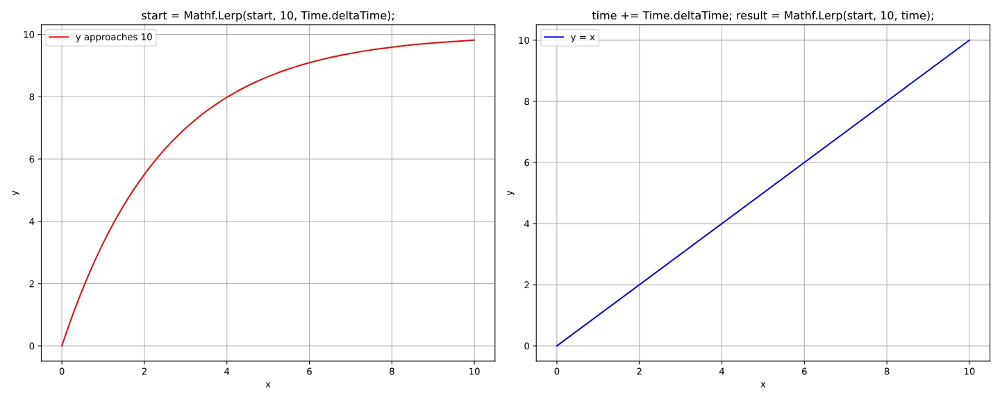
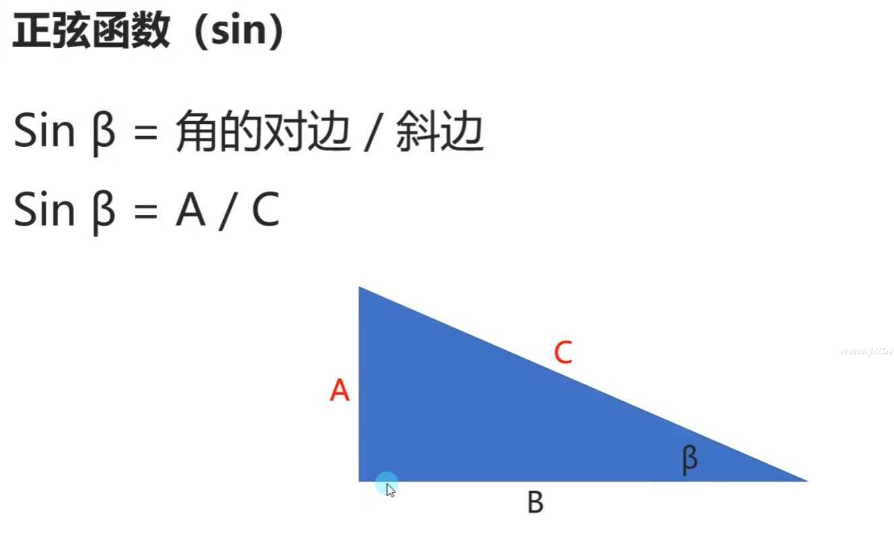
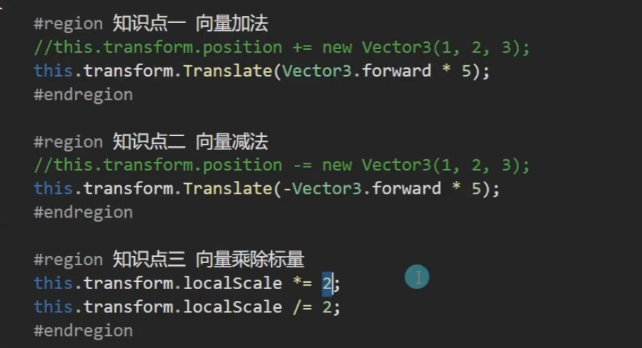
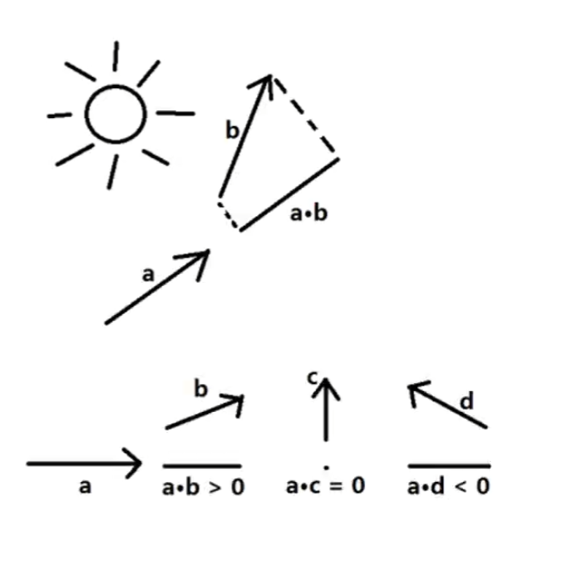
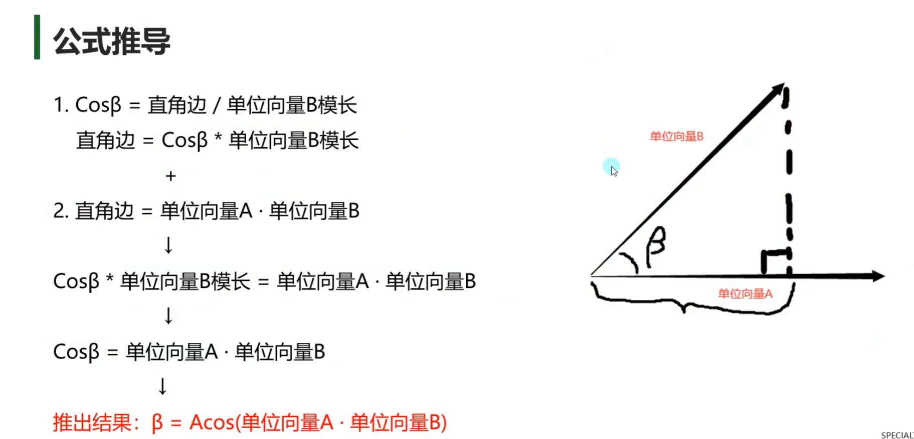
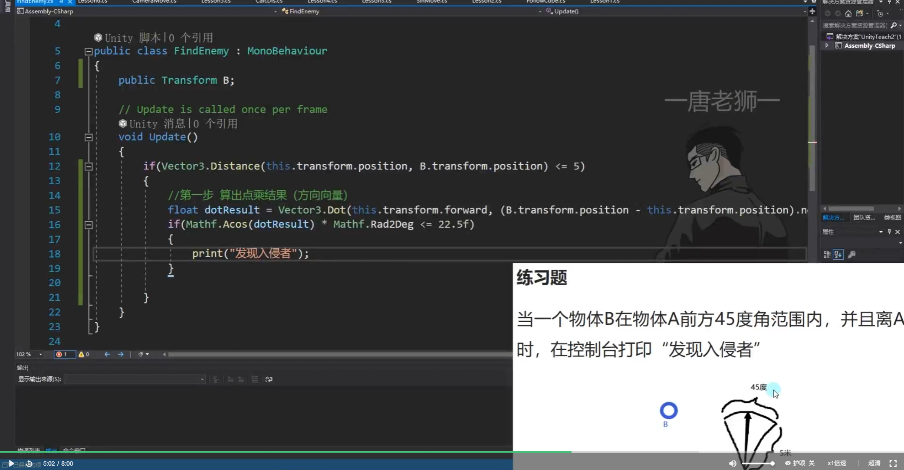
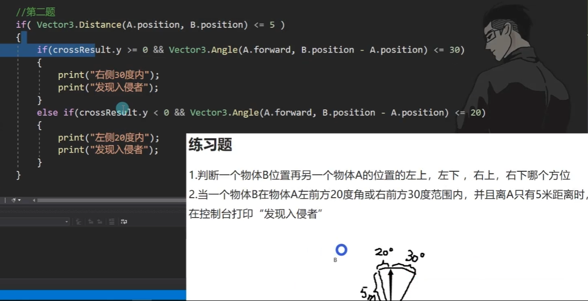
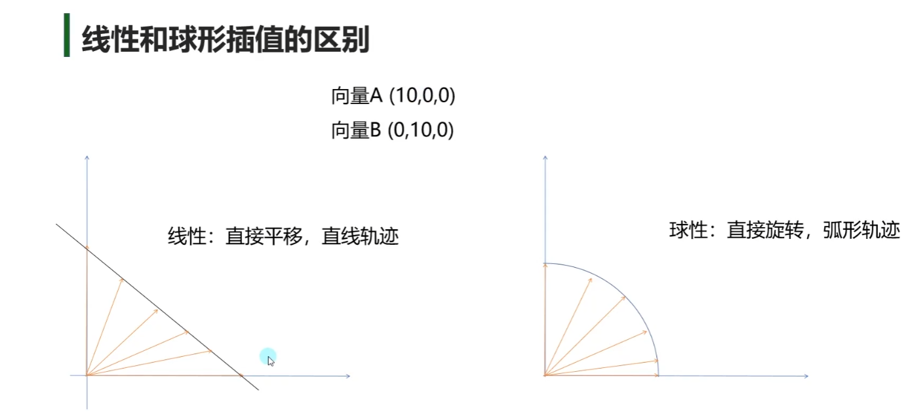

# Unity基础

## 一、 3D数学——基础

### 1. Mathf

- **知识点一**  Mathf和Math
    Math是C#中封装好的用于数学计算的**工具类** ———— 位于System命名空间中
    Matthf是Unity中封装好的用于数学计算的工具**结构体**————位于UnityEngine命名空间中
    他们都是提供来进行数学相关计算的
- **知识点二**他们的==区别==
    Mathf和Math中的相关方法几乎一样
    Math是C#自带的工具类 主要提供一些数学相关计算方法
    Mathf是Unity专门封装的，不仅包含Math中的方法，还多了一些适用于游戏开发的方法
    所以在进行Unity游戏开发时 使用Mathf中的方法用于数学计算即可
- **知识点三**Mathf中的==常用==方法———般计算一次
    1. π - **PI**
    `print（Mathf.P）;`
    2. 取绝对值 - **Abs**
    `print(Mathf.Abs(-10));`
    3.  向上取整 - **CeilToInt**
    `float f = 1.3f;`
    `print(Mathf.CeilToInt(f));`
    4. 向下取整 - **FloorToInt**
    `print(Mathf.FloorToInt(1.3));`
    5. 钳制函数 - **Clamp**
    `print(Mathf.Clamp(10,11,20));`——**输出11**
    `print(Mathf.Clamp(21,11,20));`——**输出20**
    `print(Mathf.Clamp(15,11,20));`——**输出15**
    6. 获取最大值 - **Max**
    `print(Mathf.Max(1,2,3,4,5,6,7,8,9));`——**输出1**
    7. 获取最小值 - **Min**
    `print(Mathf.Min(1,2,3,4,5,6,7,8,9));`——**输出9**
    8. 一个数的n次幂 - **Pow**
    `print(Mathf.Pow(4,2));`——**输出16**
    `print(Mathf.Pow(2,3));`——**输出8**
    9. 四舍五入 - **RounToInt**
    `print(Mathf.RoundToInt(1.3f));`——**输出1**
    `print(Mathf.RoundToInt(1.5f));`——**输出2**
    10. 返回一个数的平方根 - **Sqrt**
    `print(Mathf.Sqrt(4));`——**输出2**
    `print(Mathf.Sqrt(16));`——**输出4**
    `print(Mathf.Sqrt(64));`——**输出8**
    11. 判断一个数是否是2的n次方 - **IsPowerOfTwo**
    `print(Mathf.IsPowerOfTwo(4));`——**True**
    `print(Mathf.IsPowerOfTwo(8));`——**True**
    `print(Mathf.IsPowerOfTwo(3));`——**False**
    `print(Mathf.IsPowerOfTwo(1));`——**True**
    12. 判断正负数 - **Sign**
    `print(Mathf.Sign(0));`——**1**
    `print(Mathf.Sign(10));`——**1**
    `print(Mathf.Sign(-10));`——**-1**
    `print(Mathf.Sign(3));`——**1**
    `print(Mathf.Sign(-2));`——**-1**
- **知识点四**Mathf中的常用方法———一般不停计算
    `float start = 0;`
    `float result = 0;`
    `float time = 0;`
    差值运算——Lerp  `result = Mathf.Lerp(start,end,t);`
    t为差值系数，取值范围为 0~1  ==result = start + (end - start) * t==
    差值运算用法一 ：每帧改变start的值 —— 变化速度先快后慢，位置无限接近，但是不会得到end位置
    `start = Mathf.Lerp(start, 10, Time.deltaTime);`
    差值运算用法二：每帧改变t的值—— 变化速度匀速，位置每帧接近，当他>=1时，得到结果
    `time += Time.deltaTime;`
    `result = Mathf.Lerp(start, 10, time);`
    
### 2. 三角函数
角度和弧度的转换关系

π rad = 180°
==1 rad = (180/π)° => 1 rad = 180 / 3.14 ≈ 57.3°==
==1° = （π、180）rad = 1° = 3.14 /180≈0.01745 rad==
由此可以得出
==弧度 * 57.3 = 对应角度==
==角度 * 0.01745 = 对应弧度==

- **知识点一** 弧度、角度相互转化      ==Rad== ——radian   ==Deg== ——degree
    //==弧度转角度==
    `float rad = 1；`
    `float anger = rad * Mathf.Rad2Deg;`//Rad2Deg     弧度转角度
    `print(anger);`
    //==角度转弧度==
    `anger = 1;`
    `rad = anger * Mathf.Deg2Rad;`//Deg2Rad     角度转弧度
    `print(rad);`
- **知识点二**三角函数
    正弦函数
    
    
    ==Mathf中的三角函数相关函数，传入参数需要是弧度值==
    
    `print(Mathf.Sin(30 * Mathf * Deg2Rad));`
    `print(Mathf.Cos(30 * Mathf * Deg2Rad));`
- **知识点三**反三角函数
    1. 反三角函数是初等函数之一
    2. 包括反正弦函数、反余弦函数等
    ==作用==：通过反三角函数计算正弦值或余弦值对应的弧度值
    ==注意==：反三角函数得到的结果是 正弦或者余弦值对应的弧度
    `rad = Mathf.Asin(0.5f);`//得到0.5这么大的值对应的正弦弧度
    
    `print(rad * Mathf.Rad2Deg);`
    
    `rad = Math.Acos(0.5f);`//得到0.5这么大的值对应的余弦弧度
    
    `print(rad * Mathf.Rad2Deg);`
    
    
 
 
### 3. 坐标系

- **知识点一** 世界坐标系
    原点：世界的中心点
    轴向：世界坐标系的==三个轴向是固定==的
    //世界坐标相关
    `this.transform.position;`  世界坐标位置
    `this.transform.rotation;`  世界坐标旋转（四元数）
    `this.transform.eulerAngles;`  世界坐标欧拉角
    `this.transform.lossyScale;`世界坐标缩放
- **知识点二** 物体坐标系
    原点：物体的中心点（建模时决定）
    轴向：
    物体==右方==为==X==轴正方向
    物体==上方==为==Y==轴正方向
    物体==前方==为==Z==轴正方向
    //相对父对象坐标 本地坐标  相对坐标
    `this.transform.localPosition;`  本地坐标位置
    `this.transform.localEulerAngles;`  本地坐标欧拉角
    `this.transform.localRotation;`  本地坐标旋转（四元数）
    `this.transform.localScale;`  本地坐标缩放

- **知识点三** 屏幕坐标系
    原点：屏幕左下角
    轴向：
    ==向右==为==X==轴正方向
    ==向上==为==Y==轴正方向
    最大宽高：
    `Screen.width;` 屏幕宽度
    `Screen.height;` 屏幕高度
    `Input.mousePositon;` 鼠标位置
    
- **知识点四** 视口坐标系
    原点：屏幕左下角
    轴向：
    ==向右==为==X==轴正方向
    ==向上==为==Y==轴正方向
    特点：
    ==左下角为（0,0）==
    ==右上角为（1,1）==
    和屏幕坐标类似，将坐标单位化
- # 坐标转换 
    
    ## 1.世界转本地
    ### this.transform.InverseTransformDirection;
    ### this.transform.InverseTransformPoint;
    ### this.transform.InverseTransformVector;
    
    ## 2.本地转世界
    ### this.transform.TransformDirection;
    ### this.transform.TransformPoint;
    ### this.transform.TransformVector;
    
    ## 3.世界转屏幕
    ### Camera.main.WorldToScreenPoint;
    ## 4.屏幕转世界
    ### Camera.main.ScreenToWroldPoint;
    ## 5.世界转视口
    ### Camera.main.WorldToViewportPoint;
    ## 6.视口转世界
    ### Camera.main.ViewportToWorldPoint;
    ## 7.视口转屏幕
    ### Camera.main.ViewportToScreenPoint;
    ## 8.屏幕转视口
    ### Camera.main.ScreenToViewportPoint;

## 二、3D数学——向量

### 1. 向量模长和单位向量

- ==标量==：有数值大小，没有方向
- ==向量==：有数值大小，有方向的矢量
- **知识点一 向量**
    三维向量 —— Vector3
    1. 位置 —— 代表一个点
    `print(this.transform.position);`
    2. 方向 —— 代表一个方向
    `print(this.transform.forward);`
    `print(this.transform.up);`
- **知识点二 两点决定一向量**
    //A和B此时 几何意义 是两个点
    `Vector3 A = new Vector3(1,2,3);`
    `Vector3 B = new Vector3(5,1,5);`
    //求向量  此时AB和BA 他们的几何意义是两个向量
    `Vector3 AB = B - A;`
    `Vector3 BA = A - B;`


- **知识点三 零向量和负向量**
    零向量(0,0,0)
    零向量是==唯一==一个==大小为0==的向量
    
    ==负向量==
    (x,y,z)的负向量为(-x,-y,-z)
    负向量和原向量==大小相等==
    负向量和原向量==方向相反==
    `print(Vector3.zero);`==零向量==
    
    `print(-Vector3.forward);`==负向量==

- **知识点四 向量的模长**
    向量的模长就是向量的长度
    向量是由两个点算出，所以向量的模长就是两个点的距离
    
    模长公式：
    A向量（x,y,z）
    模长 = √x^2+y^2+z^2
    
    Vector3中提供了==获取==向量==模长==的==成员属性==
    ==magnitude==
    `print(AB.magnitude);`
    `Vector3 C = new Vector3(5,6,7);`
    `print(C.magnitude)`  ==此处为通过向量获得相对于原点的向量长度==
    
    `Vector3.Distance(A,B);`==此处为通过点的距离得模长==
- **知识点五 单位向量**
    模长为1的向量为单位向量
    任意一个向量经过归一化就是单位向量
    只需要方向，不想让模长影响计算结果时使用单位向量
    ==归一化公式：==
    A向量（x,y,z）
    模长 = √x^2+y^2+z^ 2
    ==单位向量 = （x/模长,y/模长,z/模长==
    
    Vector3提供了获取单位向量的成员属性
    ==normalized==
    `print(AB.normalized);`
    `print(AB/AB.magnitude);` 向量/模长 = 单位向量
    


### 2. 向量点乘

点乘==计算公式==

向量 A(Xa,Ya,Za)
向量 B(Xb,Yb,Zb)

==A·B=Xa * Xb + Ya * Yb + Za * Zb==
向量 · 向量 = 标量

==点乘==的==几何意义==

点乘可以得到一个向量
在自己向量上的投影的长度
点乘结果 >0 两个向量夹角为锐角
点乘结果 =0 两个向量夹角为直角
点乘结果 <0 两个向量夹角为钝角

我们可以用这个规律判断敌方的大致方位

- **补充知识 调试划线**
    画线段      前两个参数分别是 起点 终点
    `Debug.DrawLine(this.transform.position,this.transform.position+this.transform.forward,Color.red);`
    
    画射线      前两个参数分别是 起点 方向
    `Debug.DrawRay(this.transform.position,this.transform.forward,Color.white);`

- **知识点一  通过点乘判断对象方位**
    Vector3提供了计算点乘的方法
    Debug.DrawRay(this.transform.position,This.transform.forward,Color.red);
    Debug.DrawRay(this.transform.position,(target.position - this.transform.position).normalized,Color.red);
    
    得到向量 a 点乘 AB 的结果
    ```C#
    float dotResult = Vector3.Dot(this.transform.forward,target.position - this.transform.position);
    if(dotResult >= 0)
    {
        print("它在我前方");
    }
    else
    {
        print("它在我后方");
    }
    ```
    
    
- **知识点二 通过点乘退到公式算出夹角**
    
    步骤
    1. 用单位向量算出点乘结果
    dotResult = Vector3.Dot(this.transform.forward,(target.position - this.transform.position).normalized);
    2. 用反三角函数得出角度
    print("角度" + Mathf.Acos(dotResult) * Mathf.Rad2Deg);
    
    print("角度2" + Vector3.Angle(this.transform.forward,target.position - this.transform.position));


### 3. 向量叉乘
-  ==叉乘计算公式==
- 向量 X 向量 = 向量

- **知识点一 叉乘计算**
    print(Vector3.Cross(A.position,B.position));
    
- **知识点二 叉乘的几何意义**
    假设向量 A和B 都在 XZ平面上
    向量A 叉乘 向量B
    y大于0 证明 B在A右侧
    y小于0 证明 B在A左侧


### 4. 向量差值运算

**线性差值**
==Vector3.Lerp(start , end , t);==
对两个点进行差值运算
t的取值范围为0~1

==公式== ： result = start + (end - start) * t

==应用== : 
1. 每帧改变start的值（先快后慢） start = Vector3.Lerp(start , end , t);
2. 每帧改变t的值（匀速） t += Time.deltaTime ; result = Vector3.Lerp(start , end , t);
- **知识点一 线性插值**
    result = start + (end - start) * t
    
    1. 先快后慢 每帧改变start位置 位置无限接近 但不会得到end位置
    `A.position =Vector3.Lerp(A.position,target.position,Time.deltaTime);`
    
    2. 匀速 每帧改变时间 当t>=1时 得到结果
    这种匀速移动 当time>=1时 改变目标位置后 它会直接瞬移到目标位置
    ```C#
    
    public Transform target; 
    public Transform A;
    public Transform B;
    private Vector3 startPos;
    private float time;
    private Vector3 nowTarget;
    
    if(nowTarget != target.position)
    {
        nowTarget = target.position;
        time = 0;
        startPos = B.position;
    }
    time += Time.deltaTime;
    A.position =Vector3.Lerp(startPos ,nowTarget,time);
    ```
    

**球形差值**
Vector3.Slerp(start,end,t);
对两个向量进行差值运算；
t的取值范围为0~1；

- **知识点二 球形差值**

```C#

public Transform C;

C.position = Vector3.Slerp(Vector3.right * 10 , Vector3.forward * 10 , time)
```

````ad-warning

如果想模拟太阳的东升西落这种运动 

需要在目标位置加上一个y轴的微小偏移量 来让代码判断是y轴平面转动

否则则会在X轴平面运动


    Vector3.Slerp(Vector3.right * 10,Vector3.left * 10 + Vector3.up * 0.01f , Time.deltaTime);
````

## 三、3D数学——四元数

### 1. 为何使用四元数

- # 欧拉角旋转约定
- heading-pitch-bank
- 是一种最常用的旋转序列约定
- Y-X-Z约定
- heading：物体绕自身的对象坐标系的Y轴，旋转的角度
- pitch：物体绕自身的对象坐标系的X轴，旋转的角度
- bank：物体绕自身的对象坐标系的Z轴，旋转的角度

- # Unity中的欧拉角
- Inspector窗口中调节的Rotation就是欧拉角
- this.transform.eulerAngles得到的就是欧拉角角度
    ==优点==：
    直观、易理解
    存储空间小（三个数表示）
    可以进行从一个方向到另一个方向旋转180度的角度
    ==缺点==：
    同一旋转的表示不唯一
    ==万向节死锁==
    当某个特定轴打到某个特殊值时
    绕一个轴旋转可能会覆盖住另一个轴的旋转
    从而失去一维自由度
    ==Unity中X轴达到90度时 会产生万向节死锁==


### 2.四元数是什么
- # 四元数概念
- 四元数是简单的超复数
- 由实数加上三个虚数单位组成
- 主要用于在三维空间中表示旋转

- # 四元数构成
- 一个四元数包含一个标量和一个3D向量
- [w,v],w为标量，v为3D向量
- [w,(x,y,z)]
- 对于给定的任意一个四元数：
- 表示3D空间中的一个旋转量

- # 轴-角对
- 在3D空间中，任意旋转都可以表示绕着某个轴旋转一个旋转角得到
````ad-danger

注意：该轴并不是空间中的x,y,z轴 而是任意一个轴
````

- 对于给定旋转，假设绕着n轴，旋转β度，n轴为(x,y,z)
- 那么可以构成四元数为
- 四元数Q = [cos(β/2),sin(β/2)]
- 四元数Q=[cos(β/2),sin(β/2)x,sin(β/2)y,sin(β/2)z]
    四元数Q则表示绕着轴n，旋转β度的旋转量

- # Unity中的四元数
- ## Quarternion
- 是Unity中表示四元数的结构体

- # Unity中的四元数初始化方法
- ## 轴角对公式初始化
- ### Q = p[cos(β/2),sin(β/2)x,sin(β/2)y,sin(β/2)z]
- ### Quarternion q = new Quarternion(sin(β/2)x,sin(β/2)y,sin(β/2)z,cos(β/2))

- ## 轴角对方法初始化
- 四元数Q = Quarternion.AngleAxis(角度，轴);
- Quarternion q = Quarternion.AngleAxis(60,Vector3.right)

### 3.四元数常用方法

- # 单位四元数
- 单位四元数表示没有旋转量（角位移）
- 当角度为0或者360度时
- 对于给定轴都会得到单位四元数

    [1,(0,0,0)]和[-1,(0,0,0)]都是单位四元数 表示没有旋转量


- # 四元数差值运算
- 四元数同样提供如同Vector3的差值运算
- Lerp和Slerp
````ad-tip

在四元数中Lerp和Slerp只有一些细微差别

由于算法不同 Slerp效果会好一些

Lerp的效果相比Slerp更快但是如果旋转范围较大效果较差
所以建议使用Slerp进行差值运算

````


- # 向量指向转四元数
````ad-tip
Quaternion.LookRotation(面朝向量)
````
- LookRotation方法可以将传入的面朝向量转换为对应的四元数角度信息(代码中如果要接收需要申明Quaternion类型的)

- 适用案例：人物面朝向改变时，传入目标面朝向得到目标四元数角度信息，之后将人物四元数角度信息改为得到的信息即可达到转向

### 4.四元数计算

- # 四元数相乘
- q3 = q1 * q2
- 两个四元数相乘得到一个新的四元数
- 代表两个旋转量的叠加
- 相当于旋转
````ad-warning
旋转相对的坐标系是 物体自身坐标系
````

- # 四元数乘向量
- v2 = q1 * v1
- 四元数乘向量返回一个新向量 
- ==可以将指定向量旋转对应四元数的旋转量==
- ==相当于旋转向量==

````ad-tip
四元数相乘——————角度叠加

四元数乘向量——————旋转向量
````


## 四、MonoBehavior中重要内容

### 1.延迟函数

- **知识点一 什么是延迟函数**
- 顾名思义就是延迟执行的函数
- 我们可以自己设定延时要执行的函数和具体延时的时间
- 是MonoBehaviour基类中实现好的方法

- **知识点二 延迟函数的使用**
- #### 1.延迟函数
- # Invoke
- #### 参数一 ： 函数名 字符串
- #### 参数二：  延迟时间 秒为单位
- `Invoke("",5);`

````ad-warning

1.延迟函数第一个参数传入的是函数名字符串

2.延迟函数没办法传入参数 只有包裹一层

3.函数名必须是该脚本上申明的函数
````


- #### 2.延迟重复执行函数
- # InvokeRepeating
- #### 参数一： 函数名字符串
- #### 参数二： 第一次执行的延迟时间
- #### 参数三： 之后每次执行的间隔时间

````ad-warning

1.延迟函数第一个参数传入的是函数名字符串

2.延迟函数没办法传入参数 只有包裹一层

3.函数名必须是该脚本上申明的函数
````

- #### 3.取消延迟函数
- #### 3-1 取消该脚本上的所有延迟函数执行