## 一、模型制作流程

第一步：建模
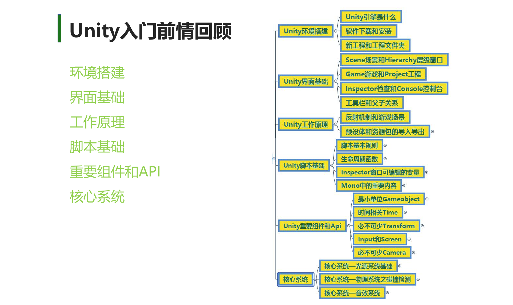
第二步：展UV

第三步：材质和纹理贴图
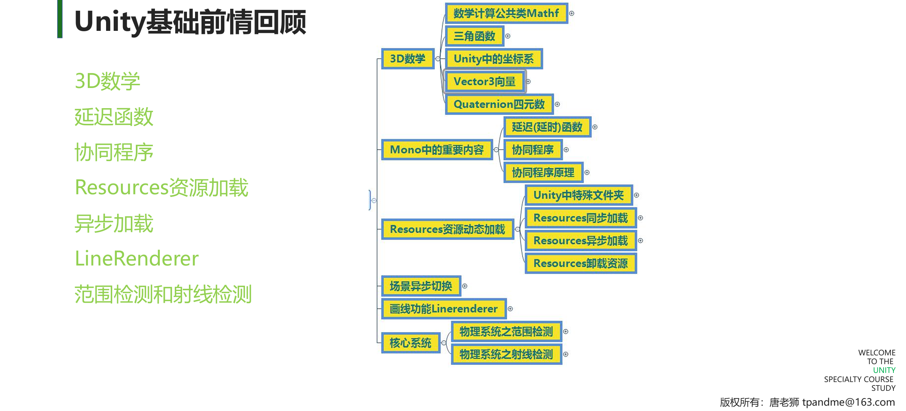
第四步：骨骼绑定
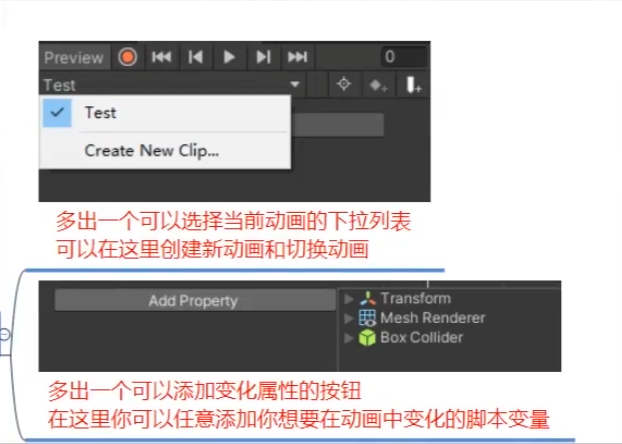
第五步：动画制作
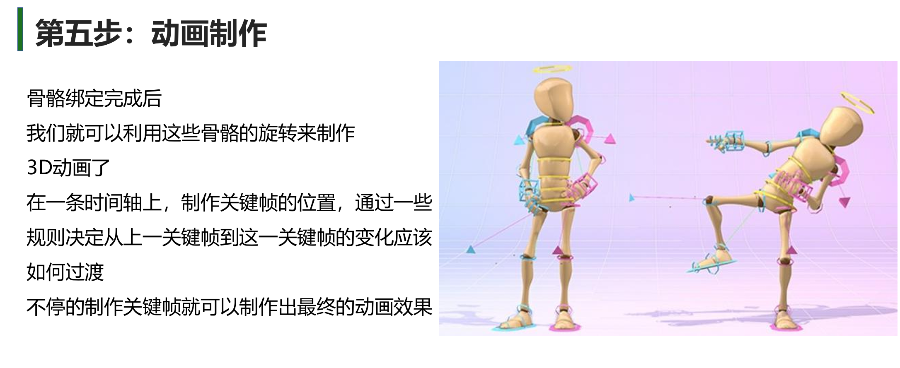


### 五、Tilemap
#### 一、瓦片资源


#### 二、瓦片调色板


````ad-tip
需要在EDIT——Project Settings——Graphics中更改排序模式成自定义模式

并将X-Y-Z改成(0,1,-0.26)

再在tilemap对象的Tilemap Renderer 组件中将MODE改成individual

否则渲染顺序会有异常
````

#### 三、瓦片地图关键脚本和碰撞器


#### 四、瓦片地图拓展包——导入知识点

#### 五、瓦片地图拓展包——新增瓦片类型

#### 六、瓦片地图拓展包——新增笔刷类型

#### 七、瓦片地图——代码控制

##### 知识点一 获取Tilemap和TileBase和Grid
- Tilemap组件： 用于管理瓦片地图
- TileBase组件： 瓦片资源对象基类
- Grid组件： 用于坐标转换

##### 知识点二 重要API
- 1. 清空瓦片地图
- *map.ClearAllTiles();*

- 2.获取指定坐标格子
- *TileBase tmp = map.GetTile(new Vector3Int(0,0,0));*

- 3.设置删除瓦片
- *map.SetTile(new Vector3Int(0,0,0),tileBase)*  //设置
- *map.SetTile(new Vector3Int(0,0,0),null)*  //删除

- 4.替换瓦片
- *map.SwapTile(tmp,tileBase);*  //批量替换

- 5.世界坐标转格子坐标
- 屏幕坐标转世界坐标
- *Vector3 ScreenPosition = Input.mousePositon;*
- *Camera.ScreenToWorldPoint(new Vector3(screenPosition.x,screenPoint.y,1))*
- 世界坐标转格子坐标
- *grid.WorldToCell()*

## 六、动画基础

### 一、Animation动画窗口

#### 1. 认识Animation动画窗口

##### 知识点一 打开Animation窗口
- Window —> Animation ——>Animation

##### 知识点二 Animation窗口是用来干啥的
- Animation窗口 直译就是动画窗口
- 它主要用于在Unity内部创建和修改动画
- 所有在场景中的对象都可以通过Animation窗口为其制作动画

- ## 原理：
- 制作动画时： 记录在固定时间点对象挂载的脚本的变量变化
- 播放动画时： 将制作动画记录的数据在固定时间点改变，产生动画效果

##### 知识点三 关键词说明
- *动画时间轴：* 
- 每一个动画文件都有自己的一个生命周期，从动画开始到结束 
- 我们可以在动画时间轴上编辑每一个动画生命周期中变化 

- *动画中的帧：* 
- 假设某个动画的帧率为60帧每秒，意味着该动画1秒钟最多会有60次改变机会 
- 每一帧的间隔时间是 1s/60 ≈ 16.67毫秒 
- 也就是说 我们最快可以每16.67毫秒改变一次对象状态 

- *关键帧：* 
- 动画在时间轴上的某一个时间节点上处于的状


- **知识点四 认识Animaiton窗口功能**
- 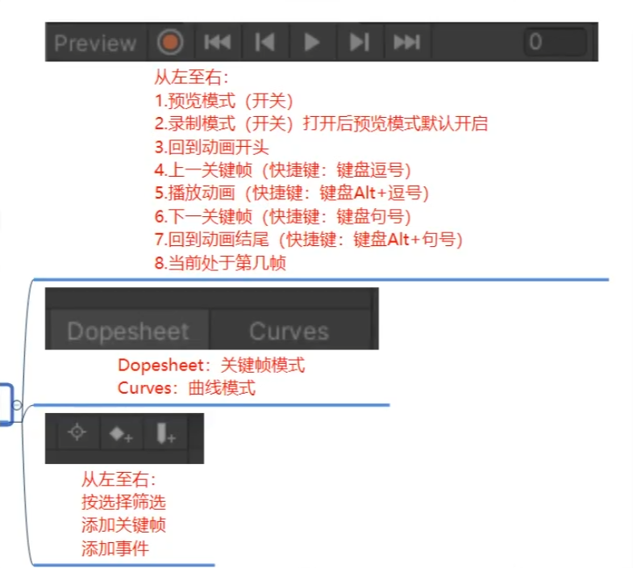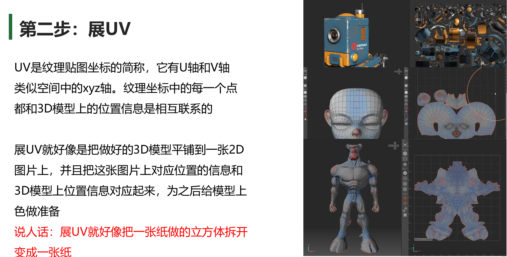

#### 2. 创建编辑Animation动画

##### 知识点一 创建动画
- 1.在场景中选中想要创建动画的对象 
- 2.在Animation窗口中点击创建 
- 3.选择动画文件将要保存到的位置

##### 知识点二 窗口上的变化
- 

````ad-tip

可以通过 在录制模式开启的状态下 选择合适的帧位置 直接更改Inspector面板上的数据来直接插入关键帧

````


##### 知识点三 关键帧模式下编辑动画


##### 知识点四 曲线模式下编辑动画


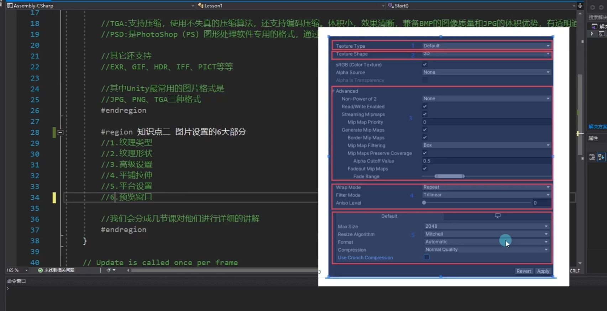
##### 知识点五 动画文件界面参数
- 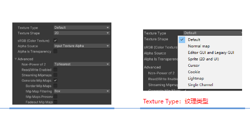
- 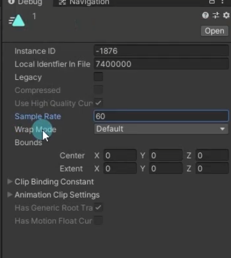

#### 3.代码控制动画（老动画系统）

##### 知识点一 什么是老动画系统
- Unity中有两套动画系统 
- 新：Mecanim动画系统——主要用Animator组件控制动画 
- 老：Animation动画系统——主要用Animation组件控制动画（Unity4之前的版本可能会用到） 
  
- 目前我们为对象在Animation窗口创建的动画都会被新动画系统支配 
- 有特殊需求或者针对一些简易动画，才会使用老动画系统
##### 知识点二 老动画系统控制动画播放
- 注意： 
- 在创建动画之前为对象添加Animation组件之后再制作动画 
- 这时制作出的动画和之前的动画格式是有区别的 
  
- Animation参数
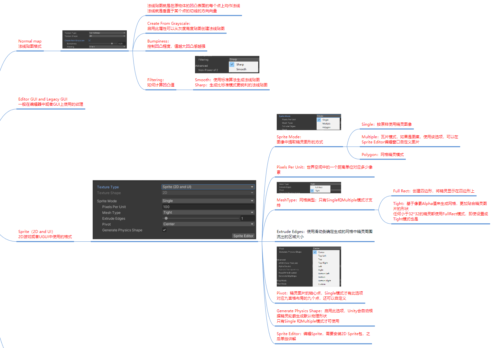

##### 知识点三 代码控制播放

- 1.播放动画 
- *if(Input.GetKeyDown(KeyCode.Alpha1))* 
- *{* 
-    *animation.Play("1");* 
- *}* 

- *if (Input.GetKeyDown(KeyCode.Alpha2))* 
- *{* 
-    *animation.Play("2");* 
- *}* 
- 2.淡入播放,自动产生过渡效果 
- *if(Input.GetKeyDown(KeyCode.Alpha3))* 
- *{* 
- *当你要播放的动画的开始状态 和当前的状态 不一样时* 
- *就会产生过渡效果* 
-    *animation.CrossFade("3");* 
-    *//animation.Play("3");* 
- *}* 
  
- 3.前一个播完再播放下一个 
- *if( Input.GetKeyDown(KeyCode.Alpha4) )* 
- *{* 
-    *//animation.PlayQueued("2");* 
-    *animation.CrossFadeQueued("2");* 
- *}* 
  
- 4.停止播放所有动画 
- *animation.Stop();* 
  
- 5.是否在播放某个动画 
- *if( animation.IsPlaying("1") )* 
- *{* 
- *}* 
  
- 6.播放模式设置  
- *animation.wrapMode = WrapMode.Loop;*
  
- 7.其它（了解即可，新动画系统中会详细讲解） 
- 层级和权重以及混合（老动画系统需要通过代码来达到动画的遮罩、融合等效果） 
- 设置层级 
- *animation["1"].layer = 1;* 
- 设置权重 
- *animation["1"].weight = 1;* 
- 混合模式 叠加还是混合 
- *animation["1"].blendMode = AnimationBlendMode.Additive;* 
- 设置混组相关骨骼信息 
- *animation[""].AddMixingTransform();*

##### 知识点四 动画事件
- 动画事件主要用于处理 当动画播放到某一时刻想要触发某些逻辑  
- 比如进行伤害检测、发射子弹、特效播放等等
- 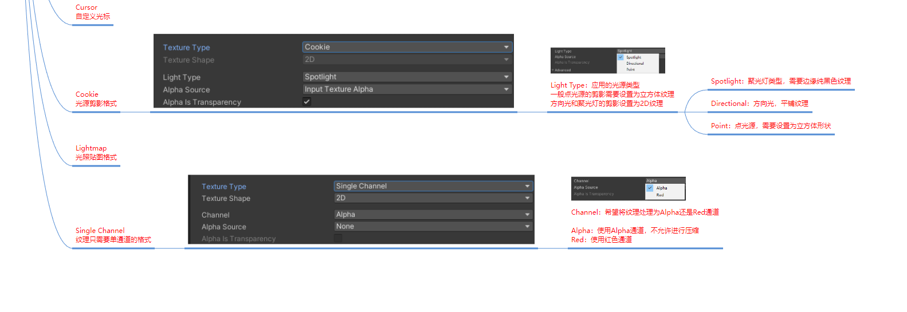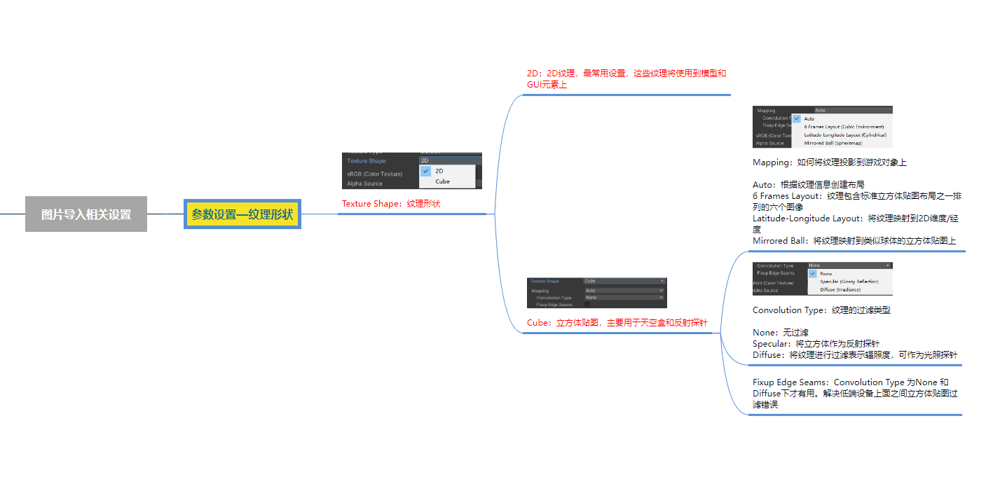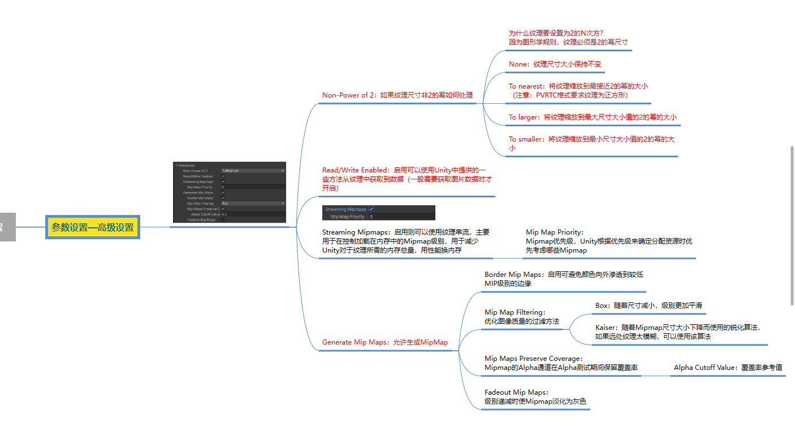
- *public void AnimationEvent()* 
- *{* 
-   *print("动画事件触发");* 
- *}*

````ad-tip

老动画系统中 创建的关键帧 需要确保 模型上每个组件都有初始关键帧 否则模型不会回正

需要在每个需要设置关键帧的模型组件上 都设置一下位置（若要保持原样 可以将旋转角度轻微变动 再改回原先值 以添加关键帧属性）

````


### 二、Animator动画状态机

#### 1.有限状态机概念

##### 知识点一 什么是有限状态机
- 有限状态机（Finite // state machine, FSM） 
- 又称有限状态自动机，简称状态机 
- 是表示有限个状态以及在这些状态之间的转移和动作等行为的数学模型 
  
- 有限：表示是有限度的不是无限的 
- 状态：指所拥有的所有状态 
  
- 举例说明： 
- 假设我们人会做很多个动作，也就是有很多种状态 
- 这些状态包括 站立、走路、跑步、攻击、防守、睡觉等等 
- 我们每天都会在这些状态中切换，而且这些状态虽然多但是是有限的 
- 当达到某种条件时，我们就会在这些状态中进行切换 
- 而且这种切换时随时可能发生的

##### 知识点二 有限状态机对于我们的意义
- 游戏开发中有很多功能系统都是有限状态机 
- 最典型的状态机系统 
- 动作系统 —— 当满足某个条件切换一个动作，且动作是有限的 
- AI（人工智能）系统 —— 当满足某个条件切换一个状态，且状态时有限的 
  
- 所以状态机是游戏开发中一个必不可少的概念

##### 知识点三 最简单的状态机实现
- 假设我们只有一个值来控制当前玩家的状态 
- *string animName = "idle";* 
- *switch (animName)* 
- *{* 
-   *case "idle":* 
-     *//待机动作逻辑* 
-     *break;* 
- *case "move":* 
 -    *//移动动作逻辑* 
-    *break;* 
- *case "run":* 
-   *//跑步动作逻辑* 
-   *break;* 
- *case "atk":* 
-   *//攻击动作逻辑* 
-   *break;* 
- *}*

#### 2.Animator Controller动画控制器（状态机）

##### 知识点一 创建动画状态机
- 1.通过为场景中物体创建动画时自动创建 
- 2.手动创建动画状态机文件
- 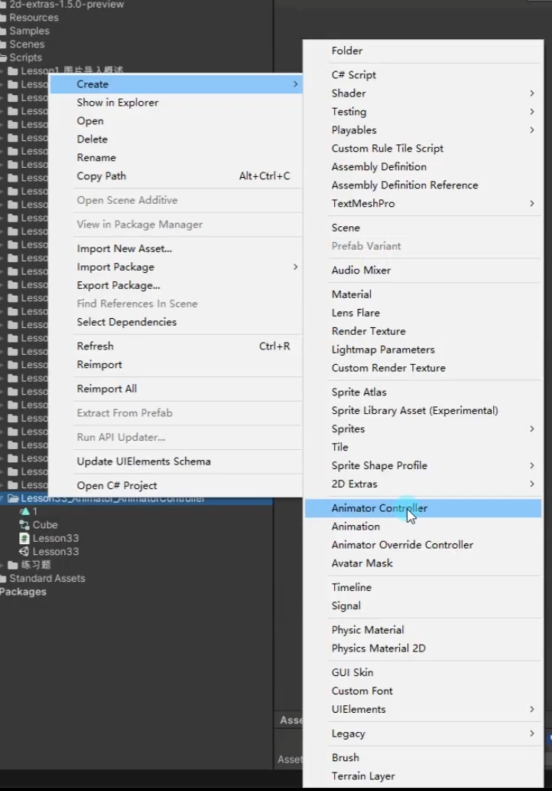
##### 知识点二 基础使用——初识动画状态机窗口
 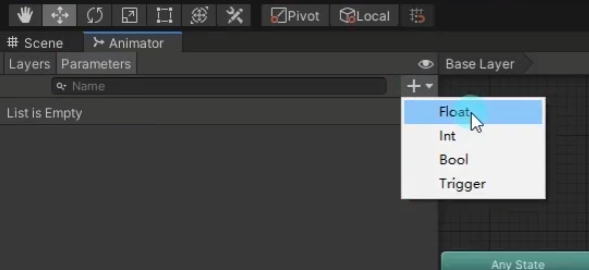
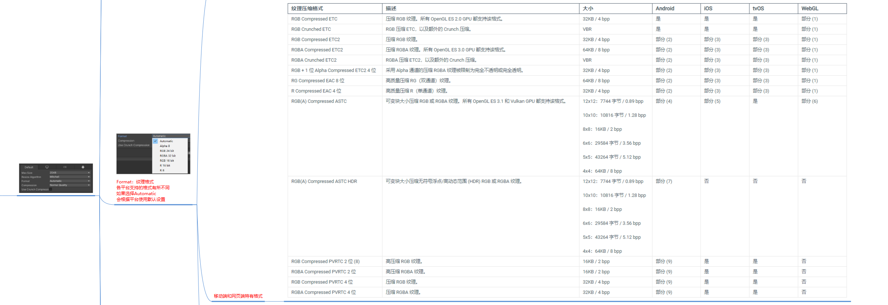


##### 知识点三 基础使用——添加动画
- 自动添加——为对象创建动画后会自动将动画添加到状态机中 
- 手动添加1——将动画文件拖入到状态机中（注意：老动画拖入会有警告） 
- 手动添加2——右键创建状态，再关联动画
-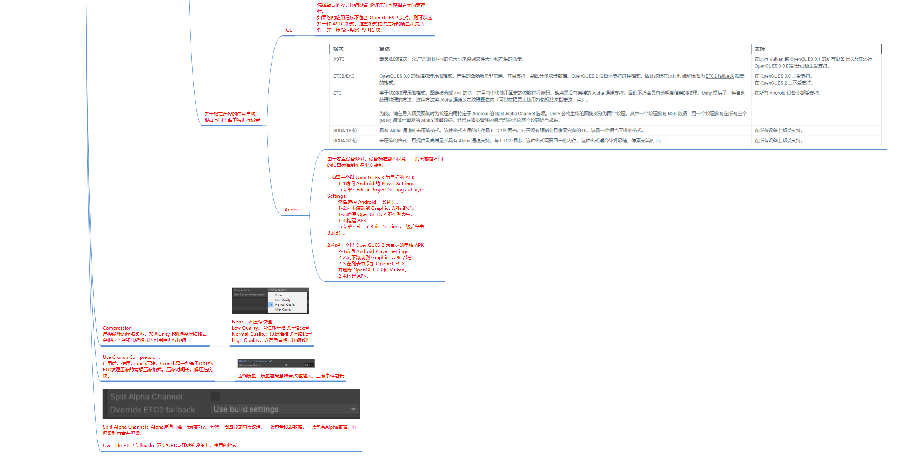

##### 知识点四 基础使用——添加切换连线
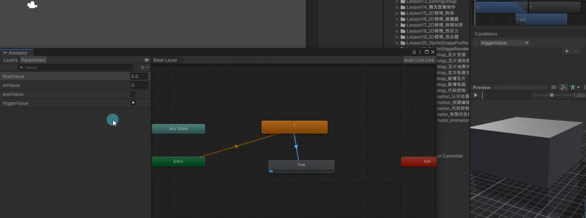
##### 知识点五 基础使用——添加切换条件
- 在左侧面板点击参数页签 
- 可以在这里添加4中类型的切换条件
 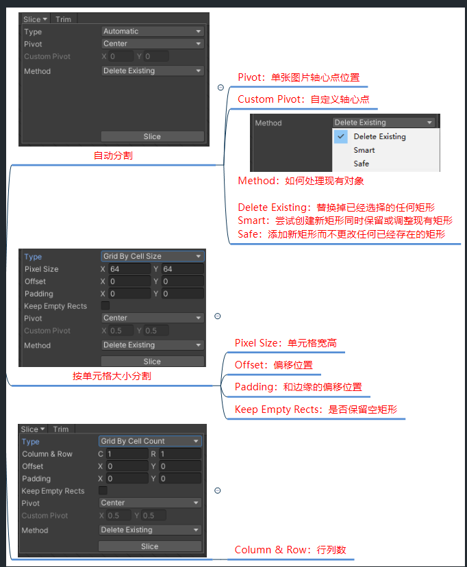
##### 知识点六 基础使用——设置动画间切换条件

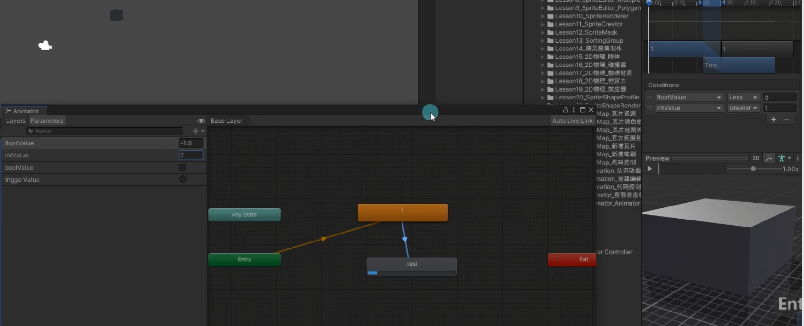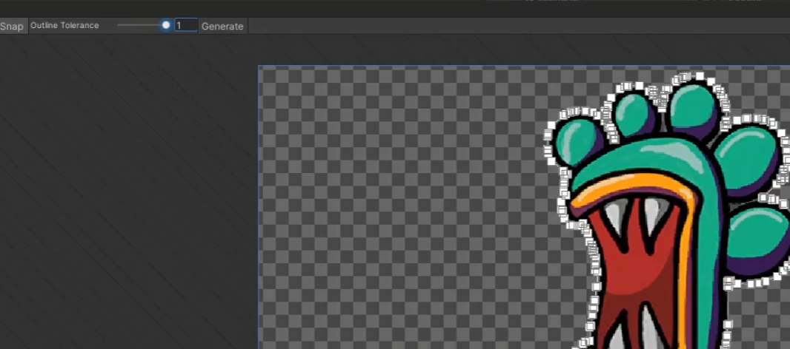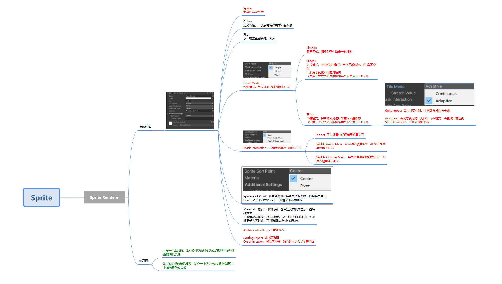
````ad-tip

trigger在切换成功之后会自动变成不激活状态

所以一般用在有返回连线的情况下

````

#### 3.代码控制动画状态机切换

##### 知识点一 关键组件Animator


##### 知识点二 Animator中的API
- 我们用代码控制状态机切换主要使用的就是Animator提供给我们的API 
- 我们知道一共有四种切换条件 int float bool trigger//所以对应的API也是和这四种类型有关系的 
- *private Animator animator;*
- *animator = this.GetComponent\<Animator>();*
-  1.通过状态机条件切换动画 
- *animator.SetFloat("条件名", 1.2f);* 
- *animator.SetInteger("条件名", 5);* 
- *animator.SetBool("条件名", true);* 
- *animator.SetTrigger("条件名");* 
  
- *animator.GetFloat("条件名");* 
- *animator.GetInteger("条件名");* 
- *animator.GetBool("条件名");* 
  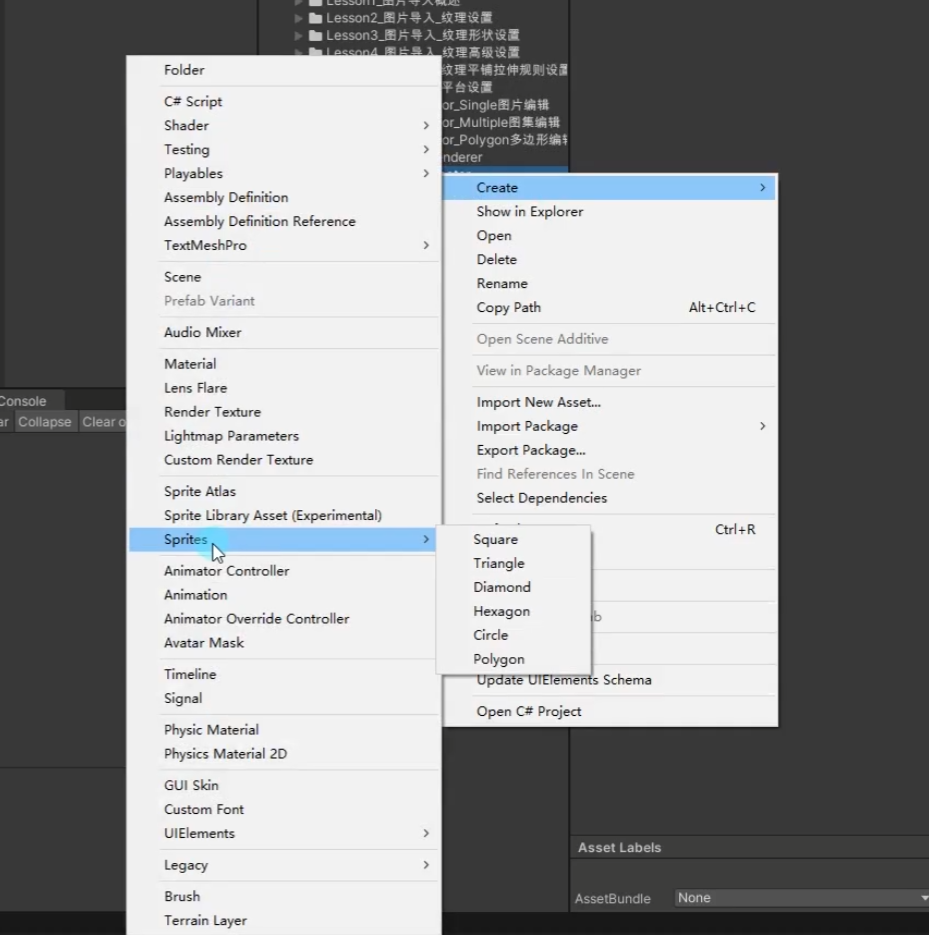


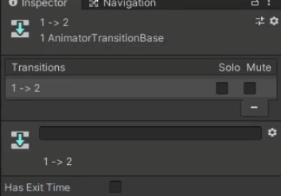
````ad-tip
如果不取消勾选 会延迟到动画结束才切换状态
````
- 2.直接切换动画 除非特殊情况 不然一般不使用 
- *animator.Play("状态名");*