## Unity跨平台的基本原理

### ①.了解.Net相关知识


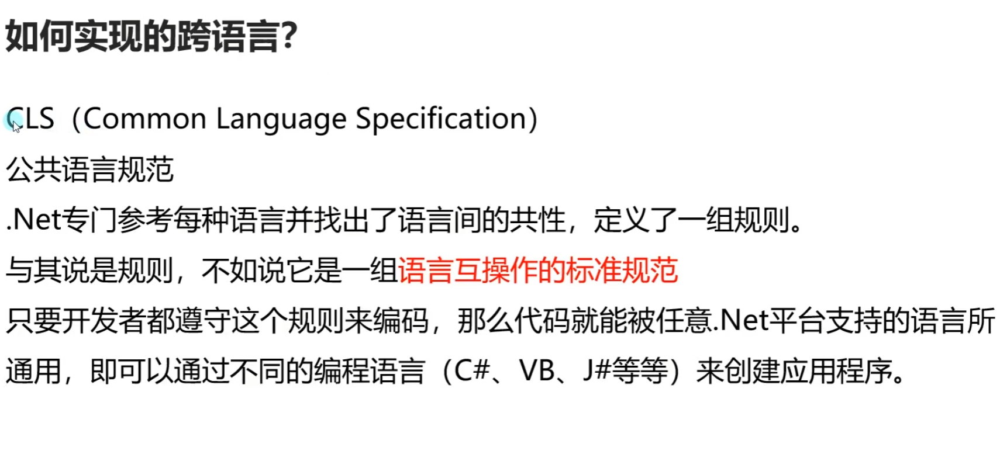


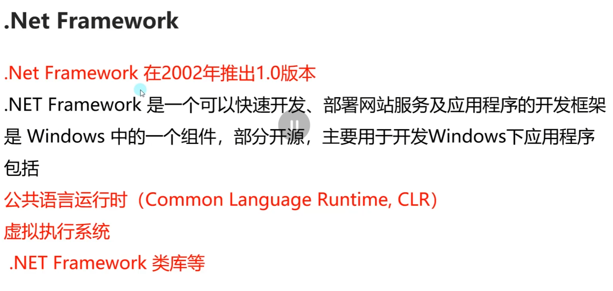


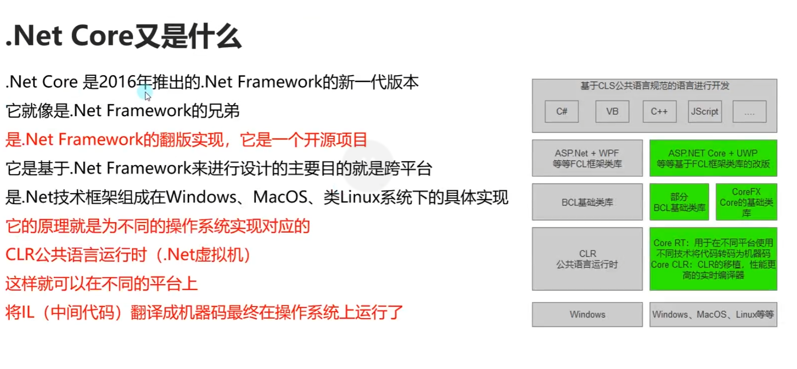

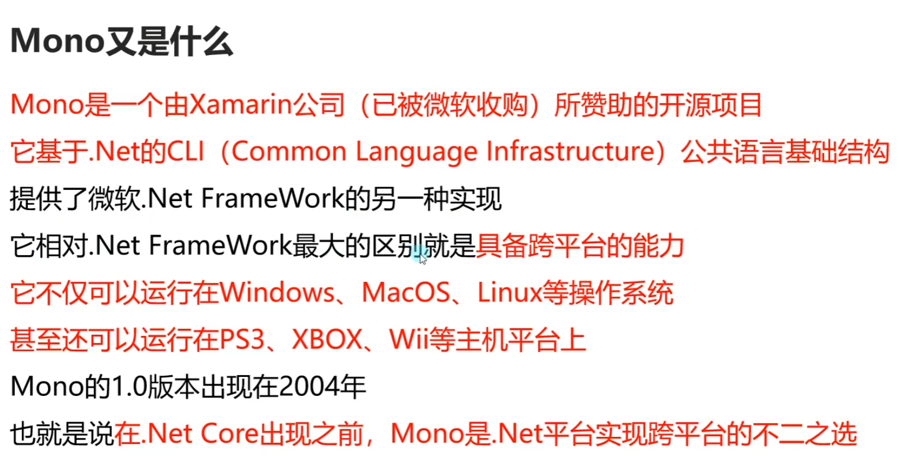


### ②.Unity跨平台的基本原理

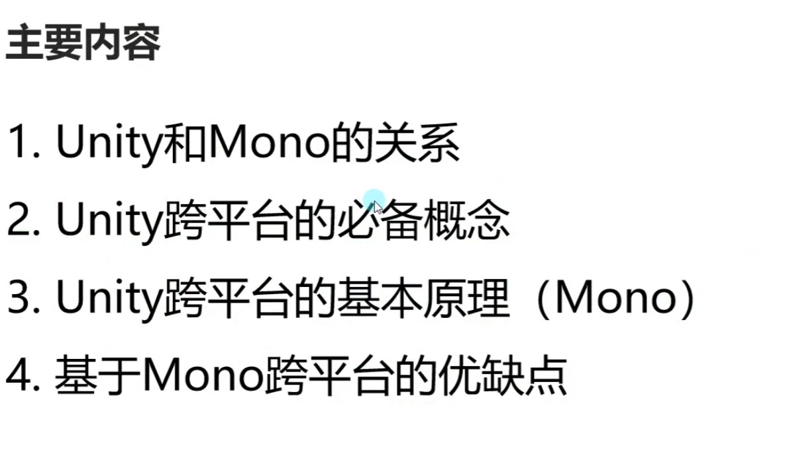

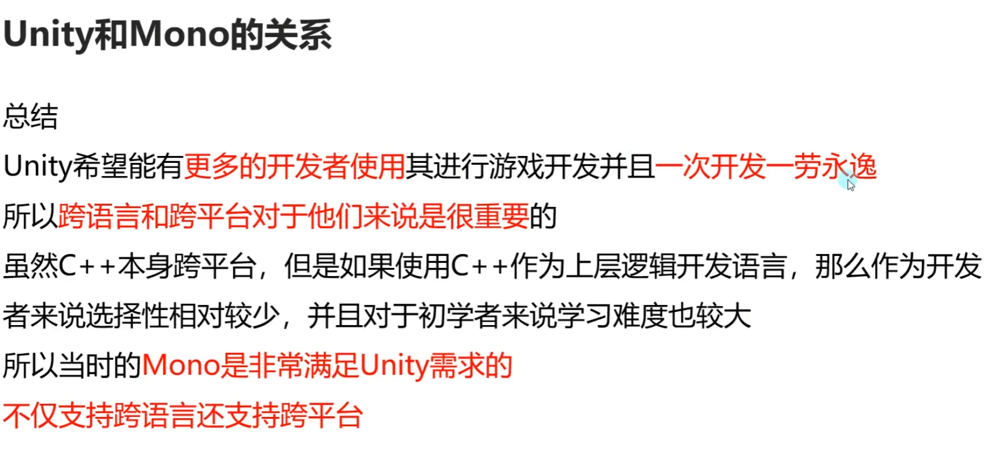

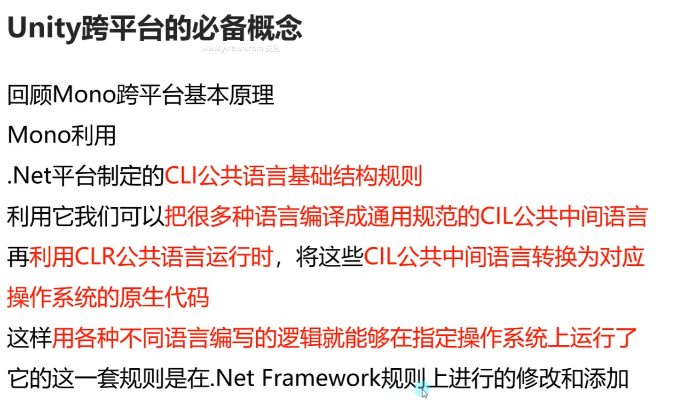

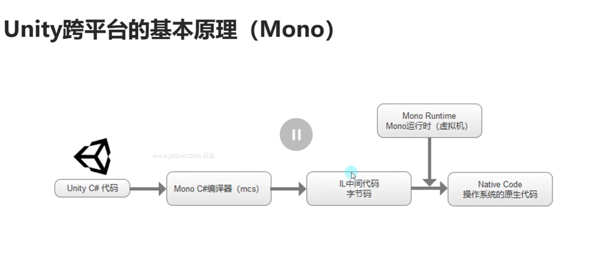
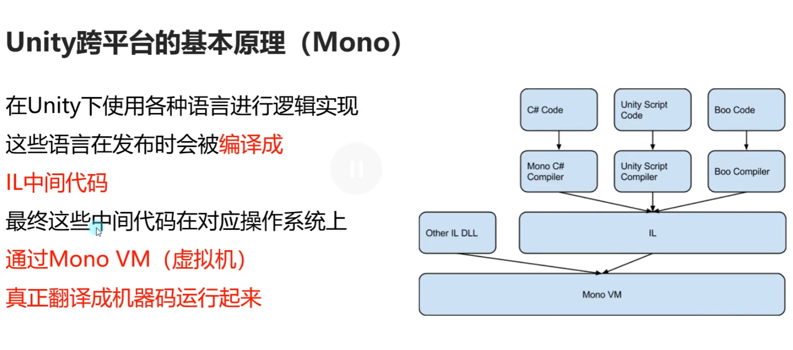


### ③Unity跨平台的基本原理(IL2CPP)

#### Unity跨平台的基本原理(IL2CPP)


充_images_28.png)


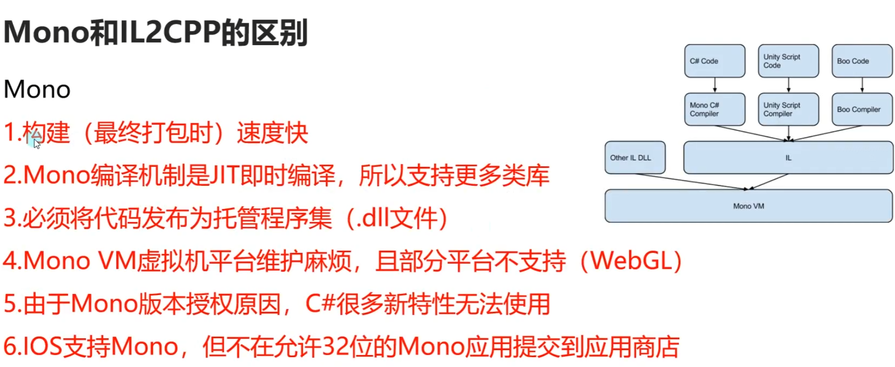
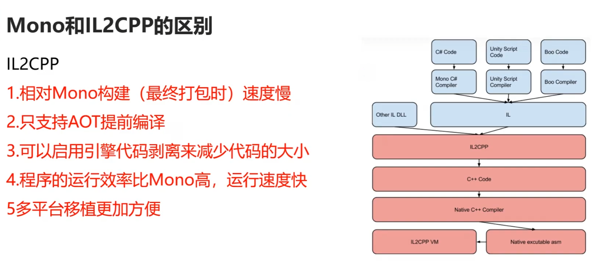


### ③IL2CPP模式可能存在的问题处理

#### IL2CPP模式可能存在的问题处理

##### 知识点一 ——安装Unity IL2CPP打包工具

- 在Unityhub中下载 IL2CPP打包相关工具
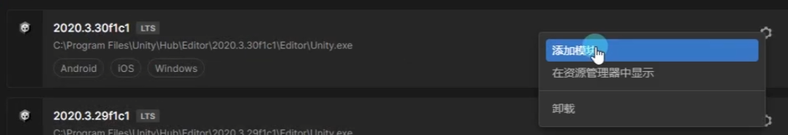


##### 知识点二 ——IL2CPP打包存在的问题——类型裁剪

- IL2CPP在打包时会自动对Unity工程的DLL进行裁剪，将代码中没有引用到的类型裁剪掉，
- 以达到减小发布后包的尺寸的目的
- 然而在实际使用过程中，很多类型有可能会被意外剪裁掉，
- 造成运行时抛出找不到某个类型的异常
- 特别是通过反射等方式在编译时无法得知的函数调用，在运行时都很有可能遇到问题

- ### 解决方案：

- 1.IL2CPP处理模式时，将PlayerSetting -> Other Setting -> Managed Stripping Level(代码剥离)设置为Low
- Disable:Mono模式下才能设置为不删除任何代码
- Low:默认低级别，保守的删除代码，删除大多数无法访问的代码，同时也最大程度减少剥离实际使用的代码的可能性
- Medium:中等级别，不如低级别剥离谨慎，也不会达到高级别的极端
- Hight:高级别，尽可能多的删除无法访问的代码，优先优化尺寸减小。如果选择该模式一般需要配合link.xml使用

- 2.通过Unity提供的link.xml方式来告诉Unity引擎，哪些类型是不能够被剪裁掉的
- 在Unity工程的Assets目录中（或其任何子目录中）建立一个叫Link.xml的XML文件


##### 知识点三 —— IL2CPP打包存在的问题——泛型问题
- 我们上节课提到了IL2CPP和Mono最大的区别是 不能在运行时动态生成代码和类型
- 就是说 泛型相关的内容，如果你在打包生成前没有把之后想要使用的泛型类型显示使用一次
- 那么之后如果使用没有被编译的类型，就会出现找不到类型的报错

- 举例：List\<A>和List\<B>中A和B是我们自定义的类，
- 我能必须在代码中显示的调用过，IL2CPP才能保留List\<A>和List\<B>两个类型。
- 如果在热更新时我们调用List\<C>，但是它之前并没有在代码中显示调用过，
- 那么这时就会出现报错等问题。主要就是因为JIT和AOT两个编译模式的不同造成的
- List\<A> list = new List\<A>();
- List\<B> list2 = new List\<B>();

- 解决方案：
- 泛型类：声明一个类，然后在这个类中声明一些public的泛型类变量
- 泛型方法：随便写一个静态方法，在将这个泛型方法在其中调用一下。这个静态方法无需被调用
- 这样做的目的其实就是在预言编译之前让IL2CPP知道我们需要使用这个内容

## 二、C#各版本新功能和语法

### ①C#1~4功能和语法

#### 命名和可选参数、动态类型等

##### 知识点一 最低支持的C#版本

- 只要是Unity 5.5及以上的版本
- 就支持C# 4版本

##### 知识点二 C# 1~4的功能和语法有哪些？

- 注意：在这里不会提及所有的内容
-     主要会提及Unity开发中会用到的一些功能和特性
-     对于一些不适合在Unity中使用的内容会省略

- C# 1 —— 委托、事件（C#进阶套课）

- C# 2 —— 泛型、匿名方法、迭代器、可空类型（C#进阶套课）

- C# 3 ——
- 隐式类型、对象集合初始化、Lambda表达式、匿名类型（C#进阶套课）
- 自动实现属性、拓展方法、分部类（C#核心套课）
- Linq相关的表达式树（以后专门讲）

- C# 4 ——
- 泛型的协变和逆变（C#进阶套课）
- 命名和可选参数
- 动态类型

##### 知识点三 补充未讲解全面的内容 命名和可选参数

- 有了命名参数，我们将不用匹配参数在所调用方法中的顺序
- 每个参数可以按照参数名字进行指定
- *Test(1, 1.2f, true);*
- *Test(f: 3.3f, i: 5, b: false);*
- *Test(b: false, f: 3.4f, i: 3);*

- 命名参数可以配合可选参数使用,让我们做到跳过其中的默认参数直接赋值后面的默认参数
- *Test2(1, true, "234");*
- *Test2(1, s: "234");*

- 好处：可以让我们更方便的调用函数，少写一些重载函数

##### 知识点四 补充未讲解的内容 动态类型

- 关键词：dynamic
- 作用：通过dynamic类型标识变量的使用和对其成员的引用绕过编译时类型检查
-      改为在运行时解析这些操作。
-      在大多数情况下，dynamic类型和object类型行为类似
-      任何非Null表达式都可以转换为dynamic类型。
-      dynamic类型和object类型不同之处在于，
-      编译器不会对包含类型 dynamic 的表达式的操作进行解析或类型检查
-      编译器将有关该操作信息打包在一起，之后这些信息会用于在运行时评估操作。
-      在此过程中，dynamic 类型的变量会编译为 object 类型的变量。
-      因此，dynamic 类型只在编译时存在，在运行时则不存在。

- 注意：1.使用dynamic功能 需要将Unity的.Net API兼容级别切换为.Net 4.x
-      2.IL2CPP 不支持 C# dynamic 关键字。它需要 JIT 编译，而 IL2CPP 无法实现
-      3.动态类型是无法自动补全方法的，我们在书写时一定要保证方法的拼写正确性
-         所以该功能我们只做了解，不建议大家使用

- 举例说明：
- *dynamic dyn = 1;*
- *object obj = 2;*

- *dyn += 2;*

- *print(obj.GetType());*
- *print(dyn.GetType());*
- *print(dyn);*

- *object t = new Test1();*
- *dynamic tmp = t;*
- *tmp.TestTest();*

- 好处：动态类型可以节约代码量，当不确定对象类型，但是确定对象成员时，可以使用动态类型
-      通过反射处理某些功能时，也可以考虑使用动态类型来替换它


##### 总结

- C# 1~4版本中的功能和语法
- 大多数我们已经在C#四部曲中学习完毕
- 命名和可选参数可以帮助我们少写一些重载函数
- 动态类型可以让我们在某些情况下节约代码量
- 但是由于要使用.Net 4.x，并且IL2CPP不支持，所以不建议使用它，但是如果有特殊需求不得不用，那我们只有退而求其次

### ②C#5功能和语法

#### 1. 回顾线程，学习线程池

##### 知识点一 C#5的新增功能和语法有哪些 

- 1.调用方信息特性（C#进阶套课——特性） 
- 2.异步方法async和await 
  
- 在学习异步方法async和await之前 
- 我们必须补充一些知识点 
- 1.线程和线程池 
- 2.Task类 
- 我们这节课先来回顾和学习线程和线程池

##### 知识点二 回顾知识点——线程 

- 1.Unity支持多线程 
- 2.Unity中开启的多线程不能使用主线程中的对象 
- 3.Unity中开启多线程后一定记住关闭 
- t = new Thread(()=> { 
-     while (true) 
-     { 
-         print("123"); 
-         Thread.Sleep(1000); 
-     } 
- }); 
- t.Start(); 
- print("主线程执行");

##### 知识点三 补充知识点——线程池 

- 命名空间：System.Threading 
- 类名：ThreadPool（线程池） 
  
- 在多线程的应用程序开发中，频繁的创建删除线程会带来性能消耗，产生内存垃圾 
- 为了避免这种开销C#推出了 线程池ThreadPool类 
  
- ThreadPool中有若干数量的线程，如果有任务需要处理时，会从线程池中获取一个空闲的线程来执行任务 
- 任务执行完毕后线程不会销毁，而是被线程池回收以供后续任务使用 
- 当线程池中所有的线程都在忙碌时，又有新任务要处理时，线程池才会新建一个线程来处理该任务， 
- 如果线程数量达到设置的最大值，任务会排队，等待其他任务释放线程后再执行 
- 线程池能减少线程的创建，节省开销，可以减少GC垃圾回收的触发 
  
- 线程池相当于就是一个专门装线程的缓存池（Unity小框架套课中有对缓存池的详细讲解） 
- 优点：节省开销，减少线程的创建，进而有效减少GC触发 
- 缺点：不能控制线程池中线程的执行顺序，也不能获取线程池内线程取消/异常/完成的通知 
  
- ThreadPool是一个静态类 
- 里面提供了很多静态成员 
- 其中相对重要的方法有 
  
- 1.获取可用的工作线程数和I/O线程数 
- *int num1;* 
- *int num2;* 
- *ThreadPool.GetAvailableThreads(out num1, out num2);* 
- *print(num1);* 
- *print(num2);* 

  
- 3.设置线程池中可以同时处于活动状态的 工作线程的最大数目和I/O线程的最大数目 
-   大于次数的请求将保持排队状态，知直到线程池线程变为可用 
-   更改成功返回true，失败返回false 
- *if(ThreadPool.SetMaxThreads(20, 20))* 
- *{* 
-     *print("更改成功");* 
- *}* 
  
- 2.获取线程池中工作线程的最大数目和I/O线程的最大数目 
- *ThreadPool.GetMaxThreads(out num1, out num2);* 
- *print(num1);* 
- *print(num2);* 
  
- 5.设置 工作线程的最小数目和I/O线程的最小数目 
- *if(ThreadPool.SetMinThreads(5, 5))* 
- *{*
-     *print("设置成功");* 
- *}* 
- 4.获取线程池中工作线程的最小数目和I/O线程的最小数目 
- *ThreadPool.GetMinThreads(out num1, out num2);* 
- *print(num1);* 
- *print(num2);* 
  
- 6.将方法排入队列以便执行，当线程池中线程变得可用时执行 
  
- *ThreadPool.QueueUserWorkItem((obj) =>* 
- *{* 
-     *print(obj);* 
-     *print("开启了一个线程");* 
- *}, "123452435345");* 
  
- *for (int i = 0; i < 10; i++)*  
- *{* 
-     *ThreadPool.QueueUserWorkItem((obj) =>* 
-     *{* 
-         *print("第" + obj + "个任务");* 
-     *}, i);* 
- *}* 
  
- *print("主线程执行");*

##### 总结 

- 线程池 是一个C#写好的 装线程的缓存池 
  
- 优点：可以在我们频繁的需要创建删除线程时提高性能，节约内存 
- 缺点：不能控制线程池中线程的执行顺序，也不能获取线程池内线程取消/异常/完成的通知


#### 2.Task任务类

##### 知识点一 认识Task 

- 命名空间：System.Threading.Tasks 
- 类名：Task 
- Task顾名思义就是任务的意思 
- Task是在线程池基础上进行的改进，它拥有线程池的优点，同时解决了使用线程池不易控制的弊端 
- 它是基于线程池的优点对线程的封装，可以让我们更方便高效的进行多线程开发 
  
- 简单理解： 
- Task的本质是对线程Thread的封装，它的创建遵循线程池的优点，并且可以更方便的让我们控制线程 
- 一个Task对象就是一个线程

##### 知识点二 创建无返回值Task的三种方式 

- 1.通过new一个Task对象传入委托函数并启动 
- *Task t1 = new Task(() =>* 
- *{* 
-     *int i = 0;* 
-     *while (isRuning)* 
-     *{* 
-         *print("方式一:" + i);* 
-         *++i;* 
-         *Thread.Sleep(1000);* 
-     *}* 
- *});* 
- *t1.Start();* 
  
- 2.通过Task中的Run静态方法传入委托函数 
- *Task t2 = Task.Run(() =>* 
- *{* 
-     *int i = 0;* 
-     *while (isRuning)* 
-     *{* 
-         *print("方式二:" + i);* 
-         *++i;* 
-         *Thread.Sleep(1000);* 
-     *}* 
- *});* 
  
- 3.通过Task.Factory中的StartNew静态方法传入委托函数 
- *Task t3 = Task.Factory.StartNew(() =>* 
- *{* 
-     *int i = 0;* 
-     *while (isRuning)* 
-     *{* 
-         *print("方式三:" + i);*  
-         *++i;* 
-         *Thread.Sleep(1000);* 
-     *}* 
- *});*

##### 知识点三 创建有返回值的Task 

- 1.通过new一个Task对象闯入委托函数并启动 
- *t1 = new Task</int>(() =>* 
- *{* 
-     *int i = 0;* 
-     *while (isRuning)* 
-     *{* 
-         *print("方式一:" + i);* 
-         *++i;* 
-         *Thread.Sleep(1000);* 
-     *}* 
-     *return 1;* 
- *});* 
- *t1.Start();* 
  
- - 2.通过Task中的Run静态方法传入委托函数 
- *t2 = Task.Run</string>(() =>* 
- *{* 
-     *int i = 0;* 
-     *while (isRuning)* 
-     *{* 
-         *print("方式二:" + i);* 
-         *++i;* 
-         *Thread.Sleep(1000);* 
-     *}* 
-     *return "1231";* 
- *});* 
  
- - 3.通过Task.Factory中的StartNew静态方法传入委托函数  
- *t3 = Task.Factory.StartNew\<float>(() =>* 
- *{* 
-     *int i = 0;* 
-     *while (isRuning)* 
-     *{* 
-         *print("方式三:" + i);* 
-         *++i;* 
-         *Thread.Sleep(1000);* 
-     *}* 
-     *return 4.5f;* 
- *});* 
  
  
- 获取返回值 
- 注意： 
- ==Resut获取结果时会阻塞线程 ==
- ==即如果task没有执行完成 ==
- ==会等待task执行完成获取到Result ==
- ==然后再执行后边的代码,也就是说 执行到这句代码时 由于我们的Task中是死循环== 
- # 主线程就会被卡死 
- *print(t1.Result);* 
- *print(t2.Result);* 
- *print(t3.Result);* 
  
- *print("主线程执行");*

##### 知识点四 同步执行Task 

- 刚才我们举的例子都是通过多线程异步执行的 
- 如果你希望Task能够同步执行 
- 只需要调用Task对象中的RunSynchronously方法 
- 注意：需要使用 new Task对象的方式，因为Run和StartNew在创建时就会启动 
  
- *Task t = new Task(()=> {* 
-     *Thread.Sleep(1000);* 
-     *print("哈哈哈");* 
- *});* 
- *t.Start();*
- *t.RunSynchronously();* 
- *print("主线程执行");* 
- 不Start 而是 RunSynchronously

##### 知识点五 Task中线程阻塞的方式（任务阻塞） 

- 1.Wait方法：等待任务执行完毕，再执行后面的内容 
- *Task t1 = Task.Run(() =>* 
- *{* 
- *for (int i = 0; i < 5; i++)* 
- *{* 
-     *print("t1:" + i);* 
- *}});* 
  
- *Task t2 = Task.Run(() =>* 
- *{* 
- *for (int i = 0; i < 20; i++)* 
- *{        print("t2:" + i);* 
- *}});* 
- *t2.Wait();* 
  
- 2.WaitAny静态方法：传入任务中任意一个任务结束就继续执行  
- *Task.WaitAny(t1, t2);* 
  
- 3.WaitAll静态方法：任务列表中所有任务执行结束就继续执行  
- *Task.WaitAll(t1, t2);* 
  
- *print("主线程执行");*

##### 知识点六 Task完成后继续其它Task（任务延续） 

- 1.==WhenAll静态方法 + ContinueWith方法==：传入任务完毕后再执行某任务 
- *Task.WhenAll(t1, t2).ContinueWith((t) =>* 
- *{* 
-     *print("一个新的任务开始了");* 
-     *int i = 0;* 
-     *while (isRuning)* 
-     *{* 
-         *print(i);* 
-         *++i;* 
-         *Thread.Sleep(1000);* 
-     *}* 
- *});* 
  
- *Task.Factory.ContinueWhenAll(new Task[] { t1, t2 }, (t) =>* 
- *{* 
-     *print("一个新的任务开始了");* 
-     *int i = 0;* 
-     *while (isRuning)* 
-     *{* 
-         *print(i);* 
-         *++i;* 
-         *Thread.Sleep(1000);* 
-     *}* 
- *});*

- 2.==WhenAny静态方法 + ContinueWith方法==：传入任务只要有一个执行完毕后再执行某任务 
- *Task.WhenAny(t1, t2).ContinueWith((t) =>* 
- *{* 
-     *print("一个新的任务开始了");* 
-     *int i = 0;* 
-     *while (isRuning)* 
-     *{* 
-         *print(i);* 
-         *++i;* 
-         *Thread.Sleep(1000);* 
-     *}* 
- *});* 
  
- *Task.Factory.ContinueWhenAny(new Task[] { t1, t2 }, (t) =>* 
- *{* 
-     *print("一个新的任务开始了");* 
-     *int i = 0;* 
-     *while (isRuning)*  
-     *{* 
-         *print(i);* 
-         *++i;* 
-         *Thread.Sleep(1000);* 
-     *}* 
- *})*
##### 知识点七 取消Task执行 

- 方法一：通过加入bool标识 控制线程内死循环的结束 
  
- 方法二：通过==CancellationTokenSource==取消标识源类 来控制 
- CancellationTokenSource对象可以达到延迟取消、取消回调等功能 

- *CancellationTokenSource c = new CancellationTokenSource();* 
- 
- 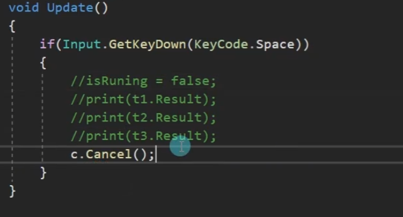
- 延迟取消 
- *c.CancelAfter(5000);* 
- 取消回调 
- *c.Token.Register(() =>* 
- *{* 
- *print("任务取消了");* 
- *});* 
- *Task.Run(() =>* 
- *{* 
-     *int i = 0;* 
-     *while (!c.==IsCancellationRequested==)* 
-     *{ 
-         *print("计时：" + i);*
-         *++i; 
-         *Thread.Sleep(1000);*
-     *}
- *});*
  

- 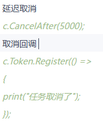
````ad-tip

此处取消回调为  取消了Task的执行后

````

##### 总结 

- 1.Task类是基于Thread的封装 
- 2.Task类可以有返回值，Thread没有返回值 
- 3.Task类可以执行后续操作，Thread没有这个功能 
- 4.Task可以更加方便的取消任务，Thread相对更加单一 
- 5.Task具备ThreadPool线程池的优点，更节约性能

#### 异步方法async和await关键字

##### 知识点一 什么是同步和异步 

- 同步和异步主要用于修饰方法 
- 同步方法： 
- 当一个方法被调用时，调用者需要等待该方法执行完毕后返回才能继续执行 
- 异步方法： 
- 当一个方法被调用时立即返回，并获取一个线程执行该方法内部的逻辑，调用者不用等待该方法执行完毕 
  
- 简单理解异步编程 
- 我们会把一些不需要立即得到结果且耗时的逻辑设置为异步执行，这样可以提高程序的运行效率 
- 避免由于复杂逻辑带来的的线程阻塞

##### 知识点二 什么时候需要异步编程 

- 需要处理的逻辑会严重影响主线程执行的流畅性时 
- 我们需要使用异步编程 
- 比如： 
- 1.复杂逻辑计算时 
- 2.网络下载、网络通讯 
- 3.资源加载时 
- 等等

##### 知识点三 异步方法async和await 

- async和await一般需要配合Task进行使用 
- async用于修饰函数、lambda表达式、匿名函数 
- await用于在函数中和async配对使用,主要作用是等待某个逻辑结束 
- 此时逻辑会返回函数外部继续执行，直到等待的内容执行结束后，再继续执行异步函数内部逻辑 
- 在一个async异步函数中可以有多个await等待关键字 
- TestAsync(); 
  
- print("主线程逻辑执行"); 
  
- 使用async修饰异步方法 
- 1.在异步方法中使用await关键字（不使用编译器会给出警告但不报错），否则异步方法会以同步方式执行 
- 2.异步方法名称建议以Async结尾 
- 3.异步方法的返回值只能是void、Task、Task<> 
- 4.异步方法中不能声明使用ref或out关键字修饰的变量 
  
- 使用await等待异步内容执行完毕（一般和Task配合使用） 
- 遇到await关键字时 
- 1.异步方法将被挂起 
- 2.将控制权返回给调用者 
- 3.当await修饰内容异步执行结束后，继续通过调用者线程执行后面内容 
  
- 举例说明 
- 1.复杂逻辑计算（利用Task新开线程进行计算 计算完毕后再使用 比如复杂的寻路算法） 
- CalcPathAsync(this.gameObject, Vector3.zero); 
  
- 2.计时器 
- Timer();  
- print("主线程逻辑执行"); 
  
- 3.资源加载(Addressables的资源异步加载是可以使用async和await的) 
  
- 注意：Unity中大部分异步方法是不支持异步关键字async和await的，我们只有使用协同程序进行使用 
- 虽然官方 不支持 但是 存在第三方的工具（插件）可以让Unity内部的一些异步加载的方法 支持 异步关键字 
- https:- github.com/svermeulen/Unity3dAsyncAwaitUtil  
  
- 虽然Unity中的各种异步加载对异步方法支持不太好 
- 但是当我们用到.Net 库中提供的一些API时，可以考虑使用异步方法 
- 1.Web访问：HttpClient 
- 2.文件使用：StreamReader、StreamWriter、JsonSerializer、XmlReader、XmlWriter等等 
- 3.图像处理：BitmapEncoder、BitmapDecoder 
- 一般.Net 提供的API中 方法名后面带有 Async的方法 都支持异步方法

##### 总结 

- 异步编程async和await是一个比较重要的功能 
- 我们可以利用它配合Task进行异步编程 
  
- 虽然Unity自带的一些异步加载原本是不支持 异步方法关键字的 
- 但是可以利用别人写好的第三方工具 让他们支持 大家可以根据自己的需求 选择性使用

### ③ C#6功能和语法

#### 静态导入、异常筛选器、nameof等

##### 知识点一 C#6的新增功能和语法有哪些 

- 1.=>运算符（C#进阶套课——特殊语法 =>） 
- 2.Null 传播器（C#进阶套课——特殊语法 ?） 
- 3.字符串内插（C#进阶套课——特殊语法 $） 
- 4.静态导入 
- 5.异常筛选器 
- 6.nameof运算符

##### 知识点二 补充讲解——静态导入 

- 用法：在引用命名空间时，在using关键字后面加入static关键词 
- 作用：无需指定类型名称即可访问其静态成员和嵌套类型 
- 好处：节约代码量，可以写出更简洁的代码 
  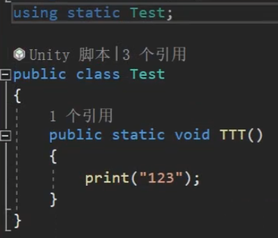
- *Max(10, 20);* 
- *TTT();* 
- *Test4 t = new Test4()*
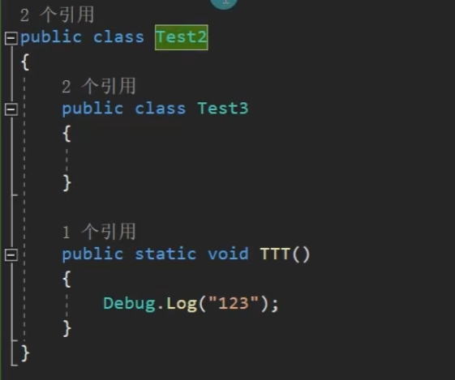
##### 知识点三 补充讲解——异常筛选器 

- 用法：在异常捕获语句块中的Catch语句后通过加入when关键词来筛选异常 
-       when（表达式）该表达式返回值必须为bool值，如果为ture则执行异常处理，如果为false，则不执行  
- 作用：用于筛选异常 
- 好处：帮助我们更准确的排查异常，根据异常类型进行对应的处理 
  
- *try* 
- *{* 
-     用于检查异常的语句块 
- *}*
- *catch (System.Exception e) when(e.Message.Contains("301"))* 
- *{* 
-     当错误编号为301时  作什么处理 
-     *print(e.Message);* 
- *}* 
- *catch (System.Exception e) when (e.Message.Contains("404"))* 
- *{* 
-     当错误编号为404时  作什么处理 
-     *print(e.Message);* 
- *}* 
- *catch (System.Exception e) when (e.Message.Contains("21"))* 
- *{* 
-     当错误编号为21时  作什么处理 
-     *print(e.Message);* 
- *}* 
- *catch (System.Exception e)* 
- *{* 
-     当错误编号为其它时  作什么处理 
-     *print(e.Message);* 
- *}*

##### 知识点四 补充讲解——nameof运算符 

- 用法：nameof(变量、类型、成员)通过该表达式，可以将他们的名称转为字符串 
- 作用：可以得到变量、类、函数等信息的具体字符串名称 
- *print(nameof(i));* 

- *print(nameof(List\<int>));* 
- *print(nameof(List\<int>.Add));* 

- *print(nameof(UnityEngine.AI));* 

- *List\<int> list = new List\<int>() { 1,2,3,4};* 
- *print(nameof(list));* 
- *print(nameof(list.Count));* 
- *print(nameof(list.Add));*

##### 总结 

- C#6中的新内容 
- 我认为 =>运算符、Null传播其、字符串内插对于我们来说是可以常用的 
- 其它补充的几个知识点使用情景不多，了解即可

### ④ C#7功能和语法

#### 1. 字面值改进、out和red新功能、本地函数等 

##### 知识点一 C#7对应的Unity版本 

- Unity 2018.3支持C# 7
- Unity 2019.4支持C# 7.3 
- 7.1, 7.2, 7.3相关内容都是基于 7的一些改进

##### 知识点二 C#7的新增功能和语法有哪些 

- 1.字面值改进 
- 2.out 参数相关 和 弃元知识点 
- 3.ref 返回值 
- 4.本地函数 
  
- 5.抛出表达式 
- 6.元组 
- 7.模式匹配

##### 知识点三 字面值改进 

- 基本概念：在声明数值变量时，为了方便查看数值 
-          可以在数值之间插入_作为分隔符 
- 主要作用：方便数值变量的阅读 
- int i = 9_9123_1239; 
- print(i); 
- int i2 = 0xAB_CD_17; 
- print(i2);
##### 知识点四 out变量的快捷使用 和 弃元 

- 用法：不需要再使用带有out参数的函数之前，声明对应变量 
- 作用：简化代码，提高开发效率 
  
- 1.以前使用带out函数的写法 
- *int a;* 
- *int b;* 
- *Calc(out a, out b);* 
  
- 2.现在的写法 
- *Calc(out int x, out int y);* 
- *print(x);* 
- *print(y);* 
  
- 3.结合var类型更简便(但是这种写法在存在重载时不能正常使用,必须明确调用的是谁) 
- *Calc(out int a, out var b);* 
- *print(a);* 
- *print(b);* 
  
- 4.可以使用 \_弃元符号 省略不想使用的参数 
  
- *Calc(out int c, out \_);* 
- *print(c);*

##### 知识点五 ref修饰临时变量和返回值 

- 基本概念：使用ref修饰临时变量和函数返回值，可以让赋值变为引用传递 
- 作用：用于修改数据对象中的某些值类型变量 
- 1.修饰值类型临时变量 
- *int testI = 100;* 
- *ref int testI2 = ref testI;* 
- *testI2 = 900;* 
- *print(testI);* 
  
- *TestRef r = new TestRef(5,5);* 
- *ref TestRef r2 = ref r;* 
- *r2.atk = 10;* 
- *print(r.atk);* 
  
- 2.获取对象中的参数 
- *ref int atk = ref r.atk;* 
- *atk = 99;* 
- *print(r.atk);* 
  
- 3.函数返回值 
- *int[] numbers = new int[] { 1, 2, 3, 45, 5, 65, 4532, 12 };* 
- *ref int number = ref FindNumber(numbers, 5);* 
- *number = 98765;* 
- *print(numbers\[4]);*

##### 知识点六 本地函数 

- 基本概念：在函数内部声明一个临时函数 
- 注意： 
- 本地函数只能在声明该函数的函数内部使用 
- 本地函数可以使用声明自己的函数中的变量 
- 作用：方便逻辑的封装 
- 建议：把本地函数写在主要逻辑的后面，方便代码的查看 
  
- *print(TestTst(10));*

##### 总结 

- C#7的新语法更新重点主要是 代码简化 
- 今天学习的out和ref新用法，弃元、本地函数都是相对比较重要的内容 
- 可以给我们带来很多便捷性


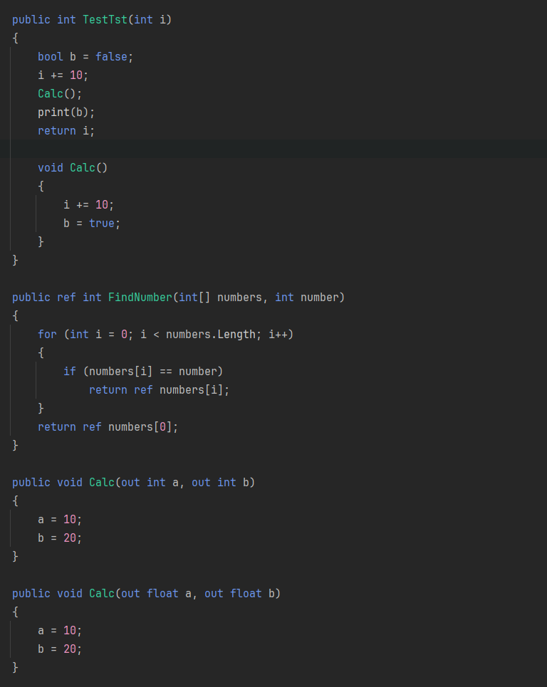

#### 2.元组、模式匹配、抛出表达式

##### 知识点一 抛出表达式 

- throw 知识回顾 
- 抛出表达式，就是指抛出一个错误 
- 一般的使用方式 都是 throw后面 new 一个异常类 
  
- 异常基类：Exception 
  
- *throw new NullReferenceException("1231231");*

````ad-tip
C#自带异常类  
- 常见  
- IndexOutOfRangeException：当一个==数组的下标超出范围==时运行时引发。  
- NullReferenceException：当一个==空对象被引用==时运行时引发。  
- ArgumentException：方法的==参数是非法==的  
- ArgumentNullException： 一个==空参数传递给方法，该方法不能接受该参数==  
- ArgumentOutOfRangeException： ==参数值超出范围== 
- SystemException：==其他用户可处理==的异常的基本类  
- OutOfMemoryException：==内存空间不够== 
- StackOverflowException ==堆栈溢出==  
  
- ArithmeticException：出现==算术上溢或者下溢==  
- ArrayTypeMismatchException：试图在数组中==存储错误类型的对象==  
- BadImageFormatException：==图形==的==格式错误==  
- DivideByZeroException：==除零异常==  
- DllNotFoundException：==找不到引用的DLL==  
- FormatException：参数==格式错误==
- InvalidCastException：使用==无效的类== 
- InvalidOperationException：方法的==调用时间错误== 
- MethodAccessException：==试图访问私有或者受保护的方法==
- MissingMemberException：访问一个==无效版本的DLL==
- NotFiniteNumberException：==对象不是一个有效的成员==  
- NotSupportedException：==调用的方法在类中没有实现==  
- InvalidOperationException：当==对方法的调用对对象的当前状态无效==时，由某些方法引发。
````
- 在C# 7中，可以在更多的表达式中进行错误抛出 
- 好处：更节约代码量 
  
- 1.空合并操作符后用throw 
- InitInfo("123"); 
- 2.三目运算符后面用throw 
- GetInfo("1,2,3", 4); 
- 3.=>符号后面直接throw 
- Action action = () => throw new Exception("错了，不准用这个委托"); 
- action();

##### 知识点二 元组 

- ==基本概念==：多个值的集合，相当于是一种快速构建数据结构类的方式 
-          一般在函数存在多返回值时可以使用元组 (返回值1类型,返回值2类型,....) 来声明返回值 
-          在函数内部返回具体内容时通过 (返回值1,返回值2,....)  进行返回 
- ==主要作用==：提升开发效率，更方便的处理多返回值等需要用到多个值时的需求 
  
- 1.无变量名元组的声明(获取值：Item'N'作为从左到右依次的参数，N从1开始) 
- *(int, float,bool,string) yz = (1, 5.5f, true, "123");* 
- *print(yz.Item1);* 
- *print(yz.Item2);* 
- *print(yz.Item3);* 
- *print(yz.Item4);* 
- 2.有变量名元组的声明 
- *(int i, float f, bool b, string str) yz2 = (1, 5.5f, true, "123");* 
- *print(yz2.i);* 
- *print(yz2.f);* 
- *print(yz2.b);* 
- *print(yz2.str);* 
  
- 3.元组可以进行等于和不等于的判断 
-   数量相同才比较，类型相同才比较，每一个参数的比较是通过\=\=比较 如果都是true 则认为两个元组相等 
- *if (yz == yz2)* 
- *print("相等");* 
- *else* 
- *print("不相等");* 
  
- 元组不仅可以作为临时变量 成员变量也是可以的 
- *print(this.yz.Item1);* 
-  元组的应用——函数返回值 
- 无变量名函数返回值 
- *var info = GetInfo();* 
- *print(info.Item1);* 
- *print(info.Item2);* 
- *print(info.Item3);* 
- 有变量名 
- *print(info.f);* 
- *print(info.i);* 
- *print(info.str);* 
  
- 元组的解构赋值 
- 相当于把多返回值元组拆分到不同的变量中 
- *int myInt;* 
- *string myStr;* 
- *float myFloat;* 
- *(myStr, myInt, myFloat) = GetInfo();* 
- *(string myStr, int myInt, float myFloat) = GetInfo();* 
- *print(myStr);* 
- *print(myInt);* 
- *print(myFloat);* 
  
- 丢弃参数 
- 利用传入 下划线_ 达到丢弃该参数不使用的作用 
- *(string ss, \_, \_) = GetInfo();* 
- *print(ss);*

###### 元组的应用——字典 
- 字典中的键 需要用多个变量来控制 
- *Dictionary<(int i, float f), string> dic = new Dictionary<(int i, float f), string>();* 
- *dic.Add((1, 2.5f), "123");* 
  
- *if(dic.ContainsKey((1,2.5f)))* 
- *{* 
-     *print("存在相同的键");* 
-     *print(dic\[(1, 2.5f)]);* 
- *}*

##### 知识点三 模式匹配 

- ==基本概念==：模式匹配时一种语法元素，可以测试一个值是否满足某种条件，并可以从值中提取信息 
-          在C#7中，模式匹配增强了两个现有的语言结构 
-          1.is表达式，is表达式可以在右侧写一个模式语法，而不仅仅是一个类型 
-          2.switch语句中的case 
- ==主要作用==：节约代码量，提高编程效率 
  
- 1.常量模式(is 常量)：用于判断输入值是否等于某个值 
- *object o = 1.5f;* 
- *if(o is 1)* 
- *{* 
-     *print("o是1");* 
- *}* 
- *if(o is null)* 
- *{* 
-     *print("o是null");* 
- *}* 

- 2.类型模式(is 类型 变量名、case 类型 变量名)：用于判断输入值类型，如果类型相同，将输入值提取出来 
- 判断某一个变量是否是某一个类型，如果满足会将该变量存入你申明的变量中 
- 以前的写法 
- *if (o is int)* 
- *{* 
-     *int i = (int)o;* 
-     *print(i);* 
- *}* 
- *if (o is int i)* 
- *{* 
-     *print(i);* 
- *}* 
  
- *switch (o)* 
- *{* 
-     *case int value:* 
-         *print("int:" + value);* 
-         *break;* 
-     *case float value:* 
-         *print("float:" + value);* 
-         *break;* 
-     *case null:* 
-         *print("null");* 
-         *break;* 
-     *default:* 
-         *break;* 
- *}*
  
  
- 3.var模式：用于将输入值放入与输入值相同类型的新变量中 
-           相当于是将变量装入一个和自己类型一样的变量中 
- *if(o is var v)* 
- *{* 
-     *print(o);* 
- *}*

##### 总结 

- 元组和模式匹配知识点 是C# 7中引入的最重要的两个知识点 
- 他们可以帮助我们更效率的完成一些功能需求 
- 建议大家常用他们

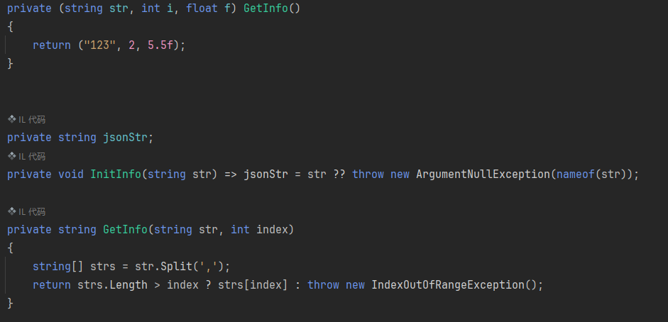


### ⑤ C#8 功能和语法

#### 1.Using声明、空合并赋值、静态本地函数、解构函数

##### 知识点一 C#8对应的Unity版本 

- Unity 2020.3 —— C# 8 - 但是部分新内容还不在该版本Unity中被支持 
- 我筛选了一些比较实用的内容给大家讲解

##### 知识点二 C#8的新增功能和语法有哪些 

- 1.Using 声明 
- 2.静态本地函数 
- 3.Null 合并赋值 
- 4.解构函数Deconstruct 
- 5.模式匹配增强功能

##### 知识点三 静态本地函数 

- 知识回顾： 
- 在C#7的新语法中我们学习了本地函数 
- 本地函数知识回顾 
- 基本概念：在函数内部声明一个临时函数 
- 注意： 
- 本地函数只能在声明该函数的函数内部使用 
- 本地函数可以使用声明自己的函数中的变量 
- 作用：方便逻辑的封装 
- 建议：把本地函数写在主要逻辑的后面，方便代码的查看 
- print(CalcInfo(10)); 
  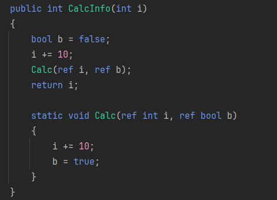
- 新知识点： 
- 静态本地函数就是在本地函数前方加入静态关键字 
- 它的作用就是让本地函数不能够使用访问封闭范围内（也就是上层方法中）的任何变量 
- 作用 让本地函数只能处理逻辑，避免让它通过直接改变上层变量来处理逻辑造成逻辑混乱

##### 知识点四 Using 声明 

- 知识回顾： 
- 在数据持久化xml相关知识当中 
- 我们学习了using相关的知识点 
- using(对象声明) 
- { 
-     使用对象，语句块结束后 对象将被释放掉 
-     当语句块结束 会自动帮助我们调用 对象的 Dispose这个方法 让其进行销毁 
-     using一般都是配合 内存占用比较大 或者 有读写操作时  进行使用的  
- } 
- 举例回顾： 
- using(StreamWriter strem = new StreamWriter("文件路劲"))
- { 
-     对该变量进行逻辑处理 该变量只能在这个语句块中使用 
-     strem.Write(true); 
-     strem.Write(1.2f); 
-     strem.Flush(); 
-     strem.Close(); 
- }
- 语句块结束执行时 调用 声明对象的 Dispose方法 释放对象 
  
- ==新知识点==： 
- Using 声明就是对using（）语法的简写 
- 当函数执行完毕时 会调用 对象的 Dispose方法 释放对象 
  
- *using StreamWriter s2 = new StreamWriter("文件路径");* 
- 对该对象进行逻辑操作 
- *s2.Write(5);* 
- *s2.Flush();* 
- *s2.Close();* 
- 利用这个写法 就会在上层语句块执行结束时释放该对象 
  
- 注意：在使用using语法时，声明的对象必须继承System.IDisposable接口 
- 因为必须具备Dispose方法，所以当声明没有继承该接口的对象时会报错 
- using TestUsing t = new TestUsing();

##### 知识点五 Null 合并赋值 

- ==知识回顾==： 
- 在C#进阶的特殊语法知识点中我们学习了 ?? 空合并操作符 
- 回顾空合并操作符知识点 
-  左边值 ?? 右边值 
-  如果左边值为null 就返回右边值 否则返回左边值 
-  只要是可以为null的类型都能用 
-  举例： 
- *string str = null;* 
- *string str2 = str ?? "234";* 
- *print(str2);* 
  
- ==新知识点==： 
- 空合并赋值是C#8.0新加的一个运算符 ??=  =
- 类似复合运算符  =
-  左边值 ??= 右边值  =
-  当左侧为空时才会把右侧值赋值给变量  =
-  举例：  =
- *str ??= "4565";* 
- *print(str);* 
- *注意：由于*左侧为空才会讲右侧赋值给变量，所以不为空的变量不会改变 
- *str ??= "1111";* 
- *print(str);*

##### 知识点六 解构函数Deconstruct 

- ==知识回顾==： 
- 我们之前学习过元组的解构，就是可以用单独的变量存储元组的值 
- 相当于把多返回值元组拆分到不同的变量中 
- 举例回顾： 
- *int i;* 
- *float f;* 
- *string s;* 
- *(i,f,\_,s) = GetInfo();* 
  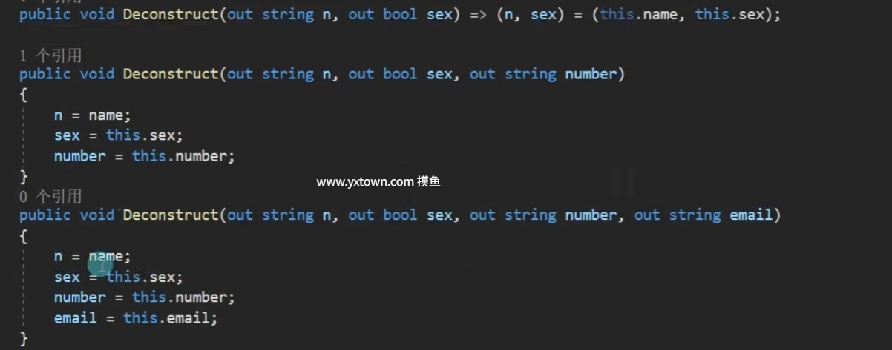
- 新知识点：解构函数Deconstruct （C# 7就有了） 
- 我们可以在自定义类当中声明解构函数 
- 这样我们可以将该自定义类对象利用元组的写法对其进行变量的获取 
- 语法： 
- 在类的内部申明函数public void Deconstruct(out 变量类型 变量名, out 变量类型 变量名.....) 
- 特点： 
- 一个类中可以有多个Deconstruct，但是参数数量不能相同 
- *Person p = new Person();* 
- *p.name = "唐老狮";* 
- *p.sex = false;* 
- *p.email = "tpandme@163.com";* 
- *p.number = "123123123123";* 
  
- 我们可以对该对象利用元组将其具体的变量值 解构出来 
- 相当于把不同的成员变量拆分到不同的临时变量中 
- *(string name, bool sex) = p;* 
- *print(name);* 
- *print(sex);* 
- *string str3;* 
- *(\_, \_, str3) = p;* 
- *print(str3);*

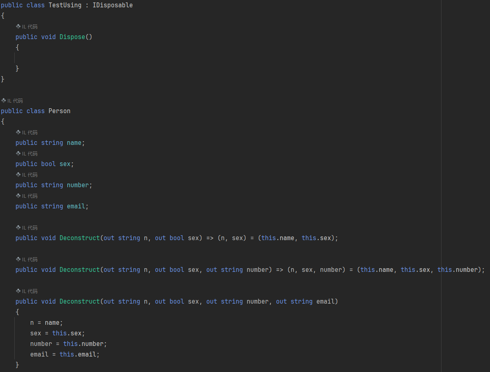


#### 2. 模式匹配、Switch表达式、属性、位置、元组模式

##### 知识点一 模式匹配回顾 

- 模式匹配（Pattern Matching） 
- “模式匹配”是一种测试表达式是否具有特定特征的方法 
- 在编程里指的是，把一个不知道具体数据信息的内容 
- 通过一些固定的语法格式来确定模式数据的具体内容的过程 
  
- 我们目前学习过的模式匹配 
- 1.常量模式(is 常量)：用于判断输入值是否等于某个值 
- *object o = 1.5f;* 
- *if (o is 1)* 
- *{* 
-     *print("o是1");* 
- *}* 
- *if (o is null)* 
- *{*
-     *print("o是null");* 
- *}* 
- 2.类型模式(is 类型 变量名、case 类型 变量名)：用于判断输入值类型，如果类型相同，将输入值提取出来 
- 判断某一个变量是否是某一个类型，如果满足会将该变量存入你申明的变量中 
- *if (o is int i)* 
- *{* 
-     *print(i);* 
- *}* 
- *switch (o)* 
- *{* 
-     *case int value:* 
-         *print("int:" + value);* 
-         *break;* 
-     *case float value:* 
-         *print("float:" + value);* 
-         *break;* 
-     *case null:* 
-         *print("null");* 
-         *break;* 
-      *default:* 
-         *break;* 
- *}* 
- 3.var模式：用于将输入值放入与输入值相同类型的新变量中 
-           相当于是将变量装入一个和自己类型一样的变量中 
- *if (o is var v)* 
- *{* 
-     *print(v);* 
- *}* 
- *int kk = GetInt();* 
- *if(kk >= 0 && kk <= 10)* 
- *{* 
  
- *}* 
  
- *if (GetInt() is var k && k >= 0 && k <= 10)* 
- *{* 
- *}*

##### 知识点二 模式匹配增强功能——switch表达式 

- switch表达式是对有返回值的switch语句的缩写 
- 用=>表达式符号代替case:组合 
- 用_弃元符号代替default 
- 它的使用限制，主要是用于switch语句当中只有一句代码用于返回值时使用 
- 语法： 
-  函数声明 => 变量 switch 
- { 
-     常量=>返回值表达式, 
-     常量=>返回值表达式, 
-     常量=>返回值表达式, 
-     ....
-     _ => 返回值表达式, 
- }

##### 知识点三 模式匹配增强功能——属性模式 

- 就是在常量模式的基础上判断对象上各属性 
- 用法：变量 is {属性:值, 属性:值} 
- *DiscountInfo info = new DiscountInfo("5折", true);* 
- *if( info.discount == "6折" && info.isDiscount)* 
- *if (info is { discount: "6折", isDiscount: true })* 
-     *print("信息相同");* 

- *print(GetMoney(info, 100));* 
  
- 它可以结合switch表达式使用 
- 结合switch使用可以通过属性模式判断条件的组合
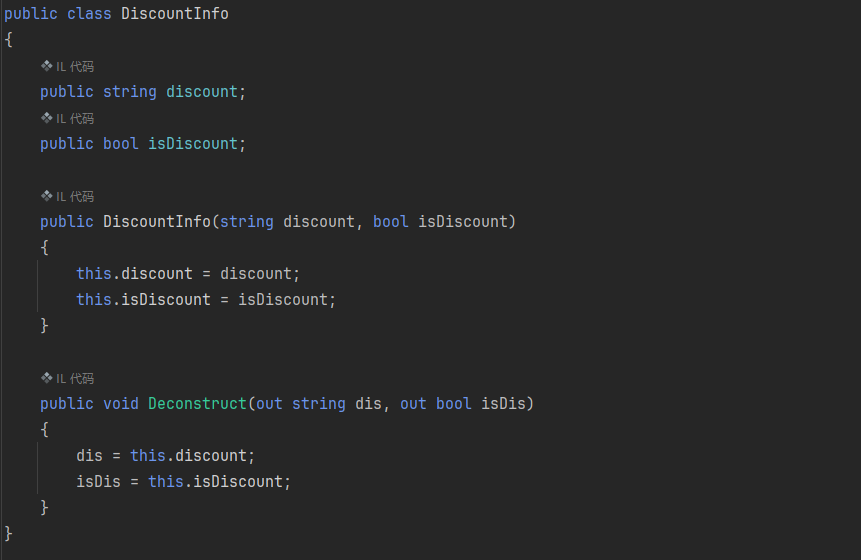
##### 知识点四 模式匹配增强功能——元组模式 

- 通过刚才学习的 属性模式我们可以在switch表达式中判断多个变量同时满足再返回什么 
- 但是它必须是一个数据结构类对象，判断其中的变量 
- 而元组模式可以更简单的完成这样的功能，我们不需要声明数据结构类，可以直接利用元组进行判断 
- *int ii = 10;* 
- *bool bb = true;* 
- *if((ii, bb) is (11, true))* 
- *{* 
-     *print("元组的值相同");* 
- *}* 
- 举例说明 
- *print(GetMoney("5折", true, 200));*

##### 知识点五 模式匹配增强功能——位置模式 

- 如果自定义类中实现了解构函数 
- 那么我们可以直接用对应类对象与元组进行is判断 
- *if(info is ("5折", true))* 
- *{* 
-     *print("位置模式 满足条件");* 
- *}* 
  
- 同样我们也可以配合switch表达式来处理逻辑 
- 举例说明 
- *print(GetMoney2(info, 300));* 
  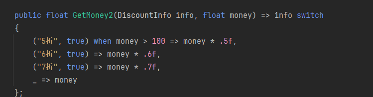
- 补充：配合when关键字进行逻辑处理


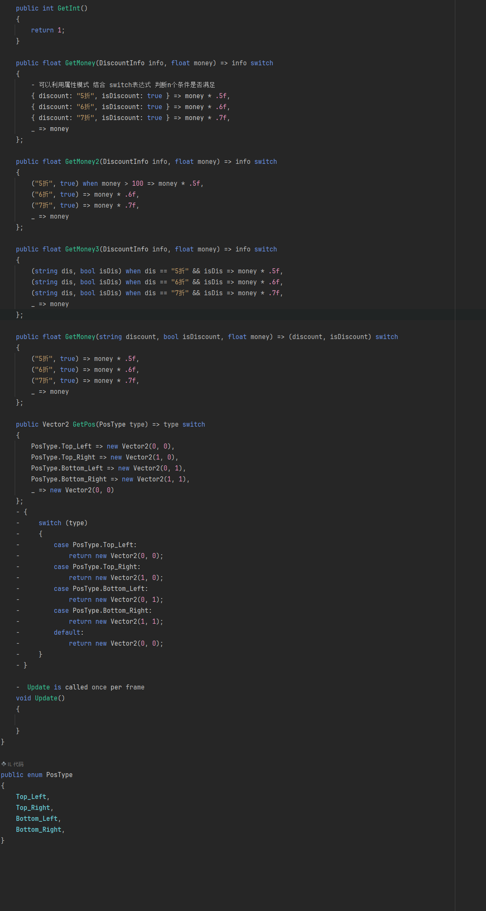


## 六、C#其它知识点补充

#### 日期和时间

##### 知识点一 目前学习过和时间相关的内容 

- 目前我们只在Unity当中学习过Time类 
- 我们可以通过Time获取当前游戏相关的时间 
- 比如帧间隔时间，游戏运行的时间和帧数等等内容 
  
- 但是我们并没有学习过和真实世界时间相关的内容 
- 比如如何得知当前时间的 年、月、日、时、分、秒 
- 这节课我们将要学习的就是真实时间相关的内容

##### 知识点二 时间对于我们的作用 

- 在游戏开发当中我们经常会有和时间打交道的内容
- 比如每日签到、活动倒计时、建造时间、激活时间等等的功能 
- 如果想要完成这些功能，仅仅用Unity提供给我们的Time类是远远不够用的 
- 所以我们需要学习专门的日期和时间相关的知识 
- 才能制作某些功能需求 
- 而C#便提供了对应的结构方便我们处理时间相关逻辑 
- 1.DateTime 日期结构体 
- 2.TimeSpan 时间跨度结构体

##### 知识点三 一些关于时间的名词说明 

//1s秒 = 1000ms毫秒 
//1ms毫秒 = 1000μs微妙 
//1μs微妙 = 1000ns纳秒 
  
//格里高利历: 
//格里高利历一般指公元 
//公元，即公历纪年法 
//目前我们所说公历，就是格里高利历 
//比如2022年就是从公元元年开始算起的两千二十二年 
  
//格林尼治时间(GMT)： 
//格林尼治标准时间 
//是指位于英国伦敦郊区的皇家格林尼治天文台的标准时间，因为本初子午线被定义在通过那里的经线 
//地球每天的自转是有些不规则的，而且正在缓慢减速 
//所以，格林尼治时间已经不再被作为标准时间使用 
//现在的标准时间──协调世界时（UTC） 
  
//协调世界时(UTC): 
//又称世界统一时间、世界标准时间、国际协调时间 
//UTC协调世界时即格林尼治平太阳时间，是指格林尼治所在地的标准时间， 
//也是表示地球自转速率的一种形式 
//UTC基于国际原子时间，通过不规则的加入闰秒来抵消地球自转变慢的影响，是世界上调节时钟和时间的主要时间标准  
  
//时间戳 
//从1970年1月1日（UNIX时间戳的起点时间）到现在的时间 
//计算机时间和众多的编程语言的时间都是从1970年1月1日开始算起 
//是因为很多编程语言起源于UNIX系统，而UNIX系统认为1970年1月1日0点是时间纪元 
//所以我们常说的UNIX时间戳是以1970年1月1日0点为计时起点时间的 
//原因： 
//最初计算机操作系统是32位，而时间也是用32位表示 
//我们知道32位能代表的最大十进制数是2147483647 
//1年是365天，总秒数是3153 6000 
//那么2147483647/3153 6000=68.1年 
//也就是说因为早期用32位来表示时间，最大的时间间隔是68年 
//而最早出现的UNIX操作系统考虑到计算机产生的年代和应用的 
//时限综合取了1970年1月1日作为UNIX TIME的纪元时间(开始时间)

##### 知识点四 DateTime- 命名空间：System 

- DateTime 是 C# 提供给我们处理日期和时间的结构体 
- DateTime 对象的默认值和最小值是0001年1月1日00:00:00（午夜） 
-          最大值可以是9999年12月31日晚上11:59:59 
- ==初始化 ==
- 主要参数： 
- 年、月、日、时、分、秒、毫秒 
- ticks：以格里高利历00:00:00.000年1月1日以来的100纳秒间隔数表示,一般是一个很大的数字 
- 次要参数： 
- DateTimeKind：日期时间种类 
-   Local：本地时间 
-   Utc：UTC时间 
-   Unspecified：不指定 
- Calendar:日历 
- 使用哪个国家的日历，一般在Unity开发中不使用 
- *DateTime dt = new DateTime(2022, 12, 1, 13, 30, 45, 500);* 
- 年、月、日、时、分、秒、毫秒 
- *print(dt.Year + "-" + dt.Month + "-" + dt.Day + "-" + dt.Hour + "-" + dt.Minute + "-" + dt.Second + "-" + dt.Millisecond);* 
- 以格里高利历00:00:00.000年1月1日以来的100纳秒间隔数表示,一般是一个很大的数字 
- *print(dt.Ticks);* 
- 一年的第多少天 
- *print(dt.DayOfYear);* 
- 星期几 
- *print(dt.DayOfWeek);*

 - ==获取时间 ==

- 当前日期和时间 
- DateTime nowTime = DateTime.Now; 
- print(nowTime.Minute); 
- 返回今日日期 
- DateTime nowTime2 = DateTime.Today; 
- print(nowTime2.Year + "-" + nowTime2.Month + "-" + nowTime2.Day); 
- 返回当前UTC日期和时间 
- DateTime nowTimeUTC = DateTime.UtcNow;

- ==计算时间 ==
- 各种加时间 
- DateTime nowTime3 = nowTime.AddDays(-1);  
- print(nowTime3.Day);

- 字符串输出 
- *print(nowTime.ToString());* 
- *print(nowTime.ToShortTimeString());* 
- *print(nowTime.ToShortDateString());* 
- *print(nowTime.ToLongTimeString());* 
- *print(nowTime.ToLongDateString());* 
  
- *print(nowTime.ToString("D"));* 
- *print(nowTime.ToString("yyyy-MM-dd-ddd/HH-mm-ss"));*

- ==字符串转DateTime==
- 字符串想要转回DateTime成功的话  
- 那么这个字符串的格式是有要求的 一定是最基本的 toString的转换出来的字符串才能转回去 
- 年/月/日 时:分:秒 
- *string str = nowTime.ToString();* 
- *str = "1988/5/4 18:00:08";* 
- *print(str);* 
- *DateTime dt3;* 
- *if(DateTime.TryParse(str, out dt3))* 
- *{* 
-     *print(dt3);* 
- *}* 
- *else* 
- *{* 
-     *print("转换失败");* 
- *}*

- ==存储时间 ==
- 存储时间 方式很多 
- 1.以直接存字符串 
- 2.可以直接存Ticks 
- 3.可以直接存时间戳信息 
  
- 存储时间戳的形式 更加节约

##### 知识点五 TimeSpan- 命名空间：System 
- TimeSpan 是 C# 提供给我们的时间跨度结构体 
- 用两个DateTime对象相减 可以得到该对象 
- *TimeSpan ts = DateTime.Now - new DateTime(1970, 1, 1);* 
- *print(ts.TotalMinutes);* 
- *print(ts.TotalSeconds);* 
- *print(ts.TotalDays);* 
- *print(ts.TotalHours);* 
- *print(ts.Ticks);* 
  
- *print(ts.Days + "-" + ts.Hours + "-" + ts.Minutes + "-" + ts.Seconds + "-" + ts.Milliseconds);*

- ==初始化它来代表时间间隔 ==
- *TimeSpan ts2 = new TimeSpan(1,0,0,0);* 
- *DateTime timeNow = DateTime.Now + ts2;* 

  
 - 用它相互计算 
- *TimeSpan ts3 = new TimeSpan(0, 1, 1, 1);* 
- *TimeSpan ts4 = ts2 + ts3;* 
- *print(ts4.Days + "-" + ts4.Hours);* 

  
 - ==自带常量方便用于和ticks进行计算 ==
- *print(ts4.Ticks / TimeSpan.TicksPerSecond);*


