## 一、基础知识点

### ①导入TMP

#### 导入TMP

##### 知识点一 导入TMP相关资源 

- Untiy2020以上版本 
- 两种方式: 
- 方式一：Window ——> TextMeshPro ——> Import TMP Essential Resources(导入TMP基本资源) 
- 方式二：在Hierarchy窗口中右键创建TMP相关的对象时，在弹出窗口中点击 Import TMP Essentials 
  
- 导入成功后 
- 会在Assets窗口中看到TextMesh Pro文件夹 
- 其中就是TMP的相关基础资源
##### 知识点二 导入TMP事例和附加功能 

- Untiy2020以上版本 
- 两种方式: 
- 方式一：Window ——> TextMeshPro ——> Import TMP Examples and Extras(导入TMP事例和附加功能) 
- 方式二：在Hierarchy窗口中右键创建TMP相关的对象时，在上一步弹出的窗口中一起导入 
  
- 导入成功后 
- 在刚才的TextMesh Pro文件夹中 
- 会多出一个 Examples & Extras文件夹

##### 知识点三 导入或更新TMP 

- 对于老版本的Unity，并没有集成TMP 
- 如果你想要自己获取它 
- 只需要在Package Manager中进行下载即可 
- 如果TMP存在版本更新，也可以在这里进行更新

##### 知识点四 TMP的官方文档 
- 官方说明文档 
- 1. https:- docs.unity3d.com/Packages/com.unity.textmeshpro@4.0/manual/index.html 
- 2. TextMesh Pro ——> Documentation ——> TextMesh Pro User Guide 2016

##### 总结 

- 我们在正式使用学习TMP之前 
- 需要导入它的必备资源和事例拓展内容 

- 如果老版本中想要使用TMP 
- 只需要在Package Manager中下载即可

### ②UI文本控件

#### 1. 初识TMP UI文本控件

##### 知识点一 创建 TMP UI 文本对象 

- 两种方式： 
- 1.Hierarchy ——> UI ——> TextMeshPro相关控件 
- 2.GameObject ——> UI ——> TextMeshPro相关控件

##### 知识点二 UGUI相关组件 

- RectTransform 矩形变换组件在UGUI中有详细讲解，不赘述 
- Canvas Renderer 画布渲染器，也是UGUI相关知识，不赘述 
- Cull Transparent Mesh(剔除透明网格):对于文本来说建议勾选上

##### 知识点三 TextMeshPro - Text(UI)组件参数 

- 我们可以将参数分成以下几部分进行讲解 
- 1.输入相关 
- 2.字体相关 
- 3.颜色相关 
- 4.间距相关 
- 5.对齐相关 
- 6.包裹溢出相关 
- 7.UV映射相关 
- 8.额外设置

#### 2.输入、字体相关


#### 3.颜色、间距、对齐相关

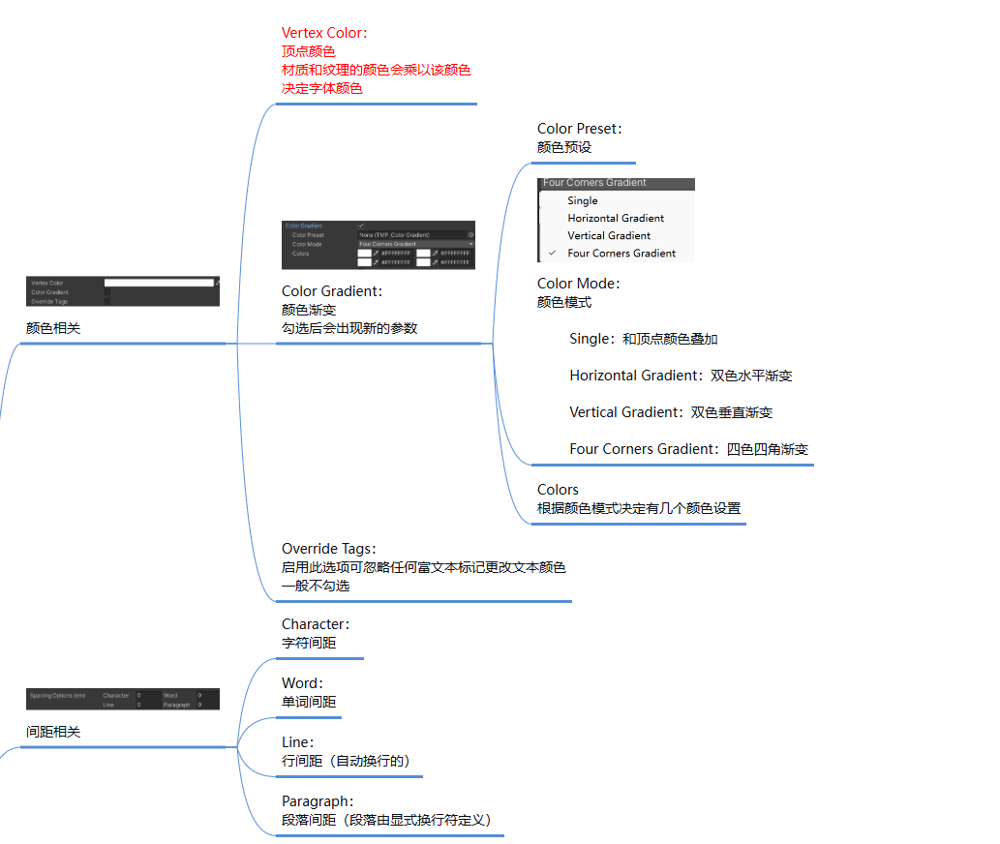
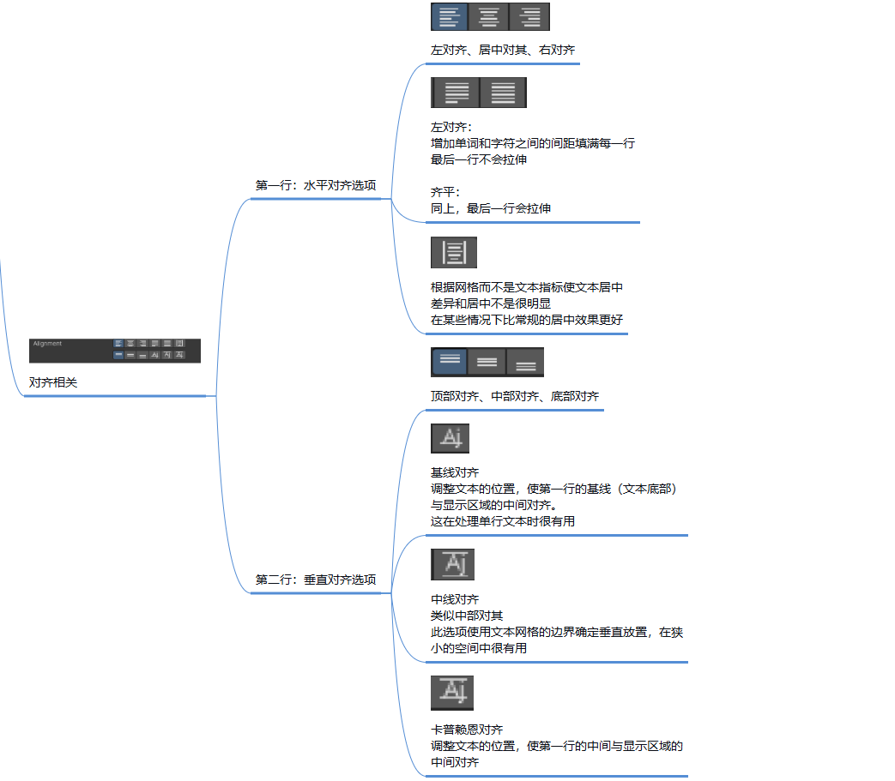

#### 4.包裹溢出、UV映射相关
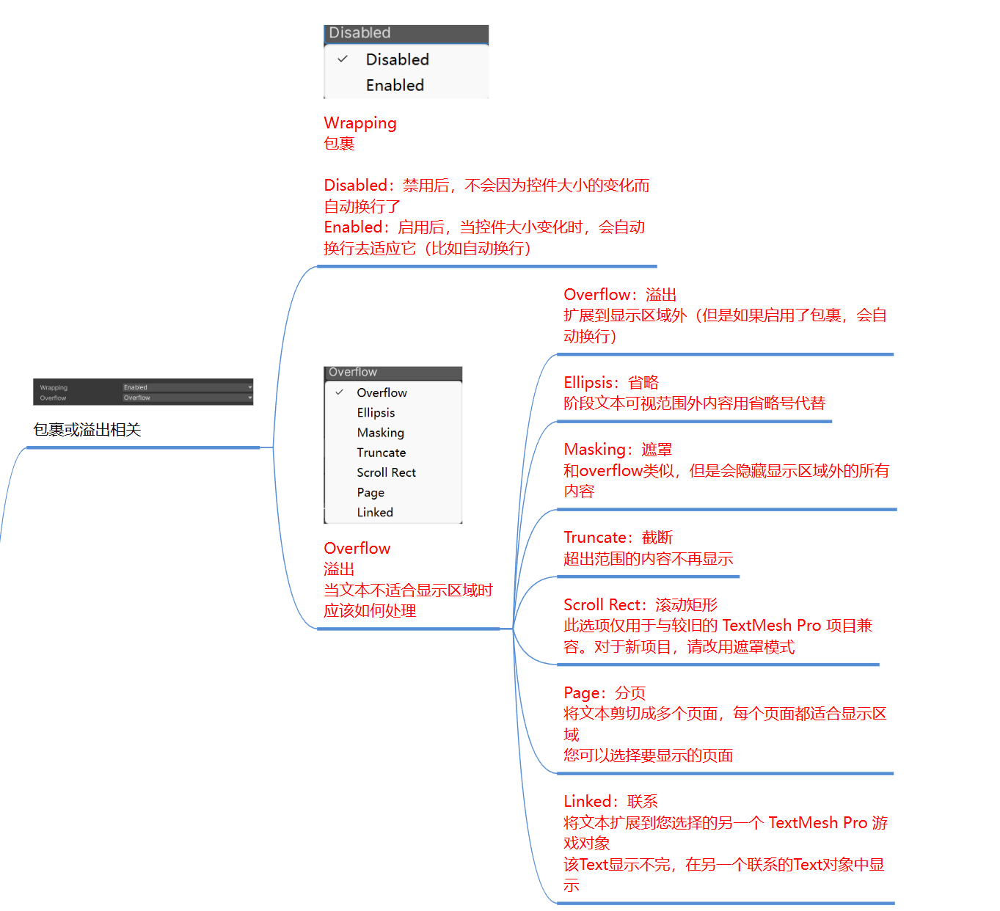
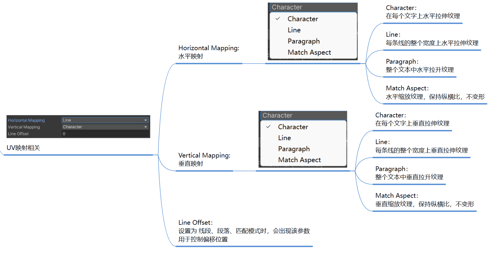
#### 5.额外设置相关
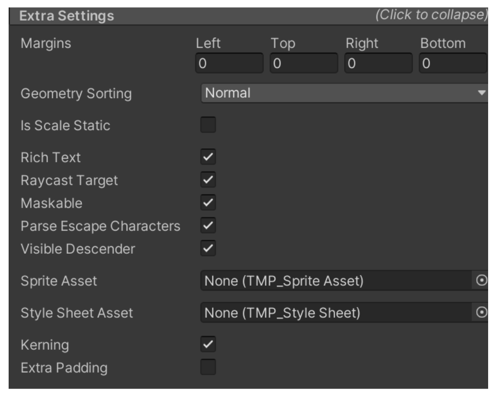
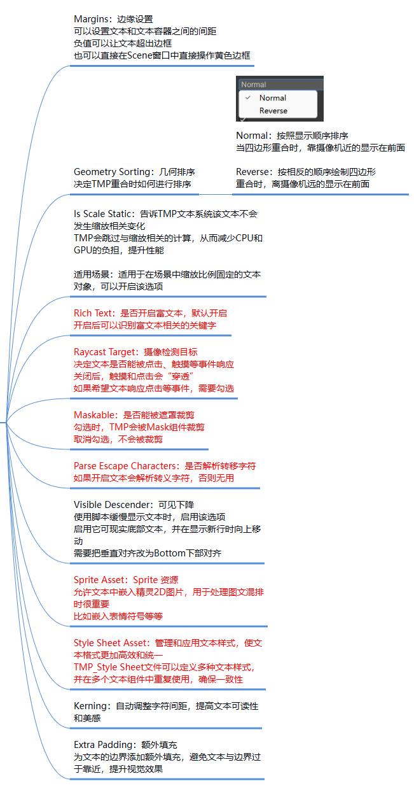
#### 6.脚本控制

##### 知识点一 脚本获取TMP UI组件 

- 1.需要引用TMP命名空间 TMPPro
- 2.TMP UI组件名为 TextMeshProUGUI

##### 知识点二 TMP UI组件常用属性 

- 1.文本内容 
- *text;* 
- *tmpUIText.text = "123123adfasdklf545454564654654646454564654132156465424";* 
  
- 2.字体 
- *font* 
- *tmpUIText.font* 

- 3.字体大小 
- *fontSize* 
- *tmpUIText.fontSize = 10;* 
  
- 4.颜色 
- *color* 
- *tmpUIText.color = Color.black;* 
  
- 5.对齐方式 
- *alignment* 
- *tmpUIText.alignment = TextAlignmentOptions.Center;* 
  
- 6.行间距 
- *lineSpacing* 
- *tmpUIText.lineSpacing = 50;* 
  
  
- 7.是否启用富文本 
- *richText;* 
- *tmpUIText.richText = false;*

##### 知识点三 TMP UI组件常用方法 
- 1.设置文本内容，支持富文本格式 
- *SetText("<color=blue>Hello, World!\</color>");* 
- *tmpUIText.SetText("123123123123123");* 
  
- 2.强制重新构建文本网格，通常在文本内容或样式更改后使用 
-   Prelayout          布局前调用 
-   Layout             布局时调用 
-   PostLayout         布局后调用 
-   PreRender          渲染前调用 
-   LatePreRender      渲染后调用 
-   MaxUpdateValue     最后调用 
- *Rebuild(UnityEngine.UI.CanvasUpdate.LatePreRender);* 
- *tmpUIText.Rebuild(UnityEngine.UI.CanvasUpdate.Prelayout);* 
  
- 3.强制更新文本网格,运行时动态更改文本时 
- *ForceMeshUpdate();* 
- *tmpUIText.ForceMeshUpdate();* 
  
- 4.获取文本中字符数 
- text.Length; 
- *print(tmpUIText.text.Length);*

##### 知识点四 UI事件监听 

- 如果我们想要为TMP UI空间添加交互事件 
- 可以UGUI中EventTrigger的方式

##### 知识点五 更多API 

- https:// docs.unity3d.com/Packages/com.unity.textmeshpro@4.0/api/TMPro.TextMeshProUGUI.html

### ③ 3D文本相关

#### 3D文本相关

##### 知识点一 3D文本和UI文本的区别 

- 1.组件不同 
-   3D:TextMeshPro 
-   UI:TextMeshProUGUI 
- 2.用途不同 
-   3D:主要用于在3D场景中显示文字 
-   UI:主要用于在UI中显示文字，具备UI相关的一些属性 
- 3.渲染方式 
-   3D:直接渲染在场景上 
-   UI:通过UGUI的Canvas系统渲染 
- 4.交互方式 
-   3D:一般通关添加碰撞器进行碰撞检测判断交互 
-   UI:一般利用UI系统的交互规则，比如EventTrigger 
  
- 如何选择？ 
- 文本需要与3D场景交互需要在3D场景上显示，选择3D文本 TextMeshPro, 就把他当成3D物体处理即可 
- 文本需要在UI系统中使用，选择 TextMeshProUGUI, 把它当成UI组件使用即可

##### 知识点二 3D文本参数相关 

- 和UI文本相关参数几乎一致

##### 知识点三 3D文本脚本控制相关 

- 组件名：TextMeshPro 
- 属性方法也和UI组件几乎一致

##### 知识点四 更多API 

- https:// docs.unity3d.com/Packages/com.unity.textmeshpro@4.0/api/TMPro.TextMeshPro.html
### ④字体资源相关

#### 1.字体资源创建基本流程

##### 知识点一 字体资源创建基本流程 

- ==方式一==：基于字体文件进行字体资源创建（常用） 
-   1.导入字体文件（后缀为 .ttf 或 .otf 格式的文件） 
-     一般放在文件夹 TextMesh Pro —> Fonts 中 
  
-   2.选中该字体 右键 —> Create —> TextMeshPro —> Font Asset 
-     创建好后 一般放在文件夹 TextMesh Pro —> Resources —> Fonts & Materials 中 
  
- ==方式二==：直接打开创建字体资源窗口创建 
-   工具栏 —> Window —> TextMeshPro —> Font Asset Creator

##### 知识点二 字体资源配置基本结构 

- 1.基本信息设置 
- 2.生成设置 
- 3.图集和材质 
- 4.字体粗细 
- 5.后备字体资源 
- 6.字符型 
- 7.字形表 
- 8.字形调整表

#### 2.基本信息设置
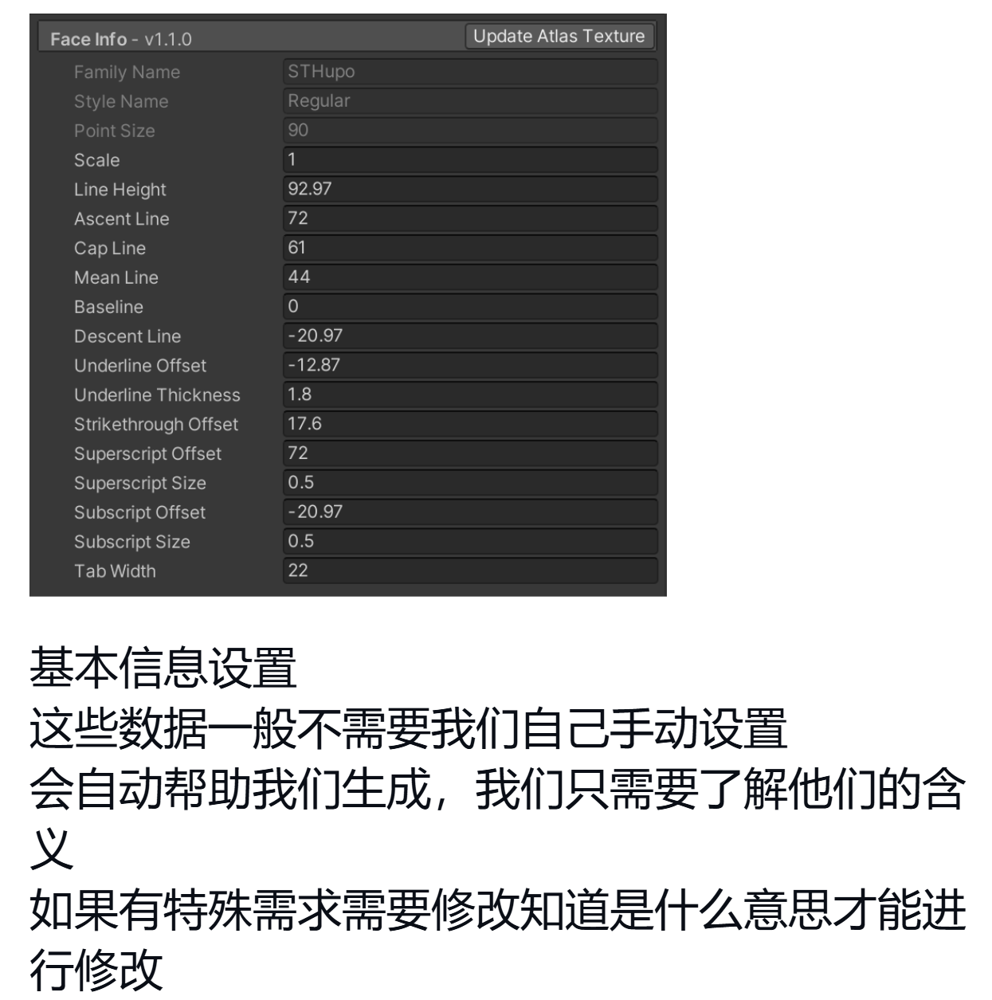
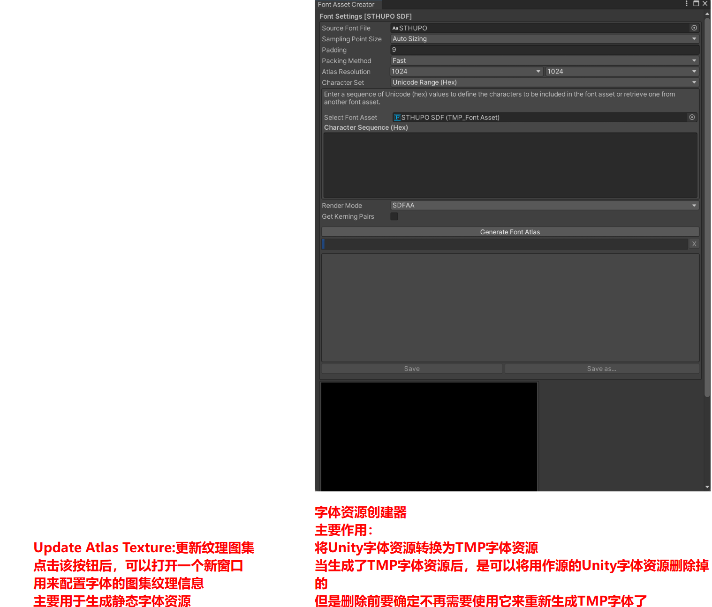
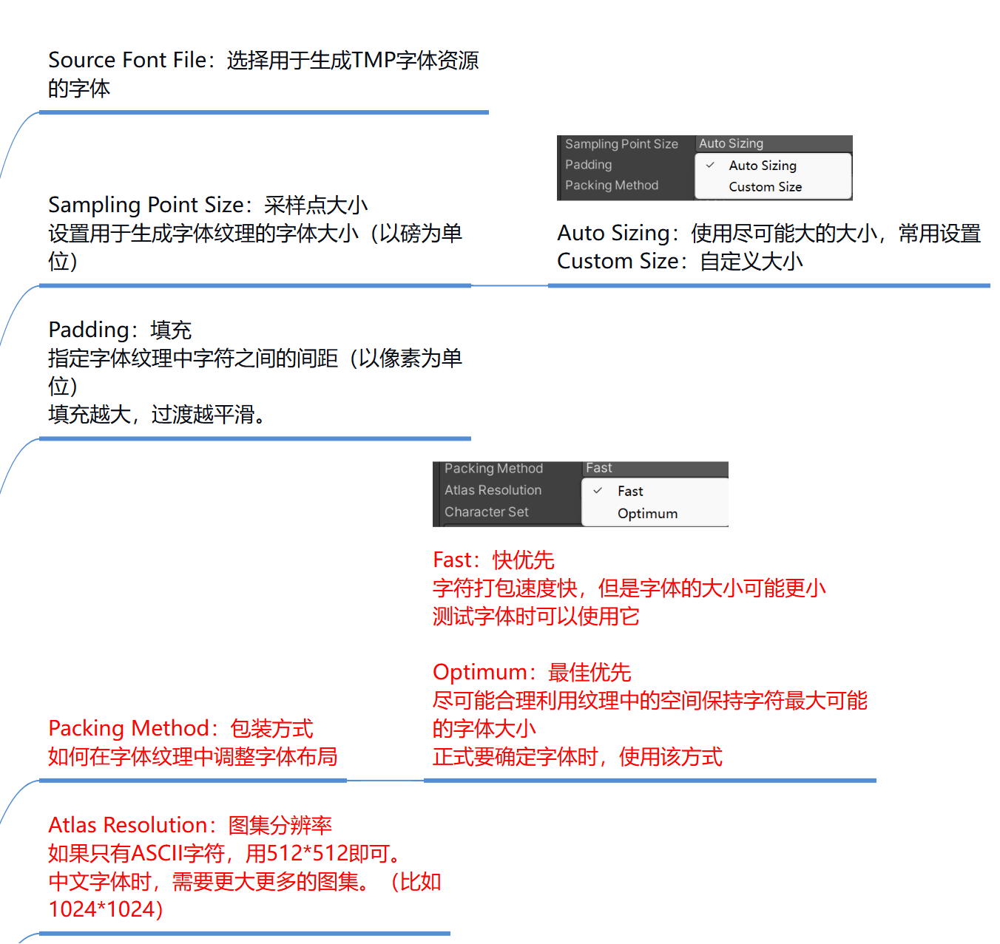
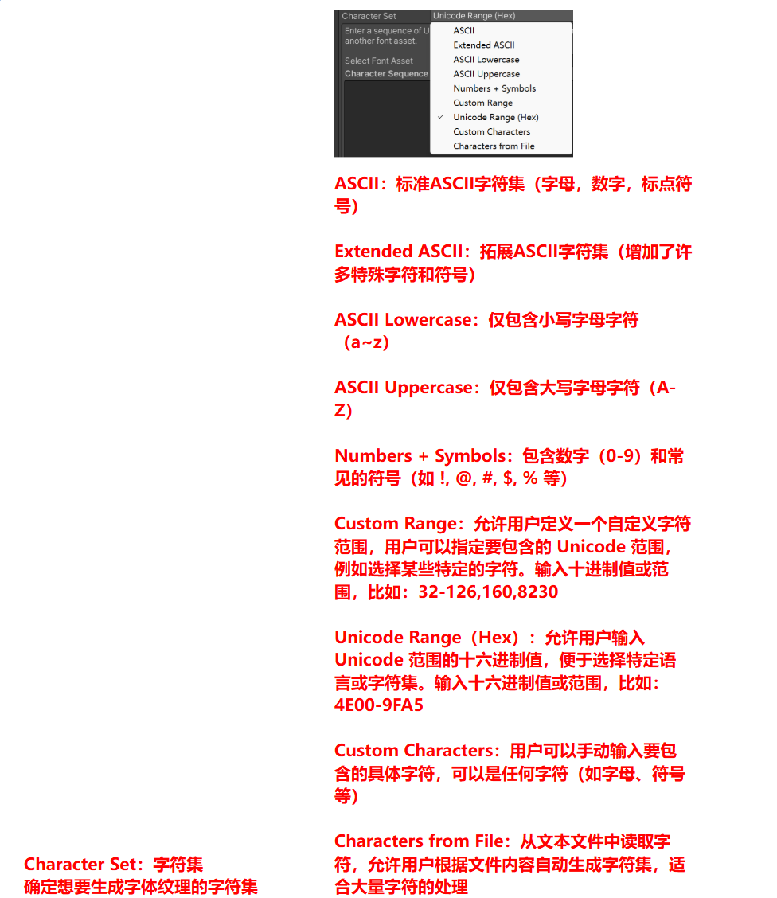
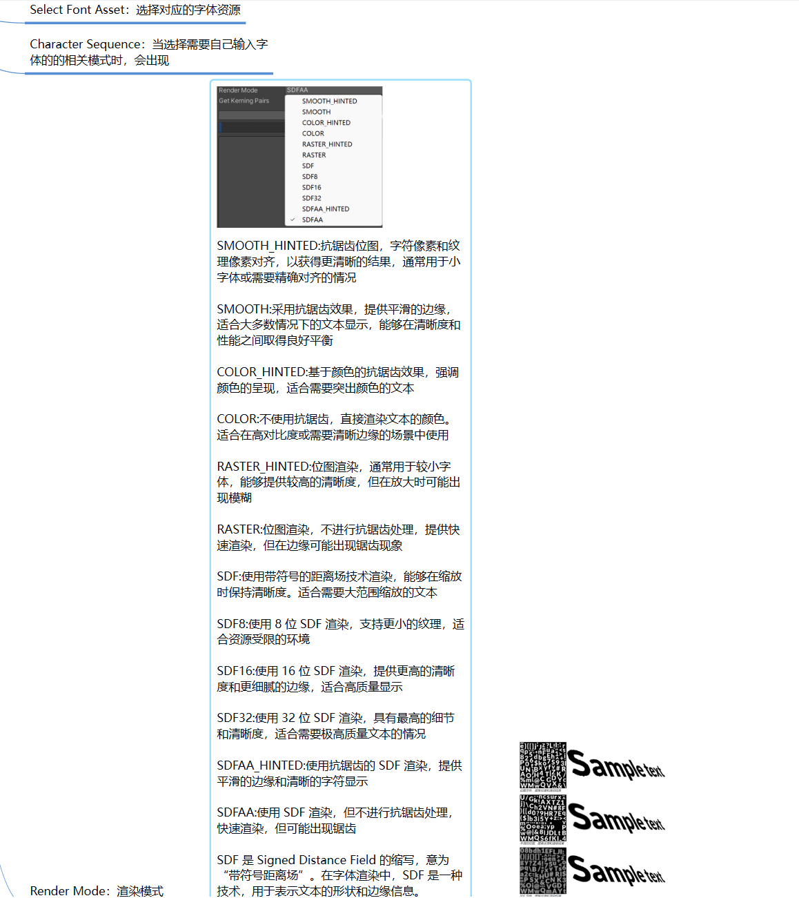
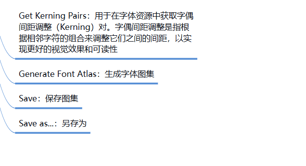
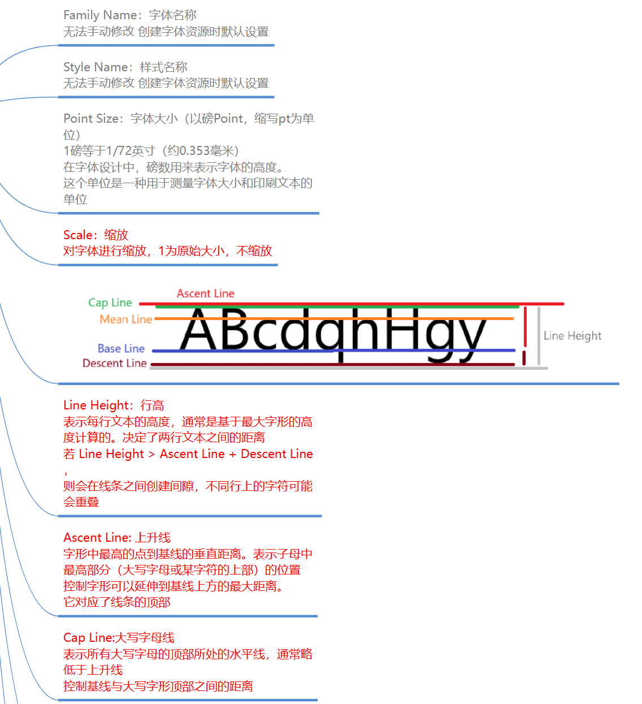
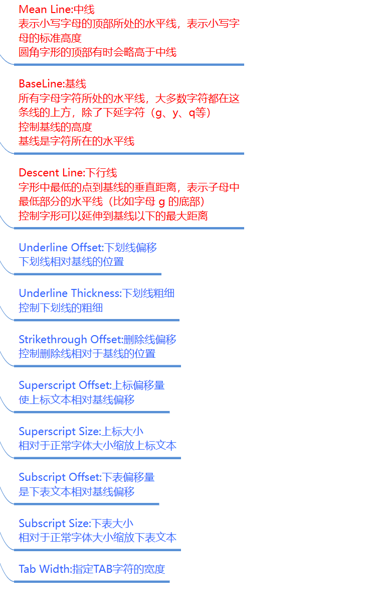

#### 3.生成设置 和 图集纹理

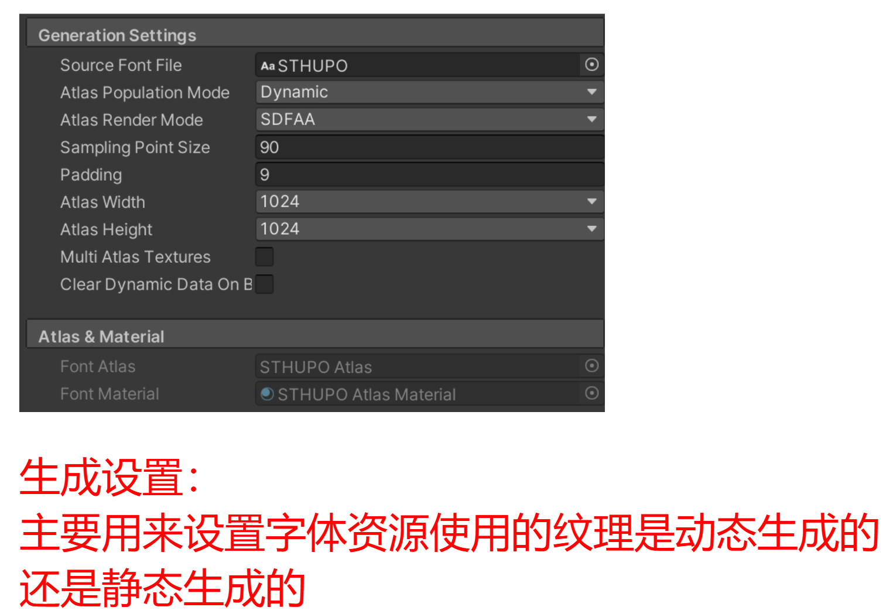
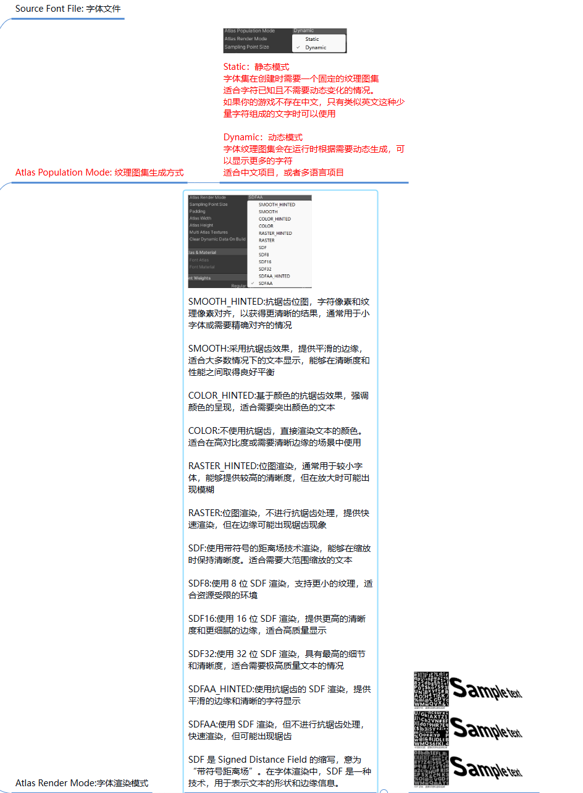
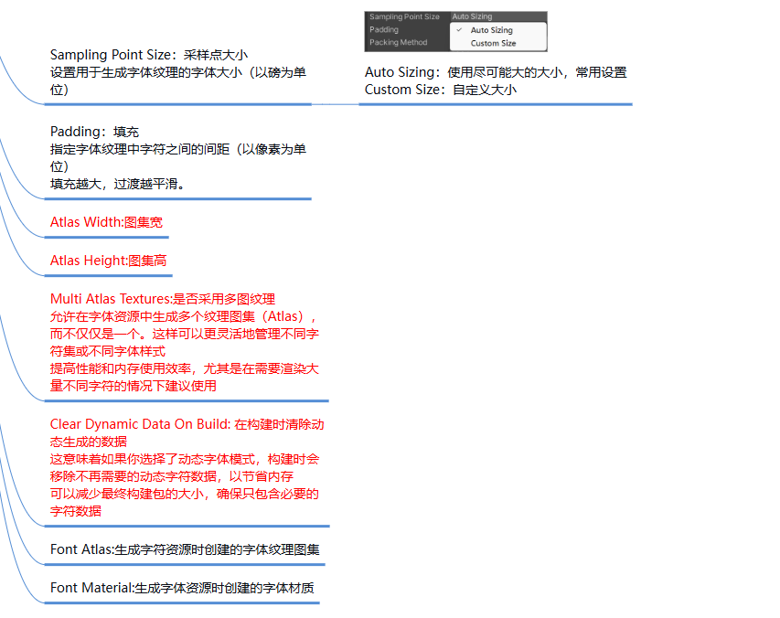


#### 4.字体粗细
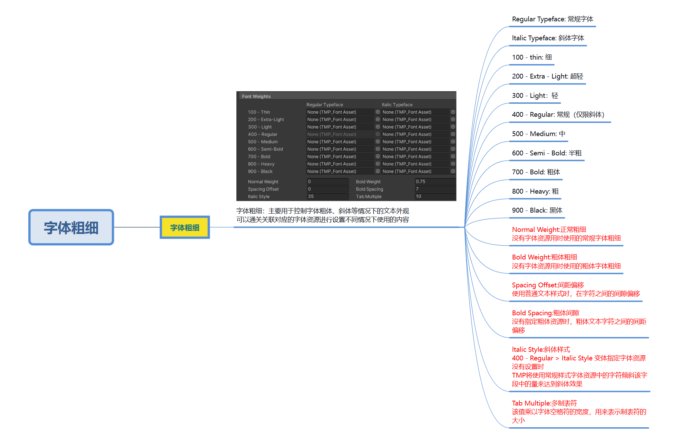


#### 5.其他相关设置

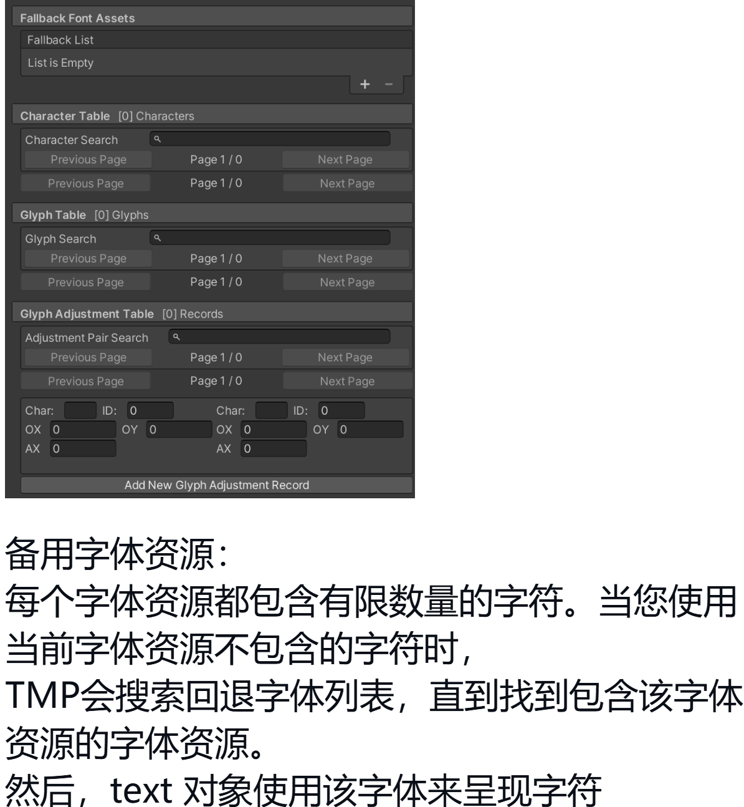

### ⑤富文本标签

#### 富文本标签

##### 知识点一 富文本标签是什么 

- 富文本标签是在很多文本处理系统中使用的标记语言 
- 允许通过特定的标签来格式化文本内容。 
- 这些标签可以控制文本的样式、颜色、大小和其他视觉效果 
- 从而增强文本的表现力 
  
- 它的写法类似HTML或XML标签 
  
- <标签名>文本内容</标签> 
- 或 
- <标签名="值">文本内容</标签> 
  
- 不同的标签会为文本带来不同的表现效果

##### 知识点二 富文本标签的主要作用 

- 富文本标签的主要作用 
- 是可以让我们在一个TMP文本控件中让一段文字呈现出各种不同的表现效果 
- 让文本表现效果更具吸引力和生动性 
- 常常用于游戏的 UI文本、聊天窗口、说明文本 等等文本显示相关的系统中

##### 知识点三 常用富文本标签 

- 1.换行 
-   *\<br>* 
  
- 2.文本加粗 
-   *\<b>\</b>* 
  
- 3.文本斜体 
-   *\<i>\</i>* 
  
- 4.加下划线 
-   *\<u>\</u>* 
  
- 5.改变大小  
-   *\<size=数值>\</size>* 
  
- 6.改变颜色  
-   *\<color=#RGBA 16进制>\</color>* 
  
- 7.对齐方式  
-   *\<align=left、center、right、justified、flush>\</align>*
  
- 8.背景高亮  
-   *\<mark=#RGBA 16进制>\</mark>* 
  
- 9.透明度 
-   *\<alpha=#A 16进制>* 
````ad-tip
透明度比较特殊  没有配对  会导致后面的字也变成相同透明度 

需要手动在后面的字符前添加 <alpha=#ff>
````
  
- 10.全部大写 
-   *\<allcaps>\</allcaps>* 
  
- 11.改字体和材质（可选） 
-   *\<font="字体名" material="材质名">\</font>* 
  
- 12.加上标(平方) 
-   *\<sup>\</sup>* 
  
- 13.加下标(化学式) 
-   *\<sub>\</sub>* 
  
- 14.超链接 
-   *\<link="链接">\</link>*

##### 知识点四 更多富文本标签 

- https:// docs.unity3d.com/Packages/com.unity.textmeshpro@4.0/manual/RichTextSupportedTags.html

## 二、进阶知识点

### ①样式表
#### 样式表

##### 知识点一 什么是样式表 

- 样式表是TMP提供的一个和 富文本标签 配合使用的功能 
- 我们可以利用 样式表 自定义一种文本样式 
- 然后在富文本中使用 
- <style="样式表名">\</style> 标签包裹想要应用该样式的文字 
- 相当于可以重复利用样式，避免每次书写相同、冗余的富文本样式编码 
  
- 样式表的本质是富文本标签，相当于是对富文本标签的复用

##### 知识点二 如何修改创建样式表 

- 1.修改默认样式表 
-   Project窗口 —> TextMesh Pro —> Resources —> Style Sheets —> Default Style Sheet 
-   选中默认样式表配置后 可以在Inspector窗口修改 本质也是个ScriptableObject表 
- 2.创建样式表 
-   Project窗口右键 —> TextMeshPro —> Style Sheet 
-   创建后，选中样式表文件 可以在Inspector窗口修改 
  
- 一般情况下，我们无需新建样式表 
- 在默认样式表中进行修改即可

##### 知识点三 样式表配置 
- Name: 样式表名 
- HashCode：不可修改的唯一编码 
- Opening Tags:富文本标签开头 
- Closing Tags:富文本标签结尾 
  
- Up、Down：上下选择当前样式 
- +、-：增加删除新的样式 
- Previous、Next：样式比较多时，用来翻页

##### 知识点四 样式表设置 

- 每一个TMP控件中的额外设置中 
- 都可以关联对应的样式表资源 
- 如果没有设置，会使用默认样式表

### ②颜色渐变预设
#### 颜色渐变预设

##### 知识点一 颜色渐变预设的作用 

- 让文本对象重复使用相同的颜色渐变 
- 避免每次对文本单独进行设置，提高开发效率

##### 知识点二 颜色渐变预设的创建和使用 

- 创建： 
- Project窗口右键 —> TextMeshPro —> Color Gradient 
- 创建好后，选中文件，在Inspector窗口即可开始编辑 
  
- 使用： 
- 在TMP文本中开启颜色渐变 
- 拖入创建好的颜色渐变配置 
- 注意：文本中颜色模式和配置文件中模式一致

### ③精灵图片资源(图文混排)
#### 精灵图片资源(图文混排)

##### 知识点一 精灵图片资源是什么？ 
- 精灵图片资源是配合富文本标签使用的资源 
- 它可以让我们在TMP文本中显示图片，达到图文混排的目的 
  
- 我们只需要创建并配置好精灵图片资源 
- 便可以利用富文本标签在文本中显示图片

##### 知识点二 精灵图片资源的创建 

- 1.根据自己的需求建立一个图集纹理 
-   图集的 
-   Texture Type 为 Sprite 
-   Sprite Mode 为 Multiple 
-   并且我们需要在Sptie Editor中将图集中的图片划分为单独的Sprite(需要导入2D Sprite包) 
  
- 2.准备好图集文件后 
-   在Project窗口中选中图集后 —> 右键 —> Text Mesh Pro —> Sprite Asset 
-   创建后，一般我们需要为每个图片进行 
-   2-1:名字设置 
-   2-2:位置宽度相关设置 
-       最好配合着使用来配置 
-       其中的参数和字体参数类似 
-       关键参数： 
-       BX、BY：相对于基线的原点的左上角 
-       AD：放置下一个内容时往右前进的位置 
-       为了方便，可以通过最下方的全局偏移和缩放进行设置

##### 知识点三 精灵图片资源的使用 

- 直接在TMP文本控件中输入sprite相关的富文本标签便可以使用 
  
- (默认资源中获取图片) 
- \<sprite index=图片ID color=#RGBA的16进制(可选)> 
- 或 
- \<sprite name="图片名" color=#RGBA的16进制(可选)> 
- 或 
- <sprite=图片ID color=#RGBA的16进制(可选)> 
  
- (指定资源中获取图片) 
- <sprite="资源名" index=图片ID color=#RGBA的16进制(可选)> 
- 或 
- <sprite="资源名" name="图片名" color=#RGBA的16进制(可选)> 
  
- 也可以将精灵图片资源直接关联给对应的TMP文本 
- 若不关联，将使用默认资源


### ④TMP基础设置
#### TMP基础设置
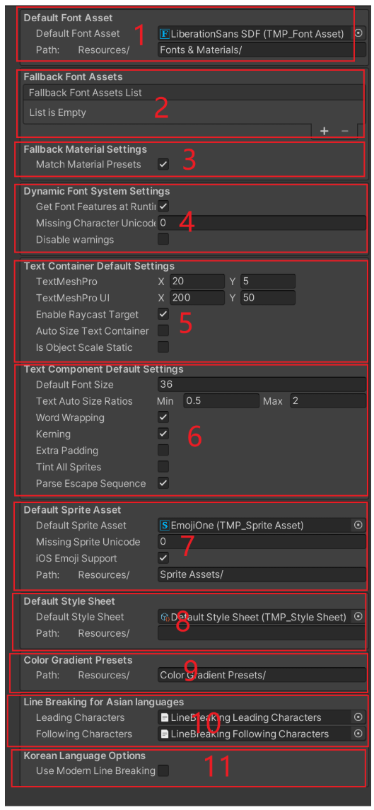
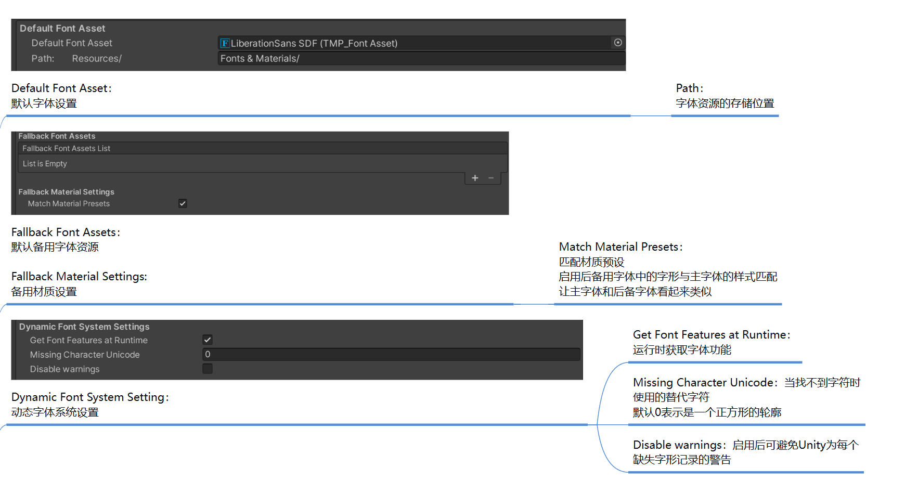
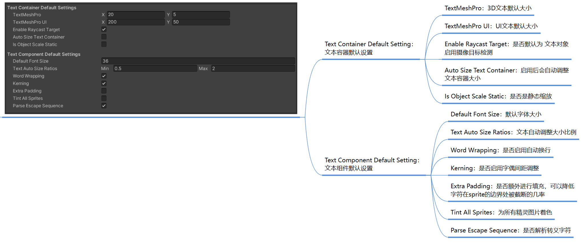
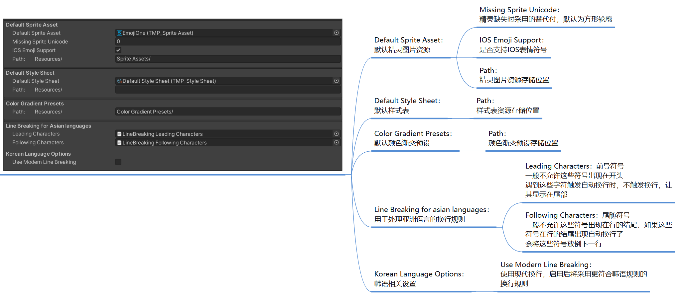


### ⑤材质球相关
#### 1.SDF材质球和基础设置(Face)

##### 知识点一 SDF是什么意思 

- SDF 是 有符号距离场 (Signed Distance Field) 的缩写 
- 有符号(Signed)：指的是距离可以为正或负，表示一个点位于边界的内部（负值）还是外部（正值） 
- 距离(Distance)：表示每个像素点到字符边缘的距离 
- 场(Field)：指的是整个字体或图形周围的距离值的分布 
  
- 是一种用于高质量文本和图形渲染的技术 
- 尤其适用于缩放或在低分辨率下保持边缘平滑的情况 
  
- 它的本质就是在一个Shader（着色器）中利用SDF相关算法规则来渲染文字 
- SDF 技术生成的字体纹理并不是普通的位图，而是基于每个像素到字体边缘的距离值。 
- 这些距离值存储在纹理的灰度通道中，代表每个像素到字符边缘的距离信息。 
- 然后在渲染时，着色器根据这些距离值动态计算字体的边缘，最终渲染出平滑的字符轮廓。 
  
- 主要在TMP中用于生成和渲染文本，能让字体在任意大小或距离下保持清晰和锐利的效果

##### 知识点二 SDF材质球指什么 

- 我们创建的字体资源使用的材质球 
- 本质上就是一个使用了SDF相关Shader的材质球 
- 利用该Shader渲染出来的字体效果会更好 
- 并且该Shader提供了很多可以被配置的参数 
- 我们可以在对应字体的材质球中修改这些参数 
- 从而让我们的字体实现一些更复杂的美术表现效果 
  
- 因此我们需要学习字体材质球中的这些参数 
- 从而帮助我们利用它来实现我们的表现需求

##### 知识点三 SDF材质球中的主要内容 

- 1.基础表面设置 
- 2.边缘线效果设置 
- 3.阴影(底层)效果设置 
- 4.照明效果设置 
- 5.发光效果设置

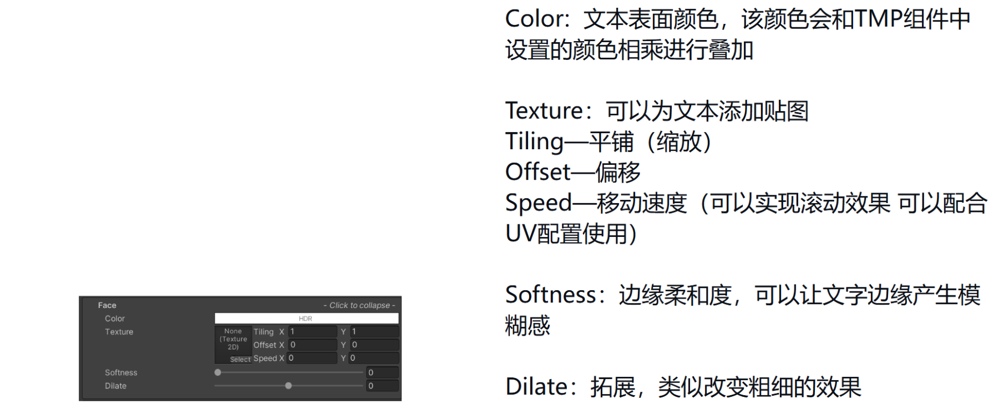

#### 2.边缘线(Outlint)和阴影(Underlay)

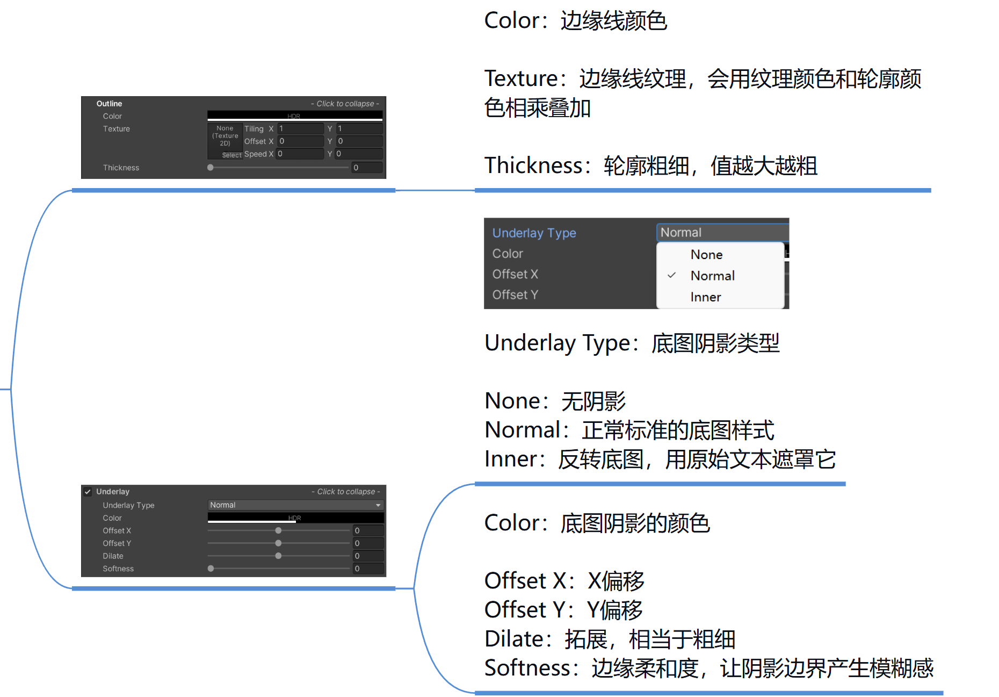

#### 3.照明(Lighting)

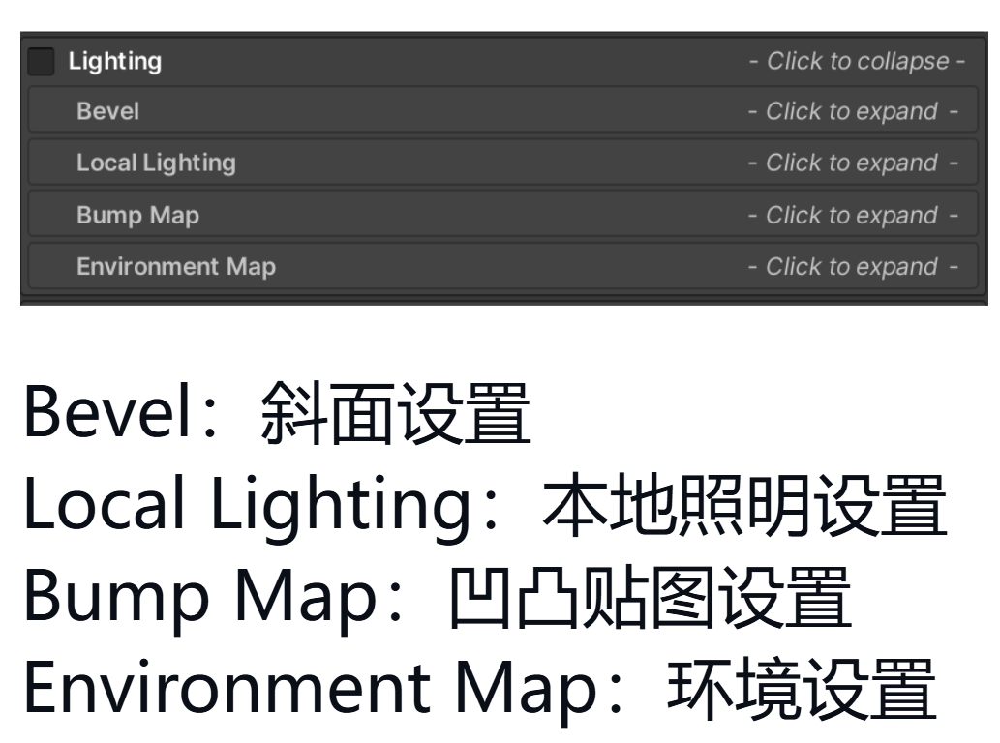
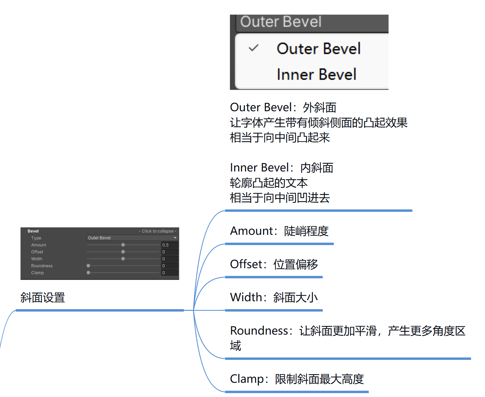
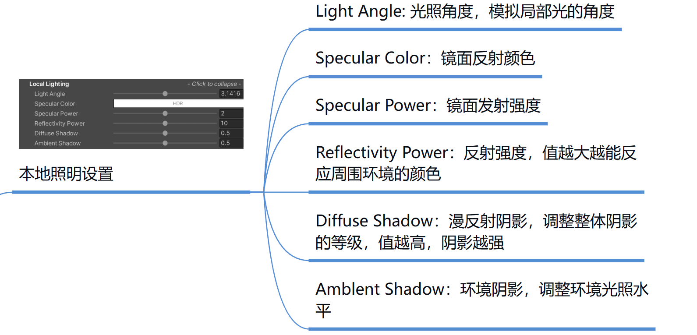
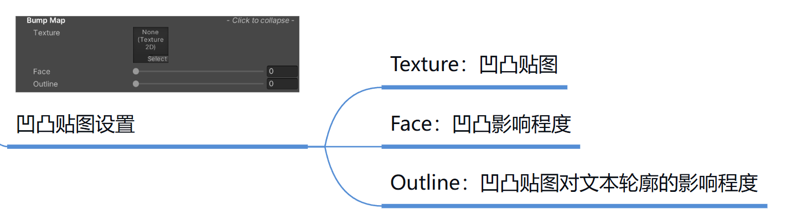
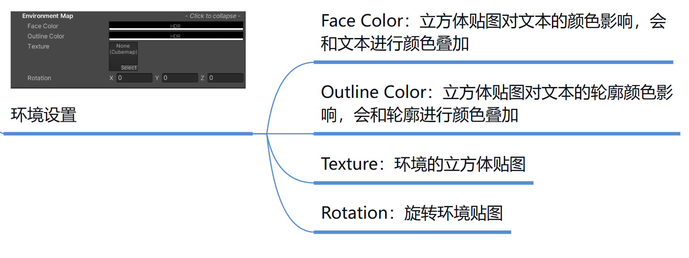

#### 4.发光（Glow）和 调试设置(Debug Settings)

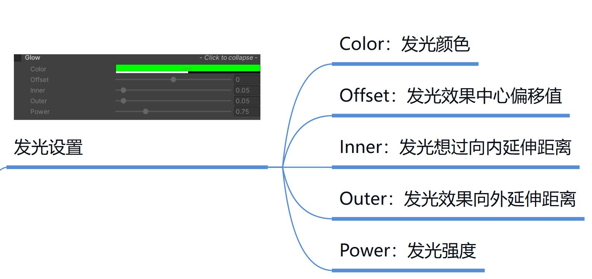
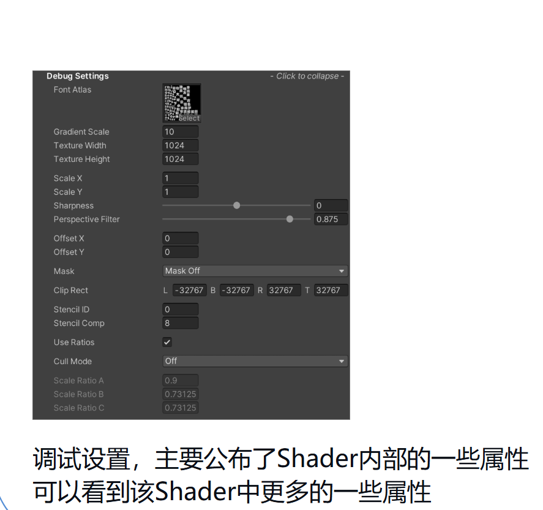
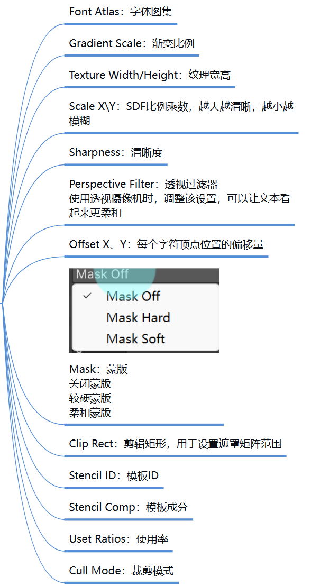

### ⑥工具类相关

#### 1. TMP_TextEventHandler

##### 知识点一 TMP_TextEventHandler类的作用 

- 它是 TextMeshPro 中提供的一个交互工具类 
- 主要用于处理用户和TMP文本之间的交互事件 
- 主要作用是监听并响应 TMP 文本中的特定区域或标签（如链接 <\link> 和特定字符）
- 的点击和鼠标悬停事件 
- 这个类可以让你对文本的某些部分进行交互式操作，适用于创建如超链接、工具提示、弹出信息等效果

##### 知识点二 TMP_TextEventHandler类的使用 

-   链接：onLinkSelection —— 当用户悬停超链接时触发 
-   字符：onCharacterSelection —— 当用户悬停某个字符时触发 
-   单词：onWordSelection —— 当用户悬停某个单词时触发 
-   行：onLineSelection —— 当用户悬停某一行文本时触发 
-   精灵图片：onSpriteSelection —— 当用户悬停某一精灵图片时触发 
  
- *TMP_TextEventHandler tmpHandler = this.GetComponent<TMP_TextEventHandler>();* 
- *tmpHandler.onLinkSelection.AddListener(MyLinkSelectionHandler);* 
- *tmpHandler.onWordSelection.AddListener(MyWordSelectionHandler);* 
- *tmpHandler.onLineSelection.AddListener(MyLineSelectionHandler);* 
- *tmpHandler.onSpriteSelection.AddListener(MySpriteSelectionHandler);* 
- *tmpHandler.onCharacterSelection.AddListener(MyCharSelectionHandler);*

#### 2.TMP_TextUtilities类

##### 知识点一 TMP_TextUtilities类的作用 

- 它是 TextMeshPro 中提供的一个实用工具类 
- 包含多个常用方法，主要用于获取指定位置的文本信息 
- 我们主要在点击文本时，利用该类来获取点击到的具体内容

##### 知识点二 TMP_TextUtilities类中的常用API 

- 下面的方法返回的都是索引值 
- 如果没有获取到信息，返回的索引为-1 
- 利用获取到的索引可以在TMP文本控件中的textInfo属性中的 
- linkInfo 
- wordInfo 
- characterInfo 
- lineInfo 
- 来获取信息 
  
- 1.获取给定位置文本中的具体信息 
-   获取链接索引：int FindIntersectingLink(TMP_Text text, Vector3 position, Camera camera) 
-   获取单词索引：int FindIntersectingWord(TMP_Text text, Vector3 position, Camera camera) 
-   获取单字符索引：int FindIntersectingCharacter(TMP_Text text, Vector3 position, Camera camera) 
-   获取行索引：int FindIntersectingLine(TMP_Text text, Vector3 position, Camera camera) 
  
- 2.获取离给定位置最新的文本中的具体信息 
-   获取链接索引：int FindNearestLink(TMP_Text text, Vector3 position, Camera camera) 
-   获取单词索引：int FindNearestWord(TMP_Text text, Vector3 position, Camera camera) 
-   获取单字符索引：int FindNearestCharacterOnLine (TMP_Text text, Vector3 position, Camera camera) 
-   获取行索引：int FindNearestLine(TMP_Text text, Vector3 position, Camera camera) 
  
- 更多API： 
- https:// docs.unity3d.com/Packages/com.unity.textmeshpro@4.0/api/TMPro.TMP_TextUtilities.html

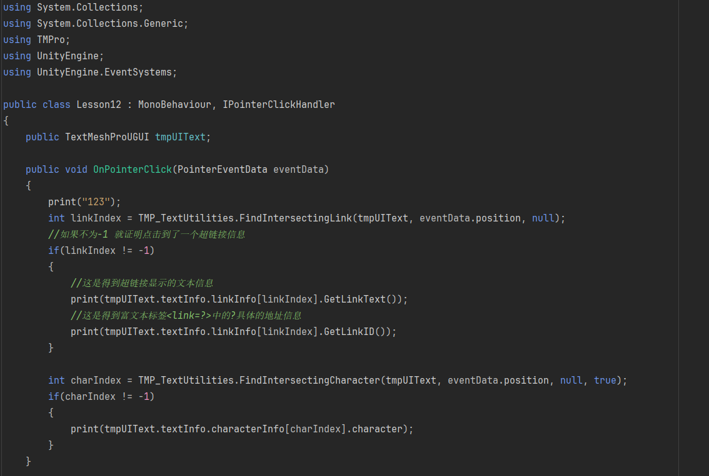

#### 3.其它工具类

##### 知识点 其它工具类 
- 在使用TMP进行开发时 
- 除了我们经常会用到的 
- TMP_TextEventHandler 和 TMP_TextUtilities 类以外 
- TMP还提供了很多工具类 
- 比如： 
- TMP_Math: 提供一些基础的数学计算 
- TMP_FontAssetUtilities: 提供字体资源的操作和查询等方法 
- TMP_TextParsingUtilities: 提供解析文本内容的工具 
- 等等 
  
- 这些内容我们虽然在日常开发时不经常使用 
- 但是大家可以大概了解下 
- 若遇到一些特殊需求时，可以选择使用其中提供的功能 
- 更多API：https:- docs.unity3d.com/Packages/com.unity.textmeshpro@4.0/api/TMPro.html