# Unity基础

## 一、 3D数学——基础

### 1. Mathf

- **知识点一**  Mathf和Math
    Math是C#中封装好的用于数学计算的**工具类** ———— 位于System命名空间中
    Matthf是Unity中封装好的用于数学计算的工具**结构体**————位于UnityEngine命名空间中
    他们都是提供来进行数学相关计算的
- **知识点二**他们的==区别==
    Mathf和Math中的相关方法几乎一样
    Math是C#自带的工具类 主要提供一些数学相关计算方法
    Mathf是Unity专门封装的，不仅包含Math中的方法，还多了一些适用于游戏开发的方法
    所以在进行Unity游戏开发时 使用Mathf中的方法用于数学计算即可
- **知识点三**Mathf中的==常用==方法———般计算一次
    1. π - **PI**
    `print（Mathf.P）;`
    2. 取绝对值 - **Abs**
    `print(Mathf.Abs(-10));`
    3.  向上取整 - **CeilToInt**
    `float f = 1.3f;`
    `print(Mathf.CeilToInt(f));`
    4. 向下取整 - **FloorToInt**
    `print(Mathf.FloorToInt(1.3));`
    5. 钳制函数 - **Clamp**
    `print(Mathf.Clamp(10,11,20));`——**输出11**
    `print(Mathf.Clamp(21,11,20));`——**输出20**
    `print(Mathf.Clamp(15,11,20));`——**输出15**
    6. 获取最大值 - **Max**
    `print(Mathf.Max(1,2,3,4,5,6,7,8,9));`——**输出1**
    7. 获取最小值 - **Min**
    `print(Mathf.Min(1,2,3,4,5,6,7,8,9));`——**输出9**
    8. 一个数的n次幂 - **Pow**
    `print(Mathf.Pow(4,2));`——**输出16**
    `print(Mathf.Pow(2,3));`——**输出8**
    9. 四舍五入 - **RounToInt**
    `print(Mathf.RoundToInt(1.3f));`——**输出1**
    `print(Mathf.RoundToInt(1.5f));`——**输出2**
    10. 返回一个数的平方根 - **Sqrt**
    `print(Mathf.Sqrt(4));`——**输出2**
    `print(Mathf.Sqrt(16));`——**输出4**
    `print(Mathf.Sqrt(64));`——**输出8**
    11. 判断一个数是否是2的n次方 - **IsPowerOfTwo**
    `print(Mathf.IsPowerOfTwo(4));`——**True**
    `print(Mathf.IsPowerOfTwo(8));`——**True**
    `print(Mathf.IsPowerOfTwo(3));`——**False**
    `print(Mathf.IsPowerOfTwo(1));`——**True**
    12. 判断正负数 - **Sign**
    `print(Mathf.Sign(0));`——**1**
    `print(Mathf.Sign(10));`——**1**
    `print(Mathf.Sign(-10));`——**-1**
    `print(Mathf.Sign(3));`——**1**
    `print(Mathf.Sign(-2));`——**-1**
- **知识点四**Mathf中的常用方法———一般不停计算
    `float start = 0;`
    `float result = 0;`
    `float time = 0;`
    差值运算——Lerp  `result = Mathf.Lerp(start,end,t);`
    t为差值系数，取值范围为 0~1  ==result = start + (end - start) * t==
    差值运算用法一 ：每帧改变start的值 —— 变化速度先快后慢，位置无限接近，但是不会得到end位置
    `start = Mathf.Lerp(start, 10, Time.deltaTime);`
    差值运算用法二：每帧改变t的值—— 变化速度匀速，位置每帧接近，当他>=1时，得到结果
    `time += Time.deltaTime;`
    `result = Mathf.Lerp(start, 10, time);`
    

### 2. 三角函数
角度和弧度的转换关系

π rad = 180°
==1 rad = (180/π)° => 1 rad = 180 / 3.14 ≈ 57.3°==
==1° = （π/180）rad = 1° = 3.14 /180≈0.01745 rad==
由此可以得出
==弧度 * 57.3 = 对应角度==
==角度 * 0.01745 = 对应弧度==

- **知识点一** 弧度、角度相互转化      ==Rad== ——radian   ==Deg== ——degree
    //==弧度转角度==
    `float rad = 1；`
    `float anger = rad * Mathf.Rad2Deg;`//Rad2Deg     弧度转角度
    `print(anger);`
    //==角度转弧度==
    `anger = 1;`
    `rad = anger * Mathf.Deg2Rad;`//Deg2Rad     角度转弧度
    `print(rad);`
- **知识点二**三角函数
    正弦函数
    
    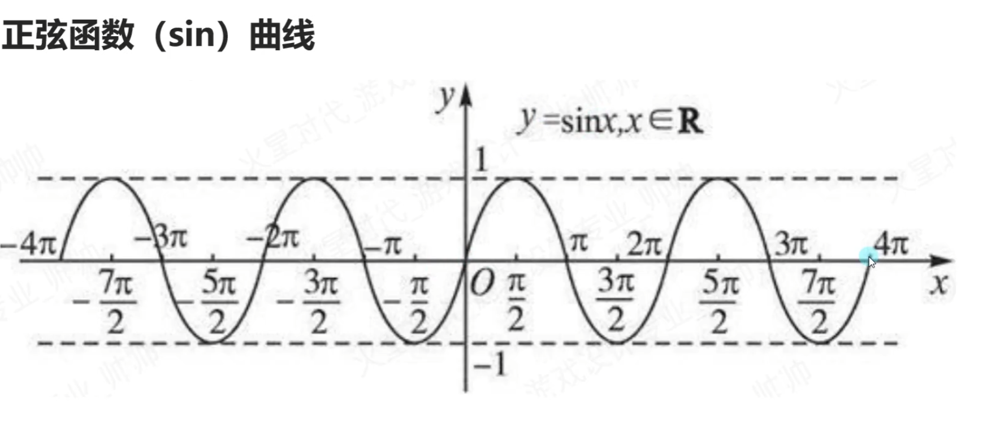
    ==Mathf中的三角函数相关函数，传入参数需要是弧度值==
    
    `print(Mathf.Sin(30 * Mathf.Deg2Rad));`
    `print(Mathf.Cos(30 * Mathf.Deg2Rad));`
- **知识点三**反三角函数
    1. 反三角函数是初等函数之一
    2. 包括反正弦函数、反余弦函数等
    ==作用==：通过反三角函数计算正弦值或余弦值对应的弧度值
    ==注意==：反三角函数得到的结果是 正弦或者余弦值对应的弧度
    `rad = Mathf.Asin(0.5f);`//得到0.5这么大的值对应的正弦弧度
    
    `print(rad * Mathf.Rad2Deg);`
    
    `rad = Math.Acos(0.5f);`//得到0.5这么大的值对应的余弦弧度
    
    `print(rad * Mathf.Rad2Deg);`
    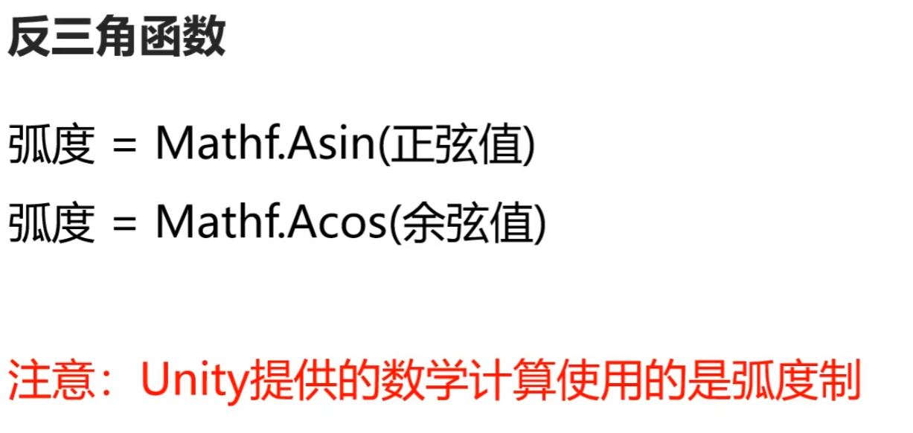
    
 
 
  ### 3. 坐标系

- **知识点一** 世界坐标系
    原点：世界的中心点
    轴向：世界坐标系的==三个轴向是固定==的
    //世界坐标相关
    `this.transform.position;`  世界坐标位置
    `this.transform.rotation;`  世界坐标旋转（四元数）
    `this.transform.eulerAngles;`  世界坐标欧拉角
    `this.transform.lossyScale;`世界坐标缩放
- **知识点二** 物体坐标系
    原点：物体的中心点（建模时决定）
    轴向：
    物体==右方==为==X==轴正方向
    物体==上方==为==Y==轴正方向
    物体==前方==为==Z==轴正方向
    //相对父对象坐标 本地坐标  相对坐标
    `this.transform.localPosition;`  本地坐标位置
    `this.transform.localEulerAngles;`  本地坐标欧拉角
    `this.transform.localRotation;`  本地坐标旋转（四元数）
    `this.transform.localScale;`  本地坐标缩放

- **知识点三** 屏幕坐标系
    原点：屏幕左下角
    轴向：
    ==向右==为==X==轴正方向
    ==向上==为==Y==轴正方向
    最大宽高：
    `Screen.width;` 屏幕宽度
    `Screen.height;` 屏幕高度
    `Input.mousePositon;` 鼠标位置
    
- **知识点四** 视口坐标系
    原点：屏幕左下角
    轴向：
    ==向右==为==X==轴正方向
    ==向上==为==Y==轴正方向
    特点：
    ==左下角为（0,0）==
    ==右上角为（1,1）==
    和屏幕坐标类似，将坐标单位化
- # 坐标转换 
    
    ## 1.世界转本地
    ### this.transform.InverseTransformDirection;
    ### this.transform.InverseTransformPoint;
    ### this.transform.InverseTransformVector;
    
    ## 2.本地转世界
    ### this.transform.TransformDirection;
    ### this.transform.TransformPoint;
    ### this.transform.TransformVector;
    
    ## 3.世界转屏幕
    ### Camera.main.WorldToScreenPoint;
    ## 4.屏幕转世界
    ### Camera.main.ScreenToWroldPoint;
    ## 5.世界转视口
    ### Camera.main.WorldToViewportPoint;
    ## 6.视口转世界
    ### Camera.main.ViewportToWorldPoint;
    ## 7.视口转屏幕
    ### Camera.main.ViewportToScreenPoint;
    ## 8.屏幕转视口
    ### Camera.main.ScreenToViewportPoint;

## 二、3D数学——向量

### 1. 向量模长和单位向量

- ==标量==：有数值大小，没有方向
- ==向量==：有数值大小，有方向的矢量
- **知识点一 向量**
    三维向量 —— Vector3
    1. 位置 —— 代表一个点
    `print(this.transform.position);`
    2. 方向 —— 代表一个方向
    `print(this.transform.forward);`
    `print(this.transform.up);`
- **知识点二 两点决定一向量**
    //A和B此时 几何意义 是两个点
    `Vector3 A = new Vector3(1,2,3);`
    `Vector3 B = new Vector3(5,1,5);`
    //求向量  此时AB和BA 他们的几何意义是两个向量
    `Vector3 AB = B - A;`
    `Vector3 BA = A - B;`

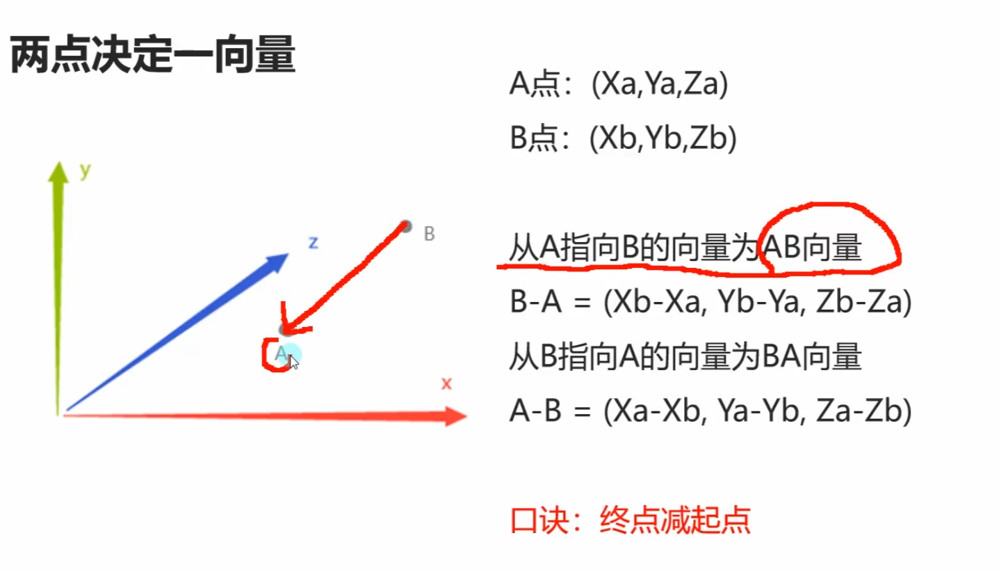
- **知识点三 零向量和负向量**
    零向量(0,0,0)
    零向量是==唯一==一个==大小为0==的向量
    
    ==负向量==
    (x,y,z)的负向量为(-x,-y,-z)
    负向量和原向量==大小相等==
    负向量和原向量==方向相反==
    `print(Vector3.zero);`==零向量==
    
    `print(-Vector3.forward);`==负向量==

- **知识点四 向量的模长**
    向量的模长就是向量的长度
    向量是由两个点算出，所以向量的模长就是两个点的距离
    
    模长公式：
    A向量（x,y,z）
    模长 = √x^2+y^2+z^2
    
    Vector3中提供了==获取==向量==模长==的==成员属性==
    ==magnitude==
    `print(AB.magnitude);`
    `Vector3 C = new Vector3(5,6,7);`
    `print(C.magnitude)`  ==此处为通过向量获得相对于原点的向量长度==
    
    `Vector3.Distance(A,B);`==此处为通过点的距离得模长==
- **知识点五 单位向量**
    模长为1的向量为单位向量
    任意一个向量经过归一化就是单位向量
    只需要方向，不想让模长影响计算结果时使用单位向量
    ==归一化公式：==
    A向量（x,y,z）
    模长 = √x^2+y^2+z^ 2
    ==单位向量 = （x/模长,y/模长,z/模长==
    
    Vector3提供了获取单位向量的成员属性
    ==normalized==
    `print(AB.normalized);`
    `print(AB/AB.magnitude);` 向量/模长 = 单位向量
    


### 2. 向量点乘

点乘==计算公式==

向量 A(Xa,Ya,Za)
向量 B(Xb,Yb,Zb)

==A·B=Xa * Xb + Ya * Yb + Za * Zb==
向量 · 向量 = 标量

==点乘==的==几何意义==

点乘可以得到一个向量
在自己向量上的投影的长度
点乘结果 >0 两个向量夹角为锐角
点乘结果 =0 两个向量夹角为直角
点乘结果 <0 两个向量夹角为钝角

我们可以用这个规律判断敌方的大致方位

- **补充知识 调试划线**
    画线段      前两个参数分别是 起点 终点
    `Debug.DrawLine(this.transform.position,this.transform.position+this.transform.forward,Color.red);`
    
    画射线      前两个参数分别是 起点 方向
    `Debug.DrawRay(this.transform.position,this.transform.forward,Color.white);`

- **知识点一  通过点乘判断对象方位**
    Vector3提供了计算点乘的方法
    Debug.DrawRay(this.transform.position,This.transform.forward,Color.red);
    Debug.DrawRay(this.transform.position,(target.position - this.transform.position).normalized,Color.red);
    
    得到向量 a 点乘 AB 的结果
    ```C#
    float dotResult = Vector3.Dot(this.transform.forward,target.position - this.transform.position);
    if(dotResult >= 0)
    {
        print("它在我前方");
    }
    else
    {
        print("它在我后方");
    }
    ```
    
    
- **知识点二 通过点乘退到公式算出夹角**
    
    步骤
    1. 用单位向量算出点乘结果
    dotResult = Vector3.Dot(this.transform.forward,(target.position - this.transform.position).normalized);
    2. 用反三角函数得出角度
    print("角度" + Mathf.Acos(dotResult) * Mathf.Rad2Deg);
    
    print("角度2" + Vector3.Angle(this.transform.forward,target.position - this.transform.position));


### 3. 向量叉乘
-  ==叉乘计算公式==
- 向量 X 向量 = 向量
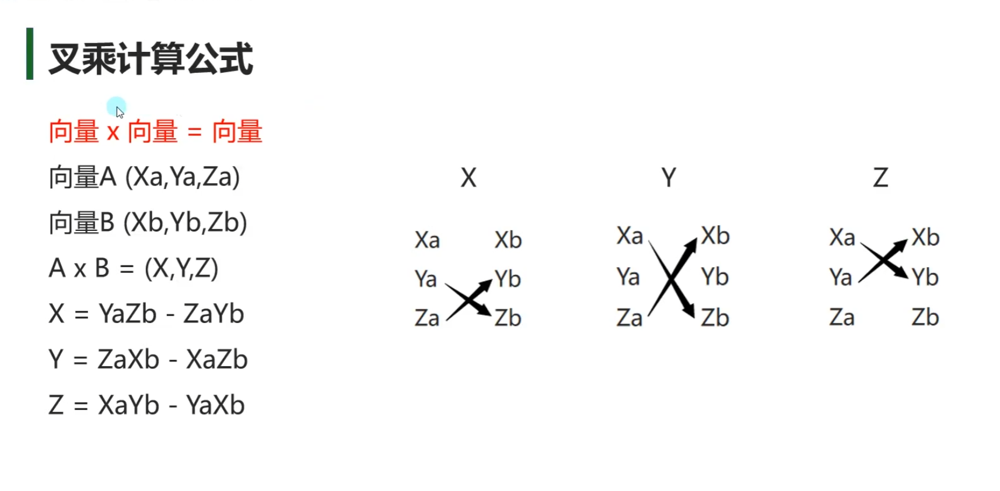
- **知识点一 叉乘计算**
    print(Vector3.Cross(A.position,B.position));
    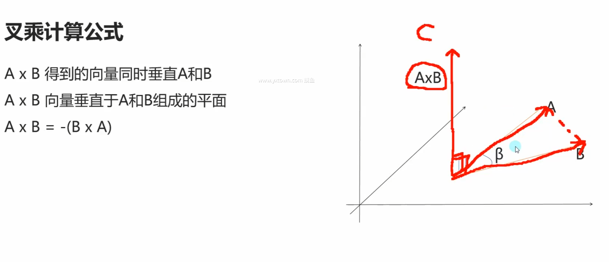
- **知识点二 叉乘的几何意义**
    假设向量 A和B 都在 XZ平面上
    向量A 叉乘 向量B
    y大于0 证明 B在A右侧
    y小于0 证明 B在A左侧


### 4. 向量差值运算

**线性差值**
==Vector3.Lerp(start , end , t);==
对两个点进行差值运算
t的取值范围为0~1

==公式== ： result = start + (end - start) * t

==应用== : 
1. 每帧改变start的值（先快后慢） start = Vector3.Lerp(start , end , t);
2. 每帧改变t的值（匀速） t += Time.deltaTime ; result = Vector3.Lerp(start , end , t);
- **知识点一 线性插值**
    result = start + (end - start) * t
    
    1. 先快后慢 每帧改变start位置 位置无限接近 但不会得到end位置
    `A.position =Vector3.Lerp(A.position,target.position,Time.deltaTime);`
    
    2. 匀速 每帧改变时间 当t>=1时 得到结果
    这种匀速移动 当time>=1时 改变目标位置后 它会直接瞬移到目标位置
    ```C#
    
    public Transform target; 
    public Transform A;
    public Transform B;
    private Vector3 startPos;
    private float time;
    private Vector3 nowTarget;
    
    if(nowTarget != target.position)
    {
        nowTarget = target.position;
        time = 0;
        startPos = B.position;
    }
    time += Time.deltaTime;
    A.position =Vector3.Lerp(startPos ,nowTarget,time);
    ```
    

**球形差值**
Vector3.Slerp(start,end,t);
对两个向量进行差值运算；
t的取值范围为0~1；

- **知识点二 球形差值**

```C#

public Transform C;

C.position = Vector3.Slerp(Vector3.right * 10 , Vector3.forward * 10 , time)
```

````ad-warning

如果想模拟太阳的东升西落这种运动 

需要在目标位置加上一个y轴的微小偏移量 来让代码判断是y轴平面转动

否则则会在X轴平面运动


    Vector3.Slerp(Vector3.right * 10,Vector3.left * 10 + Vector3.up * 0.01f , Time.deltaTime);
````

## 三、3D数学——四元数

### 1. 为何使用四元数

- # 欧拉角旋转约定
- heading-pitch-bank
- 是一种最常用的旋转序列约定
- Y-X-Z约定
- heading：物体绕自身的对象坐标系的Y轴，旋转的角度
- pitch：物体绕自身的对象坐标系的X轴，旋转的角度
- bank：物体绕自身的对象坐标系的Z轴，旋转的角度

- # Unity中的欧拉角
- Inspector窗口中调节的Rotation就是欧拉角
- this.transform.eulerAngles得到的就是欧拉角角度
    ==优点==：
    直观、易理解
    存储空间小（三个数表示）
    可以进行从一个方向到另一个方向旋转180度的角度
    ==缺点==：
    同一旋转的表示不唯一
    ==万向节死锁==
    当某个特定轴打到某个特殊值时
    绕一个轴旋转可能会覆盖住另一个轴的旋转
    从而失去一维自由度
    ==Unity中X轴达到90度时 会产生万向节死锁==


### 2.四元数是什么
- # 四元数概念
- 四元数是简单的超复数
- 由实数加上三个虚数单位组成
- 主要用于在三维空间中表示旋转

- # 四元数构成
- 一个四元数包含一个标量和一个3D向量
- [w,v],w为标量，v为3D向量
- [w,(x,y,z)]
- 对于给定的任意一个四元数：
- 表示3D空间中的一个旋转量

- # 轴-角对
- 在3D空间中，任意旋转都可以表示绕着某个轴旋转一个旋转角得到
````ad-danger

注意：该轴并不是空间中的x,y,z轴 而是任意一个轴
````

- 对于给定旋转，假设绕着n轴，旋转β度，n轴为(x,y,z)
- 那么可以构成四元数为
- 四元数Q = [cos(β/2),sin(β/2)]
- 四元数Q=[cos(β/2),sin(β/2)x,sin(β/2)y,sin(β/2)z]
    四元数Q则表示绕着轴n，旋转β度的旋转量

- # Unity中的四元数
- ## Quarternion
- 是Unity中表示四元数的结构体

- # Unity中的四元数初始化方法
- ## 轴角对公式初始化
- ### Q = p[cos(β/2),sin(β/2)x,sin(β/2)y,sin(β/2)z]
- ### Quarternion q = new Quarternion(sin(β/2)x,sin(β/2)y,sin(β/2)z,cos(β/2))

- ## 轴角对方法初始化
- 四元数Q = Quarternion.AngleAxis(角度，轴);
- Quarternion q = Quarternion.AngleAxis(60,Vector3.right)

### 3.四元数常用方法

- # 单位四元数
- 单位四元数表示没有旋转量（角位移）
- 当角度为0或者360度时
- 对于给定轴都会得到单位四元数

    [1,(0,0,0)]和[-1,(0,0,0)]都是单位四元数 表示没有旋转量
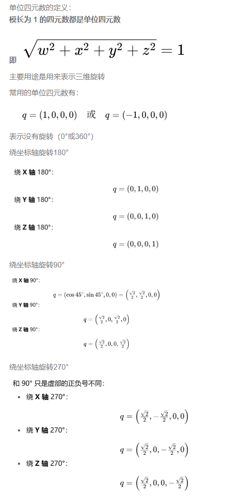


- # 四元数差值运算
- 四元数同样提供如同Vector3的差值运算
- Lerp和Slerp
````ad-tip

在四元数中Lerp和Slerp只有一些细微差别

由于算法不同 Slerp效果会好一些

Lerp的效果相比Slerp更快但是如果旋转范围较大效果较差
所以建议使用Slerp进行差值运算

````


- # 向量指向转四元数
````ad-tip
Quaternion.LookRotation(面朝向量)
````
- LookRotation方法可以将传入的面朝向量转换为对应的四元数角度信息(代码中如果要接收需要申明Quaternion类型的)

- 适用案例：人物面朝向改变时，传入目标面朝向得到目标四元数角度信息，之后将人物四元数角度信息改为得到的信息即可达到转向

### 4.四元数计算

- # 四元数相乘
- q3 = q1 * q2
- 两个四元数相乘得到一个新的四元数
- 代表两个旋转量的叠加
- 相当于旋转
````ad-warning
旋转相对的坐标系是 物体自身坐标系
````

- # 四元数乘向量
- v2 = q1 * v1
- 四元数乘向量返回一个新向量 
- ==可以将指定向量旋转对应四元数的旋转量==
- ==相当于旋转向量==

````ad-tip
四元数相乘——————角度叠加

四元数乘向量——————旋转向量
````


## 四、MonoBehavior中重要内容

### 1.延迟函数

- **知识点一 什么是延迟函数**
- 顾名思义就是延迟执行的函数
- 我们可以自己设定延时要执行的函数和具体延时的时间
- 是MonoBehaviour基类中实现好的方法

- **知识点二 延迟函数的使用**
- #### 1.延迟函数
- # Invoke
- #### 参数一 ： 函数名 字符串
- #### 参数二：  延迟时间 秒为单位
- `Invoke("",5);`

````ad-warning

1.延迟函数第一个参数传入的是函数名字符串

2.延迟函数没办法传入参数 只有包裹一层

3.函数名必须是该脚本上申明的函数
````
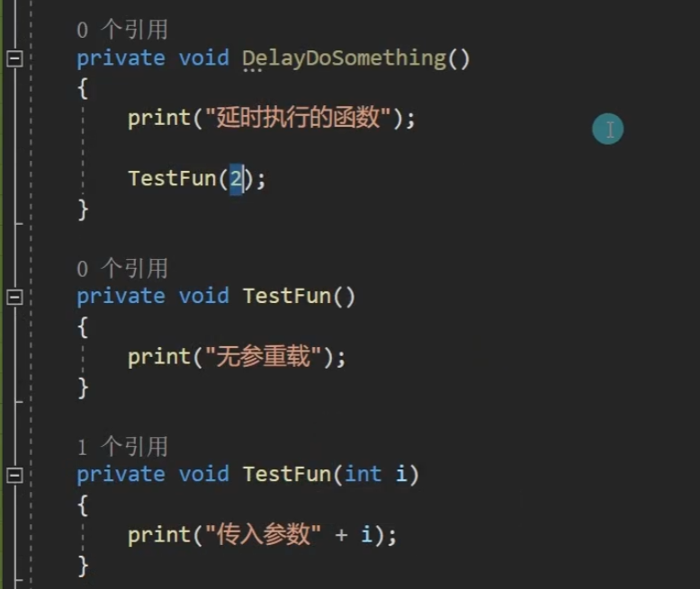

- #### 2.延迟重复执行函数
- # InvokeRepeating
- #### 参数一： 函数名字符串
- #### 参数二： 第一次执行的延迟时间
- #### 参数三： 之后每次执行的间隔时间

````ad-warning

1.延迟函数第一个参数传入的是函数名字符串

2.延迟函数没办法传入参数 只有包裹一层

3.函数名必须是该脚本上申明的函数
````

- #### 3.取消延迟函数
- #### 3-1 取消该脚本上的所有延迟函数执行
- # CancelInvoke();

- #### 3-2 指定函数名取消
- # CancelInvoke("函数名");

- #### 4.判断是否有延迟函数
- # if(IsInvoking());
- # if(IsInvoking("函数名"));

````ad-danger
失活脚本并不会导致延迟函数停止运行

除非将对象销毁 或 将脚本移除
````

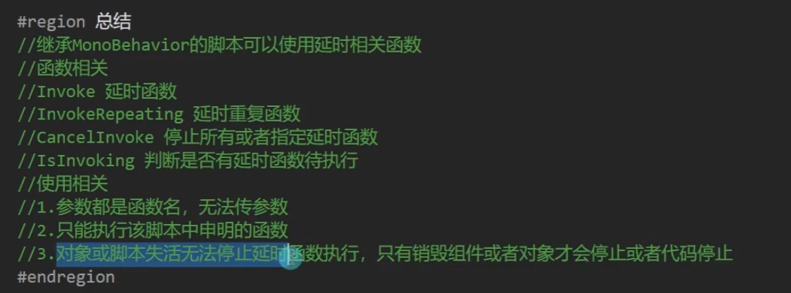


### 2.协同程序
- **知识点一** Unity是否支持多线程？
- ## Unity支持多线程
- ## 只是新开线程无法访问Unity相关内容的内容
````ad-warning

Unity中的多线程 要记住关闭(否则编辑器运行情况下 即使停止运行编辑器 线程任然在运行)

新线程无法访问Unity相关内容

````
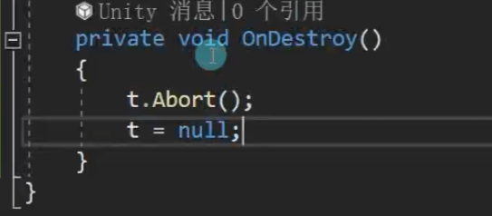

- **知识点二 协同程序是什么？**
- 简称"协程"  是"假"的多线程，不是多线程

- ==主要作用==： 将代码分时执行，不卡主线程   即把可能会让主线程卡顿的耗时的逻辑分时分布执行

- ==主要使用场景==： 

- 1.异步加载文件
- 2.异步下载文件 
- 3.场景异步加载
- 4.批量创建防止卡顿


- **知识点三 协同程序和线程的==区别==**

- 新开一个==线程==是==独立==的一个==管道==，和主线程 ==并行执行==
- 新开一个==协程==是是在==原线程之上==开启，进行==逻辑分时分步执行==

- **知识点四 协程的使用**
- 继承MonoBehavior的类 都可以开启 协程函数
- 第==一==步：==申明协程函数 ==
- 2个关键点： 1-1 返回值为IEnumerator类型及其子类
             1-2 函数中通过yield return 返回值；进行返回
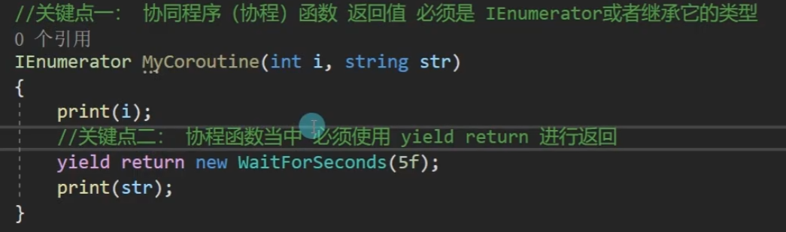
- 第==二==步：==开启协程函数==
- ==协程函数不能直接执行==  MyCoroutine(1,"123"); 没有任何效果
- ==常用开启方式==：
- #### StartCoroutine(MyCoroutine(1,"123"))

- #### IEnumerator ie = MyCoroutine(1,"123");
- #### Start#### StartCoroutine(ie);


- 第==三==步： ==关闭协程==
- #### 关闭所有： StopAllCoroutines();
- #### 关闭指定协程： StopCoroutine(c1);
 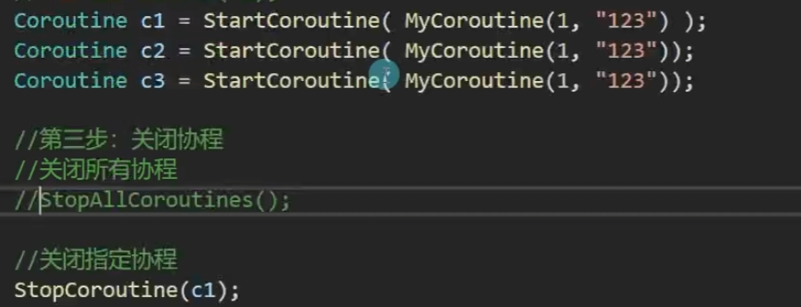

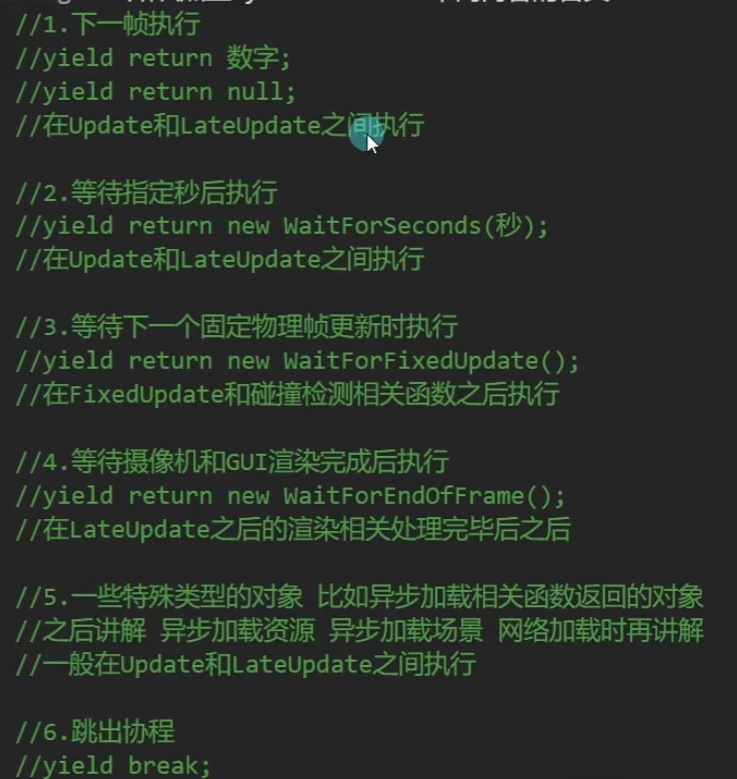

- **知识点六 协程受对象和组件失活销毁的影响**
````ad-warning

协程开启后

组件和物体销毁： 协程不执行

物体失活： 协程不执行 

组件失活： 协程执行
````


## 五、Resources资源动态加载

### 1.特殊文件夹

- **知识点一 工程路径获取**
- #### print(Application.dataPath);
````ad-warning
该方式获取到的路径 一般情况下只在 编辑模式下使用

游戏发布后 该路径就不存在了

````
- **知识点二 Resources资源文件夹**

- 路径获取：一般不获取
- 只能使用Resources相关API进行加载
- 硬要获取 可以用工程路径拼接
- #### print(application.dataPath + "/Resources");

- ==需要自己创建==
- 作用：
- 1-1 需要通过Resources相关API动态加载的资源需要放在其中
- 1-2 该文件夹下所有文件都会被打包出去
- 1-3 打包时Unity会对其压缩加密
- 1-4 该文件夹打包后只读 只能通过Resources相关API加载

- **知识点三 StreamingAssets 流动资源文件夹**
- 路径获取：
- print(Application.streamingAssetsPath);

- ==需要自己创建==
- 作用：
- 流文件夹
- 2-1 打包出去不会被压缩加密 
- 2-2 ==移动==平台==只读==，==pc==平台==可读可写==
- 2-3 可以放入一些需要自定义动态加载的初始资源

- **知识点四 persistentDataPath 持久数据文件夹**
- 路径获取：print(Application.persistentDataPath);

- ==不需要自己创建==
- 作用：
- 固定数据文件夹
- 3-1 所有平台都可读可写
- 3-2 一般用于动态下载或者动态创建的文件，游戏中创建或者获取的文件都放在其中

- **知识点五 plugins 插件文件夹**
- 路径获取：一般不获取

- ==需要自己创建==
- 作用
- 插件文件夹
- 4-1 不同平台的插件相关文件放在其中
- 4-2 比如IOS和Android平台

- **知识点六 Editor 编辑器文件夹**
- 路径获取：一般不获取

- ==需要自己创建==
- 作用：
- 编辑器文件夹
- 5-1 开发Unity编辑器时，编辑器相关脚本放在该文件夹中
- 5-2 该文件夹中内容不会被打包出去

- **知识点七 默认资源文件夹 Standard Assets**
- 路径获取：一般不获取

- ==需要自己创建==
- 作用：
- 一般Unity自带资源都放在这个文件夹下
- 代码和资源优先被编译

### 2.Resources 资源同步加载
- **知识点一 Resources资源动态加载的作用**
- 1. 通过代码动态加载Resources文件夹下指定路径资源
- 2.避免繁琐的拖曳操作

- **知识点二 常用资源类型**
- 1. 预设体对象——GameObject
- 2. 音效文件——AudioClip
- 3. 文本文件——TextAsset
- 4. 图片文件——Texture
- 5. 其他类型——需要什么用什么类型

````ad-warning
预设体对象加载需要实例化

其他资源加载一般直接用
````

- **知识点三 资源同步加载 普通方法**
- 在一个工程当中 Resources文件夹 可以有多个 通过API加载时 它会用这些同名的Resources文件夹中去找资源
- 打包时 Resources文件夹 里的内容 都会打包在一起


- 1.==预设体对象== 想要创建在场景上 记住实例化
- 第一步：要去加载预设体的资源文件（本质上就是  加载  配置数据  在内存中）
- #### Object obj = Resources.Load("Cube");
- 第二步：如果想要场景上 创建预制体 一定是加载配置文件后 然后实例化
- Instantiate(obj);

- 2.==音效资源==
- ```C#
  public AudioSource audioS;
  
  第一步：加载数据
  Object obj3 = Resources.Load(""Music/BKMusic);
  
  第二步：使用数据 我们不需要实例化音效切片 我们只需要把数据 赋值到正确的脚本上即可
  audioS.clip = obj3 as AudioClip;
  
  ```

- 3.==文本资源==
- 文本资源支持的格式
- .text
- .xml
- .bytes
- .json
- .html
- .csv
- ……

- TextAsset ta = Resources.Load("Txt/Test") as TextAsset;

- 文本内容
- print(ta.text)；
- 字节数据组
- print(ta.bytes);

- 4. ==图片==
- public Texture tex;
- tex = Resources.Load("Tex/TestJPG") as Texture;

- private void OnGUI()
- {
-    GUI.DrawTexture(new Rect(0,0,100,100),tex);
- }

- 5.==其他类型== 需要什么类型 就用什么类型就行


- 6.问题： ==资源同名怎么办？==
- Resources.Load加载同名资源时 无法准确加载出你想要的内容

- 可以使用另外的API
- 6-1 加载执行类型的资源
- public Texture tex;
- public TextAsset ta;
- tex = Resources.Load("Tex/TestJPG",typeof(Texture)) as Texture;
- ta = Resources.Load("Tex/TestJPG",typeof(TextAsset)) as TextAsset;

- 6-2加载指定类型的所有资源
- Object[] objs = Resources.LoadAll("Tex/TestJPG");
- foreach(Object item in objs)
- {
-   if(item is Texture)
-     {
- 
-     }
-   else if(item is TextAsset)
-     {
-     
-     }
- }

- **知识点四 资源同步加载 泛型方法**
- `TextAsset ta2 = Resources.Load<TextAsset>("Tex/TestJPG");`

### 3.Resources资源异步加载

- **知识点一 Resources异步加载是什么 **
- 同步加载中 如果加载过大的资源可能会造成程序卡顿
- 卡顿的原因是 从硬盘上把数据读取到内存中 是需要进行计算的
- 越大的资源耗时越长，就会造成掉帧卡顿

- Resources异步加载 就是内部新开一个线程进行资源加载 不会造成主线程卡顿

- **知识点二 Resources异步加载方法**
````ad-warning
异步加载 不能马上得到加载的资源 至少要等一帧
````

- 1. 通过异步加载中的完成事件监听 使用加载的资源
- 这句代码可以理解成 Unity内部开了一个线程进行资源下载
- ResourceRequest rq = Resources.LoadAsync《Texture>("Tex/TestJPG");
- 马上进行一个资源下载结束的一个事件函数监听
- rq.conpleted += LoadOver;
- print(Time.frameCount);
````ad-warning
刚刚执行了异步加载的执行代码 资源还没加载完毕 这样用是不对的
一定要加载结束过后后才能用

```
rq.asset xxxxxxxxxx
```
````

- ```C#
  private void LoadOver(AsyncOperation rq)
  {
      print("加载结束");
      asset 是资源对象 加载完毕后 就能得到它
      tex = (rq as ResourcesRequest).asset as Texture;
      print(Time.frameCount);
  }
  ```


- 2.通过协程 使用加载的资源 
StartCoroutine(Load());


- ```C#
  IEnumerator Load()
  {
      迭代器函数 当遇到yield return时 就会停止执行之后的代码
      然后 协程协调器 通过得到 返回的值 去判断 下一次执行后面的步骤 将会是何时
      
      ResourceRequest rq = Resources.LoadAsync<Texture>("Tex/TestJPG");
      //第一部分
      //Unity自己知道 该返回值意味着你在异步加载资源
      //yield return eq;
      //Unity会自己判断 该资源是否加载完毕了 加载完毕过后 才会继续执行后面的代码
      
      //tex = rq.asset as Texture;
      
      //判断资源是否加载结束
      while(!rq.isDone)
      {
          //打印当前进度
          //该进度 不会特别准确 过度也不是特别明显
          print(rq.progress);
          yield return null; //每帧判断是否结束 打印进度
      }
      
      yield return null;
      //第二部分
      yield return new waitForSeconds;
      //第三部分
      
  }
  ```
  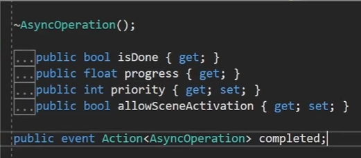

````ad-tip
# 总结

1. 完成事件监听异步加载
   ==好处== ： 写法简单
   ==坏处== ： 只能在资源加载结束后 进行处理
   "线性加载"

2. 协程异步加载
   ==好处== ： 可以在协程中处理复杂逻辑，比如同时加载多个资源，比如进度条更新
   ==坏处== ： 写法稍麻烦
   "并行加载"
   
   ==注意==：
   理解为什么异步加载不能马上加载结束，为什么至少要等一帧
   理解协程异步加载的原理
````

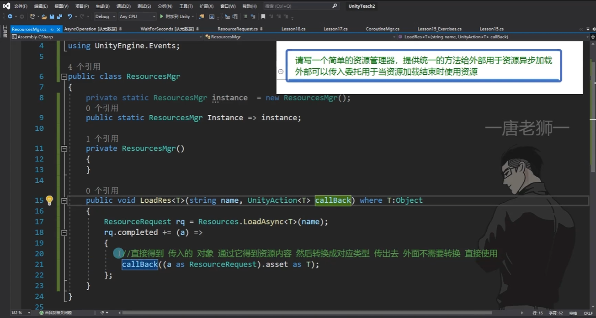

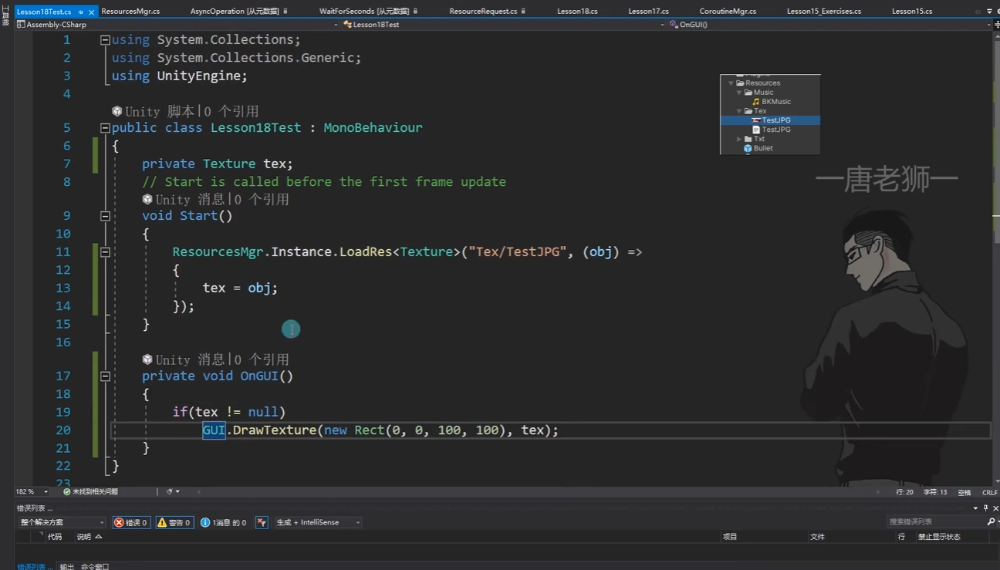

### 4.Resources卸载资源

- **知识点一 Ressources重复加载资源会浪费内存吗？**
- Resources加载一次资源过后 该资源就一直存放在内存中作为缓存
- 第二次加载时发现缓存中存在该资源 会直接取出来进行使用
- 所以==多次重复加载不会浪费内存== 但是==会浪费性能==（每次加载都会去查找取出 始终伴随一些性能消耗）

- **知识点二 如何手动释放掉缓存中的内存**
- 1. 卸载指定资源
- Resources.UnloadAsset 方法

````ad-warning
该方法不能释放GameObject对象 因为它会用于实例化对象

它只能用于一些 不需要实例化的内容 比如 图片 和 音效 文本等

一般情况下很少单独使用它
````

- 2. 卸载未使用的资源
````ad-warning
一般在过场景和GC一起使用
````

Resources.UnloadUnusedAsset();
GC.Collect();

## 六、场景异步切换
### 场景异步加载

- **知识点一 回顾场景同步切换**
- SceneManager.LoadScene("Test");
- 在切换场景时
- Unity会删除当前场景上所有对象
- 并且去加载下一个场景的相关信息
- 如果当前场景 对象过多或者下一个场景对象过多
- 这个过程会非常的耗时 会让玩家感受到卡顿

- 异步切换就是来解决该问题的

- **知识点二 场景异步切换**
- 场景异步加载和资源异步加载 几乎一致 有两种方式

- 1. 通过事件回调函数 异步加载
- AsyncOperation ao = SceneManager.LoadSceneAsync("Test");
- 当场景异步加载结束后 就会自动调用该事件函数 我们如果希望在加载结束后 做一些事情 那么就可以在该函数中 写处理逻辑
- `ao.completed +=(a) =>`
- `{`
-   `print("LoadOver");`
- `};`
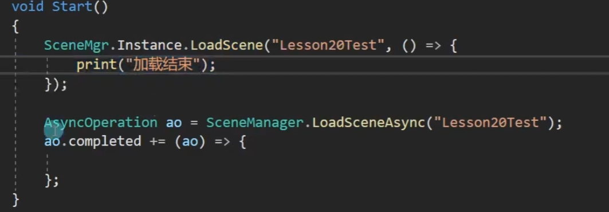

- ```C#
  public void LoadScene(string name, UnityAction action)
  {
   AsyncOperation ao = SceneManager.LoadSceneAsync(name);
   ao.completed +=(a) =>
   {
    action();
   };
  }
  ```


- 2.通过协程异步加载
- 需要注意的是 加载场景会把当前场景上 没有特别处理的对象 都删除了
- 所以 协程中的部分逻辑 可能是执行不了的
- 解决思路： 让处理场景加载的脚本依附的对象 过场景时 不被移出

- StartCoroutine(LoadScene("Test"));


- ```C#
  IEnumerator LoadScene(string name)
  {
   //第一步
   //异步加载场景
   AsyncOperation ao =SceneManager.LoadSceneAsync(name);
   //Unity内部的 协程协调器 发现是异步加载类型的返回类型 那么就会等待
   //携程的好处是 异步加载场景时 我们可以在加载的同时 做一些别的逻辑
   yield return ao;
  }
  ```


## 七、LineRenderer

### LineRenderer

- **知识点一 LineRenderer是什么**
- LineRenderer是Unity提供的一个用于画线的组件
- 使用它我们可以在场景中绘制线段
- 一般可以用于
- 1、绘制攻击范围
- 2、武器红外线
- 3、辅助功能
- 4、其它画线功能

- **LineRenderer参数相关**
- 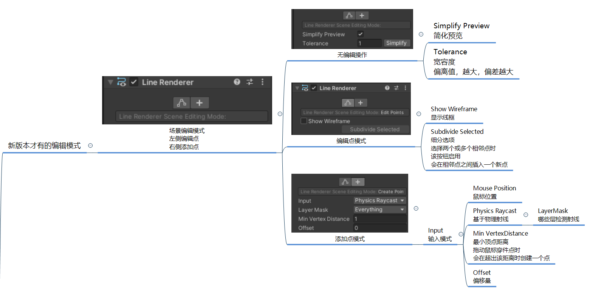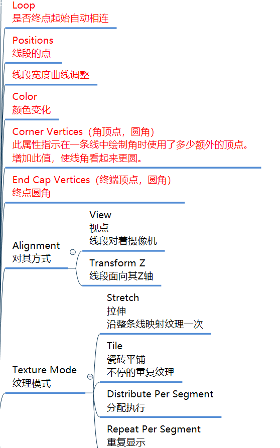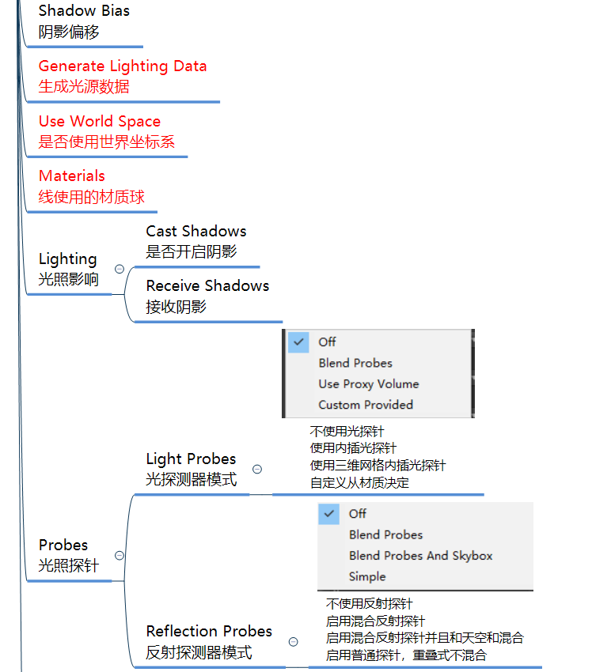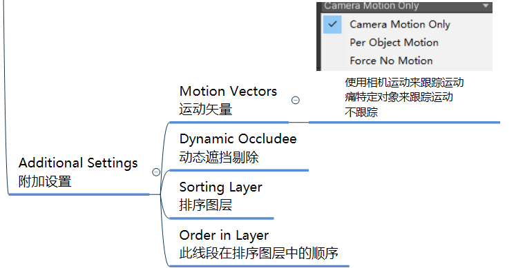

- **知识点三 LineRenderer代码相关**
- //==动态添加一个线段==
- GameObject line = new GameObject();
- line.name = "Line";
- LineRenderer lineRenderer = line.AddComponent\<LieneRenderer>();

- //==首尾相连==
- LineRenderer.loop = true;

- //==开始结束宽==
- LineRenderer.startWidth = 0.02f;
- LineRenderer.endWidth = 0.02f;

- //==开始结束颜色==
- LineRenderer.startColor = Color.white;
- LineRenderer.endColor = Color.red;

- //==设置材质==
- ```C#
  private Material m;
  ```
- m = Resources.Load\<Material>("M");
- lineRenderer.material = m;

- //==设置点 ==
- 一定要注意 设置点 要先设置点的个数
- lineRenderer.positionCount = 4;
- //接着就设置 对应每个点的位置
- `lineRender.SetPositions(new Vector3[] {`new Vector3(0,0,0);
-                                                      new Vector3(0,0,5);
-                                                      new Vector3(5,0,5);`})`//设置多个点
- lineRender.SetPosition(3, new Vector3(5,0,0));//按索引设置单个点

- //==是否使用世界坐标系==
- //决定了 是否随对象移动而移动
- lineRenderer.useWorldSpace = false;

- //==让线段受光影响 会接受光数据 进行着色器计算==
- lineRenderer.generateLightingData = true;
## 八、物理系统之范围检测

### 范围检测

- **知识回顾 物理系统之碰撞检测**
- 碰撞产生的必要条件
- 1. 至少一个物体有刚体
- 2. 连个物体都必须有碰撞器

- 碰撞和触发
- //碰撞会产生实际的物理效果
- //触发看起来不会产生碰撞但是可以通过函数监听触发

- //碰撞检测主要用于实体物体之间产生物理效果时使用


- **知识点一 什么是范围检测**
- //游戏中瞬时的攻击范围判断一般会使用范围检测
- 举例：
- 1. 玩家在前方5m处释放一个地刺魔法，在此范围内的对象将收到地刺伤害
- 2. 玩家攻击，在前方1米圆形范围内对象都受到伤害

- 类似这种没有实体物体 只想要检测在某指定某一范围是否让敌方收到伤害时 便可以使用范围判断
- 简而言之
- 在指定位置 进行 范围判断 我们可以得到处于指定范围内的 对象
- 目的是 对对象进行处理
- 比如 受伤 减血 等等

- **知识点二 如何进行范围检测**
- 必备条件: 想要被检测范围检测到的对象 必须具备碰撞器
````ad-warning

1. 范围检测相关API 只有当执行该句代码时 进行一次范围检测 它是瞬时的
   
2. 范围检测相关API 并不会真正产生一个碰撞器 只是碰撞判断计算而已
   


````

- 范围检测相关API

- 1.盒装范围检测
- //参数一：立方体中心点
- //参数二：立方体三边大小(半尺寸 即x,y,z方向长度的一半)
- //参数三：立方体角度
- //参数四：检测指定层级（不填检测所有层）
- //参数五：是否忽略触发器 UseGlobal-使用全局设置 Collide-检测触发器 Ignore-忽略触发器 不填使用UseGlobal
- //返回值: 在该范围内的触发器（得到了对象触发器就可以得到对象的所有信息）
- ### Collider[] colliders = Physics.OverlapBox(Vector3.zero,Vector3.one,1 <<LayerMask.NameToLayer("UI")|
- ### 1 << LayerMask.NameToLayer("Default"),QueryTriggerInteration.UseGlobal);

- ```C#
  for(int i =0; i < collider.Length; i++)
  {
      print(colliders[i].gameObject.name);
  }
  ```

````ad-tip
唯独不检测某一个层级的方法：


````

````ad-tip
//重要知识点：

//关于层级

//通过名字得到层级编号 LayerMask.NameToLayer

//我们需要通过编号左移构建二进制数

//这样每一个编号的层级 都是对应为1的2进制数

//我们通过 位运算 可以选择想要检测层级

//好处是 一个int 就可以表示所有想要检测的层级信息

//层级编号是 0~31 刚好32位

//是一个int数

//每一个编号 代表的 都是二进制的一位


````

- //另一个API
- //返回值：碰撞到的碰撞器数量
- //参数：传入一个数组进行存储
- physics.OverlapBoxNonAlloc()
- if(physics.OverlapBoxNonAlloc(Vector3.zero,Vector3.one,Colliders) ! =0){};

- 2.球形范围检测
- //参数一：中心点
- //参数二：球半径
- //参数三：检测指定层级（不填检测所有层）
- //参数四：是否忽略触发器 UseGlobal - 使用全局设置 Collide-检测触发器 Ignore-忽略触发器 不填使用UseGlobal
- //返回值：在该范围的触发器（得到了对象触发器就可以得到对象的所有信息）
- //physics.OverlapSphereNonAlloc(Vector3.zero,)

- //另一个API
- //返回值：碰撞到的碰撞器数量
- //参数：传入一个数组进行存储
- physics.OverlapSphereNonAlloc()
- if(physics.OverlapSphereNonAlloc(Vector3.zero,5,Colliders) ! =0){};


- 3.胶囊范围检测
- //参数一：半圆一中心点
- //参数二：半圆二中心点
- //参数三：半圆半径
- //参数四：检测指定层级（不填检测所有层）
- //参数五：是否忽略触发器 UseGlobal - 使用全局设置 Collide-检测触发器 Ignore-忽略触发器 不填使用UseGlobal
- //返回值：在该范围的触发器（得到了对象触发器就可以得到对象的所有信息）
- //physics.OverlapCpasule(Vector3.zero,Vector3.up,1,1<<LayerMask.NameToLayer("UI"),QueryTriggerInteration.UseGlobal)

- //另一个API
- //返回值：碰撞到的碰撞器数量
- //参数：传入一个数组进行存储
- physics.OverlapCpasule()
- if(physics.OverlapCpasuleNonAlloc(Vector3.zero,5,Colliders) ! =0){};

## 九、物理系统之射线检测

### 射线检测

- **知识点一 什么是射线检测**
- //物理系统中 //目前我们学习的物体相交判断
- //1.碰撞检测——必备条件 1刚体2碰撞器
- //2.范围检测——必备条件 碰撞器
  
- //如果想要做这样的碰撞检测呢？
- //1.鼠标选择场景上一物体
- //2.FPS射击游戏（无弹道-不产生实际的子弹对象进行移动）
- //等等 需要判断一条线和物体的碰撞情况
  
- //射线检测 就是来解决这些问题的
- //它可以在指定点发射一个指定方向的射线
- //判断该射线与哪些碰撞器相交，得到对应对象

- **知识点二 射线对象**
- //1.3D世界中的射线
- //假设有一条起点为坐标(1,0,0)
- //方向为世界坐标Z轴正方向的射线 
````ad-warning
注意:
  
理解参数含义  
  
参数一：起点  
  
参数二：方向（一定记住 不是两点决定射线方向，第二个参数 直接就代表方向向量）  
````
  
//目前只是申明了一个射线对象 对于我们来说 没有任何的用处
- ### Ray r = new Ray(Vector3.right, Vector3.forward);
  
//==Ray中的参数==
- #### print(r.origin);//==起点==
- #### print(r.direction);//==方向==
  
- //2.摄像机发射出的射线
- // 得到一条从屏幕位置作为起点 
- // 摄像机视口方向为 方向的射线 
- #### Ray r2 = Camera.main.ScreenPointToRay(Input.mousePosition);
  
````ad-warning
注意： 

单独的射线对于我们来说没有实际的意义 

我们需要用它结合物理系统进行射线碰撞判断
````


- **知识点三 碰撞检测函数**
- //Physics类中提供了很多进行射线检测的静态函数 
- //他们有很多种重载类型 我们只需要掌握核心的几个函数 其它函数自然就明白什么意思了 

````ad-warning
注意：

 //射线检测也是瞬时的 
 
//执行代码时进行一次射线检测 

````

  
- //1.最原始的==射线检测==
- // ==准备一条射线==
- Ray r3 = new Ray(Vector3.zero, Vector3.forward);
- // 进行射线检测 如果碰撞到对象 返回true 
- //参数一：射线 
- //参数二: 检测的最大距离 超出这个距离不检测 
- //参数三：检测指定层级（不填检测所有层） 
- //参数四：是否忽略触发器 UseGlobal-使用全局设置 Collide-检测触发器 Ignore-忽略触发器 不填使用UseGlobal 
- //返回值：bool 当碰撞到对象时 返回 true 没有 返回false 
- if (Physics.Raycast(r3, 1000, 1 << LayerMask.NameToLayer("Monster"), QueryTriggerInteraction.UseGlobal)) 
- { 
-   print("碰撞到了对象"); 
- } 

- //还有一种重载 ==不用传入 射线== 直接==传入起点 和 方向== 也可以用于判断 
- //就是把 第一个参数射线 变成了 射线的 两个点 一个起点 一个方向 
- if (Physics.Raycast(Vector3.zero, Vector3.forward, 1000, 1 << LayerMask.NameToLayer("Monster"), QueryTriggerInteraction.UseGlobal)) 
- { 
-   print("碰撞到了对象2"); 
- } 

- //2.==获取相交的单个物体信息 ==
- //==物体信息类 RaycastHit==
- RaycastHit hitInfo; 
- //参数一：射线 
- //参数二：RaycastHit是结构体 是值类型 Unity会通过out 关键在 在函数内部处理后 得到碰撞数据后返回到该参数中 
- //参数三：距离 
- //参数四：检测指定层级（不填检测所有层） 
- //参数五：是否忽略触发器 UseGlobal-使用全局设置 Collide-检测触发器 Ignore-忽略触发器 不填使用UseGlobal 
- if( Physics.Raycast(r3, ==out hitInfo==, 1000, 1<<LayerMask.NameToLayer("Monster"), QueryTriggerInteraction.UseGlobal) ) 
- { 
- print("碰撞到了物体 得到了信息"); 
  
- //==碰撞器信息 ==
- print("碰撞到物体的名字" + hitInfo.collider.gameObject.name); 
- //碰撞到的==点 ==
- print(hitInfo.point); 
- //==法线==信息 
- print(hitInfo.normal); 
  
- //得到碰撞到==对象的位置 ==
- print(hitInfo.transform.position); 
  
- //得到碰撞到==对象== ==离自己的距离 ==
- print(hitInfo.distance); 
  
- //RaycastHit 该类 对于我们的意义 
- //它不仅可以得到我们碰撞到的对象信息 
- //还可以得到一些 碰撞的点 距离 法线等等的信息 

  
- //还有一种重载 不用传入 射线 直接传入起点 和 方向 也可以用于判断 
- if (Physics.Raycast(Vector3.zero, Vector3.forward, out hitInfo, 1000, 1 << LayerMask.NameToLayer("Monster"), QueryTriggerInteraction.UseGlobal)) 
- { 
- } 
  
- //3.==获取相交的多个物体 ==
- //可以得到碰撞到的多个对象 
- //如果没有 就是容量为0的数组 
- //参数一：射线 
- //参数二：距离 
- //参数三：检测指定层级（不填检测所有层） 
- //参数四：是否忽略触发器 UseGlobal-使用全局设置 Collide-检测触发器 Ignore-忽略触发器 不填使用UseGlobal 
- RaycastHit[] hits = ==Physics.RaycastAll==(r3, 1000, 1 << LayerMask.NameToLayer("Monster"), QueryTriggerInteraction.UseGlobal); 
- for (int i = 0; i < hits.Length; i++) 
- { 
-     print("碰到的所有物体 名字分别是" + hits[i].collider.gameObject.name); 
- } 
  
- //还有一种重载 不用传入 射线 直接传入起点 和 方向 也可以用于判断 
- //之前的参数一射线 通过两个点传入 
- hits = Physics.RaycastAll(Vector3.zero, Vector3.forward, 1000, 1 << LayerMask.NameToLayer("Monster"), QueryTriggerInteraction.UseGlobal); 

- //还有一种函数 返回的碰撞的数量 通过out得到数据 
- if(Physics.RaycastNonAlloc(r3, hits, 1000, 1 << LayerMask.NameToLayer("Monster"), QueryTriggerInteraction.UseGlobal) > 0 ) 
- { 
  
- } 


  
- **知识点四 使用时注意的问题** 
- //注意： 
- //距离、层级两个参数 都是int类型 
- //当我们传入参数时 一定要明确传入的参数代表的是距离还是层级 
- //举例 
- //这样写是错误的 因为第二个参数 代表的是距离 不是层级 
- if(Physics.Raycast(r3, 1000, 1 << LayerMask.NameToLayer("Monster"))) 
- { 
  
- }
