## 一、概述


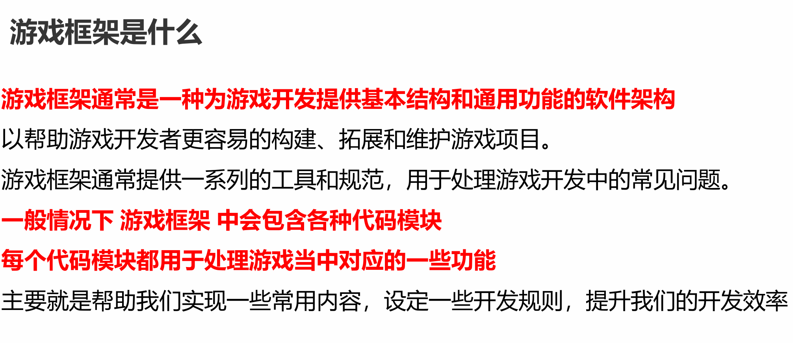
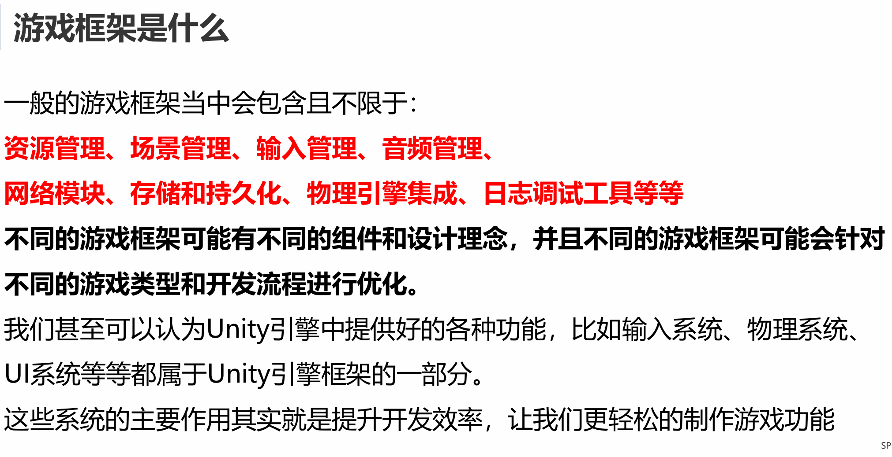


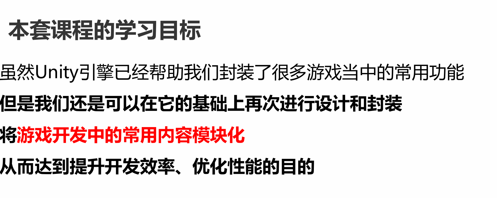
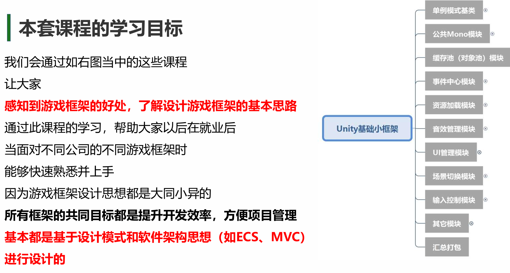


## 二、单例模式基类

#### 1.不继承MonoBehaviour的单例模式基类

##### 本节课使用的知识点 

- 大体知识体系 
- C#相关知识点（C#四部曲） 
  
- 细节知识点 
- 1.面向对象（C#四部曲C#核心中） 
- 2.静态、单例模式相关知识（C#四部曲之C#核心中） 
- 3.泛型、泛型约束相关知识点（C#四部曲之C#进阶中）

#####  知识点一 为什么要写单例模式基类 

- 用面向对象的思想避免代码冗余（多余、重复）

##### 知识点二 实现不继承MonoBehaviour的单例模式基类


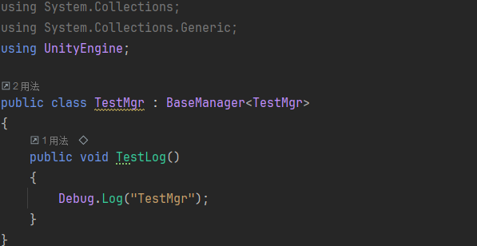

##### 知识点三 潜在的安全问题 

- 1.构造函数问题：构造函数可在外部调用 可能会破坏唯一性 
- 2.多线程问题：当多个线程同时访问管理器时，可能会出现共享资源的安全访问问题

````ad-tip
此处可以直接实例化TestMgr类 不符合单例模式思想
````

##### 总结 

- 利用泛型相关知识 
- 实现单例模式基类 
- 可能存在的安全问题 
- 我们在之后的课程中专门讲解

#### 2.继承MonoBehavior的单例模式基类

##### 本节课使用的知识点 

- 大体知识体系 
- C#相关知识点（C#四部曲） Unity相关知识点（Unity四部曲） 
  
- 细节知识点 
- 1.上节课的相关细节知识点 
- 2.MonoBehaviour相关知识点（Unity四部曲之Unity入门中）

##### 知识点一 实现继承MonoBehaviour的单例模式基类的注意事项 

- 重要的事情说三边 
- 继承MonoBehaviour的脚本不能new！ 
- 继承MonoBehaviour的脚本不能new！ 
- 继承MonoBehaviour的脚本不能new！ 
  
- 继承MonoBehaviour的脚本一定得依附在GameObject上 
- 继承MonoBehaviour的脚本一定得依附在GameObject上 
- 继承MonoBehaviour的脚本一定得依附在GameObject上

##### 知识点二 实现挂载式的单例模式基类 

- 这种方式不建议大家使用 
- 因为很容易被破坏单例模式的唯一性 
- 1.挂载多个脚本 
- 2.切换场景回来时，由于场景放置了挂载脚本的对象，回到该场景时 又会有一个该单例模式对象 
- 3.还可以通过代码动态的添加多个该脚本 也会破坏唯一性

##### 知识点三 实现自动挂载式的单例模式基类


##### 知识点四 潜在的安全问题 

- 1.构造函数问题： 
-   继承MonoBehaviour的函数，不能new，所以不用担心公共构造函数 
- 2.多线程问题： 
-   Unity主线程中相关内容，不允许其他线程直接调用，很少有这样的需求，所以也不用太担心 
- 3.重复挂载问题： 
-   1.手动重复挂载 
-   2.代码重复添加 
-   需要人为干涉，定规则，或者通过代码逻辑强制处理

##### 总结 

- 继承MonoBehaviour的单例模式对象 
- 建议大家使用自动挂载式的方案 
  
- 继承MonoBehaviour的单例模式对象 
- 潜在的安全问题相对较小，制定好规则后可以忽略不计

#### 3.【安全问题】唯一性问题——构造函数

##### 本节课使用的知识点 

- 细节知识点 
- C#中抽象类的知识点（C#四部曲之C#核心） 
- C#中反射相关知识点（C#四部曲之C#进阶）

##### 知识点一 构造函数带来的唯一性问题指什么？ 

- 1.对于不继承MonoBehaviour的单例模式基类 
-   我们要避免在外部 new 单例模式类对象 
  
- 2.对于继承MonoBehaviour的单例模式基类 
-   由于继承MonoBehaviour的脚本不能通过new创建，因此不用过多考虑

##### 知识点二 解决构造函数带来的安全问题 

- 1.父类变为抽象类 
  
- 2.规定继承单例模式基类的类必须显示实现私有无参构造函数 
  
- 3.在基类中通过反射来调用私有构造函数实例化对象 
-   主要知识点： 
-   利用Type中的 GetConstructor(约束条件, 绑定对象, 参数类型, 参数修饰符)方法 
-   来获取私有无参构造函数 
-   *ConstructorInfo constructor = typeof(T).GetConstructor(* 
-   *BindingFlags.Instance | BindingFlags.NonPublic,* //表示成员私有方法 
-     *null,*                                         //表示没有绑定对象 
-     *Type.EmptyTypes,*                   //表示没有参数 
-     *null);*                                        //表示没有参数修饰符
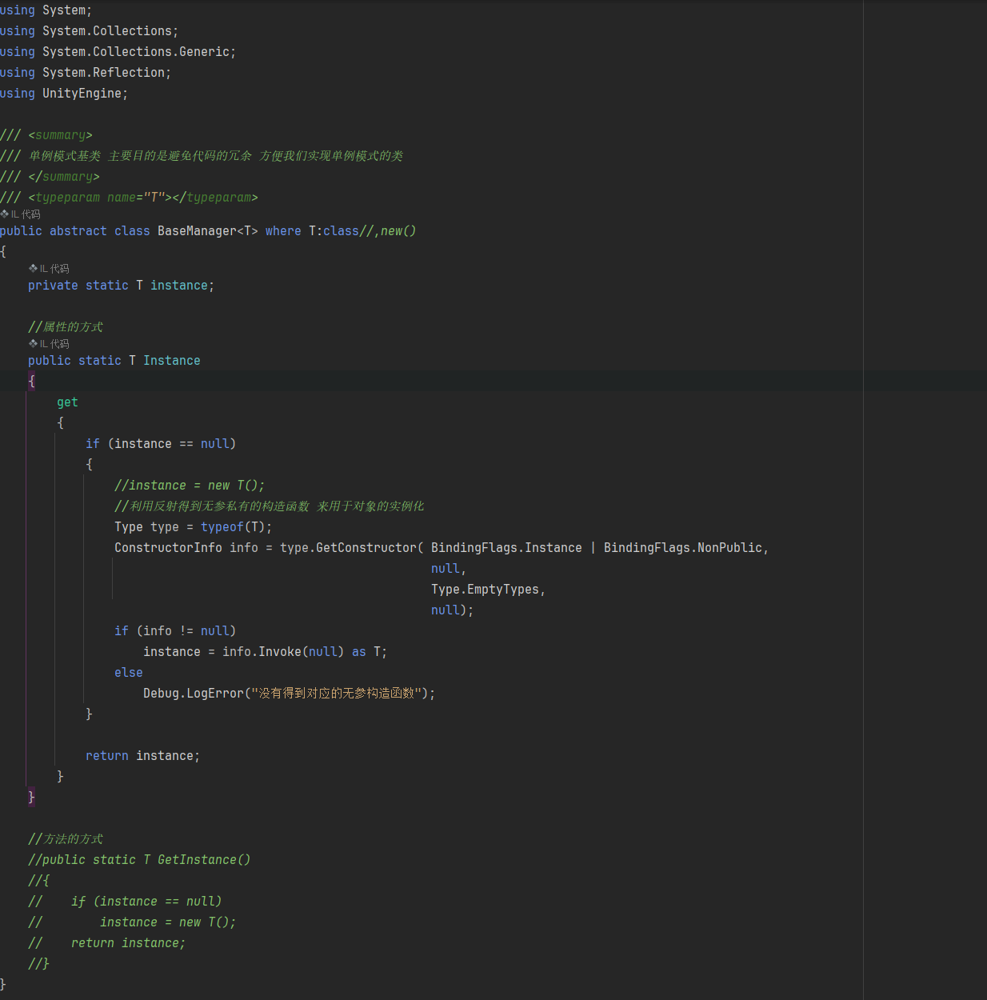

##### 总结 

- 虽然公共构造函数可能给我们带来破坏唯一性的安全隐患 
- 但是在实际开发中 
- 单例模式是非常基础的知识点 
- 可以说是程序员的必备基础知识 
- 在使用时几乎不会有人马虎到自己去new单例模式对象 
  
- 因此即使我们不做这些安全性的处理 
- 其实也不会有太大问题 
- 根据实际情况和需求进行设计即可

#### 4.【安全问题】唯一性问题——重复挂载

##### 本节课使用的知识点 

- 细节知识点 
- Unity中Destroy函数（Unity四部曲Unity入门） 
- Unity中特性相关知识（Unity四部曲Unity入门）

##### 知识点一 重复挂载带来的唯一性问题指什么？ 

- 对于继承MonoBehaviour的挂载式的单例模式基类 
- 1.手动挂载多个相同单例模式脚本 
- 2.代码动态添加多个相同单例模式脚本

##### 知识点二 解决重复挂载带来的安全问题 

- 对于挂载式的单例模式脚本 
- 1.同个对象的重复挂载 
-   为脚本添加特性[DisallowMultipleComponent] 

````ad-tip

这个特性无法判断再添加特性前  本身已经挂载了多个脚本的情况

也无法判断 另一个对象上后续也挂载了同样脚本的情况(另一个对象上第二次挂载会提示) 

所以本质上属于治标不治本 
````
  
- 2.修改代码逻辑 
-   判断如果存在对象，移除脚本 
  
````ad-tip
这里Destroy的是this代表只销毁脚本本身
````
- 对于自动挂载式的单例模式脚本 
-   制定使用规则，不允许手动挂载或代码添加

##### 总结 

- 为了避免重复挂载我们一般采用以下几种方案： 
  
- 1.对于挂载式的单例模式基类，相同对象上重复挂载问题，通过添加特性解决 
- 2.对于挂载式的单例模式基类，不同对象上的重复挂载，通过逻辑判断，代码移除多余的脚本 
  
- 3.最好的避免重复挂载的方式，就是使用自动挂载式的单例模式基类，并且制定使用规则（不允许手动挂载和代码添加）

#### 5.【安全问题】线程安全——是否加锁

##### 本节课使用的知识点 
- 细节知识点 
- C#中多线程相关知识点（C#四部曲C#进阶）

##### 知识点一 是否加锁问题指什么？ 

- 如果程序当中存在多线程 
- 我们需要考虑当多个线程同时访问同一个内存空间时出现的问题 
- 如果不加以控制，可能会导致数据出错 
- 我们一般称这种问题为多线程并发问题，指多线程对共享数据的并发访问和操作。 
  
- 而一般解决该问题的方式，就是通过C#中的lock关键字进行加锁 
- 我们需要考虑我们的单例模式对象们是否需要加锁(lock) 
  
- lock 的原理保证了在任何时刻只有一个线程能够执行被锁保护的代码块 
- 从而防止多个线程同时访问或修改共享资源，确保线程安全

##### 知识点二 解决多线程并发来带的问题 

- 1.不继承MonoBehaviour的单例模式 
-   建议加锁，避免以后使用多线程时出现并发问题 
-   比如在处理网络通讯模块、复杂算法模块时，经常会进行多线程并发处理 
  
- 2.继承MonoBehaviour的单例模式 
-   可加可不加，但是建议不加。 
-   因为Unity中的机制是，Unity主线程中处理的一些对象（如GameObject、Transform等等） 
-   是不允许被其他多线程修改访问的，会直接报错 
-   因此我们一般不会通过多线程去访问继承MonoBehaviour的相关对象 
-   既然如何，就不会发生多线程并发问题
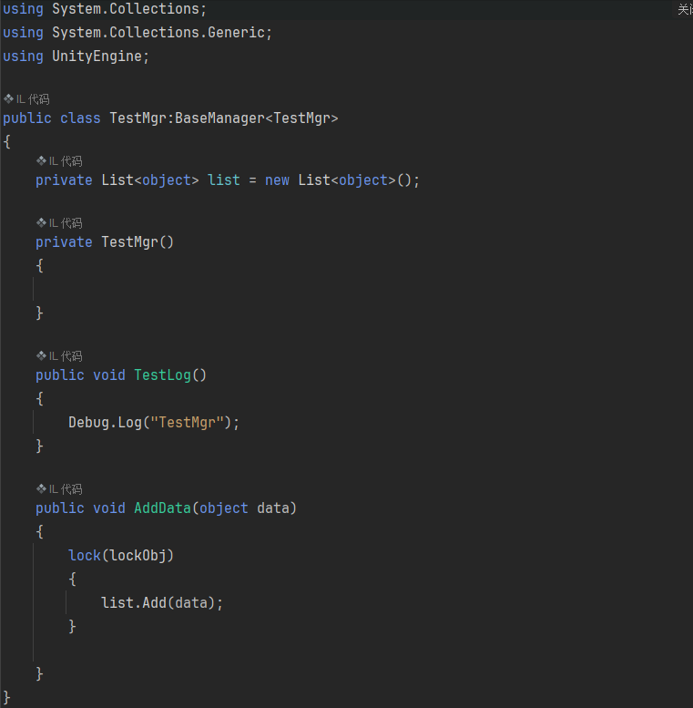

````ad-tip
假使加锁之后不进行判空 可能会出现线程先执行另一边的创建实例 而这边在等待解锁 在解锁后最终实例两遍的情况
````
##### 总结 

- 对于不继承MonoBehaviour的单例模式对象 
- 建议加锁 
- 对于继承MonoBehaviour的单例模式对象 
- 可以不加 
  
- 但是具体是否加锁，都根据需求来定 
- 如果你的项目中压根就不会使用多线程 
- 那么完全可以不用考虑加锁问题

## 三、公共Mono模块

#### 1.【公共Monno】模块主要作用和基本原理

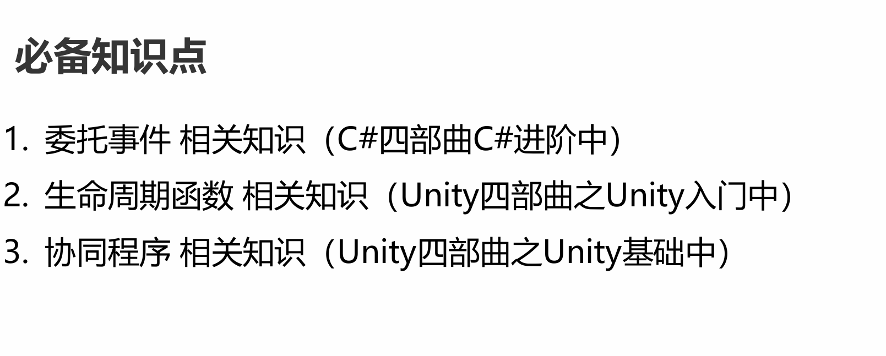
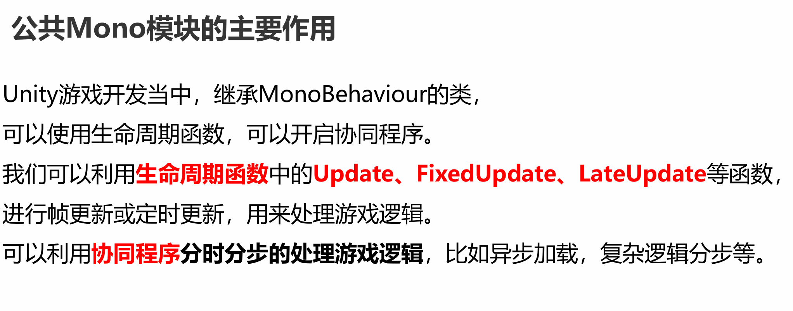


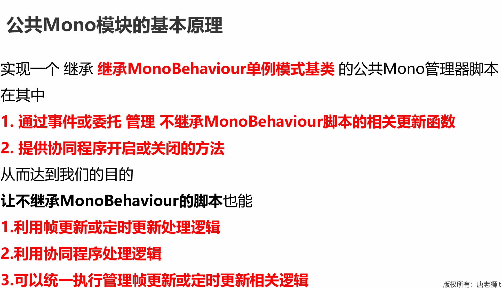
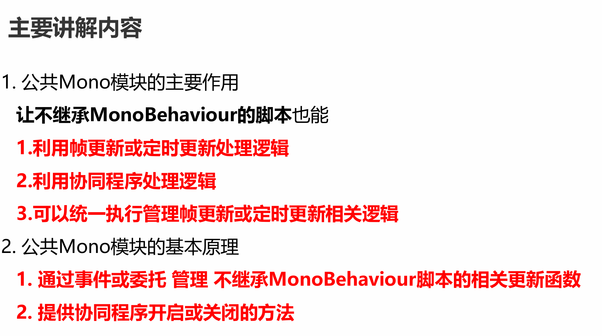

#### 2.【公共Mono模块】具体实现

##### 要内容回顾 

- 制作公共Mono模块必备知识点 
- 1.委托事件 相关知识（C#四部曲C#进阶中） 
- 2.生命周期函数 相关知识（Unity四部曲之Unity入门中） 
- 3.协同程序 相关知识（Unity四部曲之Unity基础中 
  
- 公共Mono模块的主要作用 
- 让不继承MonoBehaviour的脚本也能 
- 1.利用帧更新或定时更新处理逻辑 
- 2.利用协同程序处理逻辑 
- 3.可以统一执行管理帧更新或定时更新相关逻辑(不管你是否继承MonoBehaviour) 
  
- 公共Mono模块的基本原理 
- 1.通过事件或委托 管理 相关更新函数 
- 2.提供协同程序开启或关闭的方法

##### 知识点一 实现公共Mono模块 

- 1.创建MonoMgr继承 自动挂载式的继承MonoBehaviour的单例模式基类 
- 2.实现Update、FixedUpdate、LateUpdate生命周期函数 
- 3.声明对应事件或委托用于存储外部函数，并提供添加移除方法，从而达到让不继承MonoBehaviour的脚本可以执行帧更新或定时更新的目的 
- 4.声明协同程序开启关闭函数，从而达到让不继承MonoBehaviour的脚本可以执行协同程序的目的

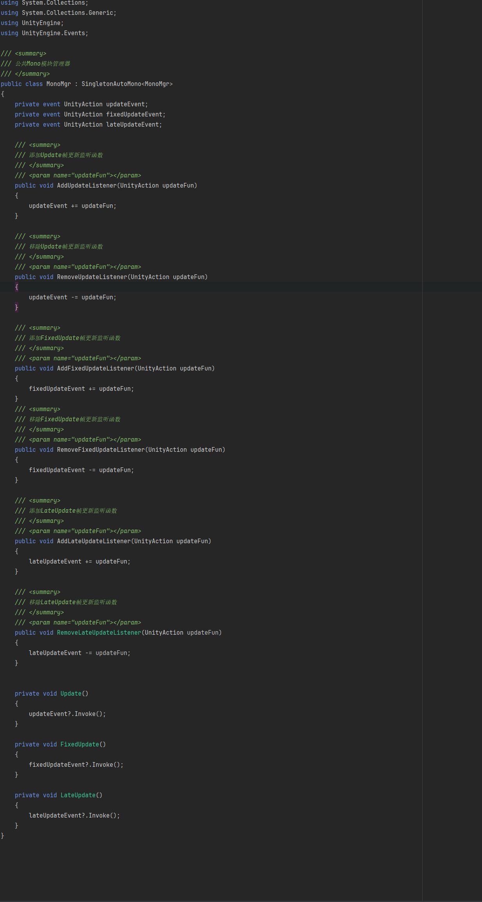
##### 知识点二 测试 

- *MonoMgr.Instance.AddUpdateListener(MyUpdate);*


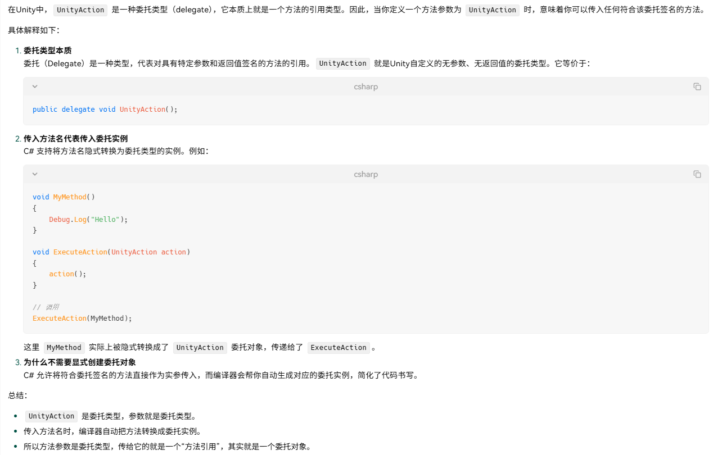

## 四、缓存池（对象池）模块

#### 1.【缓存池（对象池）模块】主要作用和基本原理

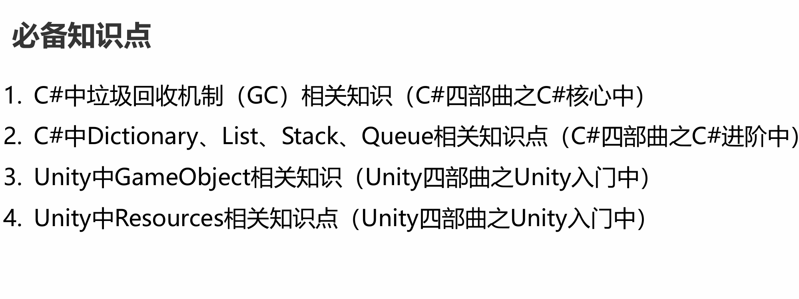


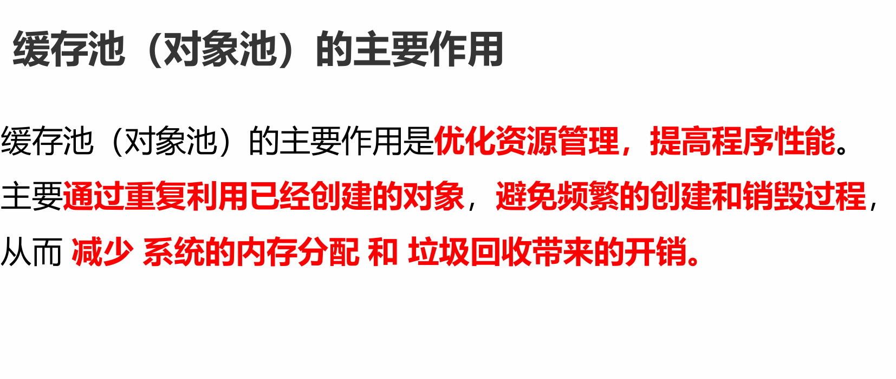

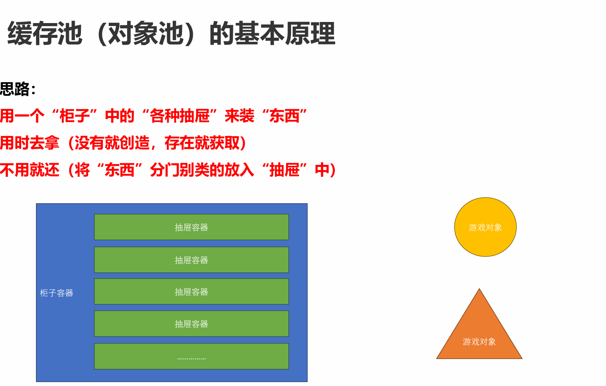
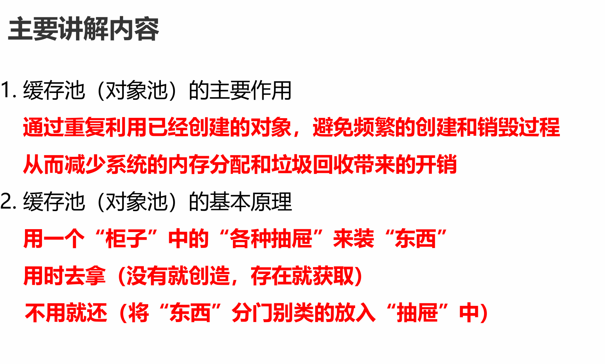


#### 2.【缓存池（对象池）模块】具体实现

##### 重要内容回顾 
- 必备知识点 
- 1.C#中垃圾回收机制（GC）相关知识（C#四部曲之C#核心中） 
- 2.C#中Dictionary、List、Stack、Queue相关知识点（C#四部曲之C#进阶中） 
- 3.Unity中GameObject相关知识（Unity四部曲之Unity入门中） 
- 4.Unity中Resources相关知识点（Unity四部曲之Unity入门中 
  
- 缓存池（对象池）的主要作用 
- 通过重复利用已经创建的对象，避免频繁的创建和销毁 
- 从而减少系统的内存分配和垃圾回收带来的开销 
  
- 缓存池（对象池）的基本原理 
- 用一个“柜子”中的“各种抽屉”来装“东西” 
- 用时去拿（没有就创造，存在就获取） 
- 不用就还（将“东西”分门别类的放入“抽屉”中）

##### 知识点一 实现缓存池(对象池)模块 

- 1.创建PoolMgr继承 不继承MonoBehaviour的单例模式基类 
- 2.声明柜子(Dictionary)和抽屉(List、Stack、Queue等)容器 
- 3.拿东西方法 
-   3-1：有抽屉并且抽屉里有东西 直接获取 
-   3-2: 没有抽屉或者抽屉里没东西 创造 
- 4.放东西方法 
-   4-1：有抽屉，直接放 
-   4-2：没抽屉，创建抽屉，再放 
- 5.清空柜子方法 
-   我们在切场景时，对象都会被移除，这时应该清空柜子  
-   否则会出现内存泄漏，并且下次取东西会出问题

##### 知识点二 测试 

- 1.创建测试用几何体 
- 2.通过监听鼠标事件，动态创建物体 
- 3.创建一个延迟销毁脚本

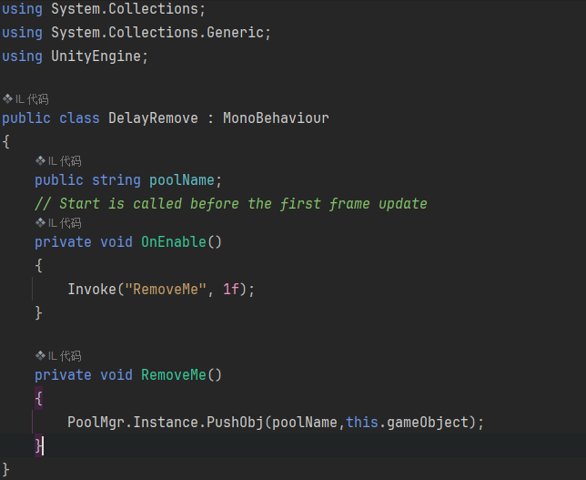
#### 3.【缓存池（对象池）模块】窗口布局优化

##### 知识点一 窗口布局优化指的是什么 

- 现在直接失活对象，当之后项目做大了，抽屉多了，对象多了 
- 游戏中成百上千个对象，在开发测试时不方便从Hierarchy窗口中查看对象获取信息 
- 因此我们希望能优化一下Hierarchy窗口中的布局 
- 将对象和抽屉的关系可视化

##### 知识点二 制作思路和具体实现 

- 制作思路： 
- 1.柜子管理自己的柜子根物体 
- 2.抽屉管理自己的抽屉根物体 
- 3.失活时建立父子关系，激活活时断开父子关系 
  
- 具体实现: 
- 1.先实现将所有对象放入柜子根物体中 
- 2.再实现将对象放入对应的抽屉根物体中 
-   用面向对象的思想将抽屉相关数据行为封装起来


##### 知识点三 将其变为可控制开启的功能 

- 这样可以避免在真机运行时，由于父子关系的频繁变换 
- 带来一些额外的性能开销

#### 4.【缓存池（对象池）模块】对象上限优化

##### 知识点一 对象上限优化指的是什么？

- 目前我们制作的缓存池模块 
- 理论上来说，当动态创建的对象长时间不放回抽屉 
- 每次从缓存池中动态获取对象时，会不停的新建对象 
- 那么也就是对象的数量是没有上限的 
- 场景上的某种对象可以存在n个 
  
- 而对象上限优化指的就是 
- 我们希望控制对象数量有上限 
- 对于不重要的资源我们没必要让其无限加量 
- 而是将“使用最久”的资源直接抢来用 
  
- 主要目的： 
- 更加彻底的复用资源 
- 对对象的数量上限加以限制 
- 可以优化内存空间，甚至优化性能（减少数量上限，可以减小渲染压力）

##### 知识点二 制作思路和具体实现 

- 制作思路： 
- 1.在抽屉里声明一个容器用来记录正在使用的资源 
- 2.每次获取对象时，传入一个抽屉最大容量值（可以给一个默认值） 
- 3.从缓存池中获取对象时就需要创建抽屉，用于记录当前使用着的对象 
- 4.每次取对象时应该分情况考虑 
-   情况1：没有抽屉时 
-   情况2：有抽屉，并且抽屉里有没用的对象或者使用中对象超过上限时 
-   情况3：有抽屉，但是抽屉里没有对象，使用中对象也没有超过上限时 
- 4.每次放回对象时 
-   由于记录了正在使用的资源，因此每次放入抽屉时还需要从记录容器中移除对象 
  
- 具体实现: 
- 根据制作思路进行实现即可
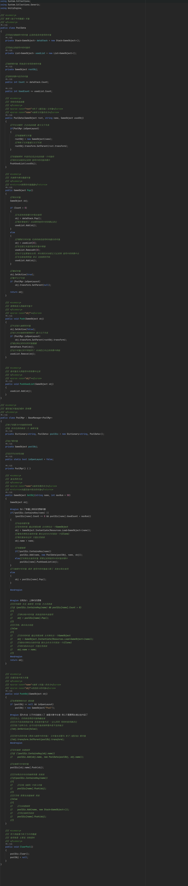

#### 5.【缓存池（对象池）模块】Pool对象报空，BUG修改

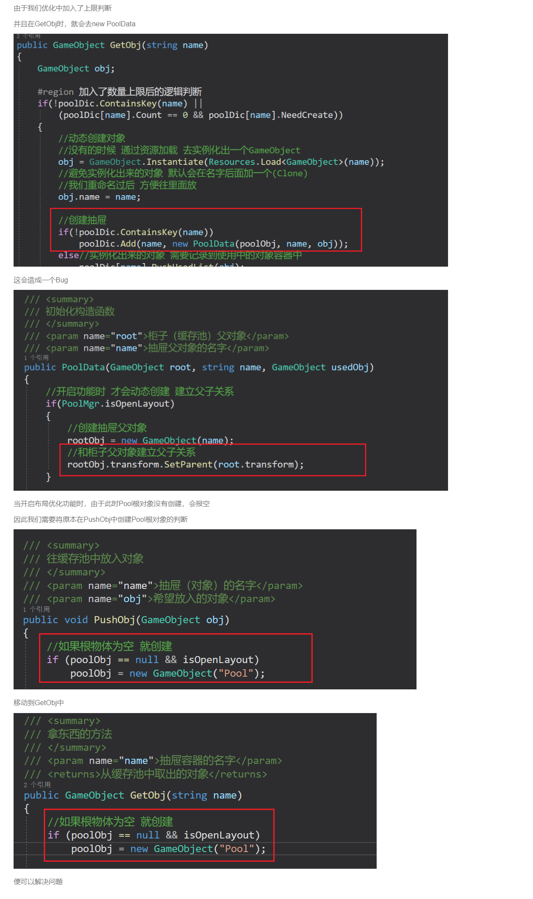

#### 6.【缓存池（对象池）模块】思考题讲解

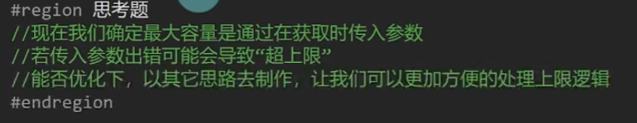

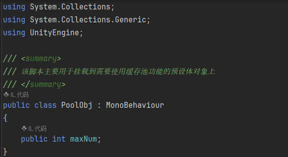
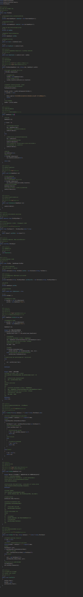

## ⑤、事件中心模块

#### 1.【事件中心模块】主要作用和基本原理


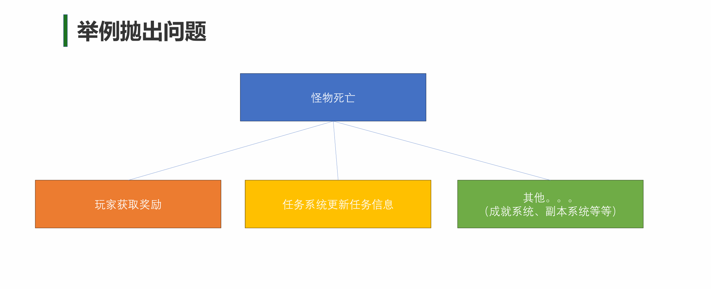

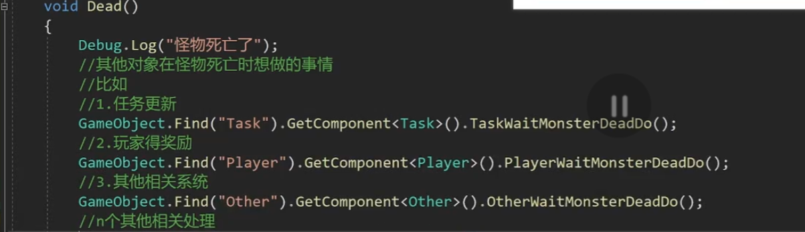
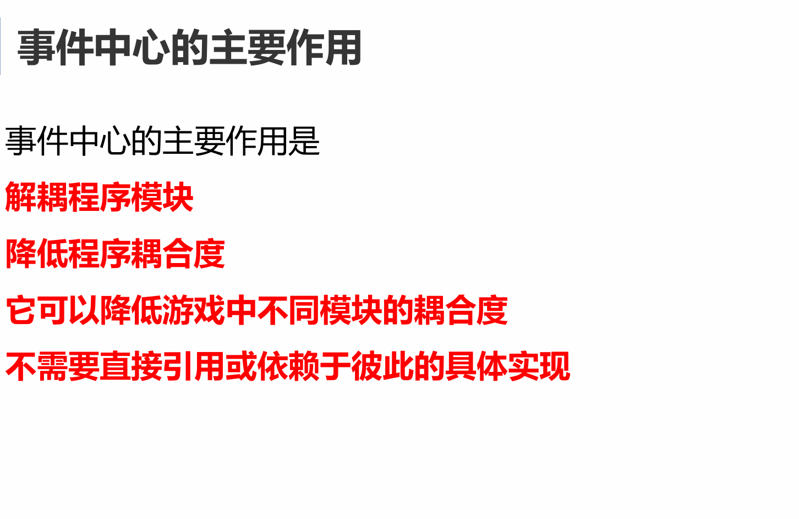
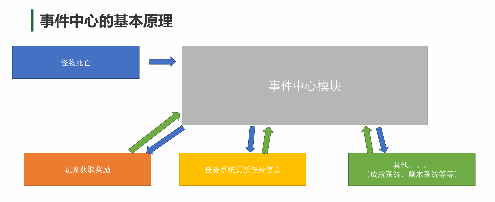

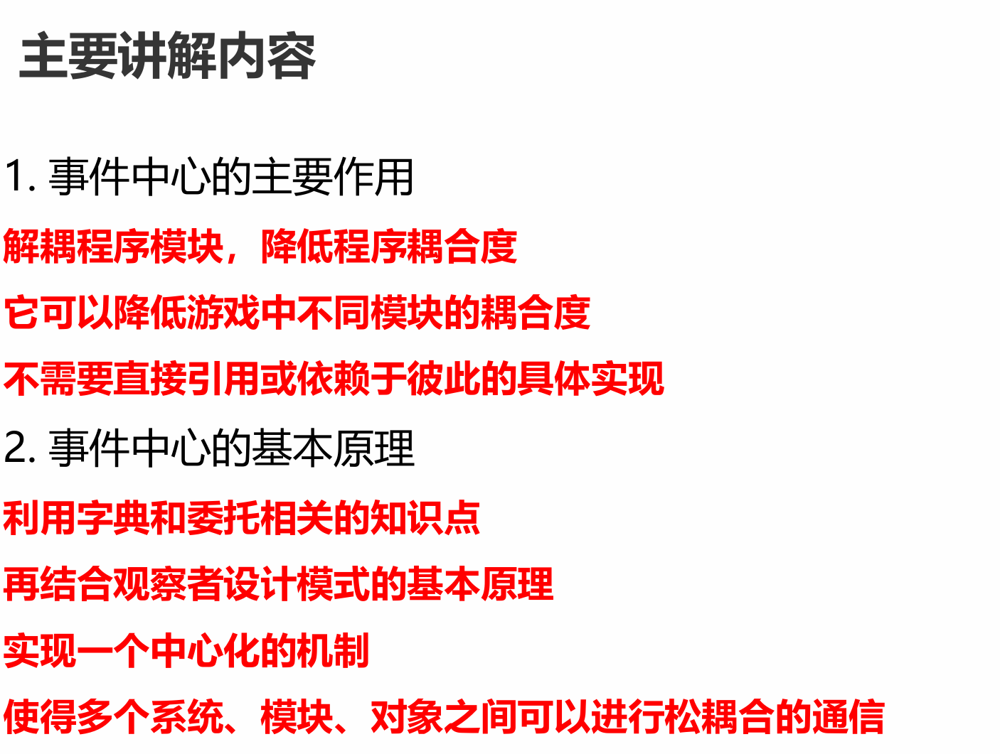

#### 2.【事件中心模块】具体实现

##### 重要知识回顾 

- 必备知识点 
- 1.C#中Dictionary相关知识点（C#四部曲之C#进阶中） 
- 2.C#中委托事件相关知识点（C#四部曲之C#进阶中） 
- 3.C#中泛型相关知识点（C#四部曲之C#进阶中） 
- 4.C#中里式替换原则（C#四部曲之C#核心中） 
- 5.观察者设计模式 
  
- 事件中心的主要作用 
- 解耦程序模块，降低程序耦合度 
- 它可以降低游戏中不同模块的耦合度 
- 不需要直接引用或依赖于彼此的具体实现  
  
- 事件中心的基本原理 
- 利用字典和委托相关的知识点 
- 再结合观察者设计模式的基本原理 
- 实现一个中心化的机制 
- 使得多个系统、模块、对象之间可以进行松耦合的通信

##### 知识点一 实现事件中心模块 

- 1.创建EventCenter继承 不继承MonoBehaviour的单例模式基类 
- 2.声明管理事件用容器 
- 3.实现关键方法 
-   触发(分发)事件 方法 
-   添加事件监听者 方法 
-   移除事件监听者 方法 
-   清除所有事件监听者 方法
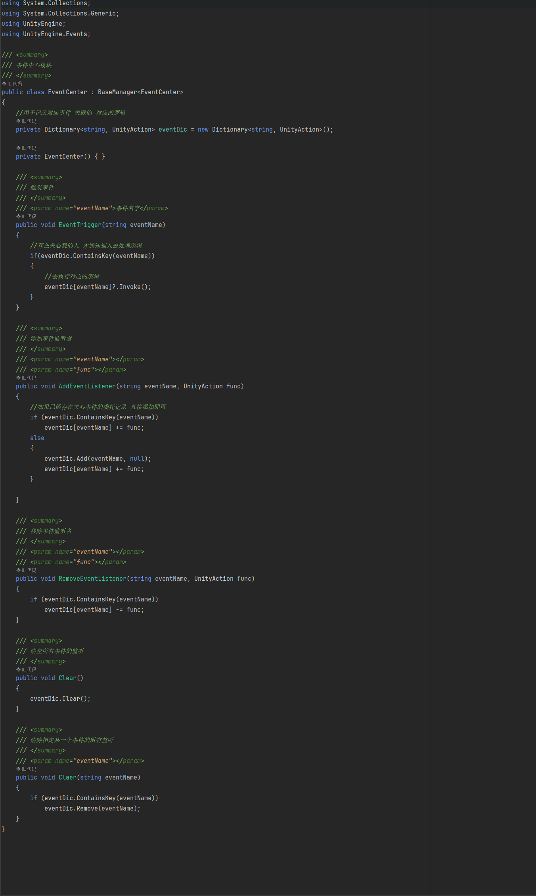
````ad-warning
此处添加监听方法中 在字典记录为空情况下 

先传入了Null值 给字典对应键的值提供了空的事件委托 然后再给空委托添加具体方法

如果不这么做 只能给字典键对应的值提供new UnityAction(Func);

这么做的话等于是创建了新的UnityAction 虽然起到的效果一样 但是引用不同 

即新的new UnityAction Func  和原来的不是同一个

这时候通过移除 移除的是原来地址的Func(即移除的是老方法地址 但实际存入的是新方法) 所以无法移除

举个例子 

UnityAction func1 += test;

UnityAction func2 += test;

虽然都是一样的效果 但是func1 和 func2  虽然加入的方法地址相同 但是两者实际不等同
````

#### 3.【事件中心模块】传递参数

##### 知识点一 事件中心中传递参数指的是什么？ 

- 希望在触发事件时传递数据 
- 比如 
- 怪物死亡时，将怪物信息传递出去
- 获取奖励时，将奖励信息传递出去 
- 等等 
  
- 传递数据的主要目的是 
- 我们可以在各系统、模块、对象中获取到我们希望获取的有用信息

##### 知识点二 制作思路和具体实现 

- 我们目前触发事件，是通过执行委托中存储的函数来执行各系统对应的逻辑 
- 那么需要传递参数，我们很自然的联想到应该从委托入手 
  
- 但是参数的类型可能有多种多样，我们可以采用万物之父 object 利用里式替换原则 
- 父类容器装载子类对象的方式来传递参数


##### 知识点三 存在的问题 

- 使用object进行参数传递，当传递值类型数据时，会存在装箱拆箱，增加性能开销

#### 4.【事件中心模块】参数类型自定义

##### 知识点一 事件中心中 参数类型自定义 指的是什么？ 

- 上节课我们通过万物之父 object 利用里式替换原则（父类装子类） 
- 实现了在事件中心中传递参数 
- 但是使用object时，当传递值类型参数时，存在装箱拆箱的性能浪费 
  
- 而这节课要讲解的 参数类型自定义 指的就是 
- 在传递数据时，参数类型可以根据需求自己定义，想传什么就传什么，而不是固定的object类型

##### 知识点二 制作思路和具体实现 

- 制作思路： 
- 想让传递的参数类型可变，并且想传什么就传什么 
- 我们可以很自然的联想到使用泛型来制作该功能 
  
- 但是我们需要解决以下关键问题： 
- 字典容器中的 泛型委托 如何提前定好类型 
- 解决方案： 
- 里式替换原则（父类装子类）
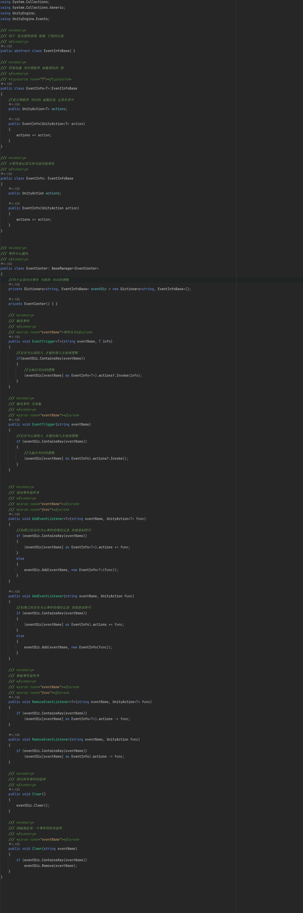

#### 5.【事件中心模块】事件名优化

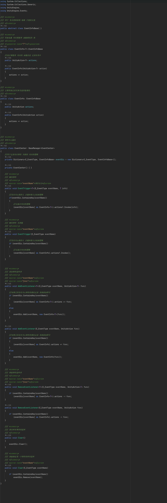


## 六、资源加载模块

#### 1.【资源加载模块】主要作用和基本原理

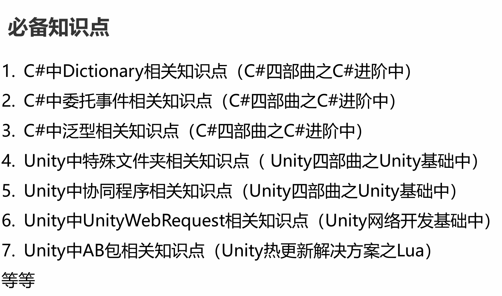
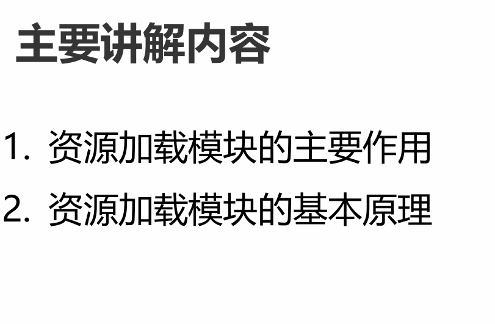
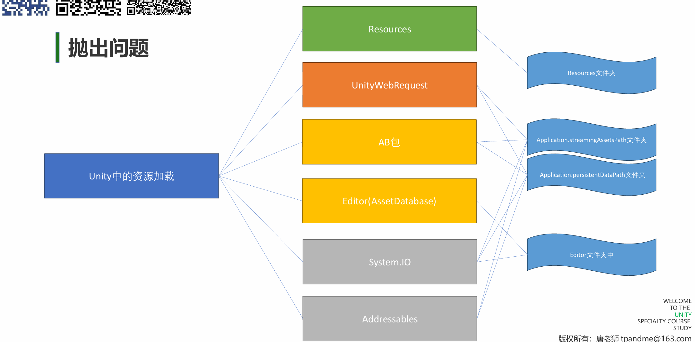
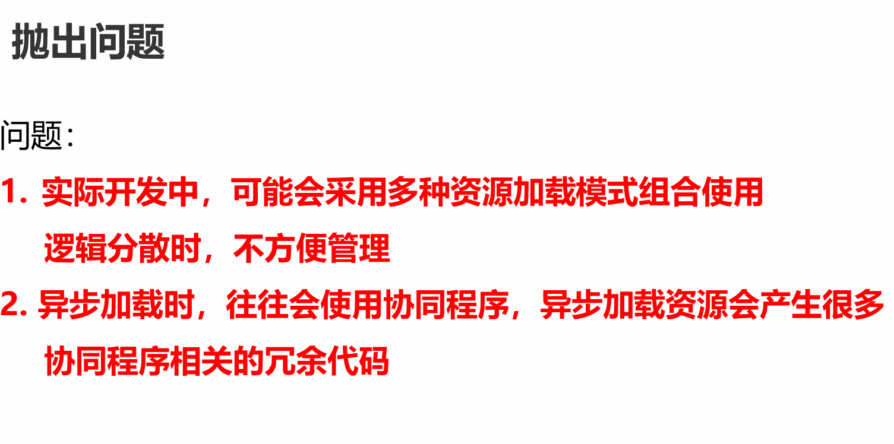
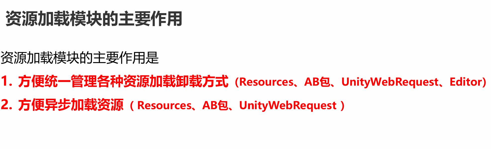
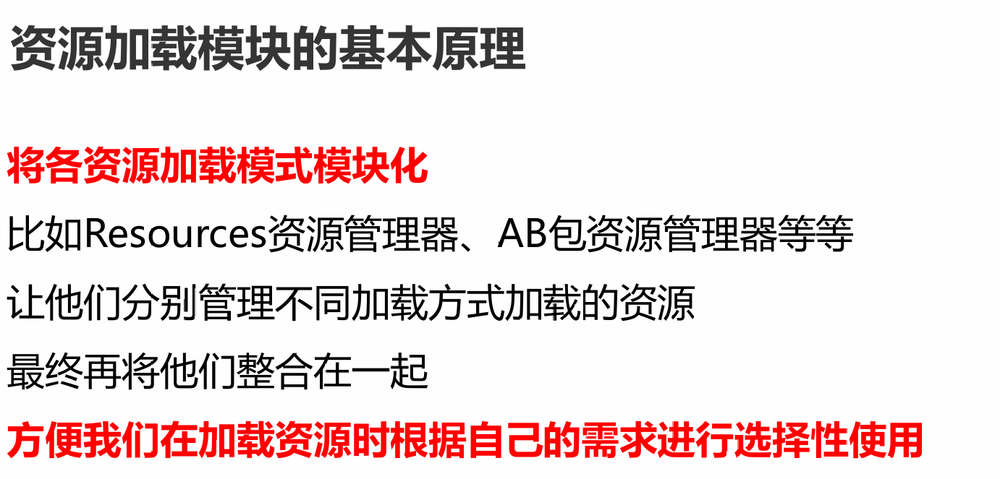
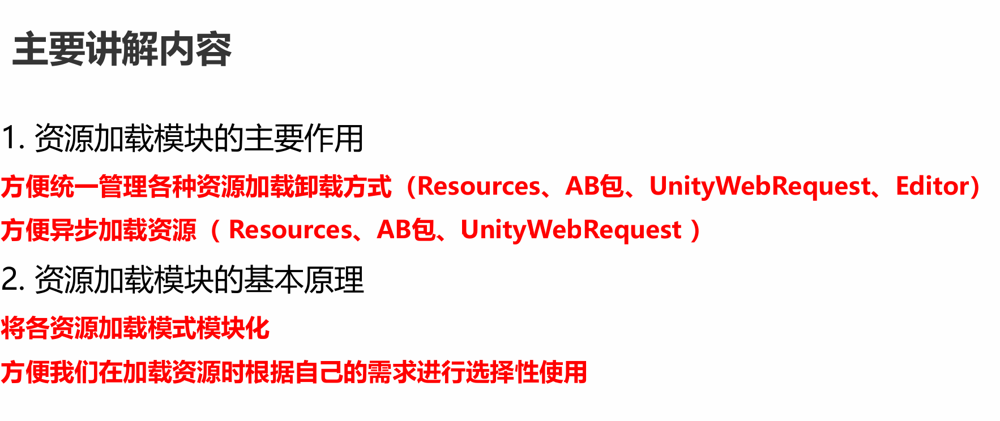

#### 2.【Resources资源加载模块】具体实现

##### 必备知识点 

- 1.C#中Dictionary相关知识点（C#四部曲C#进阶） 
- 2.C#中委托相关知识点（C#四部曲C#进阶） 
- 3.Unity中Resources相关知识点（Unity四部曲Unity基础） 
- 4.Unity中协同程序相关知识点（Unity四部曲Unity基础）

##### 知识点 Resources资源加载模块的具体实现 

- 1.创建ResourcesMgr 继承 不继承MonoBehaviour的单例模式基类 
- 2.为它封装Resources异步加载资源的相关方法（主要目的 避免异步加载的代码冗余） 
- 3.为它封装Resources同步加载资源的相关方法（顺便封装） 
- 4.为它封装资源卸载相关方法（顺便封装）

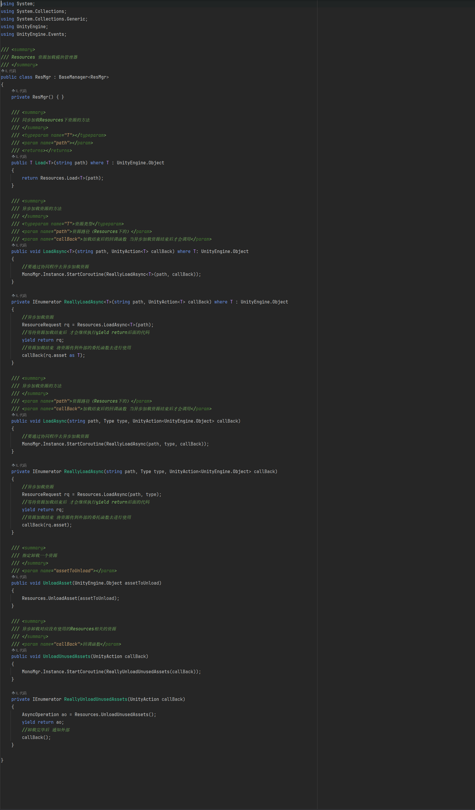
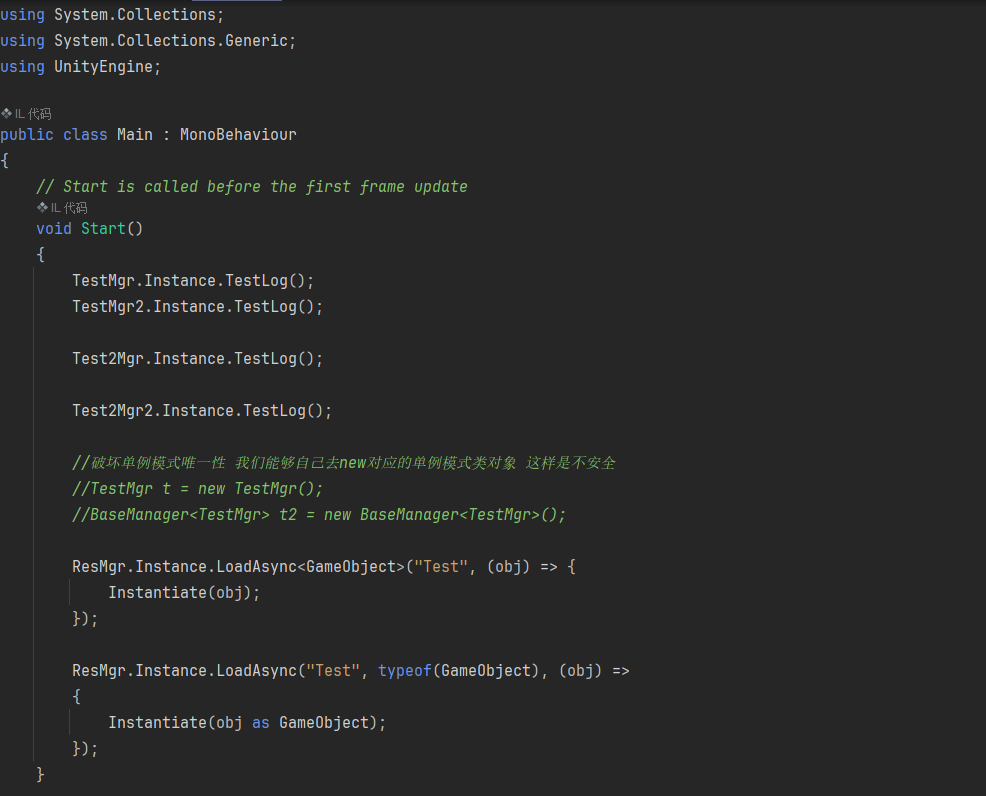

#### 3.【Resources资源加载模块 进阶优化】异步加载问题 上

##### Resources重要知识回顾 

- Resources加载一次资源过后 
- 该资源就一直存放在内存中作为缓存 
- 第二次加载时发现缓存中存在该资源 
- 会直接取出来进行使用 
- 所以 多次重复加载不会浪费内存
- 但是 会浪费性能（每次加载都会去查找取出，始终伴随一些性能消耗） 
  
- Resources.UnloadAsset 卸载指定资源 但不能卸载GameObject对象 
- 它只能用于一些 不需要实例化的内容 比如 图片 和 音效 文本等等 
  
- Resources.UnloadUnusedAssets 卸载未使用资源 一般过场景时配合GC使用

##### 知识点一 异步加载问题指的是什么？ 

- 每次进行异步加载时，都会开启一个协同程序
- 虽然Resources资源会在内部进行缓存，加载已加载过的资源，性能消耗不会太大 
- 但是每次开启协程的过程也会浪费性能 
- 因此我们希望对上节课的ResMgr进行优化 
- 不依赖Resources内部的缓存机制 
- 而是自己来管理已经加载过的资源 
- 从而解决异步加载时协同程序的频繁开启造成的性能浪费 
  
  
- 我们想要达到的目的是 
- 通过一个字典记录已经加载过的资源 
- 每次在进行资源加载时，如果发现是已经加载过的资源 
- 我们直接使用即可

##### 知识点二 制作思路和具体实现 

- 1.字典容器结构设计 
-   主要考虑点 
-   key - 资源名（路径 + 类型 拼接而成） 
-   value - 自定义数据结构类：资源、委托、协程对象等 
  
- 2.修改异步加载相关逻辑 
-   字典中不存在资源记录时 
-       开启协同程序进行加载，并且此时就要记录进字典中（这样可以避免重复异步加载） 
-   字典中存在资源记录时 
-       1-资源还没加载完 —— 记录委托 
-       2-资源已经加载完 —— 直接使用 
  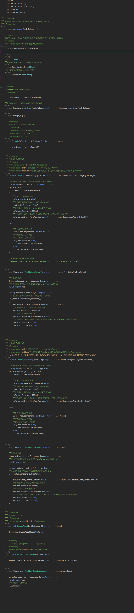
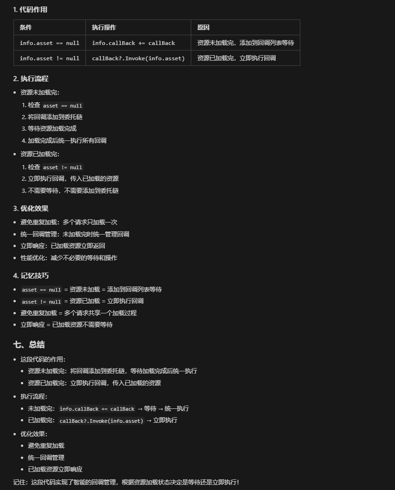

- 3.修改同步加载相关逻辑 
-   字典中不存在资源记录时 
-       直接同步加载资源记录即可 
-   字典中存在资源记录时 
-       1-资源还没加载完 —— 停止协程 
-       2-资源已经加载完 —— 直接使用 
  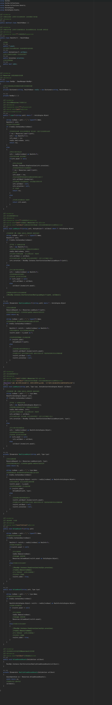

- 4.修改卸载资源相关逻辑 
-   字典中存在资源记录时 
-       1-资源还没加载完 —— 记录删除标识，待加载完后真正移除 或者 停止协程，并且移除 
-       2-资源已经加载完 —— 直接卸载，并且移除字典中资源记录
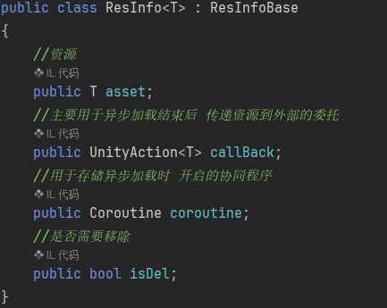
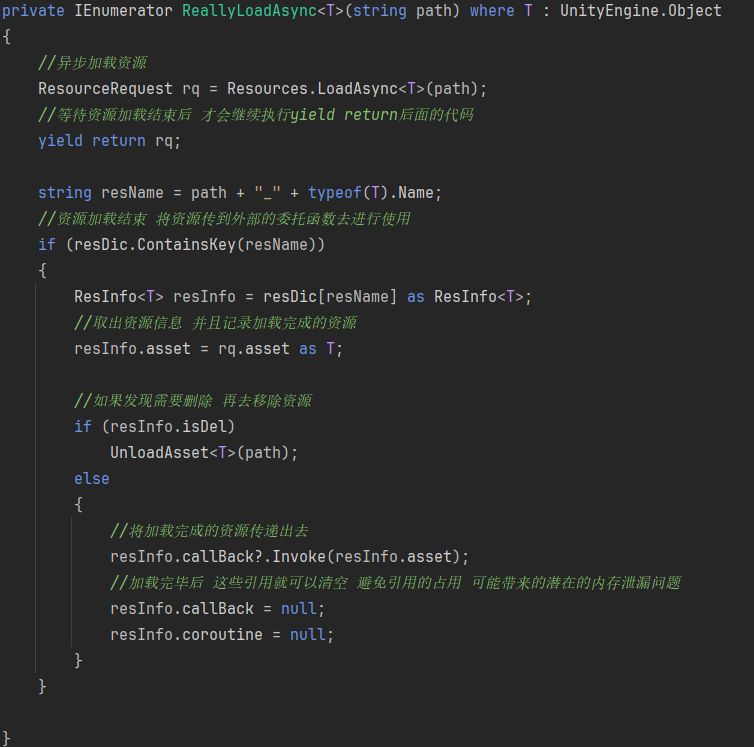
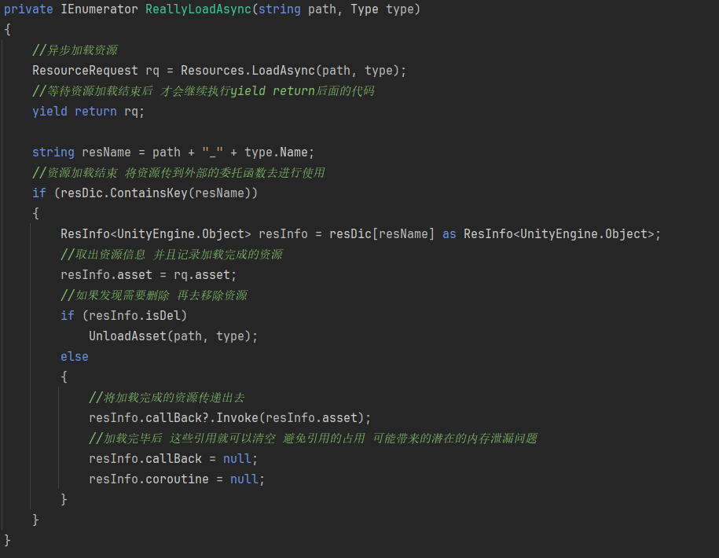
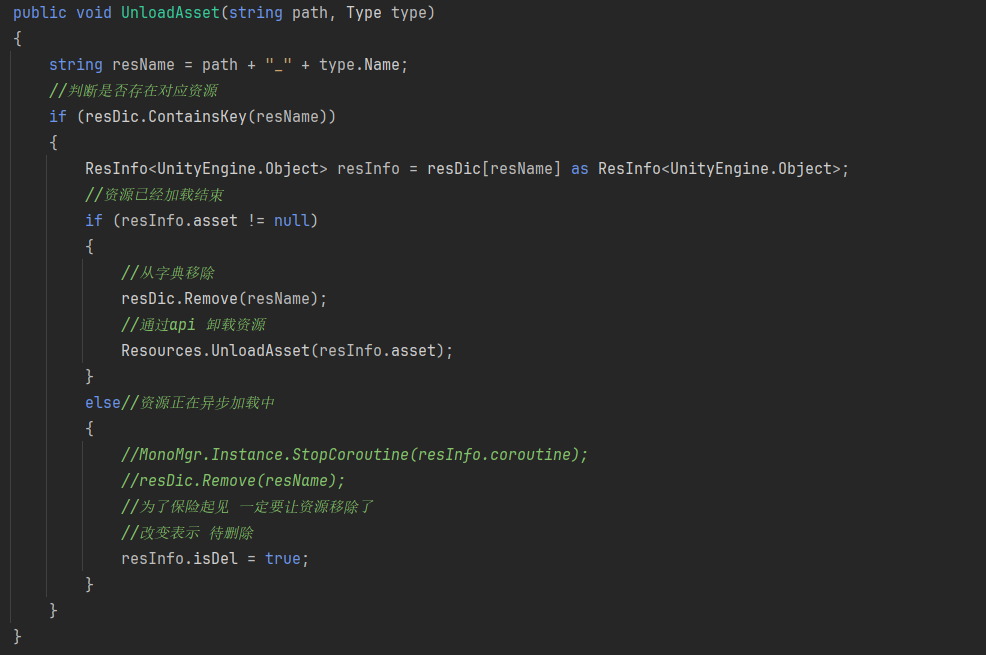
````ad-tip
此处如果使用注释掉的内容直接停止异步方法 并 移除字典中的对象

可能会存在资源已经加载完毕 在执行异步加载其他步骤的情况 

故改为添加标识符 来判断是否需要移除 

在资源异步加载方法  加载完毕后 查看标识符是否是true 确定加载完的资源是否需要移除
````

##### 知识点三 存在的问题 

- 1.在卸载资源时，我们并不知道是否还有地方使用着该资源 
- 2.UnloadUnusedAssets是卸载没有使用的资源，我们无法判断是否使用

#### 4.【Resources资源加载模块 进阶优化】引用计数

##### 问题回顾 

- 1.在卸载资源时，我们并不知道是否还有地方使用着该资源 
- 2.UnloadUnusedAssets是卸载没有使用的资源，我们无法判断是否使用

##### 知识点一 通过引用计数判断资源是否使用的问题 

- 什么是引用计数? 
- 引用计数是一种内存管理技术，用于跟踪资源被引用的次数 
- 我们通过一个整形变量来记录资源的使用次数 
- 当有对象引用该资源时，计数器会增加；当对象不再引用该资源时，计数器会减少

##### 知识点二 向ResMgr中加入引用计数功能 

- 1.为ResInfo类加入引用计数成员变量和方法 
- 2.使用资源时加 
- 3.不使用资源时减 
- 4.处理异步回调问题，某一个异步不使用资源了应该移除回调函数的记录 
- 5.修改移除资源函数逻辑，引用计数为0时才真正移除资源 
- 6.考虑资源频繁移除问题，加入马上移除bool标签 
- 7.修改移除不使用资源函数逻辑，释放时清楚引用计数为0的记录

##### 注意事项 

- 1.加入引用计数的ResMgr 
-   我们在使用资源时就需要有用就有删 
-   当使用某个资源的对象移除时，一定要记得调用移除方法 
  
- 2.如果觉得卸载资源的功能麻烦，也完全可以不使用卸载的相关方法 
-   加载相关逻辑不会有任何影响，和以前直接使用Resources的用法几乎一样 
-   只需要再添加一个主动清空字典的方法即可


#### 5.【Editor资源加载模块】 主要作用和基本原理

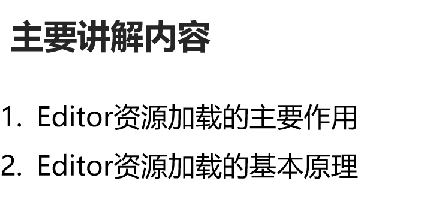
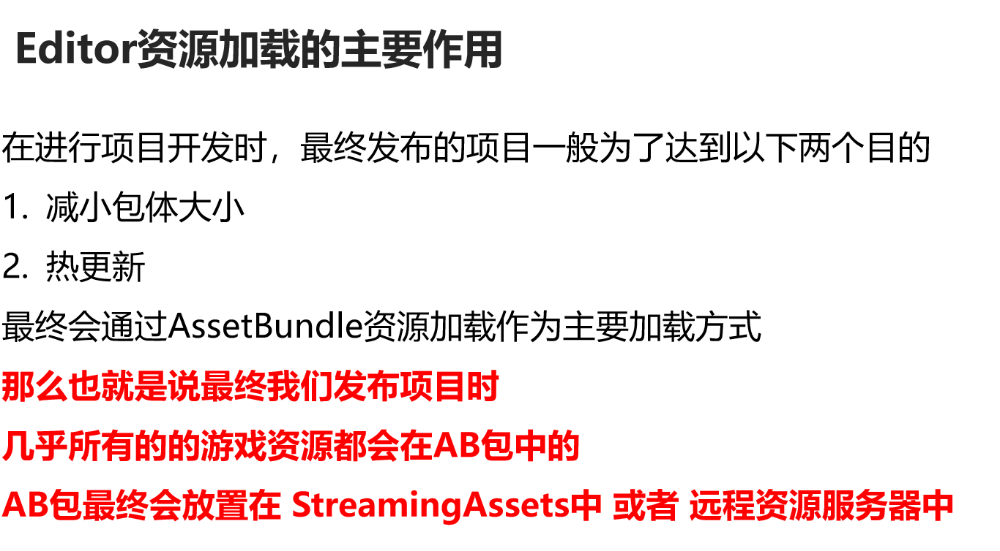
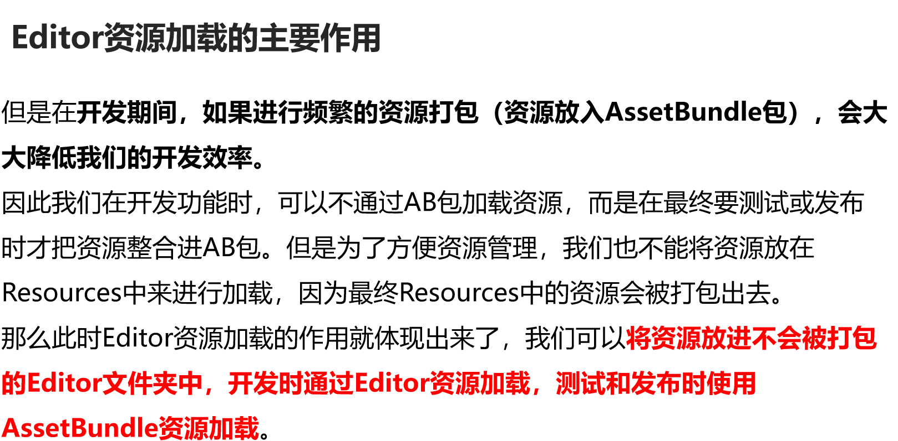
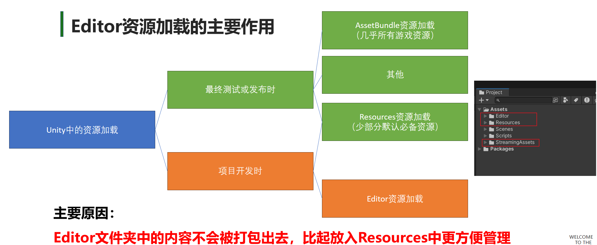
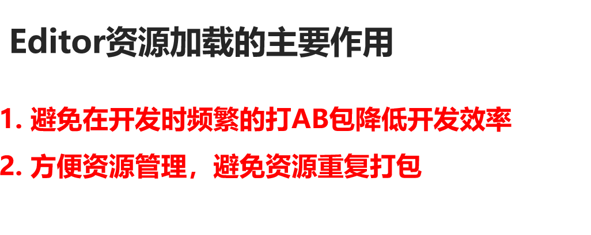
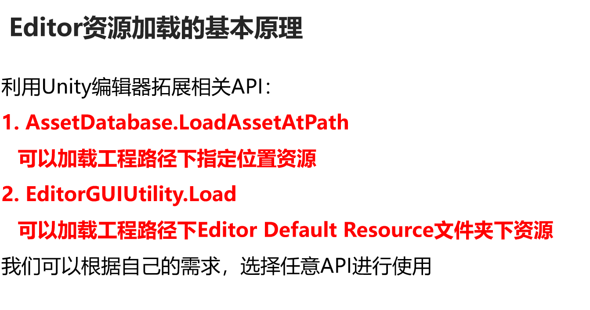

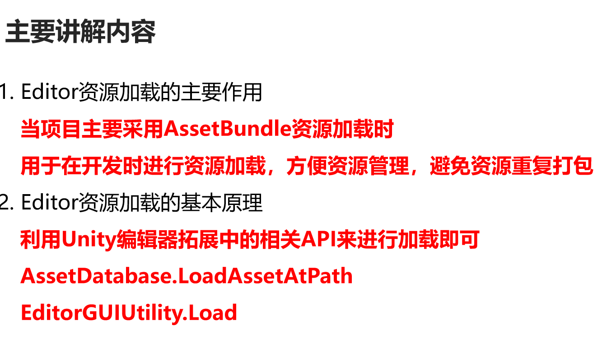

#### 6.【Editor资源加载模块】具体实现

##### 知识点一 主要使用的API 

- 1.AssetDatabase.LoadAssetAtPath                       用于加载单个资源 
- 2.AssetDatabase.LoadAllAssetRepresentationsAtPath     用于加载图集资源中的内容(该API用于加载所有子资源) 
  
- 注意： 
- 这两个API加载资源的路径都是从 Assets/... 开始

##### 知识点二 创建用于放置资源的文件夹 

- 我们可以创建Editor文件夹 
- 以后我们最终会打包为AB包的资源都放置在此处

##### 知识点三 实现Editor资源管理器 

- 封装API 
- 主要提供加载单个资源以及加载图集资源的API
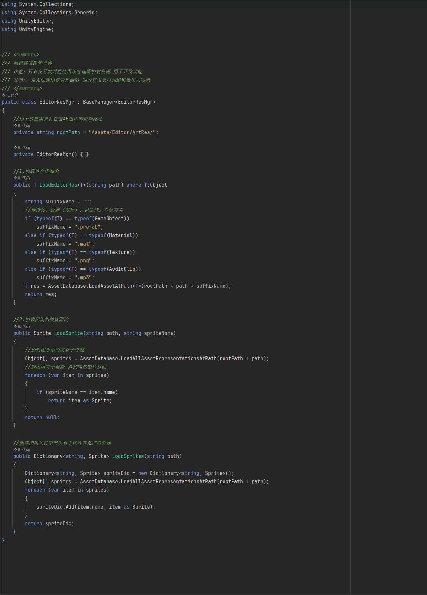

#### 7.【选修】AssetBundle理论基础


#### 8.【选修】AB包资源加载


#### 9.【选修】AB包依赖


#### 10.【选修】AB包资源管理器


#### 11.【Assetbundle资源加载模块】 ABMgr异步加载修改

##### 准备工作 

- 重新按照ABMgr中的规则进行AB包打包

##### 知识点一 ABMgr异步加载修改主要目标 

- 将ABMgr中的异步加载方法彻底异步话 
- 让其中的 
- 依赖包加载、资源包加载、资源加载都变为异步加载 
  
- 注意：主包可以保留同步加载

##### 知识点二 需要考虑的主要问题 

- 1.某个AB包当正在异步加载时又进行重复加载 
-   遇到这种情况时，我们需要避免重复加载报错 
-   因此我们不应再次加载，而是等待之前的异步加载结束后直接使用 
  
- 2.正在加载某个AB包时 
-   卸载AB包：如果正在加载中，不允许卸载 
-   清空AB包：停止所有协同程序，在清理AB包


##### 解析
- 此处申明了一个字典 
```C#
private Dictionary<string, AssetBundle> abDic = new Dictionary<string, AssetBundle>();
```
- 用来存储AB包对象 

- 并将加载主包的逻辑摘了出来

``` C#
private void LoadMainAB()  
{  
    if( mainAB == null )  
    {        mainAB = AssetBundle.LoadFromFile( PathUrl + MainName);  
        manifest = mainAB.LoadAsset<AssetBundleManifest>("AssetBundleManifest");  
    }
}
```

- 这里是加载依赖包逻辑 如果字典里没有 就把依赖包信息存入字典
``` C#
private void LoadDependencies(string abName)  
{  
    //加载主包  
    LoadMainAB();  
    //获取依赖包  
    string[] strs = manifest.GetAllDependencies(abName);  
    for (int i = 0; i < strs.Length; i++)  
    {        if (!abDic.ContainsKey(strs[i]))  
        {            AssetBundle ab = AssetBundle.LoadFromFile(PathUrl + strs[i]);  
            abDic.Add(strs[i], ab);  
        }    }
}
```
- 由于进行了判空 所以主包和依赖包不会进行重复加载


``` C#
/// <summary>  
/// 泛型异步加载资源  
/// </summary>  
/// <typeparam name="T"></typeparam>  
/// <param name="abName"></param>  
/// <param name="resName"></param>  
/// <param name="callBack"></param>  
public void LoadResAsync<T>(string abName, string resName, UnityAction<T> callBack) where T:Object  
{  
    StartCoroutine(ReallyLoadResAsync<T>(abName, resName, callBack));  
}  
//正儿八经的 协程函数  
private IEnumerator ReallyLoadResAsync<T>(string abName, string resName, UnityAction<T> callBack) where T : Object  
{  
    //加载主包  
    LoadMainAB();  
    //获取依赖包  
    string[] strs = manifest.GetAllDependencies(abName);  
    for (int i = 0; i < strs.Length; i++)  
    {        if (!abDic.ContainsKey(strs[i]))  
        {            //一开始异步加载 就记录 如果此时的记录中的值 是null 那证明这个ab包正在被异步加载  
            abDic.Add(strs[i], null);  
            AssetBundleCreateRequest req = AssetBundle.LoadFromFileAsync(PathUrl + strs[i]);  
            yield return req;  
            //异步加载结束后 再替换之前的null  这时 不为null 就证明加载结束了  
            abDic[strs[i]] = req.assetBundle;  
        }        //就证明 字典中已经记录了一个AB包相关信息了  
        else  
        {  
            //如果字典中记录的信息是null 那就证明正在加载中  
            //我们只需要等待它加载结束 就可以继续执行后面的代码了  
            while (abDic[strs[i]] == null)  
            {                //只要发现正在加载中 就不停的等待一帧 下一帧再进行判断  
                yield return 0;  
            }        }    }    //加载目标包  
    if (!abDic.ContainsKey(abName))  
    {        //一开始异步加载 就记录 如果此时的记录中的值 是null 那证明这个ab包正在被异步加载  
        abDic.Add(abName, null);  
        AssetBundleCreateRequest req = AssetBundle.LoadFromFileAsync(PathUrl + abName);  
        yield return req;  
        //异步加载结束后 再替换之前的null  这时 不为null 就证明加载结束了  
        abDic[abName] = req.assetBundle;  
    }    else  
    {  
        //如果字典中记录的信息是null 那就证明正在加载中  
        //我们只需要等待它加载结束 就可以继续执行后面的代码了  
        while (abDic[abName] == null)  
        {            //只要发现正在加载中 就不停的等待一帧 下一帧再进行判断  
            yield return 0;  
        }    }  
    //异步加载包中资源  
    AssetBundleRequest abq = abDic[abName].LoadAssetAsync<T>(resName);  
    yield return abq;  
  
    callBack(abq.asset as T);  
}
```

- 而这一段则是为了防止异步加载时 在某一个资源已经正在加载的时候 仍然调用方法 再次加载了AB包资源 导致报错
- 所以在申明的字典中查询到没有字符串名时 先往字典添加AB包对象并设置为空 
- 假使有另一个对象也调用这个资源 会先查询是否有对应字符串的键，假使有键而值是空 那么就会持续等待一帧 直到资源加载完成
- 最终依次调用加载好的资源 而不影响包加载 包只加载一次（如果包含键，且对应值正常就是直接跳过if，调用同一个包内资源了）

#### 12.【Assetbundle资源加载模块】ABMgr同步加载修改

##### 知识点一 修改同步加载主要面对的问题 

- 在进行同步加载时如果遇到有AB包正在被异步加载应该如何解决？ 
  
- 通过我们之前学习的 潜在问题考虑 得知 
- 在进行异步加载时再重复加载相同AB包是会报错的 
- 即使是同步加载，我们也必须等待异步加载结束，再进行下一步

##### 知识点二 修改ABMgr中的同步加载相关逻辑 

- 1.注释之前的同步加载代码 
- 2.在异步加载的基础上进行修改

##### 总结 

- 我们已经完成了对ABMgr的修改 
- 主要实现的就是彻底的异步化 
- 对于大家来说还有可以修改的内容 
- 比如： 
- 1.完善卸载资源逻辑 
- 2.添加AB包或资源预加载功能 
- 3.考虑AB包加载失败的情况


````ad-tip
### 此处注释掉了所有同步加载方法 通过在异步方法的参数中添加isSync标识符来表示是否是
````

#### 13.【选修】UnityWebRequest类 常用操作——获取数据

##### 知识点一 WWW类的作用 

- WWW是Unity提供给我们简单的访问网页的类 
- 我们可以通过该类下载和上传一些数据 
- 在使用http协议时，默认的请求类型是Get，如果想要Post上传，需要配合下节课学习的WWWFrom类使用 
- 它主要支持的协议 
- 1.http:和https:-  超文本传输协议 
- 2.ftp:文件传输协议（但仅限于匿名下载） 
- 3.file:本地文件传输协议，可以使用该协议异步加载本地文件（PC、IOS、Android都支持） 
- 我们本节课主要学习利用WWW来进行数据的下载或加载 
  
- 注意： 
- 1.该类一般配合协同程序使用 
- 2.该类在较新Unity版本中会提示过时，但是仍可以使用，新版本将其功能整合进了UnityWebRequest类（之后讲解）

##### 知识点二 WWW类的常用方法和变量 

- 常用方法 
- 1.WWW：构造函数，用于创建一个WWW请求 
- WWW www = new WWW("http:- 192.168.50.109:8000/Http_Server/实战就业路线.jpg"); 
- 2.GetAudioClip：从下载数据返回一个音效切片AudioClip对象 
- www.GetAudioClip() ;
- 3.LoadImageIntoTexture：用下载数据中的图像来替换现有的一个Texture2D对象 
- Texture2D tex = new Texture2D(100, 100); 
- www.LoadImageIntoTexture(tex); 
- 4.LoadFromCacheOrDownload：从缓存加载AB包对象，如果该包不在缓存则自动下载存储到缓存中，以便以后直接从本地缓存中加载 
- WWW.LoadFromCacheOrDownload("http:- 192.168.50.109:8000/Http_Server/test.assetbundle", 1); 

  
- 常用变量 
- 1.assetBundle：如果加载的数据是AB包，可以通过该变量直接获取加载结果 
- www.assetBundle 
- 2.audioClip：如果加载的数据是音效切片文件，可以通过该变量直接获取加载结果 
- www.GetAudioClip 
- 3.bytes：以字节数组的形式获取加载到的内容 
- www.bytes 
- 4.bytesDownloaded：过去已下载的字节数 
- www.bytesDownloaded 
- 5.error：返回一个错误消息，如果下载期间出现错误，可以通过它获取错误信息 
- www.error != null 
- 6.isDone：判断下载是否已经完成 
- www.isDone 
- 7.movie：如果下载的视频，可以获取一个MovieTexture类型结果 
- www.GetMovieTexture() 
- 8.progress:下载进度 
- www.progress 
- 9.text：如果下载的数据是字符串，以字符串的形式返回内容 
- www.text 
- 10.texture：如果下载的数据是图片，以Texture2D的形式返回加载结果 
- www.texture

##### 知识点三 利用WWW类来异步下载或加载文件 

-  1.下载HTTP服务器上的内容 
- StartCoroutine(DownLoadHttp()); 

  
-  2.下载FTP服务器上的内容（FTP服务器一定要支持匿名账户） 
- StartCoroutine(DownLoadFtp()); 

  
-  3.本地内容加载（一般移动平台加载数据都会使用该方式） 
- StartCoroutine(DownLoadLocal());

##### 总结 

- Unity中的WWW类比使用C#中的Http相关类更加的方便 
- 建议大家使用Unity当中为我们封装好的类来处理下载、加载相关逻辑


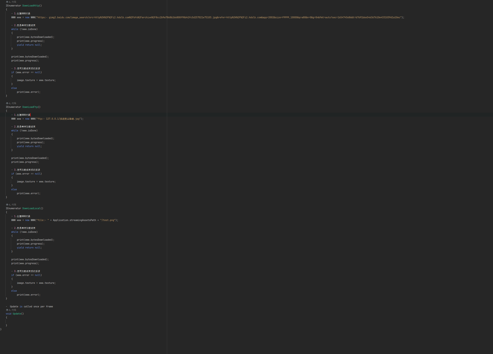         

#### 14.【UnityWebRequest】具体实现

##### 重要知识点 

- 主要用到的知识点： 
- 1.UnityWebRequest 相关知识    （Unity网络开发基础） 
- 2.泛型 相关知识                （C#四部曲C#进阶中） 
- 3.协同程序 相关知识            （Unity四部曲之Unity基础中） 
- 4.反射中的Type 相关知识        （C#四部曲C#进阶中） 
- 5.委托 相关知识                （C#四部曲C#进阶中） 
- 等等

##### 知识点 封装UnityWebRequest中的方法 

- 主要将 加载文本、加载文本字节数组、加载纹理、加载AB包 的几个方法n合一 
- 封装在一个泛型异步方法中 
- 方便外部使用

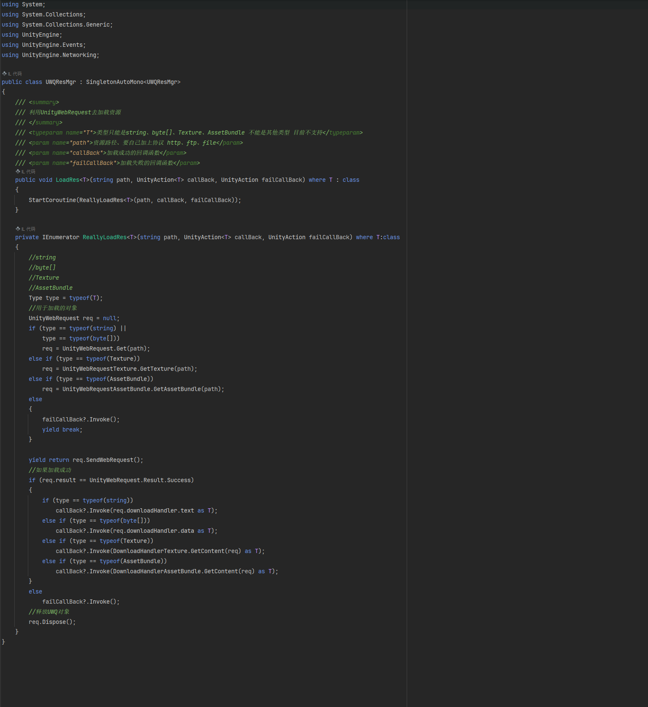

#### 15.资源加载模块 模块整合

##### 知识点一 小框架代码整合 

- 将之前写的小框架相关代码分门别类的整合在小框架文件夹中

##### 知识点二 EditorResMgr和ABMgr整合 

- EditorResMgr的主要目的是方便资源管理 
- 避免频繁的打AB包进行测试 
- 它主要是为AB包预备资源服务的 
- 因此我们可以将它和ABMgr整合在一起

##### 知识点三 为什么不整合ResMgr和UWQResMgr 

- 这两种资源加载管理器相对比较独立 
- 一个专门用于加载Resources下的资源 
- 一个专门用于加载指定位置的资源 
- 当我们使用它们时那一定是确定了位置和加载方式后才会使用的 
- 因此无需更多的整合处理

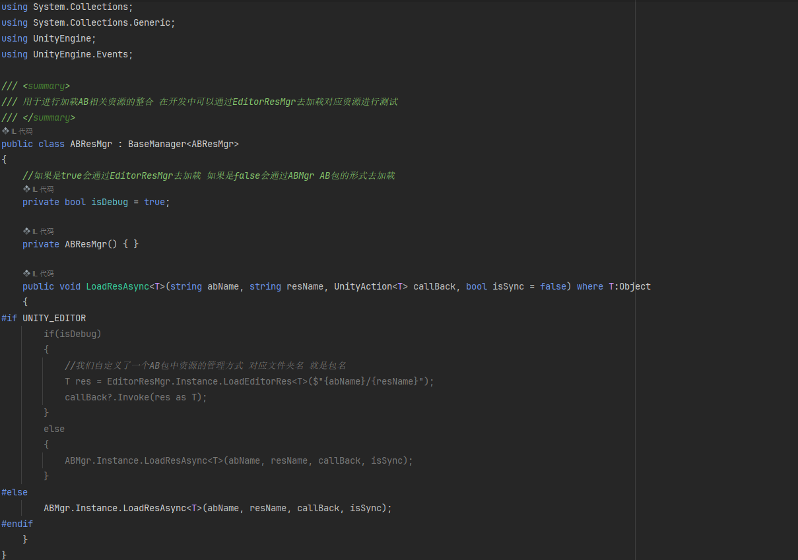

## 七、音效管理模块

#### 1.【音效管理模块】 基本原理

##### 必备知识点 

- 1.Unity音频 相关知识点 (Unity四部曲之Unity入门中) 
- 2.List 相关知识点（C#四部曲之C#进阶中）

##### 知识点一 主要作用 

- 游戏开发中有很多会用到音乐的地方 
- 比如： 
- 背景音乐 
- 打击音效 
- UI音效 
- 特效音效 
- 等等 
- 而不同的音乐音效会在不同的模块中去进行播放 
- 比如： 
- 技能释放、怪物受伤、角色受伤、副本通关、奖励发放 
  
- 如果我们不写一个音效管理模块 
- 那么在播放音乐音效时会有很多冗余的代码 
- 不方便管理，整体结构会显得较为杂乱 
- 因此我们单独实现一个独立的音效管理模块 
- 专门用于管理控制游戏中的所有音乐相关的功能 
- 提供给外部使用

##### 知识点二 基本原理 

- 实现一个音乐管理器 
- 提供一些公共方法给外部使用 
- 比如： 
- 1.播放背景音乐 
- 2.停止背景音乐 
- 3.播放音效 
- 4.停止播放音效 
- 5.设置背景音乐大小 
- 6.设置音效大小 
- 等等

#### 2.【音效管理模块】 具体实现 音效部分

##### 准备工作 

- 随便找两个音乐文件作为背景音乐测试内容

##### 知识点 实现音效管理模块 音乐 相关内容 

- 主要实现内容 
- 1.单例模式管理器 
- 2.播放背景音乐 
- 3.停止背景音乐 
- 4.暂停背景音乐 
- 5.设置背景音乐大小

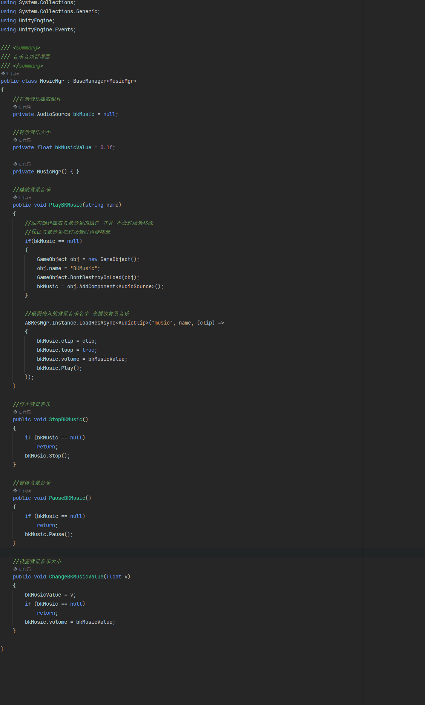

#### 3.【音效管理模块】具体实现 音效部分

##### 准备工作 

- 随便找几个音效文件作为音效测试内容

##### 知识点 实现音效管理模块 音效 相关内容 
- 主要实现内容 
- 1.播放音效 
- 2.自动移除播放完成的音效 
- 3.停止播放指定音效 
- 4.设置音效声音大小 
- 5.暂停或继续播放所有音效 
  
- 注意： 
-   1.音效和背景音乐不同 
-     音效存在多个，并且音效需要管理是否结束 
-     因此需要用容器记录音效组件 
-   2.音效分为循环和非循环 
-     非循环的需要我们检测它播放结束 
-     循环的需要让外部进行管理

##### 提出问题 

- 1.频繁的删除创建音效组件，比较浪费性能，应该如何优化？ 
- 2.3D音效需要让音效对象位置产生变化，我们应该如何修改？

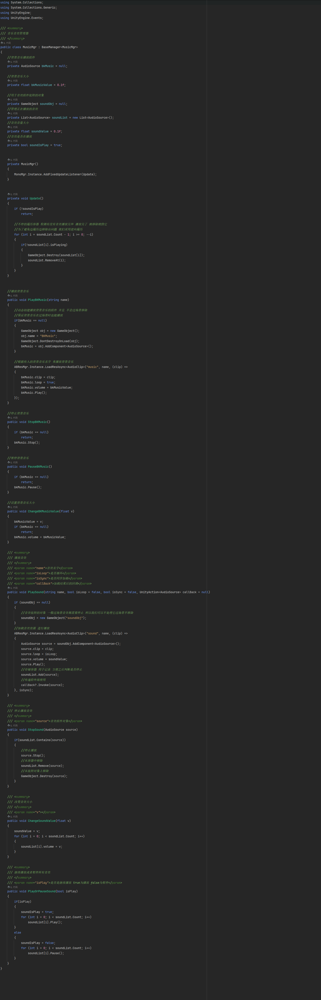
````ad-tip
核心要点 ： 额外添加了soundisplay标识符 只有soundisplay为true的情况下 才会进查询是否销毁

否则是处于暂停情况下 soundisplay为true，直接返回，而不会销毁音效对象
````
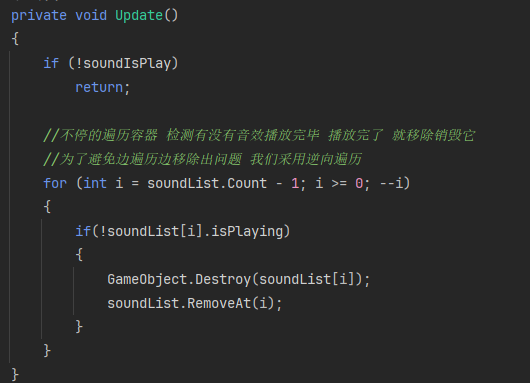

#### 4.【音效管理模块】进阶优化

##### 知识点一 优化频繁创建删除音效组件 

- 目前我们音效管理器中的音效组件会频繁的创建和删除 
- 这样会产生大量的内存垃圾，并且频繁创建对象也会带来性能消耗 
- 因此我们可以利用缓存池对其进行优化

##### 知识点二 优化3D音效问题 

- 由于我们使用了缓存池，因此AudioSource依附的将会是一个个独立的游戏对象 
- 而3D音效主要考虑的问题是： 
- 1.音效依附在对象上跟随对象移动 
- 2.音效中3D相关参数的设置 
  
- 如果你想要使用3D音效，那么只需要获取到音效组件和它依附的对象就可以迎刃而解了 
- 1.获取音效组件依附的对象，改变它的父对象，设置它的位置，音效便可以跟随对象移动 
- 2.获取音效组件改变其中的3D音效相关参数即可完成相关设置

##### 知识点三 提供清除所有音效的方法 

- 目前过场景时，音效相关对象会被自动的删除 
- 但是音效管理器中我们的容器还占着引用，我们应该提供方法清空容器

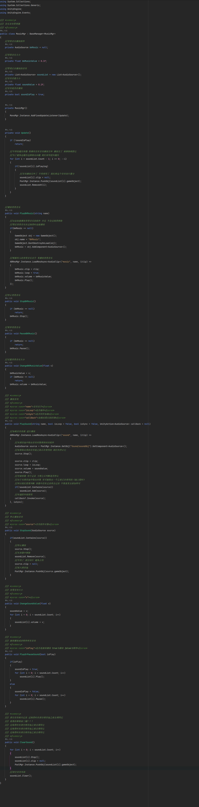

## 八、UI管理模块

#### 1.【UI管理模块】基本原理

##### 必备知识点 

- 1.UGUI 相关知识点（UI四部曲之UGUI中） 
- 2.Dictionary 相关知识点（C#四部曲之C#进阶中） 
- 3.委托 相关知识点（C#四部曲之C#进阶中） 
- 4.MonoBehaviour 相关知识点（Unity四部曲之Unity入门中） 
- 等等

##### 知识点一 回顾制作UI面板的传统流程 

- 1.拼面板（必须做） 
- 2.声明组件（重复工作） 
- 3.查找组件（重复工作） 
- 4.监听事件（重复工作） 
- 5.处理逻辑（必须做）

##### 知识点二 UI管理模块的基本原理 

- 1.制作UI面板基类，帮助我们自动化的查找组件，监听事件，无需每次写大量冗余代码 
-   将2、3、4步做成自动化的，无需重复去做 
-   解决方案一般有两种： 
-   1-1.自动化工具生成代码（Unity编辑器开发之编辑器拓展中） 
-   1-2.基类中规范冗余代码（我们将讲解的） 
  
- 2.制作UI管理器，管理所有UI面板，UI面板的显示隐藏都通过UI管理器来进行管理 
-   提供公共API供外部使用 
-   比如： 
-   2-1:显示面板 
-   2-2:隐藏面板 
-   2-3:获取面板 
-   2-4:添加自定义事件 
-   等等 
  
- 按照这个思路制作UI管理模块后 
- 我们之后在制作UI功能时，只需要把重点放在拼面板，和面板逻辑处理上了

#### 【UI管理模块】UI面板基类

##### 主要使用的知识点 

- 1.字典 
- 2.里式替换原则（父类装子类） 
- 3.GetComponentsInChildren 方法 
- 4.委托、闭包 
- 等等

##### 知识点 实现UI面板基类 

- 主要实现思路： 
- 在基类中完成声明组件、查找组件、监听组件相关功能 
- 让子类可以直接处理事件逻辑，获取指定控件 
  
- 主要实现内容： 
- 1.通用的查找组件功能 
- 2.通用的添加事件功能 
- 3.显示面板、隐藏面板时的逻辑执行虚函数 
- 4.获取指定组件的功能 
- 等等 
  
- 关键点： 
- 制定控件命名规则 
- 1.要使用的组件需要改名 
- 2.不使用只用于显示的组件可以使用默认名

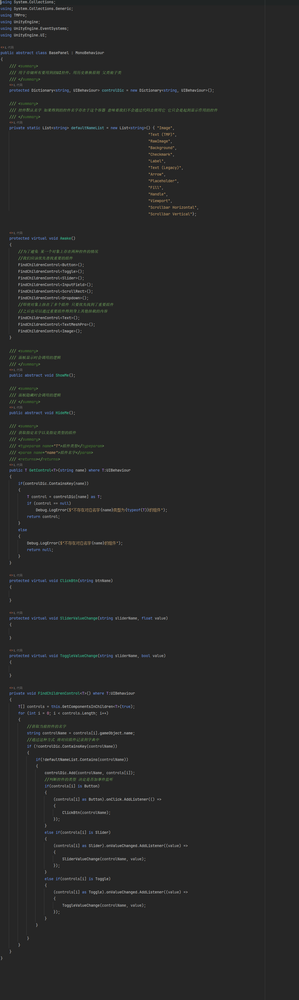

#### 【UI管理模块】UI管理器层级规划

##### 知识回顾 制作UI管理器的目的 

- 方便管理所有UI面板 
- 控制UI面板的显示隐藏 
-   提供公共API供外部使用 
-   比如： 
-   1:显示面板 
-   2:隐藏面板 
-   3:获取面板 
-   4:添加自定义事件 
-   等等

##### 知识点 制作UI管理器层级规划功能 

- 主要思路： 
- 1.UI面板在任何场景都会显示，因此Canvas和EventSystem对象应该过场景不移除，并且保证唯一性和动态创建 
-   1-1.UI管理器为不继承MonoBehaviour的单例模式 
-   1-2.在构造函数中动态创建设置好的Canvas和EventSystem预设体(如果使用了UI摄像机，也需要单独处理摄像机预设体) 
  
- 2.UI面板的显示可以存在层级（前后）关系，我们可以预先创建好层级对象，提供获取层级对象的方法 
-   2-1.在Canvas下创建好管理层级的子对象，之后面板作为对应层级对象的子对象达到分层作用 
-   2-2.提供获取层级对象的方法

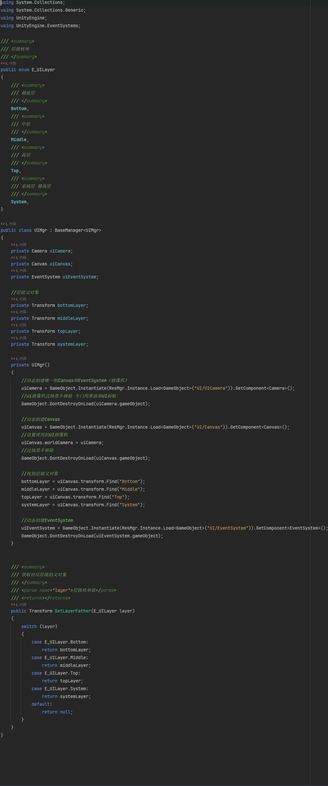

#### 【UI管理模块】UI管理器具体实现

##### 


## 九、场景切换模块

#### 1.【场景切换模块】基本原理

##### 必备知识点 

- 1.场景切换 相关知识点 （Unity四部曲之Unity入门） 
- 2.协同程序 相关知识点 （Unity四部曲之Unity基础） 
- 3.委托 相关知识点 （C#四部曲之C#进阶）


##### 知识点一 为什么要制作场景切换模块 

- 在游戏开发中很多时候可能需要进行场景切换 
- 只要存在场景切换，我们往往需要在 切换场景时 和 切换场景结束后 进行一些操作 
- 比如：
- 1.切换场景中 
-   更新Loading界面进度条 
- 2.切换场景后 
-  隐藏Loading界面 
-  动态创建场景中关卡信息:如角色、怪物、场景物件等等 
  
- 因此为了避免有太多关于切换场景的冗余代码 
- 并且为了使用更方便 
- 我们可以将切换场景的逻辑统一整理在一个场景切换管理器中

##### 知识点二 实现场景切换模块的主要思路 

- 1.制作SceneMgr单例模式管理器 
- 2.实现同步加载场景 的公共方法 
- 3.实现异步加载场景 的公共方法 
- 4.实现外部获取异步加载场景进度

#### 2.【场景切换模块】 具体实现


## 十、输入控制模块

#### 1.【输入控制模块】基本原理

##### 必备知识点 

- 1.Unity中Input公共类 相关知识点（Unity四部曲之Unity入门中） 
- 2.事件中心模块 
  
- 注意： 
- 1.本节课主要针对的是PC端 鼠标键盘输入相关的内容 
-   如果是手游，会有些不同，但是整体思路是一致的 
- 2.本节课中主要针对老输入系统（Input公共类）进行封装
-   新输入系统（InputSystem）相关知识请观看我的另一套课程（Unity进阶之InputSystem）

##### 知识点一 为什么要制作 输入控制模块 

- 制作输入控制模块主要是降低 输入相关代码的耦合性 
- 以前我们制作老输入系统相关功能，都是在Update当中进行按键检测 处理对应逻辑 
- 但是当游戏开发中存在角色切换功能时，可能就会存在冗余代码 
- 所以我们将通过输入控制模块来降低代码耦合性，减少冗余代码

##### 知识点二 输入控制模块的基本原理 

- 1.制作InputMgr单例模式管理器 
- 2.在输入管理器中进行按键检测 
- 3.利用事件中心分发事件 
- 4.在希望处理输入逻辑的位置监听事件

#### 2.【输入控制模块】具体实现

##### 知识点 实现输入控制模块 

- 主要要实现的就是监听 
- 键盘、鼠标、热键的输入 
- 并分发事件 
  
- 1.制作InputMgr单例模式管理器 
- 2.在输入管理器中进行按键检测 
- 3.利用事件中心分发事件 
- 4.在希望处理输入逻辑的位置监听事件 
- 5.提供输入系统检测开关

##### 提出问题 

- 自己思考，我不会讲 
- 1.多开关，分别控制键盘、鼠标、热键检测的开关 —— 思路：加bool值 
- 2.按下、抬起、长按3种类型的事件合3为1 —— 思路：通过参数传递当前事件类型 
- 进阶优化中会讲解的 
- 3.如何制作改键功能


````ad-tip
这种写法 需要一个个添加监测的按键 且 需要在EventType里添加多种按键输入事件类型（按下、抬起、持续按下等） 不推荐
````


```C#
using System.Collections;  
using System.Collections.Generic;  
using UnityEngine;  
  
public class InputMgr : BaseManager<InputMgr>  
{  
    //是否开启了输入系统检测  
    private bool isStart;  
  
    private InputMgr()  
    {        MonoMgr.Instance.AddUpdateListener(InputUpdate);  
    }  
    /// <summary>  
    /// 开启或者关闭我们的输入管理模块的检测  
    /// </summary>  
    /// <param name="isStart"></param>    public void StartOrCloseInputMgr(bool isStart)  
    {       
     this.isStart = isStart;  
    }  
    private void InputUpdate()  
    {        //如果外部没有开启检测功能 就不要检测  
        if (!isStart)  
            return;  
  
        CheckKeyCode(KeyCode.W);  
        CheckKeyCode(KeyCode.A);  
        CheckKeyCode(KeyCode.S);  
        CheckKeyCode(KeyCode.D);  
  
        CheckKeyCode(KeyCode.H);  
        CheckKeyCode(KeyCode.J);  
        CheckKeyCode(KeyCode.K);  
        CheckKeyCode(KeyCode.L);  
  
        CheckMouse(0);  
        CheckMouse(1);  
  
        EventCenter.Instance.EventTrigger(E_EventType.E_Input_Horizontal, Input.GetAxis("Horizontal"));  
  
        EventCenter.Instance.EventTrigger(E_EventType.E_Input_Vertical, Input.GetAxis("Vertical"));  
    }  
    private void CheckKeyCode(KeyCode key)  
    {        if (Input.GetKeyDown(key))  
            EventCenter.Instance.EventTrigger(E_EventType.E_Keyboard_Down, key);  
  
        if (Input.GetKeyUp(key))  
            EventCenter.Instance.EventTrigger(E_EventType.E_Keyboard_Up, key);  
  
        if (Input.GetKey(key))  
            EventCenter.Instance.EventTrigger(E_EventType.E_Keyboard, key);  
    }  
    private void CheckMouse(int mouseID)  
    {        if (Input.GetMouseButtonDown(mouseID))  
            EventCenter.Instance.EventTrigger(E_EventType.E_Mouse_Down, mouseID);  
        if (Input.GetMouseButtonUp(mouseID))  
            EventCenter.Instance.EventTrigger(E_EventType.E_Mouse_Up, mouseID);  
        if (Input.GetMouseButton(mouseID))  
            EventCenter.Instance.EventTrigger(E_EventType.E_Mouse, mouseID);  
    }  
}
```


#### 【3.输入控制模块】进阶优化 改建功能

##### 知识点一 分析改建功能需求 

- 1.改建功能应该是针对某一个行为的 
-   游戏中的行为是固定的，我们需要改变的是触发该行为的按键 
-   比如：角色有技能1、技能2、技能3，我们改变的是触发这些行为的输入 
  
- 2.具体键位的触发不应该写死 
-   而是需要根据存储的键位数据进行初始化或进行修改 
  
- 3.键位的修改可以是键盘输入，也可以是鼠标输入，输入类型也可以是任意的 
-   比如：触发技能1，可以修改为键盘输入，也可以修改为鼠标输入 
-   可以是按下、可以是抬起、也可以是长按，具体是哪种应该根据你的需求变化

##### 知识点二 根据需求整理思路并制作 

- 输入管理器主要做的事情 
- 根据输入的信息，触发对应的事件 
- 其中输入信息可变，触发的事件也可变 
  
- 1.改建功能应该是针对某一个行为的 
-   触发的事件类型应该是针对行为的，因为行为一般在游戏中是固定的 
  
- 2.具体键位的触发不应该写死 
-   输入管理器中应该声明字典容器 
-   键：触发事件的类型 
-   值：具体的输入信息（键盘还是鼠标、按下还是抬起还是长按、那个键） 
  
- 3.键位的修改可以是键盘输入，也可以是鼠标输入，输入类型也可以是任意的 
-   输入管理器应该提供初始化行为对应的键位方法

##### 总结 

- 我们只需要使用数据持久化、UI相关知识点，再结合这节课的输入管理器 就可以做出完整的改建功能了 
  
- 遗留问题： 
- 在真正制作改建功能时 
- 我们应该如何获取到任意键盘或任意鼠标输入来记录对应的输入信息


````ad-tip
这里写了具体改键的函数方法  但是只是提供了对外API 想要真正改键 还需要得到玩家的控制器输入信息  

思路 ->  提供方法  要求参数 ：

1.对应触发的事件（因为InputMgr本身是通过字典存入键值对 事件类型->玩家输入信息存储的），输入信息中的具体键位（因为提供的方法

2.输入信息中的具体键位（因为提供的方法 本来给的就是对应控制器的改键方法，方法内部会主动把输入信息的控制器类型写死 ）
````


#### 【输入控制模块】进阶优化 获取输入信息

##### 知识点一 实现获取输入信息逻辑 

- 在InputMgr的更新函数中 
- 获取当前输入内容 
- 用委托返回给外部 

- 主要思路： 
- 当存在按下输入时 
- 遍历监听KeyCode枚举中所有键位，检测是哪个键位输入了 
- 监听鼠标左中右键键位，检测是哪个键位输入了

##### 知识点二 延迟一帧获取 

- 由于开启检测输入时可能伴随着键盘或者鼠标输入 
- 因此我们利用协同程序延迟一帧再进行检测


````ad-tip
这里相当于是 首先用暴露给外部的方法 来使得InputMgr开始检测键盘输入

然后给技能 1 2 3 赋初始键位

之后为技能 123 的事件添加监听（实际只是把事件注册在InputMgr声明的inputDic里 方便后面用EventTrigger调用） 

有时候 某些按键可触发的事件 不会直接提供键位 需要玩家自己设置 所以更改键位的设置里 会进行一次判断字典里有没有存入这个事件以及对应的触发信息

具体事件触发之后的行为 需要在添加事件中心监听的API调用里写

另外 这里用了Enum.GetValues(typeof(T))来获取KeyCode中的所有枚举,返回值类型是Array
````


```C#
    //是否开始检测输入信息  
    private bool isBeginCheckInput = false;  
  
    private InputMgr()  
    {        
        MonoMgr.Instance.AddUpdateListener(InputUpdate);  
    }  
    /// <summary>  
    /// 开启或者关闭我们的输入管理模块的检测  
    /// </summary>  
    /// <param name="isStart"></param>    
    public void StartOrCloseInputMgr(bool isStart)  
    {        
        this.isStart = isStart;  
    }  
    /// <summary>  
    /// 提供给外部改建或初始化的方法(键盘)  
    /// </summary>    
    /// <param name="key"></param>    
    /// <param name="inputType"></param>    
    public void ChangeKeyboardInfo(E_EventType eventType, KeyCode key, InputInfo.E_InputType inputType)  
    {        
        //初始化  
        if(!inputDic.ContainsKey(eventType))  
        {            
            inputDic.Add(eventType, new InputInfo(inputType, key));  
        }        
        else
        //改键  
        {  
            //如果之前是鼠标 我们必须要修改它的按键类型  
            inputDic[eventType].keyOrMouse = InputInfo.E_KeyOrMouse.Key;  
            inputDic[eventType].key = key;  
            inputDic[eventType].inputType = inputType;  
        }   
    }  
    /// <summary>  
    /// 提供给外部改建或初始化的方法(鼠标)  
    /// </summary>    
    /// <param name="eventType"></param>    
    /// <param name="mouseID"></param>    
    /// <param name="inputType"></param>    
    public void ChangeMouseInfo(E_EventType eventType, int mouseID, InputInfo.E_InputType inputType)  
    {        //初始化  
        if (!inputDic.ContainsKey(eventType))  
        {            
            inputDic.Add(eventType, new InputInfo(inputType, mouseID));  
        }        
        else//改键  
        {  
            //如果之前是鼠标 我们必须要修改它的按键类型  
            inputDic[eventType].keyOrMouse = InputInfo.E_KeyOrMouse.Mouse;  
            inputDic[eventType].mouseID = mouseID;  
            inputDic[eventType].inputType = inputType;  
        }    
    }  
    /// <summary>  
    /// 移除指定行为的输入监听  
    /// </summary>  
    /// <param name="eventType"></param>    
    public void RemoveInputInfo(E_EventType eventType)  
    {        
        if (inputDic.ContainsKey(eventType))  
            inputDic.Remove(eventType);  
    }    
    /// <summary>  
    /// 获取下一次的输入信息  
    /// </summary>  
    /// <param name="callBack"></param>    
    public void GetInputInfo(UnityAction<InputInfo> callBack)  
    {        
        getInputInfoCallBack = callBack;  
        MonoMgr.Instance.StartCoroutine(BeginCheckInput());  
    }  
    private IEnumerator BeginCheckInput()  
    {        //等一帧  
        yield return 0;  
        //一帧后才会被置成true  
        isBeginCheckInput = true;  
    }  
    private void InputUpdate()  
    {        
        //当委托不为空时 证明想要获取到输入的信息 传递给外部  
        if(isBeginCheckInput)  
        {            
            //当一个键按下时 然后遍历所有按键信息 得到是谁被按下了  
            if (Input.anyKeyDown)  
            {                
                InputInfo inputInfo = null;  
                //我们需要去遍历监听所有键位的按下 来得到对应输入的信息  
                //键盘  
                Array keyCodes = Enum.GetValues(typeof(KeyCode));  
                foreach (KeyCode inputKey in keyCodes)  
                {                    
                    //判断到底是谁被按下了 那么就可以得到对应的输入的键盘信息  
                    if (Input.GetKeyDown(inputKey))  
                    {                        
                        inputInfo = new InputInfo(InputInfo.E_InputType.Down, inputKey);  
                        break;  
                    }                
                }                
                //鼠标  
                for (int i = 0; i < 3; i++)  
                {                    
                    if (Input.GetMouseButtonDown(i))  
                    {                        
                        inputInfo = new InputInfo(InputInfo.E_InputType.Down, i);  
                        break;  
                    }                
                }                
                //把获取到的信息传递给外部  
                getInputInfoCallBack.Invoke(inputInfo);  
                getInputInfoCallBack = null;  
                //检测一次后就停止检测了  
                isBeginCheckInput = false;  
            }        
        }         
  
        //如果外部没有开启检测功能 就不要检测  
        if (!isStart)  
            return;  
  
        foreach (E_EventType eventType in inputDic.Keys)  
        {            
            nowInputInfo = inputDic[eventType];  
            //如果是键盘输入  
            if(nowInputInfo.keyOrMouse == InputInfo.E_KeyOrMouse.Key)  
            {                
                //是抬起还是按下还是长按  
                switch (nowInputInfo.inputType)  
                {                    
                    case InputInfo.E_InputType.Down:  
                        if (Input.GetKeyDown(nowInputInfo.key))  
                            EventCenter.Instance.EventTrigger(eventType);  
                        break;  
                    case InputInfo.E_InputType.Up:  
                        if (Input.GetKeyUp(nowInputInfo.key))  
                            EventCenter.Instance.EventTrigger(eventType);  
                        break;  
                    case InputInfo.E_InputType.Always:  
                        if (Input.GetKey(nowInputInfo.key))  
                            EventCenter.Instance.EventTrigger(eventType);  
                        break;  
                    default:  
                        break;  
                }            
            }           
             //如果是鼠标输入  
            else  
            {  
                switch (nowInputInfo.inputType)  
                {                   
                     case InputInfo.E_InputType.Down:  
                        if (Input.GetMouseButtonDown(nowInputInfo.mouseID))  
                            EventCenter.Instance.EventTrigger(eventType);  
                        break;  
                    case InputInfo.E_InputType.Up:  
                        if (Input.GetMouseButtonUp(nowInputInfo.mouseID))  
                            EventCenter.Instance.EventTrigger(eventType);  
                        break;  
                    case InputInfo.E_InputType.Always:  
                        if (Input.GetMouseButton(nowInputInfo.mouseID))  
                            EventCenter.Instance.EventTrigger(eventType);  
                        break;  
                    default:  
                        break;  
                }            
            }       
         }  
        EventCenter.Instance.EventTrigger(E_EventType.E_Input_Horizontal, Input.GetAxis("Horizontal"));  
        EventCenter.Instance.EventTrigger(E_EventType.E_Input_Vertical, Input.GetAxis("Vertical"));  
    }  
}
```


## 十一、其他模块

#### 1.【缓存池模块（数据结构类、逻辑类）优化】主要目的

##### 知识点一 缓存池模块(数据结构类、逻辑类)优化 主要目的是什么？

- 我们目前实现的缓存池

- 主要是针对场景上的GameObject对象的

- 我们只能对场景上的对象进行缓存池功能处理

  

 - 但是在游戏开发中，还会存在大量的不需要挂载到场景上的实例化对象

- 比如一些数据结构类、逻辑类，它们并不依附于场景上的对象，而仅仅是被引用

 - 举例：

- 一个自定义数据结构类

- TestData t = new TestData();

 - 当我们不使用它时，往往会将其置空

 - t = null;

 - 下次又要使用时，再new

 - t = new TestData();

- 那么对于一些频繁使用的数据结构类或逻辑类

- 这样做也会产生大量的垃圾

- 因此我们完全可以修改缓存池模块，让其也支持对不挂载的类对象也进行复用

  

- 说人话

- 缓存池模块(数据结构类、逻辑类)优化 主要目的是

- 让缓存池支持回收复用不继承MonoBehaviour（不挂载GameObject）的类对象

##### 存池模块(数据结构类、逻辑类)优化 制作思路

 - 1.修改缓存池管理器PoolMgr

 - 2.添加一个新池子容器，专门用来记录不继承MonoBehaviour（不挂载GameObject）的类对象

 - 3.提供专门的方法供外部使用

 -   3-1.从池子中获取对象的方法

 -   3-2.压入池子中的方法

 -   3-3.清空池子容器的方法

  

 - 注意：由于这些自定义数据或逻辑类中可能有对其他内容的引用

 -      因此需要让其有一个重置数据的方法，在压入池子时重置数据

#### 2.【缓存池模块（数据结构类、逻辑类）优化】主要具体实现

##### 知识点 缓存池模块(数据结构类、逻辑类)优化 具体实现

  - 主要思路：

  - 1.修改缓存池管理器PoolMgr

  - 2.添加一个新池子容器，专门用来记录不继承MonoBehaviour（不挂载GameObject）的类对象

  - 3.提供==专门的方法=供外部使用

  -   3-1.从==池子中获取对象==的方法

  -   3-2.==压入池子==中的方法

  -   3-3.==清空池子==容器的方法

  

  - 注意：由于这些自定义数据或逻辑类中可能有对其他内容的引用

  -      因此需要让其有一个重置数据的方法，在压入池子时重置数据

  

  - 关键点：
  - 1.==池子容器父类== 里式替换 ==父类装子类==

  - 2.==池子容器子类== ==泛型==类 确定对象类型

  - 3.对象==父接口==，用于实现==重置数据==方法


````ad-tip
由于这种自定义脚本 一般只挂载一个 只是重复调用

所以没有写数量限制 也没有设置自动挂载父节点 只是将其存在了索引为键 脚本对象为值的字典中 并为其声明了
````

#### 优化方面


#### 3.【计时器模块】基本原理

##### 知识回顾 Unity自带的计时功能 

- 继承MonoBehaviour的组件，可以利用 
-   1.Invoke 延迟执行逻辑 
-   2.InvokeRepeating 间隔一定时间执行逻辑 
-   3.协同程序 来计时 
-   4.Update中 自己实现计时功能

##### 知识点一 为什么要自己制作计时器模块 

- 主要原因：
- 1.使用Unity自带的计时功能，不能为所有类服务（只能继承了MonoBehaviour才能使用） 
- 2.利用协同程序和Update制作计时功能，如果需要都写，会产生代码冗余（写一堆类似重复的代码） 
  
- 因此 
- 我们将计时功能统一的进行管理，让所有系统都能够通过计时器模块进行计时

##### 知识点二 计时器模块的基本原理 

- 想要达到的效果： 
- 1.能够延时响应逻辑（比如：10s后执行某一逻辑） 
- 2.在延时过程中，可以固定时间间隔响应逻辑（比如：10s后执行某一逻辑，但是10s内每隔1s又能响应其它逻辑） 

- 基本原理： 
- 1.定义一个计时器对象，计时器对象记录延时执行时间、间隔执行时间、执行结束回调委托、间隔执行回调委托等等 
- 2.计时器模块中统一管理所有计时器对象，每个计时器对象有一个唯一ID，用来区分获取计时器对象 
- 3.在计时器模块中利用一个协同程序固定间隔时间进行计时器对象的时间检测 
- 4.计时器模块中提供创建计时器、移除计时器、停止计时器、开始计时器、重置计时器的相关方法 
  
- 主要要实现的类： 
- 计时器模块管理器 
- TimerMgr 
-   需要声明的关键成员 
-   1.计时器字典容器 
-   2.待移除计时器列表容器 
-   等等 
-   需要实现的关键方法 
-   1.开启计时器管理器 
-   2.关闭计时器管理器 
-   3.创建单个计时器 
-   4.移除单个计时器 
-   5.重置单个计时器 
-   6.开启单个计时器 
-   7.停止单个计时器 
-   等等 

- 计时器对象类 
- TimerItem 
-   需要声明的关键成员 
-   1.唯一ID 
-   2.延时执行回调委托 
-   3.间隔执行回到委托 
-   4.总时间 
-   5.间隔时间 
-   6.是否开启 
-   等等 
-   需要实现的关键方法 
-   1.初始化数据 
-   2.重置时间 
-   等等

#### 4.【计时器模块】具体实现 TimerItem

##### 知识点 实现 计时器模块 

- 想要达到的效果： 
- 1.能够延时响应逻辑（比如：10s后执行某一逻辑） 
- 2.在延时过程中，可以固定时间间隔响应逻辑（比如：10s后执行某一逻辑，但是10s内每隔1s又能响应其它逻辑） 
  
- 基本原理： 
- 1.定义一个计时器对象，计时器对象记录延时执行时间、间隔执行时间、执行结束回调委托、间隔执行回调委托等等 
- 2.计时器模块中统一管理所有计时器对象，每个计时器对象有一个唯一ID，用来区分获取计时器对象 
- 3.在计时器模块中利用一个协同程序固定间隔时间进行计时器对象的时间检测 
- 4.计时器模块中提供创建计时器、移除计时器、停止计时器、开始计时器、重置计时器的相关方法 
  
- 主要要实现的类： 
- 计时器模块管理器 
- TimerMgr 
-   需要声明的关键成员 
-   1.计时器字典容器 
-   2.待移除计时器列表容器 
-   等等  
-   需要实现的关键方法 
-   1.开启计时器管理器 
-   2.关闭计时器管理器 
-   3.创建单个计时器 
-   4.移除单个计时器 
-   5.重置单个计时器 
-   6.开启单个计时器 
-   7.停止单个计时器 
-   等等 
  
- 计时器对象类 
- TimerItem 
-   需要声明的关键成员 
-   1.唯一ID 
-   2.延时执行回调委托 
-   3.间隔执行回到委托 
-   4.总时间 
-   5.间隔时间 
-   6.是否开启 
-   等等 
-   需要实现的关键方法 
-   1.初始化数据 
-   2.重置时间 
-   等等

##### 提出问题 

- 目前的计时器管理器会受到 Time.timeScale 的影响 
- 我们应该如何让计时器管理器可以自己决定是否受到它的影响呢？

````ad-tip
# 这里的maxAllTime是用来存储allTime初始值的，maxIntervalTime同理

# 主要用来在调用InitInfo重置时间时 让 allTime 和 maxIntervalTime恢复初始值

````


````ad-tip
这里在将计时器对象添加入缓存池时，用的是Push（计时器对象类型）而不是显示调用泛型类  是因为泛型类的两个参数 namespace本身有默认值 且脚本会自动推断字典和数组中存储的计时器对象类型 确认是泛型调用

同时 不用给nameSpace赋值是因为计时器对象是脚本对象 并非需要加载路径的预设体之类  所以不需要nameSpace
````


#### 5.【计时器模块】进阶优化

##### 必备知识点 

- Unity中 
- 在协同程序中使用 
- yield return new WaitForSeconds(秒); 
- 会受到Time.timeScale影响 
- 但是Unity也提供了不受其影响的 
- yield return new WaitForSecondsRealtime(秒); 
- 我们将利用它制作不受timeScale影响的计时器

##### 知识点 计时器模块 进阶优化 

- 主要制作思路： 
- 在计时器模块中 
- 保留之前的受Time.timeScale影响的计时器 
- 并添加一种不受其影响的计时器 
- 让开发者可以根据需求选择使用 
  
- 主要修改处： 
- 1.添加一个字典容器专门记录不受其影响的计时器 
- 2.多开一个协同程序专门用于处理不受其影响的计时器 
- 3.修改相关方法


## 其他工具模块 

#### 1.【加密工具模块】主要作用和基本原理

##### 知识点一 加密工具模块 主要作用 

- 在游戏开发中 
- 为了防止玩家利用修改器等工具修改游戏数据 
- 我们往往会加入数据加密功能 
- 主要作用就是提高游戏安全性，防止被修改 
- 而加密工具模块就是为了方便数据加密而存在的 
  
- 加密工具模块的主要作用 
- 就是将存储在内存中的数据进行加密 
- 避免玩家利用修改器查找内存中数据进行修改

##### 知识点二 加密工具模块 基本原理 

- 加密： 
- 将原本存储在内存中的值进行加密后变换为另一个值存储在内存中 
- 解密： 
- 将内存中存储的值进行解密后得到原始值 
- 加密算法： 
- 异或加密 
  
- 我们将新建一个加密工具类 
- 主要提供以下方法： 
- 1.获取随机密钥 方法 
- 2.加密数据 方法 
- 3.解密数据 方法 
  
- 只要在需要加密的地方进行相关方法调用即可

#### 2.【加密工具模块】具体实现

##### 知识点一 了解我们将如何使用加密工具模块 

##### 知识点二 实现加密工具模块 

- 主要提供以下方法： 
- 1.获取随机密钥 方法 
- 2.加密数据 方法 
- 3.解密数据 方法

##### 知识点三 测试加密工具模块 

- TestPlayer player = new TestPlayer(); 
- player.HP = 100; 
- print(player.HP);


````ad-tip
这里的判断是否为0 是为了确保 字段是否没有经过加密 还是初始值或者数值就是0 导致错误解密计算 

同时 在加密逻辑里的最后一行+=key 是防止前面的逻辑 让原来的数值的加密产物数值正好等于0 保证最后产出的加密数值 一般大于0（除非初始值就是0）  这样解密时能进正常的解密判断
````


````ad-tip
一般的逻辑调用：

设置数值时加密 想取得时解密

比如 一个角色的血量  先写一个Player类  里面 hp时private 修饰的  为这个hp写一个takeDamege方法 受外部调用 里面写了伤害逻辑 和 自动调用UI控件的更新方法 updateUI

申明属性HP  专门用来调用加密解密方法  假使 角色受到了伤害 那么 攻击方的武器/技能 触发导致的伤害检测会调用角色的takeDamge方法 来使得角色的HP发生改变 

此时hp存的应该是一串乱码 或者无关数字 调用Player.HP时会自动解码hp 得到你希望的数值 

HP发生改变之后 自动调用updatUI方法 来返回hp.text = HP;由于HP是自动解密的 得到的也会是需要的数值（当然  这里没有用MVC思想 存在逻辑层和UI层的耦合）

具体HP在存档后是可以在存档文件中修改的  所以仍然存在被修改的风险（修改存档之后读取） 这时候就要另一套对存档进行加密的规则了 这里推荐使用二进制存储 并写专门逻辑来防止泄密
````

#### 3.【文字工具模块】主要作用和基本原理

##### 知识点一 文本工具模块 主要作用 

- 在游戏开发中 
- 经常会对字符串进行一些处理 
- 而这些处理往往会在多处使用 
- 为了减少代码冗余 
- 我们往往会把常用的文本操作逻辑 
- 封装到一个工具类中提供给外部使用 
  
- 因此文本工具模块 
- 主要就是提取通用的文本处理逻辑封装为方法 
- 供外部使用

##### 知识点二 文本工具模块 基本原理 

- 我们将新建一个文本工具类 
- 主要提供以下方法： 
- 1.字符串拆封公共方法 
-   字符串拆分为字符串数组 
-   字符串拆分为int数组 
- 2.数字前补0转字符串 
- 3.秒转时分秒 
- 4.秒转00:00:00 
- 5.大数据数值转换 
- 等等 

- 我们只实现以上方法 
- 更多内容，在实际开发时根据需求加入到工具类中即可

#### 4.【文本工具模块】具体实现 字符串拆分为字符串数组

##### 知识点 实现文本工具类中的 字符串拆分方法 
- 为什么要封装字符串拆分方法 
  
- 我们在配置表中 
- 经常会配置如下格式的字符串数据 
- - 2,11|3,12|4,55 
- 遇到这种数据时，我们往往会使用string中的Split方法进行拆分 
  
- 我们想要通过封装满足以下的需求 
- 1.避免符号填写错误，英文字符填写成中文字符 
- 2.能够直接拆分获取到int数组


````ad-danger
这里 return 一个长度为0的新数组 是因为要防止 没有正确读取或者本身不存在为空  然后在遍历时报错
````


#### 5.【文本工具模块】 具体实现 数字转字符串相关

##### 知识点 必备知识点 

- 1.内插字符串 相关知识点（C#四部曲之C#进阶中）其实就是$在输出字符串时的用法
- 2.ToString() 相关知识点（C#四部曲之C#核心中）

##### 知识点一 实现文本工具类中的 转字符串数字前补0 的方法 
- 为什么要封装 转字符串数字前补0 的方法 
  
- 我们在游戏开发中界面显示时 
- 经常可能会有这样的需求 
- 要在界面中显示 
- 0001 
- 01 
- 010 
- 也就是说想要让某个数字在转换为字符串时 
- 可以指定转换的字符串长度 
- 并且能够在数字前自动的添加0 
  
- print(TextUtil.GetNumStr(1, 4));           - 0001 
- print(TextUtil.GetNumStr(10, 3));         - 010 
- print(TextUtil.GetNumStr(1000, 3));     - 1000


##### 知识点二 实现文本工具类中的 转字符串保留n位小数 的方法 
- 为什么要封装 转字符串保留n位小数 的方法 
  
- 我们在游戏开发中界面显示时 
- 经常可能会有这样的需求 
- 要在界面中显示 
- 3.1415926 保留两位小数 只显示 3.14 
- 也就是说想要让某个数字在转换为字符串时 
- 可以指定保留小数点后的位数 
  
- print(TextUtil.GetDecimalStr(3.1415926f, 2));- 3.14 
- print(TextUtil.GetDecimalStr(3.1415926f, 4));- 3.1415 
- print(TextUtil.GetDecimalStr(0.000006f, 2));- 0.00


