## 一、Unity性能分析工具
### ①.性能分析工具 概述

#### 分析工具 概述

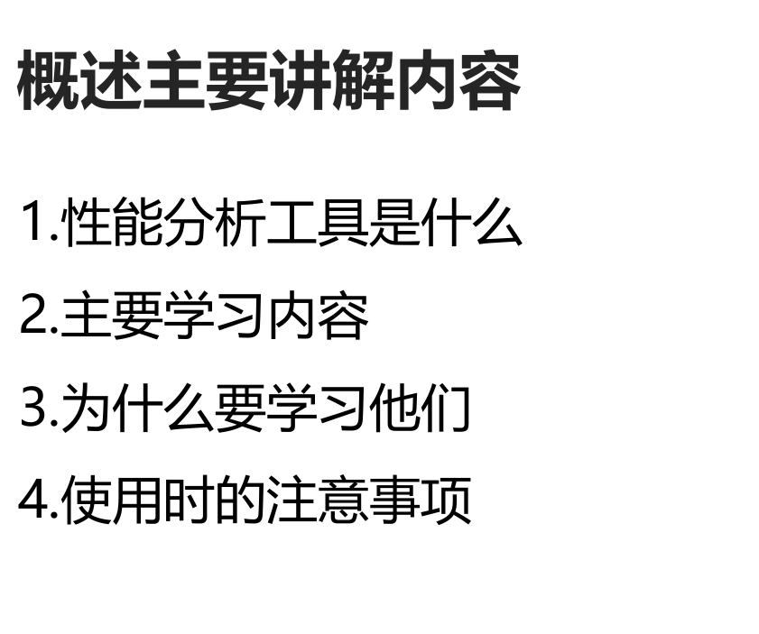
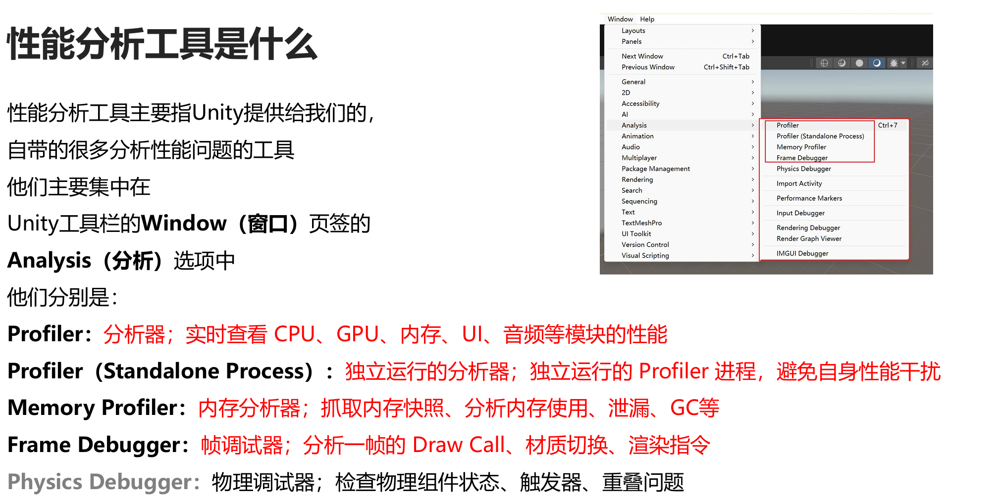

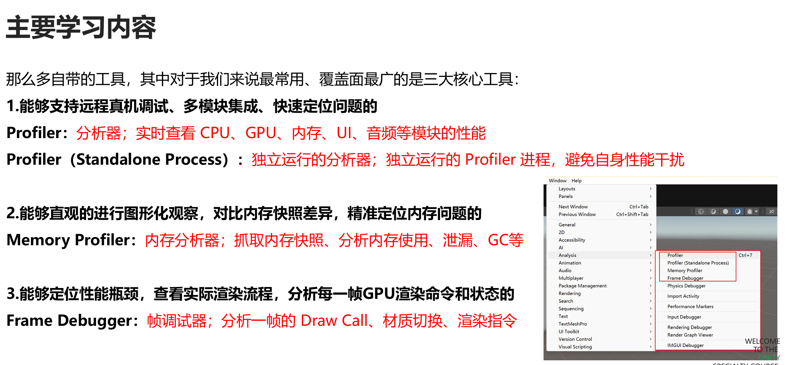

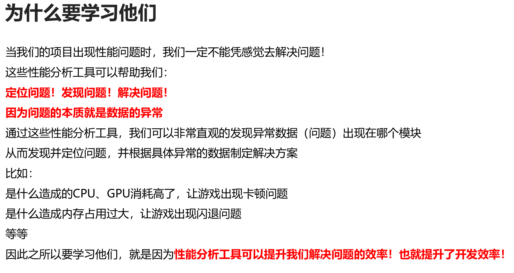
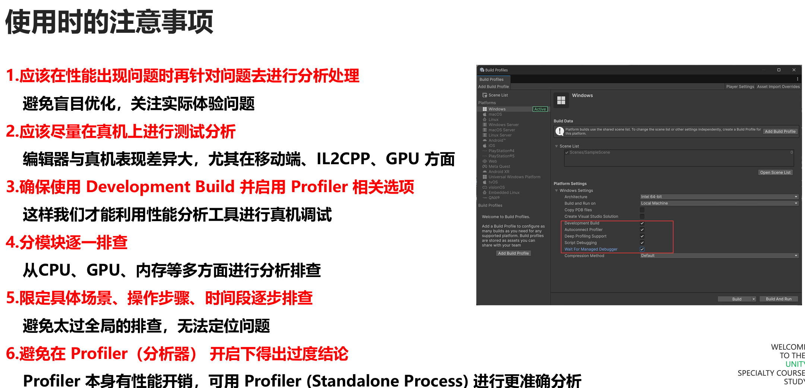
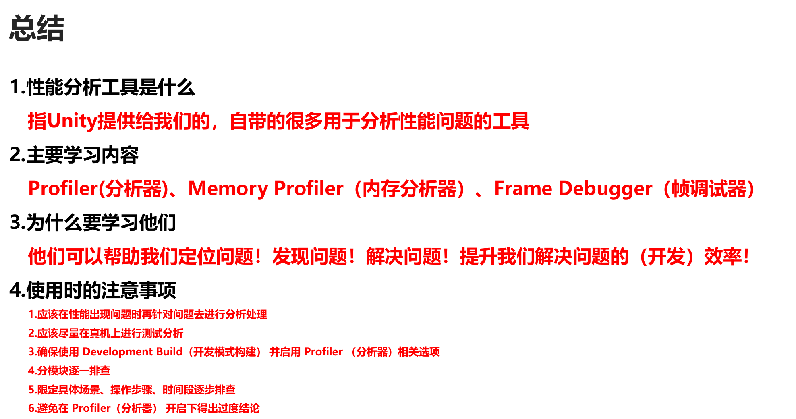

### ②Unity Profiler

#### 1.初识 性能分析窗口

##### 知识点一 知道如何打开性能分析器窗口 

- Window——>Analysis——>Profiler或Profiler（Standalone Process）

##### 知识点二 了解两种分析器窗口的区别 

-   Profiler: 
-   内嵌在 Unity 编辑器中的性能分析工具，默认使用，方便调试 
-   它同属 Unity Editor 进程，会对游戏性能造成 一定干扰（特别是深度采样或低端设备） 
-   更适合日常开发调试、小项目、局部功能分析 
  
-   Profiler (Standalone Process): 
-   独立运行的分析器，可最大限度减少对被分析游戏的性能干扰，更适合真实测试 
-   更适合复杂场景、大型项目、真机性能分析

##### 知识点三 大致了解窗口中的各模块 

- 为之后的学习做好准备

#### 顶部页签

##### 知识点 Profiler窗口的顶部页签 

- 主要目标 
- 1.了解Profiler顶部页签中每一部分的作用 
- 2.着重记忆（记录）重要参数含义


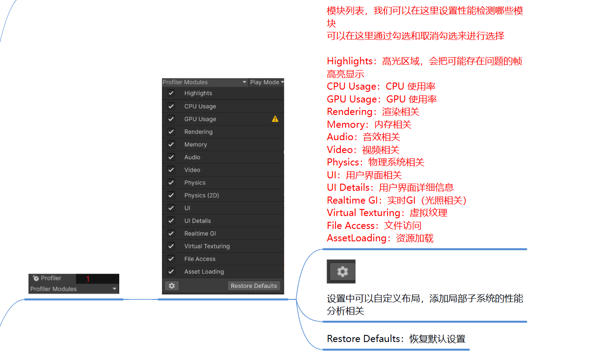
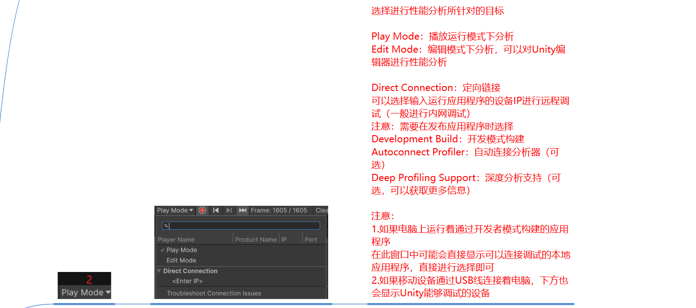
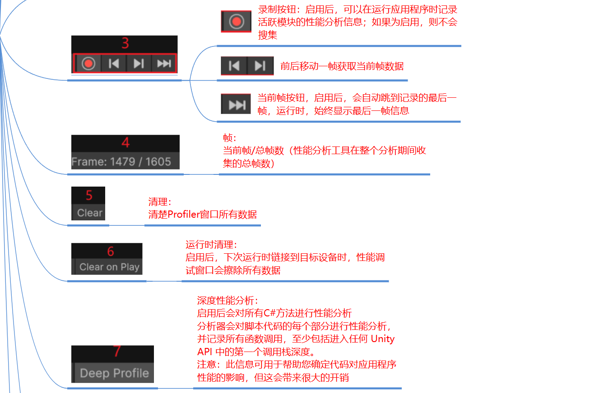

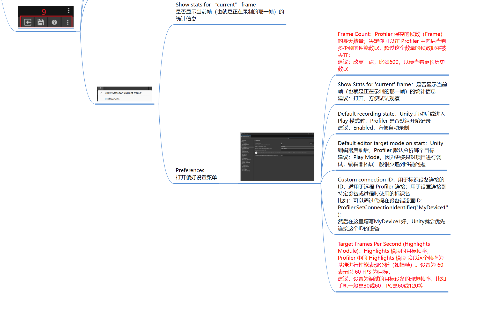


## 二、性能优化 

### ①Unity机制可能带来的问题

#### 1.脚本挂载问题

##### 识点一 Unity机制可能带来的问题指什么 

- Unity 引擎本身的设计机制或默认行为在某些情况下会导致性能、可维护性或功能性问题。 
- 这些问题往往是非业务逻辑造成的隐患或小坑 
- 我们需要了解这些注意事项，从而避免对我们的性能分析带来干扰

#### 知识点二 检测脚本是否挂载的==重要性 ==

- 由于Unity的工作机制，继承MonoBehaviour的脚本必须挂载到对象上才有意义 
- 我们在排查性能问题时，==一定要确定相关脚本已经挂载 ==
- # 最简单有效的方式就是在Hierarchy窗口中输入 
- # t:脚本名 
- 这样==Hierarchy窗口==中就==会显示挂载了该脚本的对象==

##### 知识点三 检测脚本的执行次数 

- 如果我们在使用Profiler进行问题排查时 
- 发现某个MonoBehaviour方法执行的次数比预期的多或者执行的时间比预期的长 
- 这时我们就应该排查该脚本在场景上出现的次数是否和预期的一样 
- 避免由于挂载失误导致性能问题

#### 2.生命周期函数的问题

##### 知识点一 生命周期函数的调用顺序 

- 我们在进行性能调试和问题定位时 
- 如果不了解或忽略生命周期函数的执行顺序，可能会导致调试误判或遗漏真实性能问题 
- 比如： 
- 1.错误归因性能开销的位置 
-   在 Profiler 中看到帧开头有较大开销 
-   误以为是某个 Update() 耗时过长，但实际是前面的 Start() 或 OnEnable() 初始化造成的 
-   我们不能只是关注Update部分，也要关注在Awake、OnEnable、Start中的逻辑 
-   因为也可能是因为某些逻辑初始化造成的卡顿 
  
- 2.逻辑初始化顺序错乱导致异常 
-   场景中不同脚本中的相同生命周期函数的执行时机是不确定的 
-   当两个脚本相互依赖时，比如A依赖B中的初始化数据 
-   那么我们一定要保证A在使用B数据时，B已经被初始化了 
-   等等

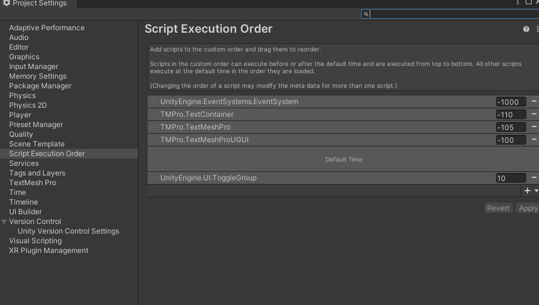

- # 此处数值越小 越先执行 点击+号 可以加入继承Mono的函数

##### 知识点二 不用的生命周期函数 

- 如果在脚本中==定义了生命周期函数 ==
- 但==没有==在其中==写任何逻辑 ==
- 他们==仍然==会带来==额外==的==性能开销 ==
  
- 因此我们要 
- 
- # 避免在脚本中写空的生命周期函数 
  
- ==特别是==那些会==每帧调用的生命周期函数 ==
- 1.Update 
- 2.LateUpdate 
- 3.FixedUpdate 
- 4.OnGUI

#### 3.Debug的性能消耗

##### 知识点一 Debug相关API带来的性能消耗 

- Unity中Debug公共类中提供了日志打印的相关API 
- 比如： 
- Debug.Log 
- Debug.LogError 
- Debug.LogWarning 
- 等等 
- 他们可以用于在Unity的控制台中输出打印信息 
- 帮助我们进行项目调试 
- 但是这些API会带来额外的性能开销 
- 特别是在==最终的发布版本==中，==尽量==都==不要再使用Debug相关API ==
- ==避免==给我们的最终项目带来==额外的开销==，影响项目性能表现 

- *Debug.Log("123");*

##### 知识点二 如何更好的使用Debug相关API 

- 我们可以==对Debug进行二次封装 ==
- 可以让我们更加方便的开关Debug相关API的使用 
- 尽量不影响我们的开发效率 
- *Util.Log("123");*

```C#
using UnityEngine;  
  
public class Util  
{  
    /// <summary>  
    /// 是否是调试状态  
    /// </summary>  
    private static bool isDebug = false;  
  
    public static void Log(object info)  
    {        
        if (!isDebug)  
            return;  
            
        Debug.Log(info);  
    }  
    public static void LogError(object info)  
    {        
        if (!isDebug)  
            return;  
            
        Debug.LogError(info);  
    }
}
```

#### 4.垂直同步带来的等待问题

##### 知识点一 垂直同步的作用 

- 在==未开启垂直同步==的情况下 
- 游戏可能在显示器==未完成当前帧的刷新==时，就==输出下一帧图像==， 
- 导致屏幕的 上下部分显示的是不同的画面内容，这就是“==画面撕裂==”。 
- ==垂直同步==会==强制==显卡==等待==显示器==刷新完成==后再==提交下一帧==图像，从而避免撕裂。 
  
- 但是它可能带来一些==副作用 ==
- 1.输入==延迟增加 ==
-   游戏被迫等待显示器信号，延迟图像输出，会让操作感觉迟钝 
- 2.帧率下降 
-   如果帧率无法维持在刷新率水平，垂直同步会强行降档到下一个可整除值（如从 60 → 30FPS），造成明显卡顿 
  
- 因此在使用垂直同步时应根据实际情况而定 
- 1.对图像撕裂特别敏感的游戏（如第三人称 3D、赛车等） 
- 2.游戏帧率远高于显示器刷新率，容易画面撕裂； 
- 3.对输入延迟不特别敏感的项目

##### 知识点二 垂直同步影响帧率具体分析 

- 显示器通常以固定的频率刷新画面（如 60Hz 表示每秒刷新 60 次，每帧 16.67ms） 
- 而游戏中渲染图像的速度通常不固定，有时快于显示器刷新，有时慢于 
- 垂直同步（VSync）会强制游戏等显示器准备好再提交新帧，避免屏幕撕裂 
  
- 这样可能造成两个问题 
- 1.如果游戏==渲染太快==，它==要等一等==（游戏==帧率会降低==） 
- 2.如果游戏==渲染太慢==，它==只能跳过一帧，延后一轮提交==（游戏==帧率会降低==） 
  
- 影响帧率主要有两种情况 
- 1.游戏帧率略高于刷新率，会强制等待 
-   比如游戏渲染能力是 90FPS，而显示器是 60Hz; 
-   垂直同步开启后，项目 只能 每 16.67ms 渲一帧，即游戏被“卡”在 60FPS 
  
- 2.游戏帧率低于刷新率 ，会被“降档”处理 
-   比如游戏当前只能 50FPS，，而显示器是 60Hz; 
-   垂直同步要求必须整除刷新频率（开启垂直同步时，游戏的帧率必须与显示器刷新率成整数倍的关系） 
-   于是 游戏 被“降档”到 30FPS（60Hz ÷ 2） 
-   这会造成严重卡顿或掉帧感 
  
- 也就是说 
- 垂直同步的开启可能带来游戏帧率下降的问题 
- 如果游戏帧率的下降给玩家带来了不好的体验，建议谨==慎使用垂直同步= 
- 特别是==游戏帧率低于显示器刷新率==的时候，==可以不用开启垂直同步==

##### 知识点三 Unity中如何设置垂直同步开关 

- 1.代码控制 
- #### *QualitySettings.vSyncCount = 0;* 
-   0:关闭垂直同步 
-   1:每帧同步 
-   2:隔一帧同步 
- 2.编辑器中设置 
- Edit > Project Settings > Quality 
- Don't Sync（0）即可关闭 VSync 
- Every V Blank（1）：每次垂直同步（默认） 
- Every Second V Blank（2）：隔一帧同步（更低帧率）
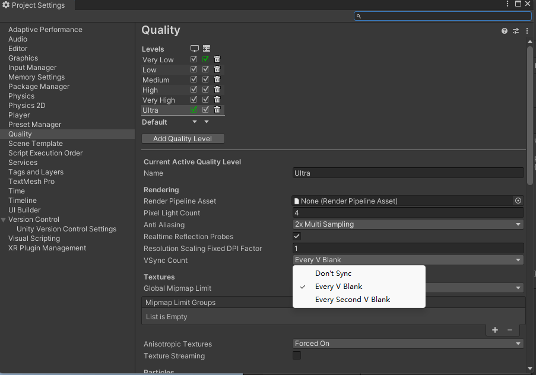
##### 知识点四 使用垂直同步时的注意事项 

- 开发调试时： 
- 通常关闭垂直同步观察真实的 GPU 性能瓶颈 
  
- 低端机运行卡顿时： 
- 关闭垂直同步可减少帧率锁死卡顿 
  
- 正式发包时： 
- 1.帧率较高的项目可以开启垂直同步防止画面撕裂（比如主机、VR的高帧率项目） 
- 2.帧率较低的项目可以关闭垂直同步避免帧率降档 
- 3.或者直接交给玩家在设置中进行设置 
  
- 在使用垂直同步时应注意： 
- 1.确保帧率 >= 显示器刷新率 
-   如果帧率低于刷新率，系统会“降档”（如从 60FPS 降为 30FPS），导致明显卡顿 
-   建议确保游戏至少稳定在刷新率（如60Hz）之上 
- 2.避免频繁掉帧或波动 
-   帧率波动容易触发降档，产生体验断崖式下降 
-   使用 Application.targetFrameRate 或其他方式稳定帧率 
- #### Application.targetFrameRate = 60; 
- 3.测试不同设备刷新率 
-   玩家显示器可能是 60Hz、75Hz、120Hz、144Hz、165Hz 
-   如果你写死了某些逻辑基于固定帧率（比如60FPS），在高刷新率设备上可能出错 
-   应尽量 基于 Time.deltaTime 实现帧无关逻辑 
- 4.注意输入延迟 
-   VSync 会导致 GPU等待显示器信号再提交帧，会增加输入延迟（尤其是在低帧率时） 
-   射击、格斗等对响应要求高的游戏需谨慎使用 
- 5.与平台特性/设置协调 
-   有些平台默认强制开启 VSync（如某些安卓设备) 
-   有些平台（如 PC）允许玩家手动控制显卡驱动中的 VSync 设置 
-   开发时应 暴露 VSync 控制项（设置菜单），让玩家按需开启/关闭 
- 等等

#### 5.排除其他应用程序带来的问题

##### 知识点一 排除其他应用程序带来的问题 

- 在 Unity 中进行性能调试或问题排查时 
- 排除其他应用程序带来的问题指的是要确保你在 
- 分析性能、内存、输入等数据时 
- 不受到 Unity 编辑器之外的其他程序的干扰或影响 
  
- 可能带来影响的因素 
- 1.==系统资源争用带来的问题 ==
- ==其他后台应用==可能会==占用 CPU、GPU、内存、磁盘 IO、网络带宽==等，导致 
- 游戏运行帧率降低、卡顿、系统调度不及时导致==Profiler数据不准确、系统内存吃紧==，但==可能是别的应用程序占用的 ==
  
- 2.输入系统干扰 
- ==某些应用程序可能劫持键盘或鼠标输入==，导致Unity中输入响应迟缓，鼠标位置偏移或滞后等 
  
- 3.音视频干扰 
- ==其它程序播放音频==可能==干扰==Unity Profiler中的==音频模块 ==
- ==视频播放软件==也会==抢占GPU解码资源==，影响Profiler中的GPU模块或视频模块 
- 部分==音频设备驱动==会导致Unity中==音频播放异常 ==
  
- 4.文件访问干扰 
- 后台==杀毒软件、网盘同步软件==可能访问或==锁定Unity资源文件 ==
- 导致文件==导入异常==或==Profiler中==的文件访问模块==显示大量非游戏内文件操作 ==
  
- 5.远程调试或投屏干扰 
- 使用远程桌面、投屏、录屏等工具 
- 可能造成==GPU占用异常、造成窗口失去焦点==，影响输入测试结果 
- 也可能导致==垂直同步和帧率异常 ==
  
- 等等

##### 知识点二 对项目进行性能分析时的建议 

- 1.在进行性能分析时，特别是CPU、GPU、内存相关 
-   ==最好关闭一切后台应用==，==尤其==是对这些模块有==高占用的内容 ==
  
- 2.在进行输入调试时，首先要确保Game窗口获得焦点，不要使用远程桌面 
  
- 3.在进行音频/视频分析时，建议关闭其它音视频播放程序 
  
- 4.在进行文件加载调试时，建议关闭系统的同步、备份、杀毒等软件的运行 
  
- 5.为了避免Profiler本身消耗带来的干扰，更建议大家使用独立运行的Profiler进行调试 
-   即Profiler（Standalone Process） 
-   它可以降低编辑器本身的干扰、获取更稳定的数据采集、远程链接更加方便、资源消耗也更少 
-   特别是在正式的性能分析环节以及真机调试时，强烈推荐使用它！ 
  
- 总之，在进行性能分析和调试时，一定要保持测试环境的纯净 
- 这样才能够准确定位游戏自身的问题，避免被其他应用程序误导，节省排查时间


### ② CPU性能优化——脚本性能优化

#### 1. 利用Unity的Time类计时（精度低）

##### 知识点一 为什么要计时判断代码执行效率 

- 游戏开发中性能资源有限，如果某些代码段耗时过长，会导致 
- 帧率下降、卡顿或掉帧 
- 从而导致玩家体验变差 
- 通过计时我们可以更“细颗粒度”找出是哪段代码导致帧率下降 
  
- 虽然Profiler可以帮助我们排查耗时的元凶 
- 但是手动实现代码计时依然可以给我们带来以下好处 
- 1.Profiler在正式发布版中一般不包含 
-   而手动计时代码可以在正式版本中用于日志上报、自动分析等 
- 2.Profiler不太适合精细比较同一段代码在不同算法下的微秒级表现 
-   而==手动计时代码==可以让我们==针对性的“细颗粒度”的进行比较 ==
- 3.==Profiler不太适合==做==批量性能测试、基准对比 ==
-   而手动计算可以把一个算法跑指定次数，计算平均耗时、最大耗时等等 
- 等等

##### 知识点二 计时判断代码执行效率的基本原理 

- ==原理==： 
- ==记录==一段代码==执行前后的时间差==，从而==估算它的运行耗时== 
- 说人话： 
- 耗时 = 结束时间 - 开始时间 
  
- 测试建议 
- 1.==多次执行计算== 求==平均值 ==
- 2.不要在初始化中测试，待消耗稳定后，通过按键启用 
- 3.不要在测试中使用Unity的控制台打印相关API 
-   应在完成测试后再输出 或 直接记录数据

##### 知识点三 利用Unity的Time类计时 

- 利用Time类中游戏启动以来的时间进行计算 
- #### Time.realtimeSinceStartup（不受 Time.timeScale 缩放影响） 
- 它得到的时间单位是秒，带小数，是毫秒级的，精度适中 
  
- float startTime = Time.realtimeSinceStartup;  //记录开始时间
- 执行一段逻辑代码 
- float endTime = Time.realtimeSinceStartup;   //记录结束时间
- 耗时 单位是秒 1s = 1000ms 
- float spendTime = 1000f*(endTime - startTime);  //得到时间差，即执行时间
  
- Debug.Log("12312312"); 
  
- float spendTime = (Time.realtimeSinceStartup - startTime) * 1000f; 
- Util.Log("Debug打印耗时" + spendTime + "ms");

##### 知识点四 利用C#机制封装一个计时类 

- 利用C#的using语句块 
- using语句块包裹的对象使用完后会调用销毁逻辑（执行Dispose函数）
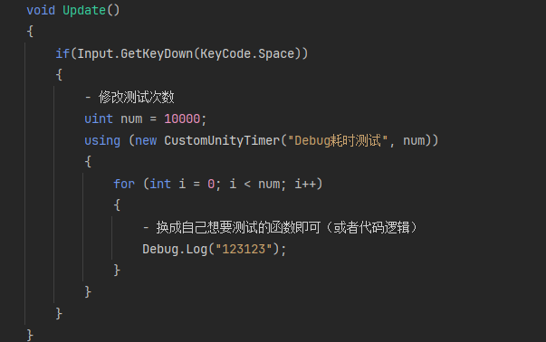
```C#
using UnityEngine;  
using System;  
//用于对逻辑执行计时的性能分析类  
public class CustomUnityTimer : IDisposable  
{  
    //本次测试的名字  
    private string _name;  
    //执行逻辑多少次  
    private uint _num;  
  
    //计时开始时间  
    private float _startTime;  
  
    public CustomUnityTimer(string name, uint num)  
    {        
        //记录测试名字 和测试次数  
        this._name = name;  
        this._num = num;  
        //记录逻辑开始的时间  
        this._startTime = Time.realtimeSinceStartup;  
    }  
  
    public void Dispose()  
    {       
        //得到执行多长时间的结果  
        //转换为ms  
        float spendTime = (Time.realtimeSinceStartup - _startTime) * 1000f;  
        Util.Log(string.Format("{0}计时结束，共耗时{1}ms，一共测试{2}次，每次平均耗时{3}ms",  
                              _name, spendTime, _num, spendTime / _num));  
    }}
```


#### 2.利用C#的Stopwatch类计时（精度高）

##### 知识点一 C#的Stopwatch类 

- Stopwatch类是C#中提供的一个用于高精度计时的工具类 
- 它可以精确地测量代码执行的时间，常用于性能分析和调试 
- 所属命名空间：System.Diagnostics（诊断） 
- 该类提供毫秒甚至微妙级别的计时精度 
  
- 常用API： 
- 1.利用类中提供的静态方法开启一个计时 
- Stopwatch.StartNew() 
- 该方法会返回一个Stopwatch对象，并开始计时 
  
- 2.停止计时 
- Stop() 
- 该方法通过计时对象调用，将停止计时 
  
- 3.获取计时 
- ElapsedMilliseconds 
- 该成员通过计时对象调用，获取耗时时间（毫秒） 
- 返回类型为long，不使用与小于1ms的时间获取 
  
- Elapsed.TotalMilliseconds 
- 该成员通过计时对象调用，获取耗时时间（毫秒） 
- 返回类型为double，可以精确到微妙级 
  
- 4.重启计时 
- Restart 
- 该方法通过计时对象调用，会清零重启计时

##### 知识点二 利用C#机制封装一个计时类 

- 利用C#的using语句块 
- using语句块包裹的对象使用完后会调用销毁逻辑（执行Dispose函数）
```C#
using UnityEngine;  
using System;  
using System.Diagnostics;  
  
public class CustomTimer : IDisposable  
{  
    //计时任务的名字  
    private string _name;  
    //计时任务的执行次数  
    private uint _num;  
    //计时对象  
    private Stopwatch _watch;  
  
    public CustomTimer(string name, uint num)  
    {        this._name = name;  
        this._num = num;  
        //避免传入次数传错 如果为0 至少肯定会执行1次   
    if (this._num == 0)  
            this._num = 1;  
        //声明一个计时对象 并且直接开始计时  
        _watch = Stopwatch.StartNew();  
    }  
  
    public void Dispose()  
    {        
        _watch.Stop();  
        //得到一个微妙级的时间  
        double spendTime = _watch.Elapsed.TotalMilliseconds;  
        Util.Log(string.Format("{0}计时结束，共耗时{1}ms，一共测试{2}次，每次平均耗时{3}ms",  
                              _name, spendTime, _num, spendTime / _num));  
    }}
```


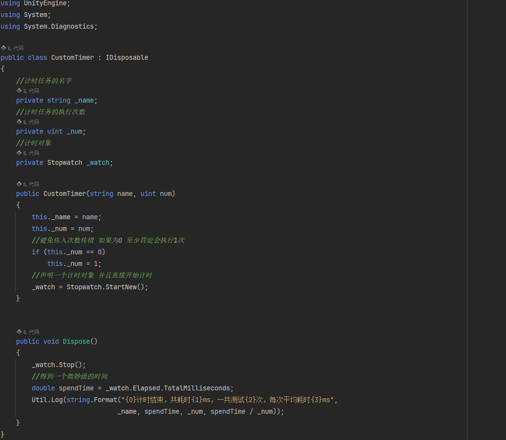


