## 一、概述(两个转二进制IExcelDataReade和BinaryFormatter)


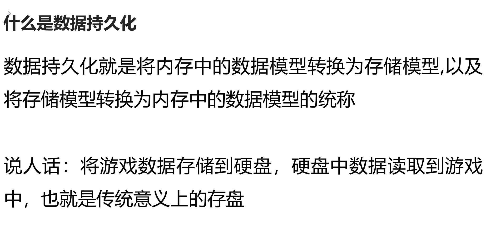

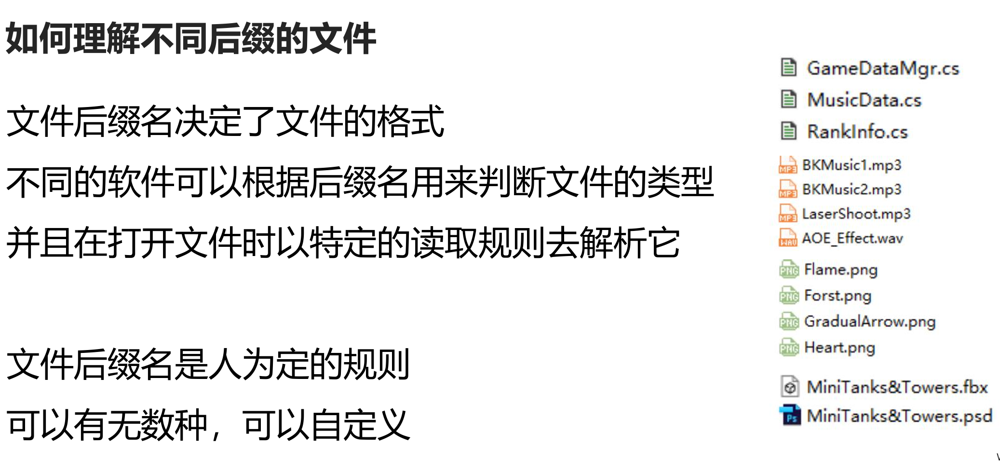

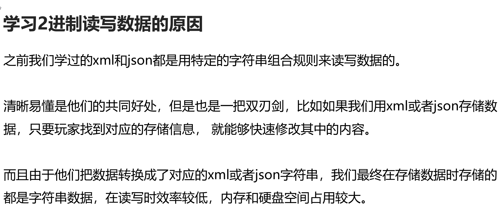


## 二、基础知识 

#### 1.各类型转字节数组

##### 知识点一 回顾C#知识——不同变量类型 

- 不同变量类型 

- 有符号 sbyte int short long 
  
- 无符号 byte uint ushort ulong 
  
- 浮点 float double decimal 
  
- 特殊 bool char string

##### 知识点二 回顾C#知识——变量的本质 

- 变量的本质是2进制 
- 在内存中都以字节的形式存储着 
- 1byte = 8bit 
- 1bit(位)不是0就是1 
- 通过sizeof方法可以看到常用变量类型占用的字节空间长度 

- print("有符号"); 
- print("sbyte" + sizeof(sbyte) + "字节"); 
- print("int" + sizeof(int) + "字节"); 
- print("short" + sizeof(short) + "字节"); 
- print("long" + sizeof(long) + "字节"); 

- print("无符号"); 
- print("byte" + sizeof(byte) + "字节"); 
- print("uint" + sizeof(uint) + "字节"); 
- print("ushort" + sizeof(ushort) + "字节"); 
- print("ulong" + sizeof(ulong) + "字节"); 

- print("浮点"); 
- print("float" + sizeof(float) + "字节"); 
- print("double" + sizeof(double) + "字节"); 
- print("decimal" + sizeof(decimal) + "字节"); 

- print("特殊"); 
- print("bool" + sizeof(bool) + "字节"); 
- print("char" + sizeof(char) + "字节")


##### 知识点三 2进制文件读写的本质 

- 它就是通过将各类型变量转换为字节数组 
- 将字节数组直接存储到文件中 
- 一般人是看不懂存储的数据的 
- 不仅可以节约存储空间，提升效率 
- 还可以提升安全性 
- 而且在网络通信中我们直接传输的数据也是字节数据（2进制数据）

##### 识点四 各类型数据和字节数据相互转换 

- C#提供了一个公共类帮助我们进行转化 
- 我们只需要记住API即可 
- 类名：BitConverter 
- 命名空间：using System 
  
- 1.将各类型转字节 
- *byte[] bytes = BitConverter.GetBytes(256);* 
  
- 2.字节数组转各类型 
- *int i = BitConverter.ToInt32(bytes, 0);* 
- *print(i);*

##### 知识点五 标准编码格式 

- 编码是用预先规定的方法将文字、数字或其它对象编成数码，或将信息、数据转换成规定的电脉冲信号。 
- 为保证编码的正确性，编码要规范化、标准化，即需有标准的编码格式。 
- 常见的编码格式有ASCII、ANSI、GBK、GB2312、UTF - 8、GB18030和UNICODE等。 
  
-  说人话 
-  计算机中数据的本质就是2进制数据 
-  编码格式就是用对应的2进制数 对应不同的文字 
-  由于世界上有各种不同的语言，所有会有很多种不同的编码格式 
-  不同的编码格式 对应的规则是不同的 
  
-  如果在读取字符时采用了不统一的编码格式，可能会出现乱码 
  
-  游戏开发中常用编码格式 UTF-8 
-  中文相关编码格式 GBK 
-  英文相关编码格式 ASCII 
  
-  在C#中有一个专门的编码格式类 来帮助我们将字符串和字节数组进行转换 
  
-  类名：Encoding 
-  需要引用命名空间：using System.Text; 
  
- 1.将字符串以指定编码格式转字节 
- *byte[] bytes2 = Encoding.UTF8.GetBytes("唐老狮");* 
  
- 2.字节数组以指定编码格式转字符串 
- *string s = Encoding.UTF8.GetString(bytes2);* 
- *print(s);*

##### 总结 

- 我们可以通过BitConverter和Encoding类 
- 将所有C#提供给我们的数据类型和字节数组之间进行相互转换了 
- 我们需要熟练掌握其中的API

#### 2.文件操作相关——文件

##### 知识点一 代码中的文件操作是做什么 

- 在电脑上我们可以在操作系统中创建删除修改文件 
- 可以增删查改各种各样的文件类型 
  
- 代码中的文件操作就是通过代码来做这些事情

##### 知识点二 文件相关操作公共类 

- C#提供了一个名为File（文件）的公共类  
- 让我们可以快捷的通过代码操作文件相关 
- 类名：File 
- 命名空间： System.IO


##### 知识点三 文件操作File类的常用内容 

- 1.判断文件是否存在 
- *if(File.Exists(Application.dataPath + "/UnityTeach.tang"))* 
- *{* 
-     *print("文件存在");* 
- *}* 
- *- else* 
- *{* 
-     *print("文件不存在");* 
- *}* 

- 2.创建文件 
- *FileStream fs = File.Create(Application.dataPath + "/UnityTeach.tang");* 
  
- 3.写入文件 
- 将指定字节数组 写入到指定路径的文件中 
- *byte[] bytes = BitConverter.GetBytes(999);* 
- *File.WriteAllBytes(Application.dataPath + "/UnityTeach.tang", bytes);* 
- 将指定的string数组内容 一行行写入到指定路径中 
- *string[] strs = new string[] { "123", "唐老狮", "123123kdjfsalk", "123123123125243"};* 
- *File.WriteAllLines(Application.dataPath + "/UnityTeach2.tang", strs);* 
- 将指定字符串写入指定路径 
- *File.WriteAllText(Application.dataPath + "/UnityTeach3.tang", "唐老狮哈\n哈哈哈哈123123131231241234123");* 
  
- 4.读取文件 
- 读取字节数据 
- *bytes = File.ReadAllBytes(Application.dataPath + "/UnityTeach.tang");* 
- *print(BitConverter.ToInt32(bytes, 0));* 
  
- 读取所有行信息 
- *strs = File.ReadAllLines(Application.dataPath + "/UnityTeach2.tang");* 
- *for (int i = 0; i < strs.Length; i++)* 
- *{* 
-  *print(strs[i]);* 
- *}* 
  
- 读取所有文本信息 
- *print(File.ReadAllText(Application.dataPath + "/UnityTeach3.tang"));* 
  
- 5.删除文件 
- 注意 如果删除打开着的文件 会报错 
- *File.Delete(Application.dataPath + "/UnityTeach.tang");* 
  
- 6.复制文件 
- 参数一：现有文件 需要是流关闭状态 
- 参数二：目标文件 
- *File.Copy(Application.dataPath + "/UnityTeach2.tang", Application.dataPath + "/唐老狮.tanglaoshi", true);* 
  
- 7.文件替换 
- 参数一：用来替换的路径 
- 参数二：被替换的路径 
- 参数三：备份路径 
- *File.Replace(Application.dataPath + "/UnityTeach3.tang", Application.dataPath + "/唐老狮.tanglaoshi", Application.dataPath + "/唐老狮备份.tanglaoshi");* 
  
- 8.以流的形式 打开文件并写入或读取 
- 参数一：路径 
- 参数二：打开模式 
- 参数三：访问模式 
- *FileStream fs = File.Open(Application.dataPath + "/UnityTeach2.tang", FileMode.OpenOrCreate, FileAccess.ReadWrite);*

#### 3.文件操作相关——文件流

##### 知识点一 什么是文件流

- 在C#中提供了一个文件流类 FileStream类 
- 它主要作用是用于读写文件的细节 
- 我们之前学过的File只能整体读写文件 
- 而FileStream可以以读写字节的形式处理文件 
  
- 说人话： 
- 文件里面存储的数据就像是一条数据流（数组或者列表） 
- 我们可以通过FileStream一部分一部分的读写数据流 
- 比如我可以先存一个int（4个字节）再存一个bool（1个字节）再存一个string（n个字节） 
- 利用FileStream可以以流式逐个读写

##### 知识点二 FileStream文件流类常用方法 

- 类名：FileStream 
- 需要引用命名空间：System.IO 
  
- ## 1.打开或创建指定文件 

- ### 方法一：new FileStream 
- #### 参数一：路径 
- #### 参数二：打开模式 
-   CreateNew:创建新文件 如果文件存在 则报错 
-   Create:创建文件，如果文件存在 则覆盖 
-   Open:打开文件，如果文件不存在 报错 
-   OpenOrCreate:打开或者创建文件根据实际情况操作 
-   Append:若存在文件，则打开并查找文件尾，或者创建一个新文件 
-   Truncate:打开并清空文件内容 
- #### 参数三：访问模式 
- #### 参数四：共享权限 
-   None 谢绝共享 
-   Read 允许别的程序读取当前文件 
-   Write 允许别的程序写入该文件 
-   ReadWrite 允许别的程序读写该文件 
- *FileStream fs = new FileStream(Application.dataPath + "/Lesson3.tang", FileMode.Create, FileAccess.ReadWrite);* 
  
- ### 方法二：File.Create 
- #### 参数一：路径 
- #### 参数二：缓存大小 
- #### 参数三：描述如何创建或覆盖该文件（不常用） 
-   Asynchronous 可用于异步读写 
-   DeleteOnClose 不在使用时，自动删除 
-   Encrypted 加密 
-   None 不应用其它选项 
-   RandomAccess 随机访问文件 
-   SequentialScan 从头到尾顺序访问文件 
-   WriteThrough 通过中间缓存直接写入磁盘 
- *FileStream fs2 = File.Create(Application.dataPath + "/Lesson3.tang");* 
  
- ### 方法三：File.Open 
- #### 参数一：路径 
- #### 参数二：打开模式 
- *FileStream fs3 = File.Open(Application.dataPath + "/Lesson3.tang", FileMode.Open);* 

  
- ## 2.重要属性和方法 
- *FileStream fs = File.Open(Application.dataPath + "Lesson3.tang", FileMode.OpenOrCreate);* 
- #### 文本字节长度 
- *print(fs.Length);* 
  
- #### 是否可写 
- *if( fs.CanRead )* 
- *{* 
  
- *}* 
  
- #### 是否可读 
- *if( fs.CanWrite )* 
- *{* 
  
- *}* 
  
- #### 将字节写入文件 当写入后 一定执行一次 
- *fs.Flush();* 
  
- #### 关闭流 当文件读写完毕后 一定执行 
- *fs.Close();* 
  
- #### 缓存资源销毁回收 
- *fs.Dispose();* 
  
  
- ## 3.写入字节 
- *print(Application.persistentDataPath);* 
- *using (FileStream fs = new FileStream(Application.persistentDataPath + "/Lesson3.tang", FileMode.OpenOrCreate, FileAccess.Write))* 
- { 
  
- *byte[] bytes = BitConverter.GetBytes(999);* //bytes存入4字节整形999
- 方法：Write 
- 参数一：写入的字节数组 
- 参数二：数组中的开始索引 
- 参数三：写入多少个字节 
- *fs.Write(bytes, 0, bytes.Length);* 
  
- 写入字符串时 
- *bytes = Encoding.UTF8.GetBytes("唐老狮哈哈哈哈");* //覆盖bytes,bytes存入字符串
-  先写入长度 
- *int length = bytes.Length;* //得到字符串长度
- *fs.Write(BitConverter.GetBytes(bytes.Length), 0, 4);* //写入代表字符串长度的4字节整形
- 再写入字符串具体内容 
- *fs.Write(bytes, 0, bytes.Length);* //写入bytes中包含的长度为bytes.Length的字符串bytes
  
- 避免数据丢失 一定写入后要执行的方法 
- *fs.Flush();* 
- 销毁缓存 释放资源 
- *fs.Dispose();* 
- } 
  

  
- ## 4.读取字节 
  
- ###  方法一：挨个读取字节数组 
  
- *using (FileStream fs2 = File.Open(Application.persistentDataPath + "/Lesson3.tang", FileMode.Open, FileAccess.Read))* 
- { 
- 读取第一个整形 
- *byte[] bytes2 = new byte[4];* 
  
- #### 参数一：用于存储读取的字节数组的容器 
- #### 参数二：容器中开始的位置 
- #### 参数三：读取多少个字节装入容器 
- #### 返回值：当前流索引前进了几个位置  - 
- *int index = fs2.Read(bytes2, 0, 4);* 
- *int i = BitConverter.ToInt32(bytes2, 0);* 
- *print("取出来的第一个整数" + i);// 999* 
- *print("索引向前移动" + index + "个位置"); //4*

- 读取第二个字符串 
- 读取字符串字节数组长度 
- *index = fs2.Read(bytes2, 0, 4);* 
- *print("索引向前移动" + index + "个位置"); //4*
- *int length = BitConverter.ToInt32(bytes2, 0);* 
- 要根据我们存储的字符串字节数组的长度 来声明一个新的字节数组 用来装载读取出来的数据 
- *bytes2 = new byte[length];* 
- *index = fs2.Read(bytes2, 0, length);*
- *print("索引向前移动" + index + "个位置");* 
- 得到最终的字符串 打印出来 
- *print(Encoding.UTF8.GetString(bytes2));* 
- *fs2.Dispose();* 
- } 


````ad-tip

# Read 会将数据存入参数一代表的字节容器里

第一个方法为一次性read一部分数据，用bytes2来装read过后存入的数据

此时由于fs2.Read(bytes2, 0, 4) Byte中读取的数据会按照当前索引（即数据流第四位）往下搜寻四个字节

因此BitConverter.ToInt32(bytes2, 0)中的bytes2数据 实际是5-8位的数据，此时index=8

而5-8位的数据，记录的是字符串的长度

之后再次向后面读取fs2.Read(bytes2, 0, length)这么多位，即从index8开始向后读length长度字节 读出来的就是字符串本身


````


- ### 方法二：一次性读取再挨个读取 
- 
- *print("\*\*\*\*\*\*\*\*\*\*\*\*\*\*\*\*\*\*\*\*\*\*\*\*\*\*\*\");* 
- *using (FileStream fs3 = File.Open(Application.persistentDataPath + "/Lesson3.tang", FileMode.Open, FileAccess.Read))* 
- { 
- 一开始就申明一个 和文件字节数组长度一样的容器 
- *byte[] bytes3 = new byte[fs3.Length];* 
- *fs3.Read(bytes3, 0, (int)fs3.Length);* 
- *fs3.Dispose();* 
- 读取整数 
- *print(BitConverter.ToInt32(bytes3, 0));* 
- 读取字符串字节数组的长度 
- *int length2 = BitConverter.ToInt32(bytes3, 4);* 
- 得到字符串 
- *print(Encoding.UTF8.GetString(bytes3, 8, length2));* 
- }

````ad-tip

第二种方法则是 一开始就读取文件流全部数据 然后依次读取各自长度

由于BitConverter.ToInt32(bytes3, 0)) 是ToInt32所以默认只读取四字节

所以一开始读出来的就是int值999  然后从偏移值4开始读，读4字节，即字符串长度21

最后读字符串，从文件流偏移位置8开始读，读字符串长度length2

````

##### 知识点三 更加安全的使用文件流对象 

- using关键字重要用法 
- using (申明一个引用对象) 
- { 
- 使用对象 
- } 
- 无论发生什么情况 当using语句块结束后 
- 会自动调用该对象的销毁方法 避免忘记销毁或关闭流 
- using是一种更安全的使用方法 
  
- # 强调： 
- 目前我们对文件流进行操作 为了文件操作安全 都用using来进行处理最好


##### 总结 

- 通过FIleStream读写时一定要注意 
- 读的规则一定是要和写是一致的 
- 我们存储数据的先后顺序是我们制定的规则 
- 只要按照规则读写就能保证数据的正确性


#### 4. 文件夹操作相关——文件夹

##### 知识点一 文件夹操作是指什么？ 

- 平时我们可以在操作系统的文件管理系统中 
- 通过一些操作增删查改文件夹 
  
- 我们目前要学习的就是通过代码的形式 
- 来对文件夹进行增删查改的操作

##### 知识点二 C#提供给我们的文件夹操作公共类 

- 类名:Directory 
- 命名空间：using System.IO 
- ###### 1.判断文件夹是否存在 
- *if( Directory.Exists(Application.dataPath + "/数据持久化四"))*
- *{* 
-     *print("存在文件夹");* 
- *}* 
- *else* 
- *{* 
-     *print("文件夹不存在");*  
- *}* 
  
- ###### 2.创建文件夹 
- *DirectoryInfo info = Directory.CreateDirectory(Application.dataPath + "/数据持久化四");* 
  
- ###### 3.删除文件夹 
- 参数一：路径 
- 参数二：是否删除非空目录，如果为true，将删除整个目录，如果是false，仅当该目录为空时才可删除 
- Directory.Delete(Application.dataPath + "/数据持久化四"); 
  
- ###### 4.查找文件夹和文件 
- 得到指定路径下所有文件夹名 
- *string[] strs = Directory.GetDirectories(Application.dataPath);* 
- *for (int i = 0; i < strs.Length; i++)* 
- *{* 
-     *print(strs[i]);* 
- *}* 
  
- 得到指定路径下所有文件名 
- *strs = Directory.GetFiles(Application.dataPath);* 
- *for (int i = 0; i < strs.Length; i++)* 
- *{* 
-     *print(strs[i]);* 
- *}* 
  
- ###### 5.移动文件夹 
- 如果第二个参数所在的路径 已经存在了一个文件夹 那么会报错 
- 移动会把文件夹中的所有内容一起移到新的路径 
- *Directory.Move(Application.dataPath + "/数据持久化四", Application.dataPath + "/123123123");*

##### 知识点三 DirectoryInfo和FileInfo 

- DirectoryInfo目录信息类 
- 我们可以通过它获取文件夹的更多信息 
- 它主要出现在两个地方 
- 1.创建文件夹方法的返回值 
- *DirectoryInfo dInfo = Directory.CreateDirectory(Application.dataPath + "/数据持久化123");* 
- 全路径 
- *print(dInfo.FullName);* 
- 文件名 
- *print(dInfo.Name);* 
  
- 2.查找上级文件夹信息 
- *dInfo = Directory.GetParent(Application.dataPath + "/数据持久化123");* 
- 全路径 
- *print(dInfo.FullName);* 
- 文件名 
- *print(dInfo.Name);* 
  
- 重要方法 
- 得到所有子文件夹的目录信息 
- *DirectoryInfo[] dInfos = dInfo.GetDirectories();* 
  
- FileInfo文件信息类 
- 我们可以通过DirectoryInfo得到该文件下的所有文件信息 
- *FileInfo[] fInfos = dInfo.GetFiles();* 
- *for (int i = 0; i < fInfos.Length; i++)* 
- *{* 
-     *print("\*\*\*\*\*\*\*\*\*\*\*\*\*\*");* 
-     *print(fInfos[i].Name);*//文件名 
-     *print(fInfos[i].FullName);* //路径 
-     *print(fInfos[i].Length);*//字节长度 
-     *print(fInfos[i].Extension);*//后缀名 
- *}*

##### 总结 

- Directory提供给我们了常用的文件夹相关操作的API 
- 只需要熟练使用它即可 
  
- DirectoryInfo和FileInfo 一般在多文件夹和多文件操作时会用到 
- 了解即可 
- 目前用的相对较少 他们的用法和Directory和File类的用法大同小异


# 练习题

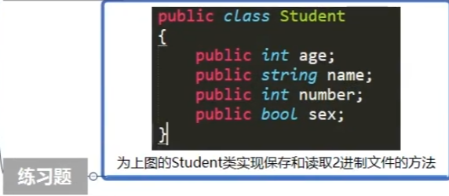
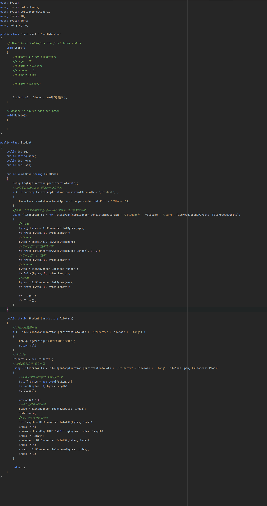

#### 5.C#类对象的序列化

##### 知识点一 序列化类对象第一步—申明类对象 

- 注意：如果要使用C#自带的序列化2进制方法 
- 申明类时需要添加[System.Serializable]特性

##### 知识点二 序列化类对象第二步—将对象进行2进制序列化 
  
- *Person p = new Person();* 
- 方法一：使用内存流得到2进制字节数组 
- 主要用于得到字节数组 可以用于网络传输 
- 新知识点 
- 1.内存流对象 
- 类名：MemoryStream 
- 命名空间：System.IO 
- 2.2进制格式化对象 
- 类名：BinaryFormatter 
- 命名空间：System.Runtime.Serialization.Formatters.Binary、 
- 主要方法：序列化方法 Serialize 
- *using (MemoryStream ms = new MemoryStream())* 
- { 
- 2进制格式化程序 
-     *BinaryFormatter bf = new BinaryFormatter();* 
-     序列化对象 生成2进制字节数组 写入到内存流当中 
-     *bf.Serialize(ms, p);* 
-     得到对象的2进制字节数组 
-     *byte[] bytes = ms.GetBuffer();* 
-     存储字节 
-     *File.WriteAllBytes(Application.dataPath + "/Lesson5.tang", bytes);* 
-     关闭内存流 
-      *ms.Close();* 
- } 

- 方法二：使用文件流进行存储 
- 主要用于存储到文件中 
- *using (FileStream fs = new FileStream(Application.dataPath + "/Lesson5_2.tang", FileMode.OpenOrCreate, FileAccess.Write))* 
- { 
-     2进制格式化程序 
-     *BinaryFormatter bf = new BinaryFormatter();* 
-     序列化对象 生成2进制字节数组 写入到内存流当中 
-     *bf.Serialize(fs, p);* 
-     *fs.Flush();* 
-     *fs.Close();* 
- }

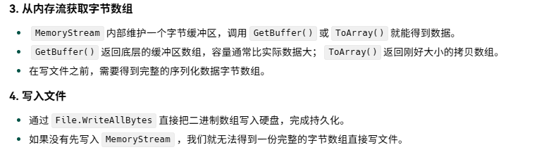
````ad-tip

**BinaryFormatter.Serialize(Stream, Object)** 直接把对象的*二进制数据*写进一个`Stream`中

两种方法 一个是声明内存流 一个声明文件流  但是都声明了2进制格式化对象

第一种方法 将对象存入到内存流当中

会得到字节数据 再通过File.WriteAllBytes(path,bytes)方法将数据存入到指定文件中

第二种方法直接通过2进制格式化对象直接存储进文件中  但是文件流必须 进行flush 和 close 操作

## 简而言之就是 可以把BinaryFormatter 当成一个翻译器 

## 第二种方法 是直接将对象翻译进文件 

## 而第一种方法则是将对象翻译进内存流中  

## 再通过内存流中的API(MemoryStream.GetBuffer)得到内存流中的字节数组  

## 再用File.WriteAllBytes方法将字节数组存储进文件中


````
##### 总结 

- C#提供的类对象2进制序列化主要类是 BinaryFormatter 
- 通过其中的序列化方法即可进行序列化生成字节数组

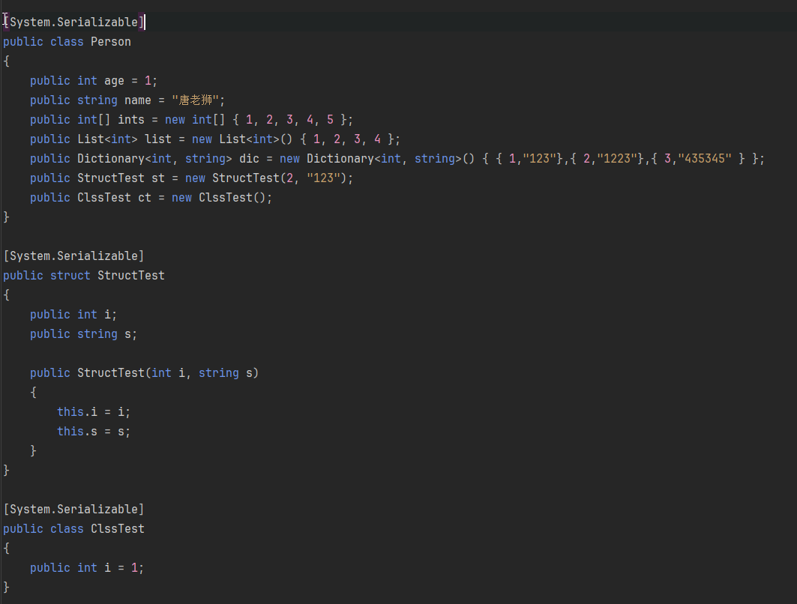

#### 6.C#对象的反序列化

##### 知识点一 反序列化之 反序列化文件中数据 

- 主要类 
- FileStream文件流类 
- BinaryFormatter 2进制格式化类 
- 主要方法 
- Deserizlize 
- 通过文件流打开指定的2进制数据文件 
- *using (FileStream fs = File.Open(Application.dataPath + "/Lesson5_2.tang", FileMode.Open, FileAccess.Read))* 
- *{* 
-     申明一个 2进制格式化类 
-     *BinaryFormatter bf = new BinaryFormatter();* 
-     反序列化 
-     *Person p = bf.Deserialize(fs) as Person;*

-     *fs.Close();* 
- *}*

##### 知识点二 反序列化之 反序列化网络传输过来的2进制数据 

- 主要类 
- MemoryStream内存流类 
- BinaryFormatter 2进制格式化类 
- 主要方法 
- Deserizlize 
- 目前没有网络传输 我们还是直接从文件中获取 
- *byte[] bytes = File.ReadAllBytes(Application.dataPath + "/Lesson5_2.tang");* 
- 申明内存流对象 一开始就把字节数组传输进去 
- *using (MemoryStream ms = new MemoryStream(bytes))* 
- *{* 
-     申明一个 2进制格式化类 
-     *BinaryFormatter bf = new BinaryFormatter();* 
-     反序列化 
-     *Person p = bf.Deserialize(ms) as Person;* 
  
-     *ms.Close();* 
- *}*


````ad-tip

文件流和内存流 都是对象  本质两种方法都是利用BinaryFormatter将两个对象之一"翻译"成二进制字节数据/目标对象

第一种是因为文件流读取的本身就是文件本身 包含数据 直接用File.OPen打开文件再用BinaryFormatter反序列化文件流对象成数据就行

第二种则是因为内存流本身不包含数据 

需要先用File.ReadAllBytes读取字节数据 再将数据存储入内存流中

再用BinaryFormatter反序列化内存流 得到目标对象实例

````


#### 7.C#类对象的2进制数据加密

##### 知识点一 何时加密？何时解密？ 

- 当我们将类对象转换为2进制数据时进行加密 
- 当我们将2进制数据转换为类对象时进行解密 
  
- 这样如果第三方获取到我们的2进制数据 
- 当他们不知道加密规则和解密秘钥时就无法获取正确的数据 
- 起到保证数据安全的作用

##### 知识点二 加密是否是100%安全？ 

- 一定记住加密只是提高破解门槛，没有100%保密的数据 
- 通过各种尝试始终是可以破解加密规则的，只是时间问题 
- 加密只能起到提升一定的安全性

##### 知识点三 常用加密算法 

- MD5算法 
- SHA1算法 
- HMAC算法 
- AES/DES/3DES算法 
- 等等等 
  
- 有很多的别人写好的第三发加密算法库 
- 可以直接获取用于在程序中对数据进行加密 
- 这里我们不深究 感兴趣的同学可以自己去了解

##### 知识点四 用简单的异或加密感受加密的作用 

- *Person p = new Person();* 
- *byte key = 199;* 
- *using (MemoryStream ms = new MemoryStream())* 
- *{* 
-     *BinaryFormatter bf = new BinaryFormatter();* 
-     *bf.Serialize(ms, p);* 
-     *byte[] bytes = ms.GetBuffer();* 
-     异或加密 
-     *for (int i = 0; i < bytes.Length; i++)* 
-     *{*
-         *bytes[i] ^= key;    }    File.WriteAllBytes(Application.dataPath + "/Lesson7.tang", bytes);* 
-     *}* 
- *}*
- 解密 
- 
- *byte[] bytes2 = File.ReadAllBytes(Application.dataPath + "/Lesson7.tang");* 
- *for (int i = 0; i < bytes2.Length; i++)* 
- *{* 
-     *bytes2[i] ^= key;}* 
-     *using (MemoryStream ms = new MemoryStream(bytes2))* 
-     *{* 
-         *BinaryFormatter bf = new BinaryFormatter();* 
-         *Person p2 = bf.Deserialize(ms) as Person;* 
-         *ms.Close();* 
-      *}*
- *}*


##### 练习题 


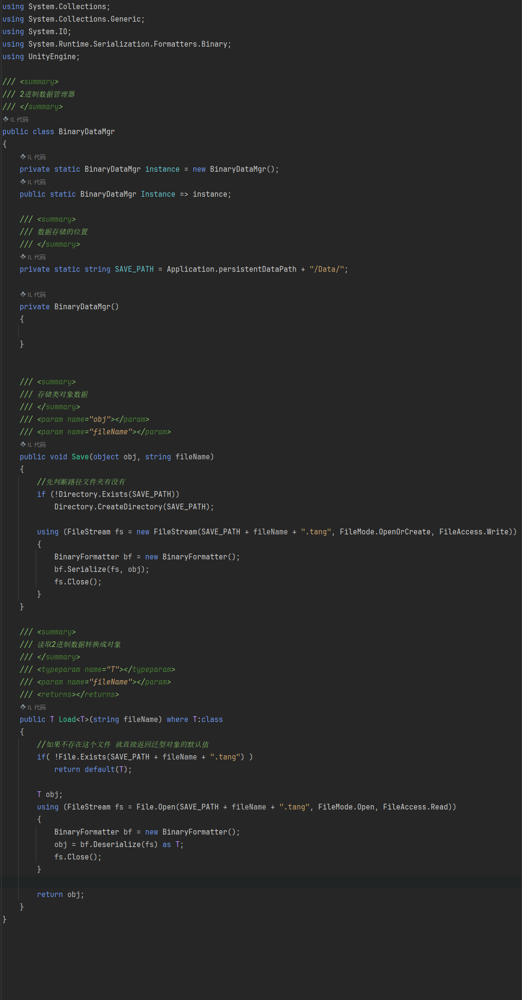

## 三、实践小项目

### ①.知识补充

#### 1.Unity添加菜单栏按钮

##### 知识点一 为编辑器菜单栏添加新的选项入口 

- 可以通过Unity提供我们的MenuItem特性在菜单栏添加选项按钮 
- 特性名：MenuItem 
- 命名空间：UnityEditor 
  
- 规则一：一定是静态方法 
- 规则二：我们这个菜单栏按钮 必须有至少一个斜杠 不然会报错 它不支持只有一个菜单栏入口 
- 规则三：这个特性可以用在任意的类当中
- [MenuItem"Test/1/2/3"]
- *private static void Test()* 
- *{* 
-     *Debug.Log("测试测试");* 
##### 知识点二 刷新Project窗口内容 
- 类名：AssetDatabase 
- 命名空间：UnityEditor 
- 方法：Refresh 
  
-     *Directory.CreateDirectory(Application.dataPath + "/测试文件夹");* 
  
-     *AssetDatabase.Refresh();* 
- *}*

##### 知识点三 Editor文件夹 

- Editor文件夹可以放在项目的任何文件夹下，可以有多个 
- 放在其中的内容，项目打包时不会被打包到项目中 
- 一般编辑器相关代码都可以放在该文件夹中

##### 总结 

- 我们之后在学习通过Excel表生成数据的功能时 
- 可以在菜单栏加一个按钮 
- 点击后就可以自动为我们生成对应数据了

#### 2.ExcelDll包导入

##### 知识点一 了解Excel表的本质 

- Excel表本质上也是一堆数据 
- 只不过它有自己的存储读取规则 
- 如果我们想要通过代码读取它 
- 那么必须知道它的存储规则 
  
- 官网是专门提供了对应的DLL文件用来解析Excel文件的 
  
- Dll文件：库文件，你可以理解为它是许多代码的集合 
- 将相关代码集合在库文件中可以方便迁移和使用 
- 有了某个DLL文件，我们就可以使用其中已经写好的代码 
  
- 而Excel的DLL包就是官方已经把解析Excel表的相关类和方法写好了 
- 方便用户直接使用
##### 知识点二 导入官方提供的Excel相关DLL文件

````ad-tip
见课程附件
````


#### 3.Excel数据读取

##### 知识点一 打开Excel表 

- 主要知识点： 
- 1.FileStream读取文件流 
- 2.IExcelDataReader类，从流中读取Excel数据 
- 3.DataSet 数据集合类 将Excel数据转存进其中方便读取

```C# 

[MenuItem("GameTool/打开Excel表")]  
private static void OpenExcel()  
{  
    using (FileStream fs = File.Open(Application.dataPath + "/ArtRes/Excel/PlayerInfo.xlsx", FileMode.Open, FileAccess.Read ))  
    {        
        //通过我们的文件流获取Excel数据  
        IExcelDataReader excelReader = ExcelReaderFactory.CreateOpenXmlReader(fs);  
        //将excel表中的数据转换为DataSet数据类型 方便我们 获取其中的内容  
        DataSet result = excelReader.AsDataSet();  
        //得到Excel文件中的所有表信息  
        for (int i = 0; i < result.Tables.Count; i++)  
        {            
            Debug.Log("表名：" + result.Tables[i].TableName);  
            Debug.Log("行数：" + result.Tables[i].Rows.Count);  
            Debug.Log("列数：" + result.Tables[i].Columns.Count);  
        }        
        fs.Close();  
    }
}

```


##### 知识点二 获取Excel表中单元格的信息 

- 主要知识点： 
- 1.FileStream读取文件流 
- 2.IExcelDataReader类，从流中读取Excel数据 
- 3.DataSet 数据集合类 将Excel数据转存进其中方便读取 
- 4.DataTable 数据表类 表示Excel文件中的一个表 
- 5.DataRow 数据行类 表示某张表中的一行数据

```C#
[MenuItem("GameTool/读取Excel里的具体信息")]  
private static void ReadExcel()  
{  
    using (FileStream fs = File.Open(Application.dataPath + "/ArtRes/Excel/PlayerInfo.xlsx", FileMode.Open, FileAccess.Read))  
    {        IExcelDataReader excelReader = ExcelReaderFactory.CreateOpenXmlReader(fs);  
        DataSet result = excelReader.AsDataSet();  
  
        for (int i = 0; i < result.Tables.Count; i++)  
        {            
            //得到其中一张表的具体数据  
            DataTable table = result.Tables[i];  
            // 得到其中一行的数据  
            - DataRow row = table.Rows[0];  
            //得到行中某一列的信息  
            - Debug.Log(row[1].ToString());  
            DataRow row;  
            for (int j = 0; j < table.Rows.Count; j++)  
            {               
                //得到每一行的信息  
                row = table.Rows[j];  
                Debug.Log("*********新的一行************");  
                for (int k = 0; k < table.Columns.Count; k++)  
                {              
                      Debug.Log(row[k].ToString());  
                }           
            }       
         }  
            fs.Close();  
    }
}
```


##### 知识点三 获取Excel表中信息对于我们的意义？ 

- 既然我们能够获取到Excel表中的所有数据 
- 那么我们可以根据表中数据来动态的生成相关数据 
- 1.数据结构类 
- 2.容器类 
- 3.2进制数据 
  
- 为什么不直接读取Excel表而要把它转成2进制数据 
- 1.提升读取效率 
- 2.提升数据安全性

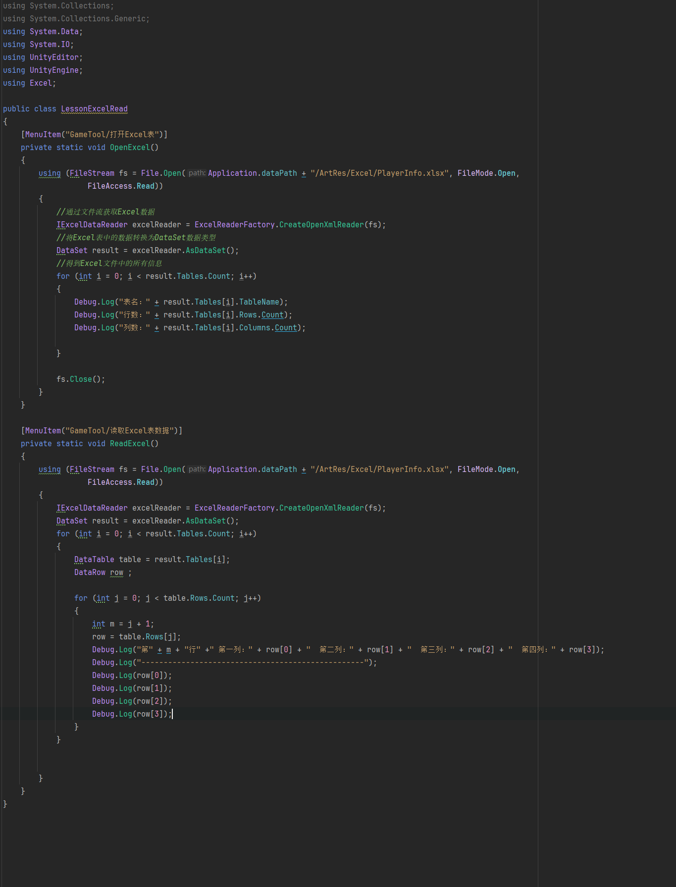
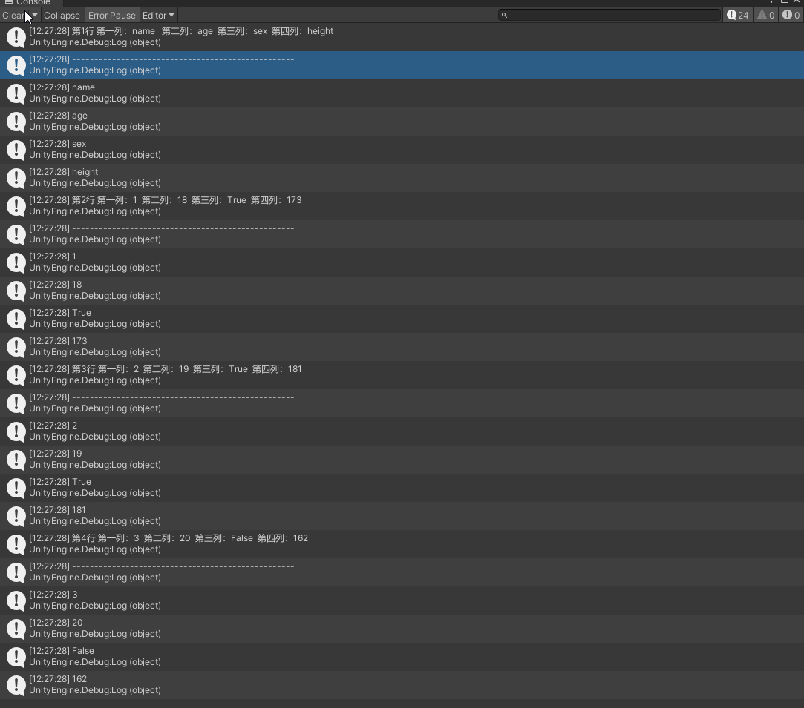

### ②.小项目实现

#### 1.Excel表自动生成相关文件——制定配表规则

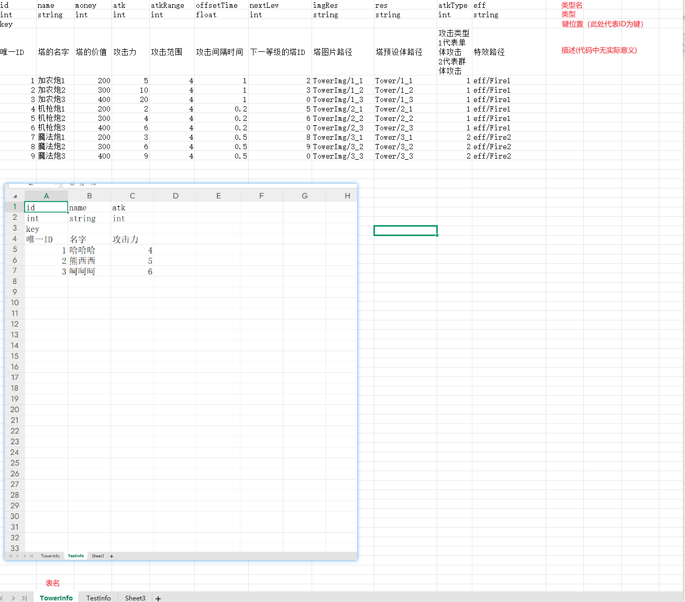


#### 2.Excel表自动生成相关文件——读取Excel目录下所有Excel文件

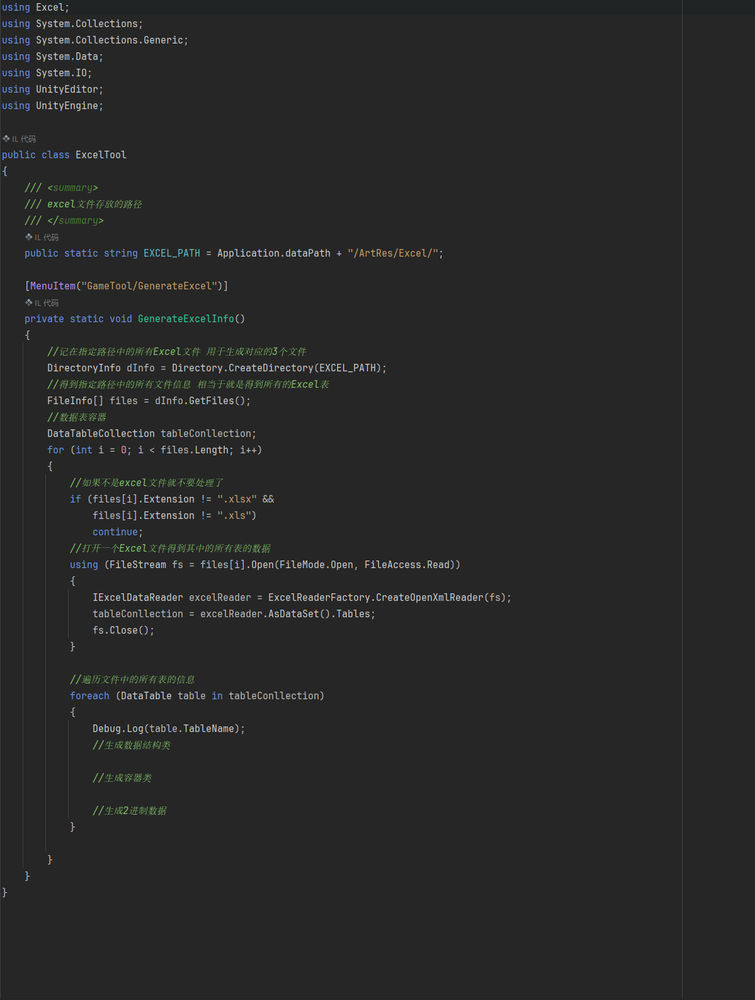

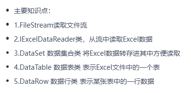
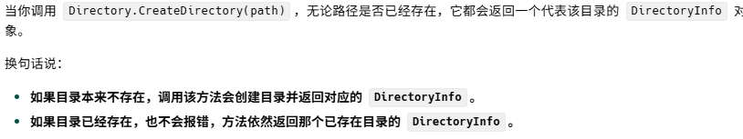

````ad-tip

想要得到Excel表中的信息 就得*先得到目标文件夹*

- ###### 1.首先用DirectoryInfo dInfo = Directory.CreateDirectory(path)来装载文件夹对象本身信息

- ###### 2.然后调用DirectoryInfo中的API——GetFiles()来得到文件夹中包含的所有文件

- ###### 3.首先用文件流打开目标文件  再用IExcelDataReader从流中读取Excel数据

- ###### 4.之后用IExeclDataReader中的AsDataSet这个API来得到这个Excel文件的数据

- ###### 5.或者直接用AsDataSet里的.tables来读取这个Excel文件中的各个表的集合信息 并用DataTableCollection类来装载

- ###### 6.此时就可以得到Excel表中的每行每列信息了
  
- ###### 7.可以用DataTable来装行信息并用table[i][j]来读取行列信息
  
- ###### 8.或者DataRow来装载循环中对应index的行以获取列信息
  

## 注意： 别忘了在使用完文件流之后关闭流

````
#### 3. Excel表自动生成相关文件——生成数据结构类

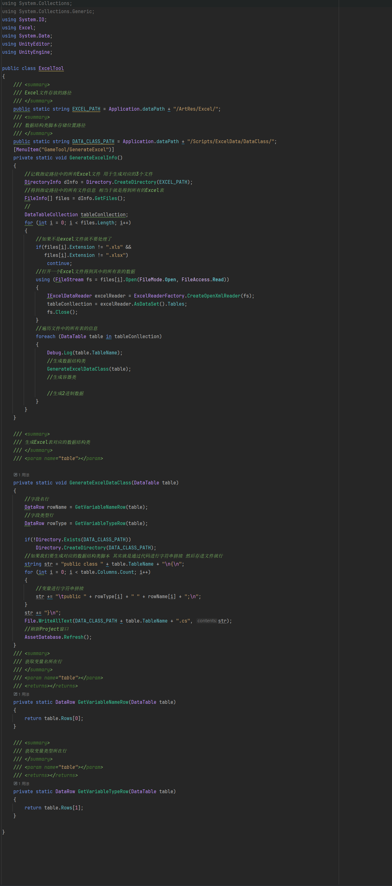


````ad-tip

GetVariableNameRow和GetVariableTypeRow两个方法用来获取第一行和第二行两行的数据 特地写方法是为了防止后续更改规则,以便更好维护

这两行数据  一个是字段类型 一个是字段名 申明局部变量rowName 和 rowType来接收它们

首先获得目标行信息 然后确定最终数据结构类存储的位置  如果不存在文件夹就新建

之后开始拼接字符串 正常的数据结构 为==访问修饰符 + class + 类名 + "{" + "申明对应内容字段" + "}"==

###### 换行可以用\n转义字符 制表键首部缩进可以用\t转义字符

用循环来循环获取同行每列信息 rowName存储的列信息是字段名rowType存储的信息是字段类型

字段申明 用  ==访问修饰符 + 字段类型 + 字段名 + ";" + \n== 换行 

最终表示为 *str += \t + public + rowType[i] +  rowName[i] + ";\n"*

利用str += 将各部分拼接起来

##### 最终将str 通过File.WriteAllBytes(path + 目标名称(可以是table.TableName即表单页名) + ".cs"，str)存储到目标文件中

````

#### 4.Excel表自动生成相关文件——生成容器类

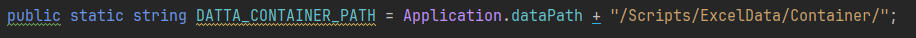
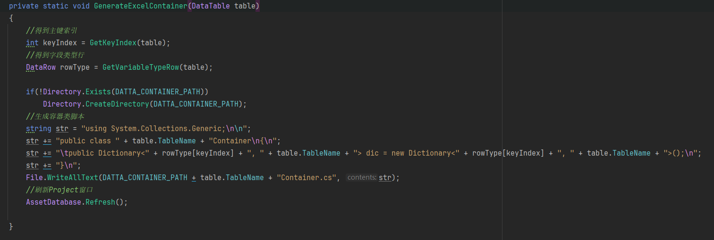
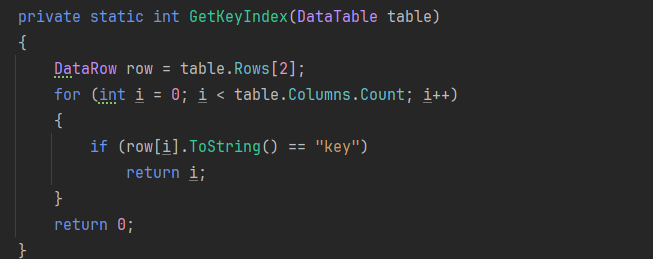
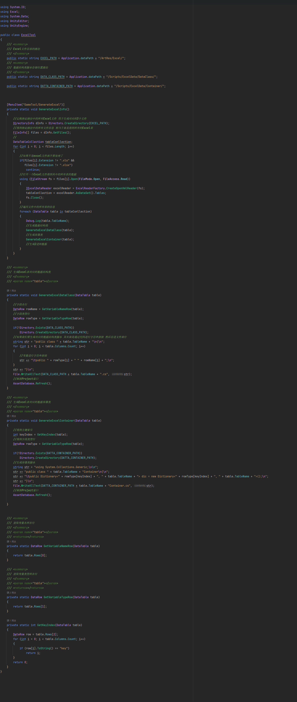

````ad-tip

首先声明数据类存储的地址 进行判定是否有相应文件夹  没有就生成

然后申明生成数据类的方法

一开始先得到索引keyIndex(额外创建方法 防止后期进行变动 改变Key键位置 即 key键所在行数)

然后通过上一部分声明的方法  用DataRow rowType接收返回值 得到字段类型所在的行

由于需要的Dictionary的格式为<int,数据容器类名(规则中为表页签名)>

则需要添加的两个参数 分别就是 rowType[keyIndex] 和 table.TableName

````


#### 5.Excel表自动生成相关文件——生成2进制数据文件

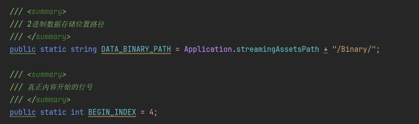
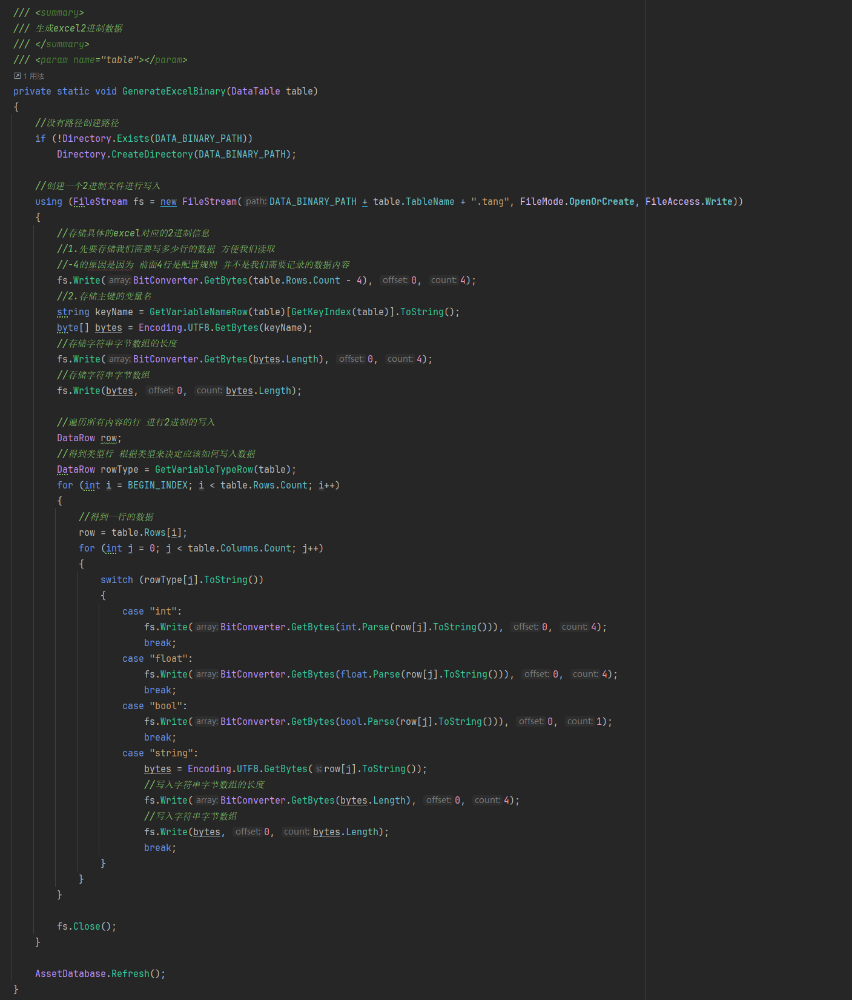


# 数据存储
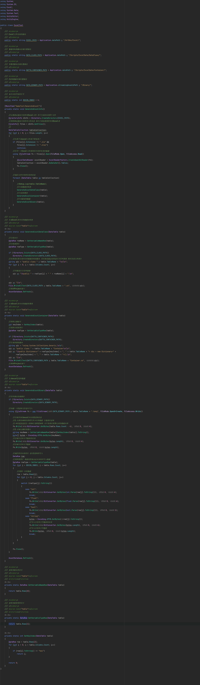


````ad-warning
# 此处创建容器类 创建的字典名 应该是dataDic
````

````ad-tip

和前面一样 先声明路径 这里存入StreamingAssets文件夹内 打包后这个文件内的内容将变成只读

顺便申明开始索引 用来标记实际记录的数据开始的行数 方便遍历 顺带防止更改表格规则导致的需要重构代码 

然后声明具体的存储2进制数据规则 仍然和之前一样 先判断路径是否存在 如果路径不存在就新建路径需求的文件夹

接下来是 实际存储规则部分 

首先using(FileStream fs = new FileStream(路径(路径+页签名+自定义类型),打开模式,访问模式))创建文件流接收信息

然后首先写入需要存入的数据的行数  方便后续读取   由于前四行是不需要存储的无关数据 所以实际行数=页签行数-4

再得到需要存储的主键名称keyName,用字节数组装载主键名通过UTF-8规则转成的字节数据

先写入字节长度  再写入字节数据

之后遍历所有行和列  根据其中数据对应的类型名 来确定具体写入数据的规则


````

# 数据读取

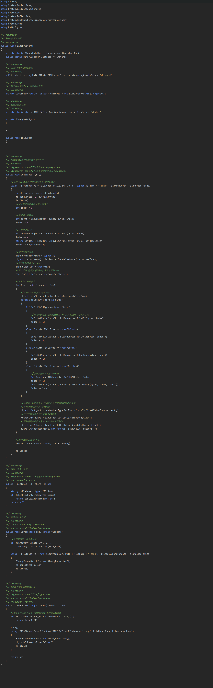


