## 一、概述

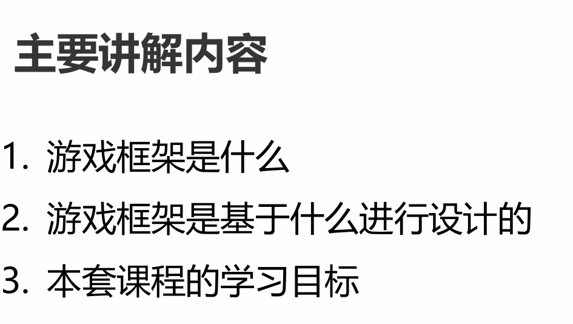


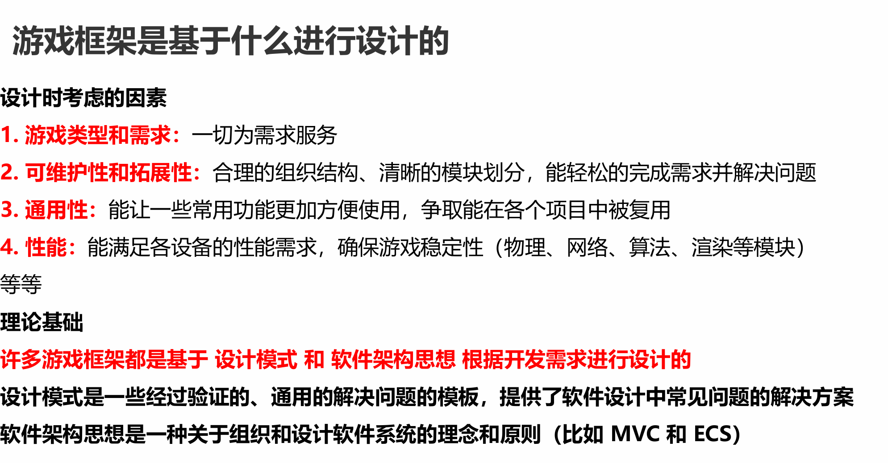
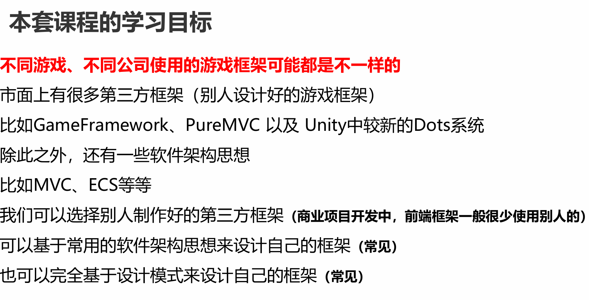


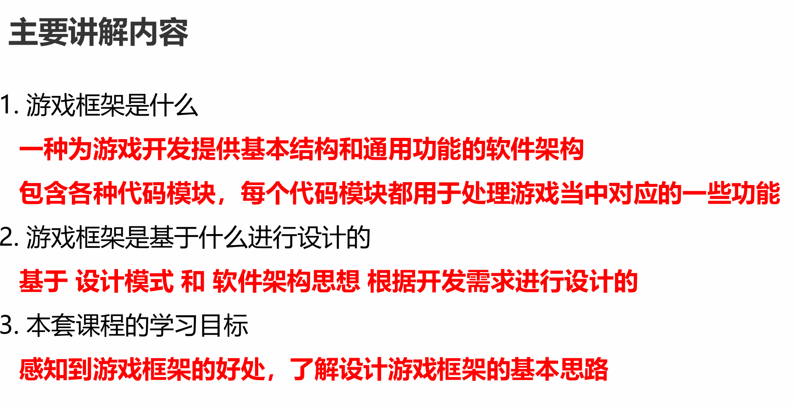

## 二、单例模式基类

#### 1.不继承MonoBehaviour的单例模式基类

##### 本节课使用的知识点 

- 大体知识体系 
- C#相关知识点（C#四部曲） 
  
- 细节知识点 
- 1.面向对象（C#四部曲C#核心中） 
- 2.静态、单例模式相关知识（C#四部曲之C#核心中） 
- 3.泛型、泛型约束相关知识点（C#四部曲之C#进阶中）

#####  知识点一 为什么要写单例模式基类 

- 用面向对象的思想避免代码冗余（多余、重复）

##### 知识点二 实现不继承MonoBehaviour的单例模式基类

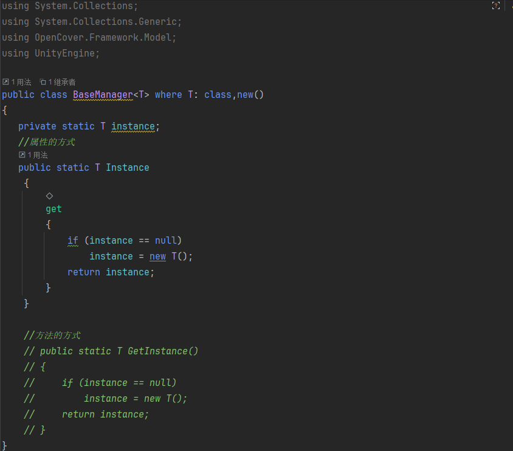


##### 知识点三 潜在的安全问题 

- 1.构造函数问题：构造函数可在外部调用 可能会破坏唯一性 
- 2.多线程问题：当多个线程同时访问管理器时，可能会出现共享资源的安全访问问题

````ad-tip
此处可以直接实例化TestMgr类 不符合单例模式思想
````

##### 总结 

- 利用泛型相关知识 
- 实现单例模式基类 
- 可能存在的安全问题 
- 我们在之后的课程中专门讲解

#### 2.继承MonoBehavior的单例模式基类

##### 本节课使用的知识点 

- 大体知识体系 
- C#相关知识点（C#四部曲） Unity相关知识点（Unity四部曲） 
  
- 细节知识点 
- 1.上节课的相关细节知识点 
- 2.MonoBehaviour相关知识点（Unity四部曲之Unity入门中）

##### 知识点一 实现继承MonoBehaviour的单例模式基类的注意事项 

- 重要的事情说三边 
- 继承MonoBehaviour的脚本不能new！ 
- 继承MonoBehaviour的脚本不能new！ 
- 继承MonoBehaviour的脚本不能new！ 
  
- 继承MonoBehaviour的脚本一定得依附在GameObject上 
- 继承MonoBehaviour的脚本一定得依附在GameObject上 
- 继承MonoBehaviour的脚本一定得依附在GameObject上

##### 知识点二 实现挂载式的单例模式基类 

- 这种方式不建议大家使用 
- 因为很容易被破坏单例模式的唯一性 
- 1.挂载多个脚本 
- 2.切换场景回来时，由于场景放置了挂载脚本的对象，回到该场景时 又会有一个该单例模式对象 
- 3.还可以通过代码动态的添加多个该脚本 也会破坏唯一性

##### 知识点三 实现自动挂载式的单例模式基类


##### 知识点四 潜在的安全问题 

- 1.构造函数问题： 
-   继承MonoBehaviour的函数，不能new，所以不用担心公共构造函数 
- 2.多线程问题： 
-   Unity主线程中相关内容，不允许其他线程直接调用，很少有这样的需求，所以也不用太担心 
- 3.重复挂载问题： 
-   1.手动重复挂载 
-   2.代码重复添加 
-   需要人为干涉，定规则，或者通过代码逻辑强制处理

##### 总结 

- 继承MonoBehaviour的单例模式对象 
- 建议大家使用自动挂载式的方案 
  
- 继承MonoBehaviour的单例模式对象 
- 潜在的安全问题相对较小，制定好规则后可以忽略不计

#### 3.【安全问题】唯一性问题——构造函数

##### 本节课使用的知识点 

- 细节知识点 
- C#中抽象类的知识点（C#四部曲之C#核心） 
- C#中反射相关知识点（C#四部曲之C#进阶）

##### 知识点一 构造函数带来的唯一性问题指什么？ 

- 1.对于不继承MonoBehaviour的单例模式基类 
-   我们要避免在外部 new 单例模式类对象 
  
- 2.对于继承MonoBehaviour的单例模式基类 
-   由于继承MonoBehaviour的脚本不能通过new创建，因此不用过多考虑

##### 知识点二 解决构造函数带来的安全问题 

- 1.父类变为抽象类 
  
- 2.规定继承单例模式基类的类必须显示实现私有无参构造函数 
  
- 3.在基类中通过反射来调用私有构造函数实例化对象 
-   主要知识点： 
-   利用Type中的 GetConstructor(约束条件, 绑定对象, 参数类型, 参数修饰符)方法 
-   来获取私有无参构造函数 
-   *ConstructorInfo constructor = typeof(T).GetConstructor(* 
-   *BindingFlags.Instance | BindingFlags.NonPublic,* //表示成员私有方法 
-     *null,*                                         //表示没有绑定对象 
-     *Type.EmptyTypes,*                   //表示没有参数 
-     *null);*                                        //表示没有参数修饰符
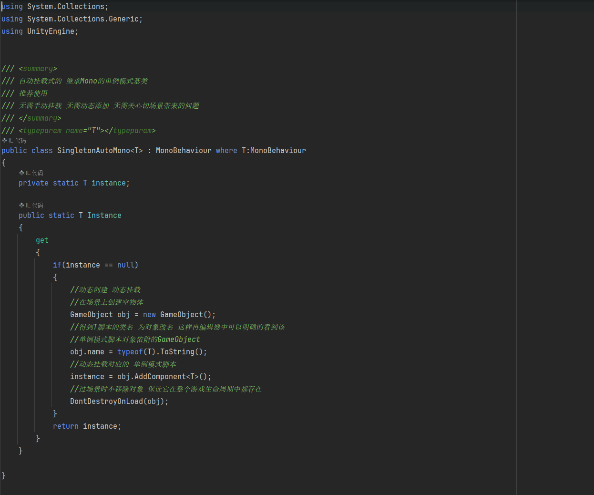

##### 总结 

- 虽然公共构造函数可能给我们带来破坏唯一性的安全隐患 
- 但是在实际开发中 
- 单例模式是非常基础的知识点 
- 可以说是程序员的必备基础知识 
- 在使用时几乎不会有人马虎到自己去new单例模式对象 
  
- 因此即使我们不做这些安全性的处理 
- 其实也不会有太大问题 
- 根据实际情况和需求进行设计即可

#### 4.【安全问题】唯一性问题——重复挂载

##### 本节课使用的知识点 

- 细节知识点 
- Unity中Destroy函数（Unity四部曲Unity入门） 
- Unity中特性相关知识（Unity四部曲Unity入门）

##### 知识点一 重复挂载带来的唯一性问题指什么？ 

- 对于继承MonoBehaviour的挂载式的单例模式基类 
- 1.手动挂载多个相同单例模式脚本 
- 2.代码动态添加多个相同单例模式脚本

##### 知识点二 解决重复挂载带来的安全问题 

- 对于挂载式的单例模式脚本 
- 1.同个对象的重复挂载 
-   为脚本添加特性[DisallowMultipleComponent] 

````ad-tip

这个特性无法判断再添加特性前  本身已经挂载了多个脚本的情况

也无法判断 另一个对象上后续也挂载了同样脚本的情况(另一个对象上第二次挂载会提示) 

所以本质上属于治标不治本 
````
  
- 2.修改代码逻辑 
-   判断如果存在对象，移除脚本 
  
````ad-tip
这里Destroy的是this代表只销毁脚本本身
````
- 对于自动挂载式的单例模式脚本 
-   制定使用规则，不允许手动挂载或代码添加

##### 总结 

- 为了避免重复挂载我们一般采用以下几种方案： 
  
- 1.对于挂载式的单例模式基类，相同对象上重复挂载问题，通过添加特性解决 
- 2.对于挂载式的单例模式基类，不同对象上的重复挂载，通过逻辑判断，代码移除多余的脚本 
  
- 3.最好的避免重复挂载的方式，就是使用自动挂载式的单例模式基类，并且制定使用规则（不允许手动挂载和代码添加）

#### 5.【安全问题】线程安全——是否加锁

##### 本节课使用的知识点 
- 细节知识点 
- C#中多线程相关知识点（C#四部曲C#进阶）

##### 知识点一 是否加锁问题指什么？ 

- 如果程序当中存在多线程 
- 我们需要考虑当多个线程同时访问同一个内存空间时出现的问题 
- 如果不加以控制，可能会导致数据出错 
- 我们一般称这种问题为多线程并发问题，指多线程对共享数据的并发访问和操作。 
  
- 而一般解决该问题的方式，就是通过C#中的lock关键字进行加锁 
- 我们需要考虑我们的单例模式对象们是否需要加锁(lock) 
  
- lock 的原理保证了在任何时刻只有一个线程能够执行被锁保护的代码块 
- 从而防止多个线程同时访问或修改共享资源，确保线程安全

##### 知识点二 解决多线程并发来带的问题 

- 1.不继承MonoBehaviour的单例模式 
-   建议加锁，避免以后使用多线程时出现并发问题 
-   比如在处理网络通讯模块、复杂算法模块时，经常会进行多线程并发处理 
  
- 2.继承MonoBehaviour的单例模式 
-   可加可不加，但是建议不加。 
-   因为Unity中的机制是，Unity主线程中处理的一些对象（如GameObject、Transform等等） 
-   是不允许被其他多线程修改访问的，会直接报错 
-   因此我们一般不会通过多线程去访问继承MonoBehaviour的相关对象 
-   既然如何，就不会发生多线程并发问题
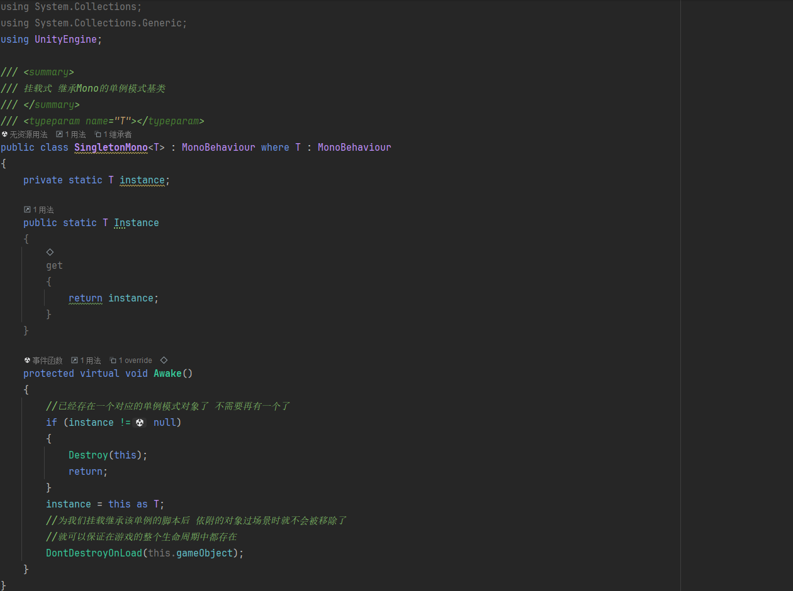

````ad-tip
假使加锁之后不进行判空 可能会出现线程先执行另一边的创建实例 而这边在等待解锁 在解锁后最终实例两遍的情况
````
##### 总结 

- 对于不继承MonoBehaviour的单例模式对象 
- 建议加锁 
- 对于继承MonoBehaviour的单例模式对象 
- 可以不加 
  
- 但是具体是否加锁，都根据需求来定 
- 如果你的项目中压根就不会使用多线程 
- 那么完全可以不用考虑加锁问题

### ③公共Mono模块

#### 【公共Monno】模块主要作用和基本原理

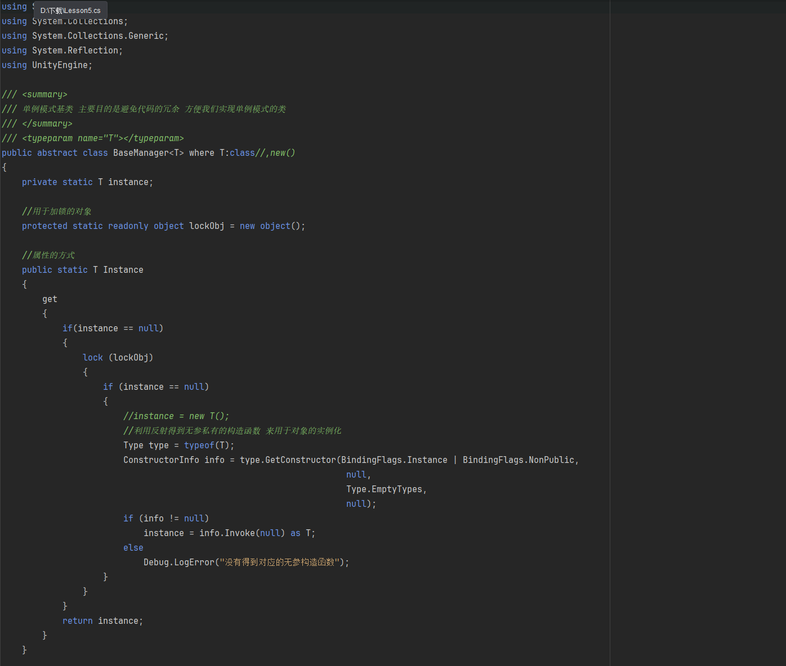

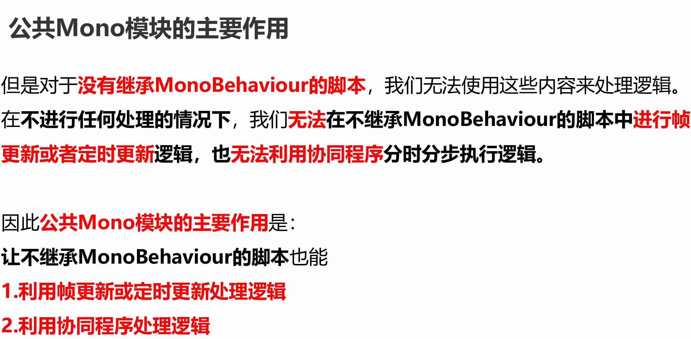

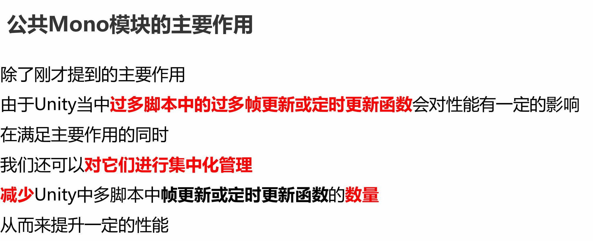


#### 【公共Mono模块】具体实现

##### 要内容回顾 

- 制作公共Mono模块必备知识点 
- 1.委托事件 相关知识（C#四部曲C#进阶中） 
- 2.生命周期函数 相关知识（Unity四部曲之Unity入门中） 
- 3.协同程序 相关知识（Unity四部曲之Unity基础中 
  
- 公共Mono模块的主要作用 
- 让不继承MonoBehaviour的脚本也能 
- 1.利用帧更新或定时更新处理逻辑 
- 2.利用协同程序处理逻辑 
- 3.可以统一执行管理帧更新或定时更新相关逻辑(不管你是否继承MonoBehaviour) 
  
- 公共Mono模块的基本原理 
- 1.通过事件或委托 管理 相关更新函数 
- 2.提供协同程序开启或关闭的方法

##### 知识点一 实现公共Mono模块 

- 1.创建MonoMgr继承 自动挂载式的继承MonoBehaviour的单例模式基类 
- 2.实现Update、FixedUpdate、LateUpdate生命周期函数 
- 3.声明对应事件或委托用于存储外部函数，并提供添加移除方法，从而达到让不继承MonoBehaviour的脚本可以执行帧更新或定时更新的目的 
- 4.声明协同程序开启关闭函数，从而达到让不继承MonoBehaviour的脚本可以执行协同程序的目的


##### 知识点二 测试 

- *MonoMgr.Instance.AddUpdateListener(MyUpdate);*

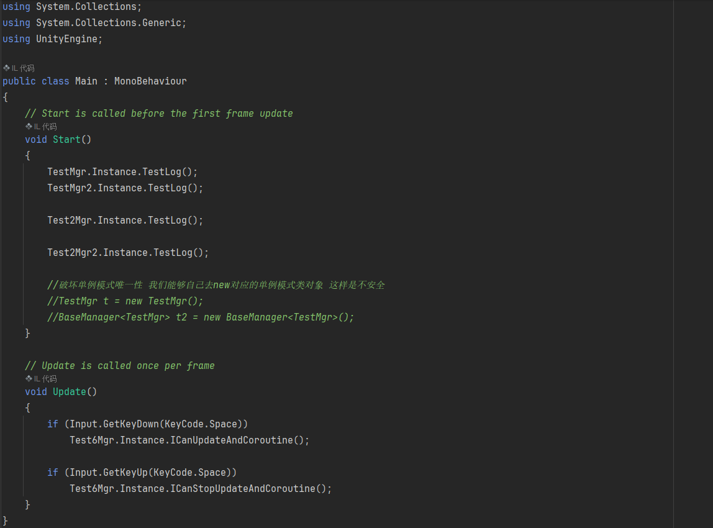


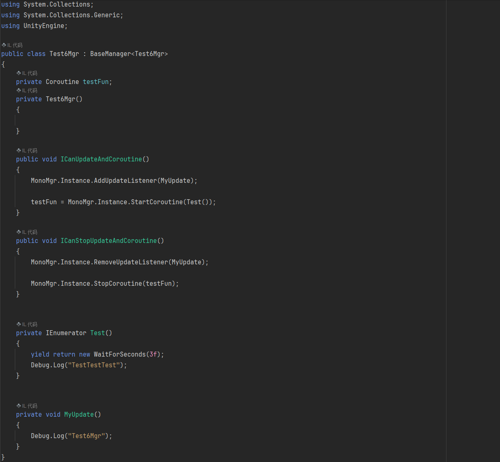

### ④缓存池（对象池）模块

#### 1.【缓存池（对象池）模块】主要作用和基本原理


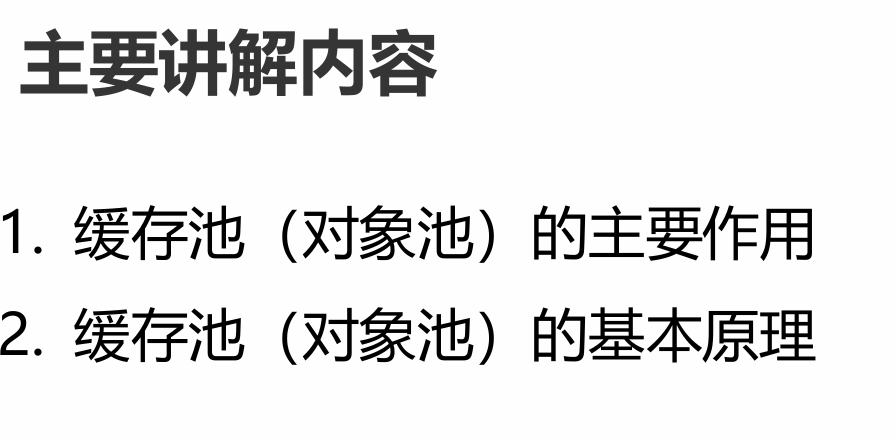

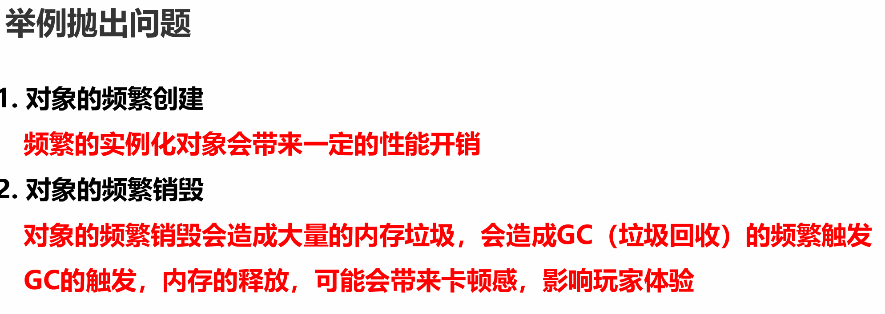

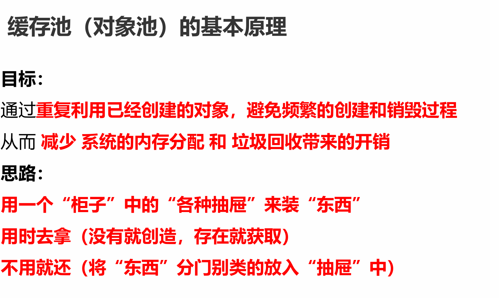


#### 2.【缓存池（对象池）模块】具体实现

##### 重要内容回顾 
- 必备知识点 
- 1.C#中垃圾回收机制（GC）相关知识（C#四部曲之C#核心中） 
- 2.C#中Dictionary、List、Stack、Queue相关知识点（C#四部曲之C#进阶中） 
- 3.Unity中GameObject相关知识（Unity四部曲之Unity入门中） 
- 4.Unity中Resources相关知识点（Unity四部曲之Unity入门中 
  
- 缓存池（对象池）的主要作用 
- 通过重复利用已经创建的对象，避免频繁的创建和销毁 
- 从而减少系统的内存分配和垃圾回收带来的开销 
  
- 缓存池（对象池）的基本原理 
- 用一个“柜子”中的“各种抽屉”来装“东西” 
- 用时去拿（没有就创造，存在就获取） 
- 不用就还（将“东西”分门别类的放入“抽屉”中）

##### 知识点一 实现缓存池(对象池)模块 

- 1.创建PoolMgr继承 不继承MonoBehaviour的单例模式基类 
- 2.声明柜子(Dictionary)和抽屉(List、Stack、Queue等)容器 
- 3.拿东西方法 
-   3-1：有抽屉并且抽屉里有东西 直接获取 
-   3-2: 没有抽屉或者抽屉里没东西 创造 
- 4.放东西方法 
-   4-1：有抽屉，直接放 
-   4-2：没抽屉，创建抽屉，再放 
- 5.清空柜子方法 
-   我们在切场景时，对象都会被移除，这时应该清空柜子  
-   否则会出现内存泄漏，并且下次取东西会出问题
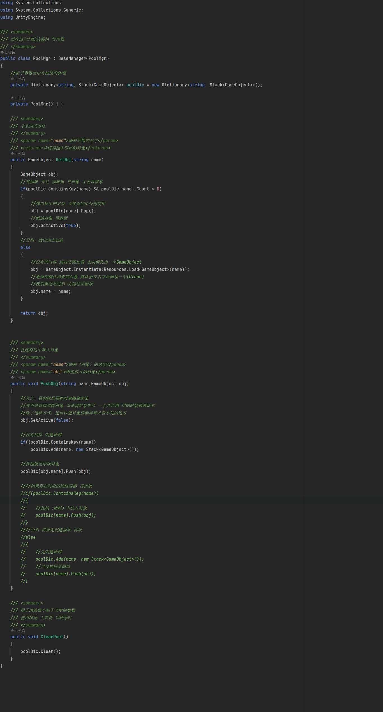
##### 知识点二 测试 

- 1.创建测试用几何体 
- 2.通过监听鼠标事件，动态创建物体 
- 3.创建一个延迟销毁脚本
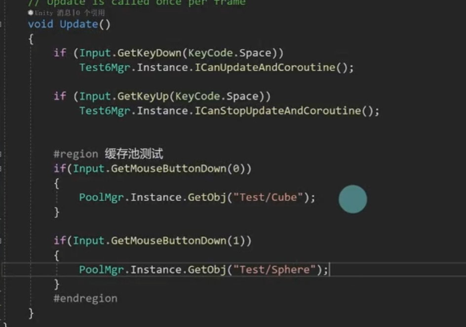

#### 3.【缓存池（对象池）模块】窗口布局优化

##### 知识点一 窗口布局优化指的是什么 

- 现在直接失活对象，当之后项目做大了，抽屉多了，对象多了 
- 游戏中成百上千个对象，在开发测试时不方便从Hierarchy窗口中查看对象获取信息 
- 因此我们希望能优化一下Hierarchy窗口中的布局 
- 将对象和抽屉的关系可视化

##### 知识点二 制作思路和具体实现 

- 制作思路： 
- 1.柜子管理自己的柜子根物体 
- 2.抽屉管理自己的抽屉根物体 
- 3.失活时建立父子关系，激活活时断开父子关系 
  
- 具体实现: 
- 1.先实现将所有对象放入柜子根物体中 
- 2.再实现将对象放入对应的抽屉根物体中 
-   用面向对象的思想将抽屉相关数据行为封装起来
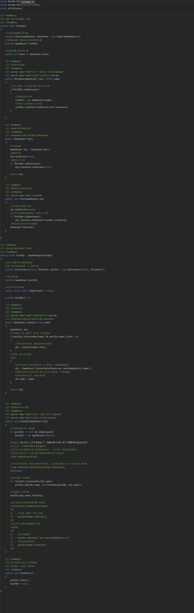

##### 知识点三 将其变为可控制开启的功能 

- 这样可以避免在真机运行时，由于父子关系的频繁变换 
- 带来一些额外的性能开销

#### 4.【缓存池（对象池）模块】对象上限优化

##### 知识点一 对象上限优化指的是什么？

- 目前我们制作的缓存池模块 
- 理论上来说，当动态创建的对象长时间不放回抽屉 
- 每次从缓存池中动态获取对象时，会不停的新建对象 
- 那么也就是对象的数量是没有上限的 
- 场景上的某种对象可以存在n个 
  
- 而对象上限优化指的就是 
- 我们希望控制对象数量有上限 
- 对于不重要的资源我们没必要让其无限加量 
- 而是将“使用最久”的资源直接抢来用 
  
- 主要目的： 
- 更加彻底的复用资源 
- 对对象的数量上限加以限制 
- 可以优化内存空间，甚至优化性能（减少数量上限，可以减小渲染压力）

##### 知识点二 制作思路和具体实现 

- 制作思路： 
- 1.在抽屉里声明一个容器用来记录正在使用的资源 
- 2.每次获取对象时，传入一个抽屉最大容量值（可以给一个默认值） 
- 3.从缓存池中获取对象时就需要创建抽屉，用于记录当前使用着的对象 
- 4.每次取对象时应该分情况考虑 
-   情况1：没有抽屉时 
-   情况2：有抽屉，并且抽屉里有没用的对象或者使用中对象超过上限时 
-   情况3：有抽屉，但是抽屉里没有对象，使用中对象也没有超过上限时 
- 4.每次放回对象时 
-   由于记录了正在使用的资源，因此每次放入抽屉时还需要从记录容器中移除对象 
  
- 具体实现: 
- 根据制作思路进行实现即可


#### 5.【缓存池（对象池）模块】Pool对象报空，BUG修改


#### 6.【缓存池（对象池）模块】思考题讲解


### ⑤事件中心模块

#### 1.【事件中心模块】主要作用和基本原理

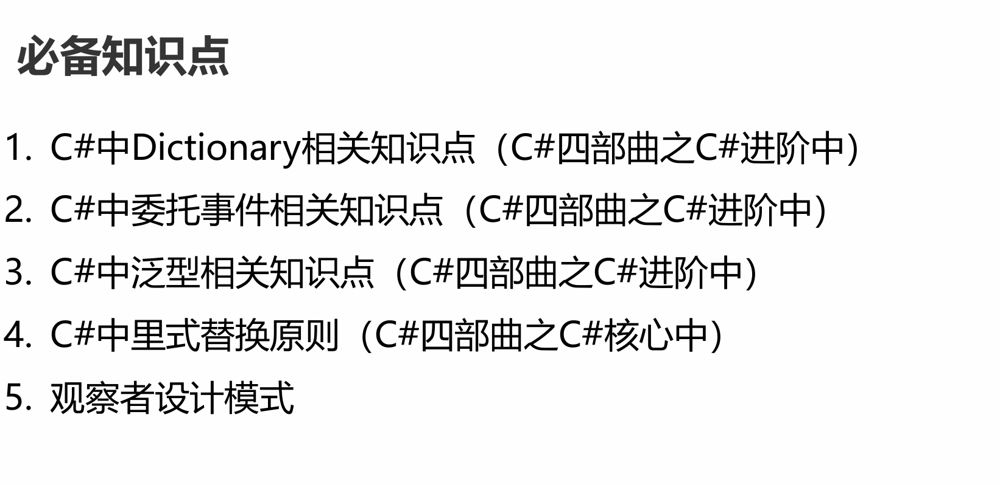
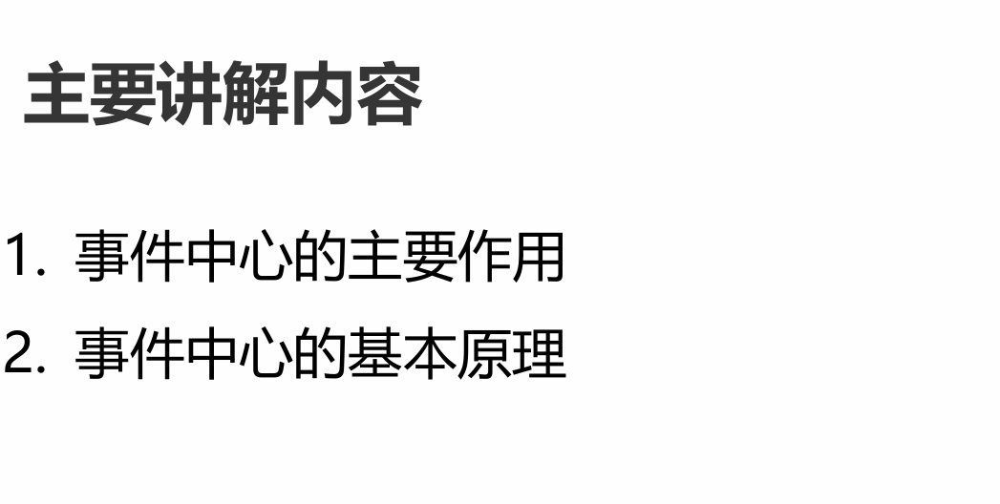
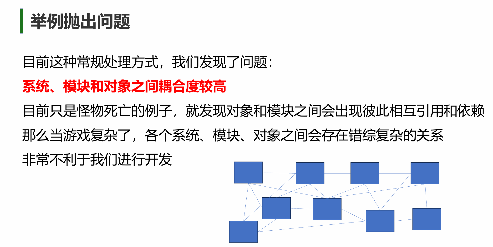


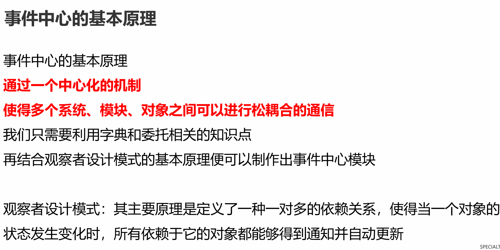


#### 2.【事件中心模块】具体实现

##### 重要知识回顾 

- 必备知识点 
- 1.C#中Dictionary相关知识点（C#四部曲之C#进阶中） 
- 2.C#中委托事件相关知识点（C#四部曲之C#进阶中） 
- 3.C#中泛型相关知识点（C#四部曲之C#进阶中） 
- 4.C#中里式替换原则（C#四部曲之C#核心中） 
- 5.观察者设计模式 
  
- 事件中心的主要作用 
- 解耦程序模块，降低程序耦合度 
- 它可以降低游戏中不同模块的耦合度 
- 不需要直接引用或依赖于彼此的具体实现  
  
- 事件中心的基本原理 
- 利用字典和委托相关的知识点 
- 再结合观察者设计模式的基本原理 
- 实现一个中心化的机制 
- 使得多个系统、模块、对象之间可以进行松耦合的通信

##### 知识点一 实现事件中心模块 

- 1.创建EventCenter继承 不继承MonoBehaviour的单例模式基类 
- 2.声明管理事件用容器 
- 3.实现关键方法 
-   触发(分发)事件 方法 
-   添加事件监听者 方法 
-   移除事件监听者 方法 
-   清除所有事件监听者 方法

````ad-warning
此处添加监听方法中 在字典记录为空情况下 

先传入了Null值 给字典对应键的值提供了空的事件委托 然后再给空委托添加具体方法

如果不这么做 只能给字典键对应的值提供new UnityAction(Func);

这么做的话等于是创建了新的UnityAction 虽然起到的效果一样 但是引用不同 

即新的new UnityAction Func  和原来的不是同一个

这时候通过移除 移除的是原来地址的Func(即移除的是老方法地址 但实际存入的是新方法) 所以无法移除

举个例子 

UnityAction func1 += test;

UnityAction func2 += test;

虽然都是一样的效果 但是func1 和 func2  虽然加入的方法地址相同 但是两者实际不等同
````

#### 3.【事件中心模块】传递参数

##### 知识点一 事件中心中传递参数指的是什么？ 

- 希望在触发事件时传递数据 
- 比如 
- 怪物死亡时，将怪物信息传递出去
- 获取奖励时，将奖励信息传递出去 
- 等等 
  
- 传递数据的主要目的是 
- 我们可以在各系统、模块、对象中获取到我们希望获取的有用信息

##### 知识点二 制作思路和具体实现 

- 我们目前触发事件，是通过执行委托中存储的函数来执行各系统对应的逻辑 
- 那么需要传递参数，我们很自然的联想到应该从委托入手 
  
- 但是参数的类型可能有多种多样，我们可以采用万物之父 object 利用里式替换原则 
- 父类容器装载子类对象的方式来传递参数
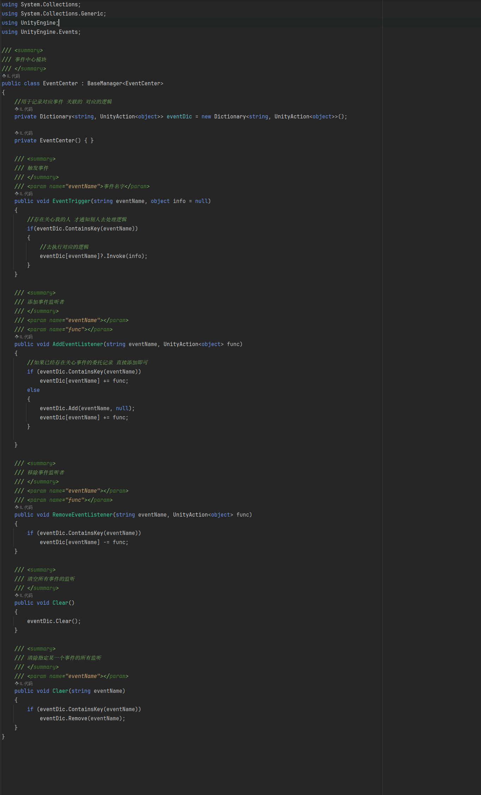


##### 知识点三 存在的问题 

- 使用object进行参数传递，当传递值类型数据时，会存在装箱拆箱，增加性能开销

#### 4.【事件中心模块】参数类型自定义

##### 知识点一 事件中心中 参数类型自定义 指的是什么？ 

- 上节课我们通过万物之父 object 利用里式替换原则（父类装子类） 
- 实现了在事件中心中传递参数 
- 但是使用object时，当传递值类型参数时，存在装箱拆箱的性能浪费 
  
- 而这节课要讲解的 参数类型自定义 指的就是 
- 在传递数据时，参数类型可以根据需求自己定义，想传什么就传什么，而不是固定的object类型

##### 知识点二 制作思路和具体实现 

- 制作思路： 
- 想让传递的参数类型可变，并且想传什么就传什么 
- 我们可以很自然的联想到使用泛型来制作该功能 
  
- 但是我们需要解决以下关键问题： 
- 字典容器中的 泛型委托 如何提前定好类型 
- 解决方案： 
- 里式替换原则（父类装子类）
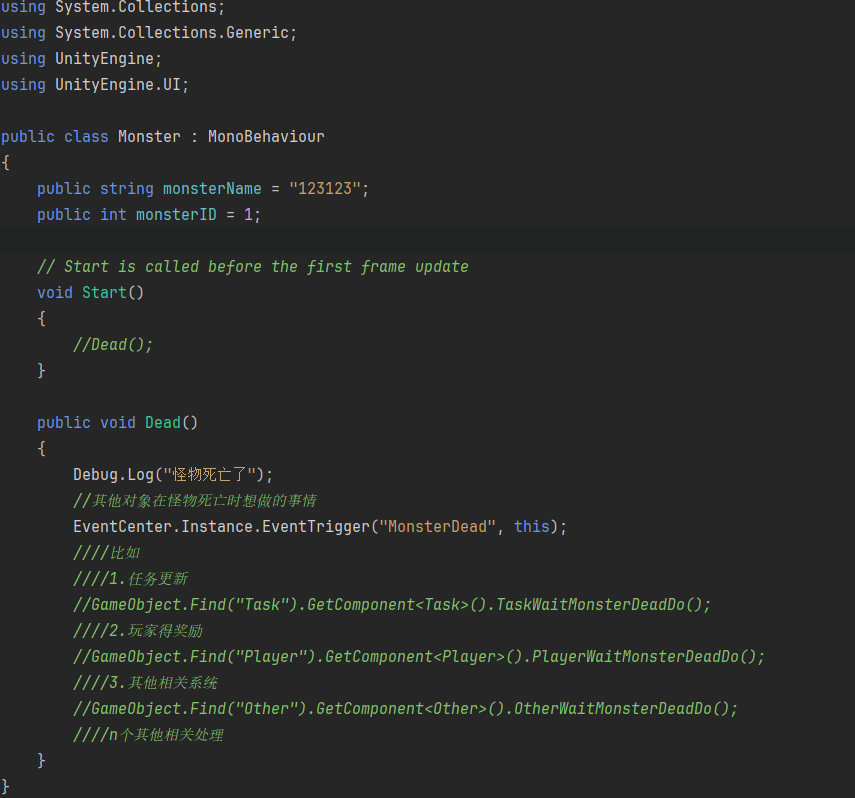

#### 5.【事件中心模块】事件名优化


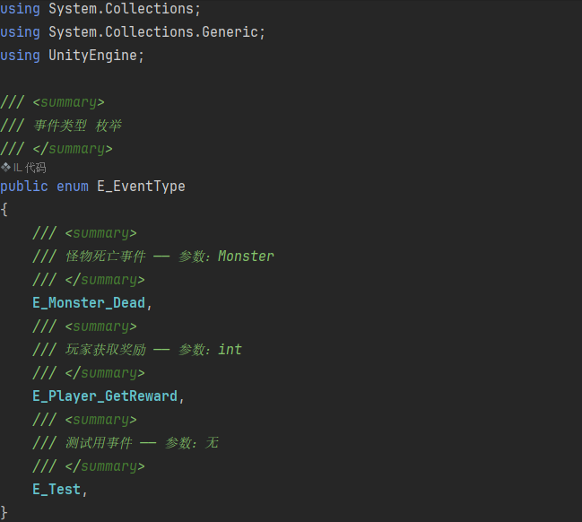


