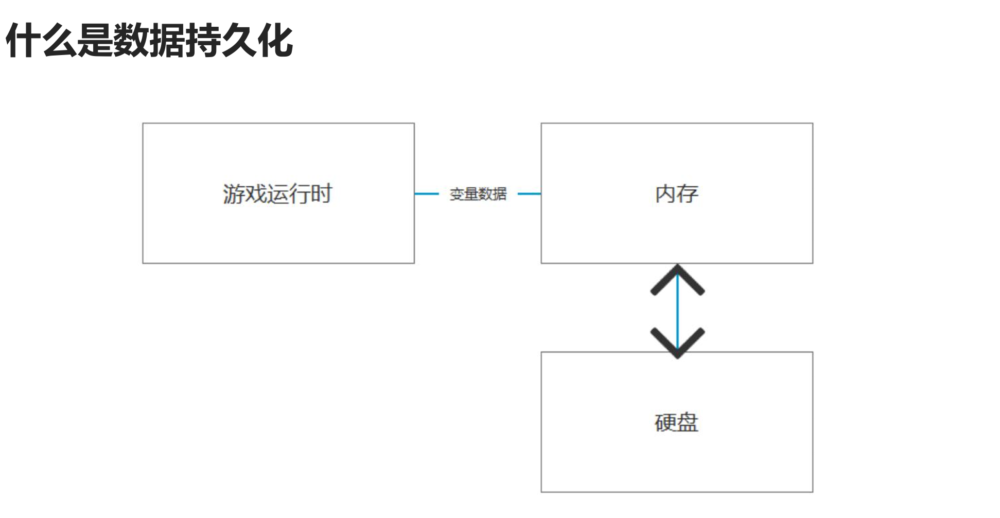
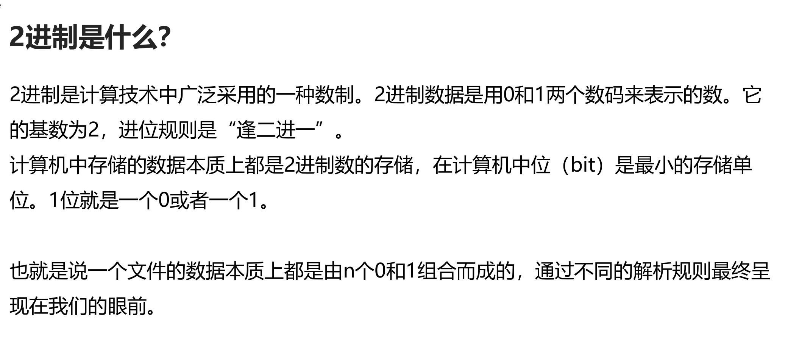

## 一、概述







## 二、基础知识 

#### 1.各类型转字节数组

##### 知识点一 回顾C#知识——不同变量类型 

- 不同变量类型 

- 有符号 sbyte int short long 
  
- 无符号 byte uint ushort ulong 
  
- 浮点 float double decimal 
  
- 特殊 bool char string

##### 知识点二 回顾C#知识——变量的本质 

- 变量的本质是2进制 
- 在内存中都以字节的形式存储着 
- 1byte = 8bit 
- 1bit(位)不是0就是1 
- 通过sizeof方法可以看到常用变量类型占用的字节空间长度 

- print("有符号"); 
- print("sbyte" + sizeof(sbyte) + "字节"); 
- print("int" + sizeof(int) + "字节"); 
- print("short" + sizeof(short) + "字节"); 
- print("long" + sizeof(long) + "字节"); 

- print("无符号"); 
- print("byte" + sizeof(byte) + "字节"); 
- print("uint" + sizeof(uint) + "字节"); 
- print("ushort" + sizeof(ushort) + "字节"); 
- print("ulong" + sizeof(ulong) + "字节"); 

- print("浮点"); 
- print("float" + sizeof(float) + "字节"); 
- print("double" + sizeof(double) + "字节"); 
- print("decimal" + sizeof(decimal) + "字节"); 

- print("特殊"); 
- print("bool" + sizeof(bool) + "字节"); 
- print("char" + sizeof(char) + "字节")


##### 知识点三 2进制文件读写的本质 

- 它就是通过将各类型变量转换为字节数组 
- 将字节数组直接存储到文件中 
- 一般人是看不懂存储的数据的 
- 不仅可以节约存储空间，提升效率 
- 还可以提升安全性 
- 而且在网络通信中我们直接传输的数据也是字节数据（2进制数据）

##### 识点四 各类型数据和字节数据相互转换 

- C#提供了一个公共类帮助我们进行转化 
- 我们只需要记住API即可 
- 类名：BitConverter 
- 命名空间：using System 
  
- 1.将各类型转字节 
- *byte[] bytes = BitConverter.GetBytes(256);* 
  
- 2.字节数组转各类型 
- *int i = BitConverter.ToInt32(bytes, 0);* 
- *print(i);*

##### 知识点五 标准编码格式 

- 编码是用预先规定的方法将文字、数字或其它对象编成数码，或将信息、数据转换成规定的电脉冲信号。 
- 为保证编码的正确性，编码要规范化、标准化，即需有标准的编码格式。 
- 常见的编码格式有ASCII、ANSI、GBK、GB2312、UTF - 8、GB18030和UNICODE等。 
  
-  说人话 
-  计算机中数据的本质就是2进制数据 
-  编码格式就是用对应的2进制数 对应不同的文字 
-  由于世界上有各种不同的语言，所有会有很多种不同的编码格式 
-  不同的编码格式 对应的规则是不同的 
  
-  如果在读取字符时采用了不统一的编码格式，可能会出现乱码 
  
-  游戏开发中常用编码格式 UTF-8 
-  中文相关编码格式 GBK 
-  英文相关编码格式 ASCII 
  
-  在C#中有一个专门的编码格式类 来帮助我们将字符串和字节数组进行转换 
  
-  类名：Encoding 
-  需要引用命名空间：using System.Text; 
  
- 1.将字符串以指定编码格式转字节 
- *byte[] bytes2 = Encoding.UTF8.GetBytes("唐老狮");* 
  
- 2.字节数组以指定编码格式转字符串 
- *string s = Encoding.UTF8.GetString(bytes2);* 
- *print(s);*

##### 总结 

- 我们可以通过BitConverter和Encoding类 
- 将所有C#提供给我们的数据类型和字节数组之间进行相互转换了 
- 我们需要熟练掌握其中的API

#### 2.文件操作相关——文件

##### 知识点一 代码中的文件操作是做什么 

- 在电脑上我们可以在操作系统中创建删除修改文件 
- 可以增删查改各种各样的文件类型 
  
- 代码中的文件操作就是通过代码来做这些事情

##### 知识点二 文件相关操作公共类 

- C#提供了一个名为File（文件）的公共类  
- 让我们可以快捷的通过代码操作文件相关 
- 类名：File 
- 命名空间： System.IO

##### 知识点三 文件操作File类的常用内容 

- 1.判断文件是否存在 
- *if(File.Exists(Application.dataPath + "/UnityTeach.tang"))* 
- *{* 
-     *print("文件存在");* 
- *}* 
- *- else* 
- *{* 
-     *print("文件不存在");* 
- *}* 

- 2.创建文件 
- *FileStream fs = File.Create(Application.dataPath + "/UnityTeach.tang");* 
  
- 3.写入文件 
- 将指定字节数组 写入到指定路径的文件中 
- *byte[] bytes = BitConverter.GetBytes(999);* 
- *File.WriteAllBytes(Application.dataPath + "/UnityTeach.tang", bytes);* 
- 将指定的string数组内容 一行行写入到指定路径中 
- *string[] strs = new string[] { "123", "唐老狮", "123123kdjfsalk", "123123123125243"};* 
- *File.WriteAllLines(Application.dataPath + "/UnityTeach2.tang", strs);* 
- 将指定字符串写入指定路径 
- *File.WriteAllText(Application.dataPath + "/UnityTeach3.tang", "唐老狮哈\n哈哈哈哈123123131231241234123");* 
  
- 4.读取文件 
- 读取字节数据 
- *bytes = File.ReadAllBytes(Application.dataPath + "/UnityTeach.tang");* 
- *print(BitConverter.ToInt32(bytes, 0));* 
  
- 读取所有行信息 
- *strs = File.ReadAllLines(Application.dataPath + "/UnityTeach2.tang");* 
- *for (int i = 0; i < strs.Length; i++)* 
- *{* 
-  *print(strs[i]);* 
- *}* 
  
- 读取所有文本信息 
- *print(File.ReadAllText(Application.dataPath + "/UnityTeach3.tang"));* 
  
- 5.删除文件 
- 注意 如果删除打开着的文件 会报错 
- *File.Delete(Application.dataPath + "/UnityTeach.tang");* 
  
- 6.复制文件 
- 参数一：现有文件 需要是流关闭状态 
- 参数二：目标文件 
- *File.Copy(Application.dataPath + "/UnityTeach2.tang", Application.dataPath + "/唐老狮.tanglaoshi", true);* 
  
- 7.文件替换 
- 参数一：用来替换的路径 
- 参数二：被替换的路径 
- 参数三：备份路径 
- *File.Replace(Application.dataPath + "/UnityTeach3.tang", Application.dataPath + "/唐老狮.tanglaoshi", Application.dataPath + "/唐老狮备份.tanglaoshi");* 
  
- 8.以流的形式 打开文件并写入或读取 
- 参数一：路径 
- 参数二：打开模式 
- 参数三：访问模式 
- *FileStream fs = File.Open(Application.dataPath + "/UnityTeach2.tang", FileMode.OpenOrCreate, FileAccess.ReadWrite);*

#### 3.文件操作相关——文件流

##### 知识点一 什么是文件流

- 在C#中提供了一个文件流类 FileStream类 
- 它主要作用是用于读写文件的细节 
- 我们之前学过的File只能整体读写文件 
- 而FileStream可以以读写字节的形式处理文件 
  
- 说人话： 
- 文件里面存储的数据就像是一条数据流（数组或者列表） 
- 我们可以通过FileStream一部分一部分的读写数据流 
- 比如我可以先存一个int（4个字节）再存一个bool（1个字节）再存一个string（n个字节） 
- 利用FileStream可以以流式逐个读写

##### 知识点二 FileStream文件流类常用方法 

- 类名：FileStream 
- 需要引用命名空间：System.IO 
  
- ## 1.打开或创建指定文件 

- ### 方法一：new FileStream 
- #### 参数一：路径 
- #### 参数二：打开模式 
-   CreateNew:创建新文件 如果文件存在 则报错 
-   Create:创建文件，如果文件存在 则覆盖 
-   Open:打开文件，如果文件不存在 报错 
-   OpenOrCreate:打开或者创建文件根据实际情况操作 
-   Append:若存在文件，则打开并查找文件尾，或者创建一个新文件 
-   Truncate:打开并清空文件内容 
- #### 参数三：访问模式 
- #### 参数四：共享权限 
-   None 谢绝共享 
-   Read 允许别的程序读取当前文件 
-   Write 允许别的程序写入该文件 
-   ReadWrite 允许别的程序读写该文件 
- *FileStream fs = new FileStream(Application.dataPath + "/Lesson3.tang", FileMode.Create, FileAccess.ReadWrite);* 
  
- ### 方法二：File.Create 
- #### 参数一：路径 
- #### 参数二：缓存大小 
- #### 参数三：描述如何创建或覆盖该文件（不常用） 
-   Asynchronous 可用于异步读写 
-   DeleteOnClose 不在使用时，自动删除 
-   Encrypted 加密 
-   None 不应用其它选项 
-   RandomAccess 随机访问文件 
-   SequentialScan 从头到尾顺序访问文件 
-   WriteThrough 通过中间缓存直接写入磁盘 
- *FileStream fs2 = File.Create(Application.dataPath + "/Lesson3.tang");* 
  
- ### 方法三：File.Open 
- #### 参数一：路径 
- #### 参数二：打开模式 
- *FileStream fs3 = File.Open(Application.dataPath + "/Lesson3.tang", FileMode.Open);* 

  
- ## 2.重要属性和方法 
- *FileStream fs = File.Open(Application.dataPath + "Lesson3.tang", FileMode.OpenOrCreate);* 
- #### 文本字节长度 
- *print(fs.Length);* 
  
- #### 是否可写 
- *if( fs.CanRead )* 
- *{* 
  
- *}* 
  
- #### 是否可读 
- *if( fs.CanWrite )* 
- *{* 
  
- *}* 
  
- #### 将字节写入文件 当写入后 一定执行一次 
- *fs.Flush();* 
  
- #### 关闭流 当文件读写完毕后 一定执行 
- *fs.Close();* 
  
- #### 缓存资源销毁回收 
- *fs.Dispose();* 
  
  
- ## 3.写入字节 
- *print(Application.persistentDataPath);* 
- *using (FileStream fs = new FileStream(Application.persistentDataPath + "/Lesson3.tang", FileMode.OpenOrCreate, FileAccess.Write))* 
- { 
  
- *byte[] bytes = BitConverter.GetBytes(999);* //bytes存入4字节整形999
- 方法：Write 
- 参数一：写入的字节数组 
- 参数二：数组中的开始索引 
- 参数三：写入多少个字节 
- *fs.Write(bytes, 0, bytes.Length);* 
  
- 写入字符串时 
- *bytes = Encoding.UTF8.GetBytes("唐老狮哈哈哈哈");* //覆盖bytes,bytes存入字符串
-  先写入长度 
- *int length = bytes.Length;* //得到字符串长度
- *fs.Write(BitConverter.GetBytes(bytes.Length), 0, 4);* //写入代表字符串长度的4字节整形
- 再写入字符串具体内容 
- *fs.Write(bytes, 0, bytes.Length);* //写入bytes中包含的长度为bytes.Length的字符串bytes
  
- 避免数据丢失 一定写入后要执行的方法 
- *fs.Flush();* 
- 销毁缓存 释放资源 
- *fs.Dispose();* 
- } 
  

  
- ## 4.读取字节 
  
- ###  方法一：挨个读取字节数组 
  
- *using (FileStream fs2 = File.Open(Application.persistentDataPath + "/Lesson3.tang", FileMode.Open, FileAccess.Read))* 
- { 
- 读取第一个整形 
- *byte[] bytes2 = new byte[4];* 
  
- #### 参数一：用于存储读取的字节数组的容器 
- #### 参数二：容器中开始的位置 
- #### 参数三：读取多少个字节装入容器 
- #### 返回值：当前流索引前进了几个位置  - 
- *int index = fs2.Read(bytes2, 0, 4);* 
- *int i = BitConverter.ToInt32(bytes2, 0);* 
- *print("取出来的第一个整数" + i);// 999* 
- *print("索引向前移动" + index + "个位置"); //4*

- 读取第二个字符串 
- 读取字符串字节数组长度 
- *index = fs2.Read(bytes2, 0, 4);* 
- *print("索引向前移动" + index + "个位置"); //4*
- *int length = BitConverter.ToInt32(bytes2, 0);* 
- 要根据我们存储的字符串字节数组的长度 来声明一个新的字节数组 用来装载读取出来的数据 
- *bytes2 = new byte[length];* 
- *index = fs2.Read(bytes2, 0, length);*
- *print("索引向前移动" + index + "个位置");* 
- 得到最终的字符串 打印出来 
- *print(Encoding.UTF8.GetString(bytes2));* 
- *fs2.Dispose();* 
- } 


````ad-tip

# Read 会将数据存入参数一代表的字节容器里

第一个方法为一次性read一部分数据，用bytes2来装read过后存入的数据

此时由于fs2.Read(bytes2, 0, 4) Byte中读取的数据会按照当前索引（即数据流第四位）往下搜寻四个字节

因此BitConverter.ToInt32(bytes2, 0)中的bytes2数据 实际是5-8位的数据，此时index=8

而5-8位的数据，记录的是字符串的长度

之后再次向后面读取fs2.Read(bytes2, 0, length)这么多位，即从index8开始向后读length长度字节 读出来的就是字符串本身


````


- ### 方法二：一次性读取再挨个读取 
- 
- *print("\*\*\*\*\*\*\*\*\*\*\*\*\*\*\*\*\*\*\*\*\*\*\*\*\*\*\*\");* 
- *using (FileStream fs3 = File.Open(Application.persistentDataPath + "/Lesson3.tang", FileMode.Open, FileAccess.Read))* 
- { 
- 一开始就申明一个 和文件字节数组长度一样的容器 
- *byte[] bytes3 = new byte[fs3.Length];* 
- *fs3.Read(bytes3, 0, (int)fs3.Length);* 
- *fs3.Dispose();* 
- 读取整数 
- *print(BitConverter.ToInt32(bytes3, 0));* 
- 读取字符串字节数组的长度 
- *int length2 = BitConverter.ToInt32(bytes3, 4);* 
- 得到字符串 
- *print(Encoding.UTF8.GetString(bytes3, 8, length2));* 
- }

````ad-tip

第二种方法则是 一开始就读取文件流全部数据 然后依次读取各自长度

由于BitConverter.ToInt32(bytes3, 0)) 是ToInt32所以默认只读取四字节

所以一开始读出来的就是int值999  然后从偏移值4开始读，读4字节，即字符串长度21

最后读字符串，从文件流偏移位置8开始读，读字符串长度length2

````

##### 知识点三 更加安全的使用文件流对象 

- using关键字重要用法 
- using (申明一个引用对象) 
- { 
- 使用对象 
- } 
- 无论发生什么情况 当using语句块结束后 
- 会自动调用该对象的销毁方法 避免忘记销毁或关闭流 
- using是一种更安全的使用方法 
  
- # 强调： 
- 目前我们对文件流进行操作 为了文件操作安全 都用using来进行处理最好


##### 总结 

- 通过FIleStream读写时一定要注意 
- 读的规则一定是要和写是一致的 
- 我们存储数据的先后顺序是我们制定的规则 
- 只要按照规则读写就能保证数据的正确性


#### 4. 文件夹操作相关——文件夹

##### 知识点一 文件夹操作是指什么？ 

- 平时我们可以在操作系统的文件管理系统中 
- 通过一些操作增删查改文件夹 
  
- 我们目前要学习的就是通过代码的形式 
- 来对文件夹进行增删查改的操作

##### 知识点二 C#提供给我们的文件夹操作公共类 

- 类名:Directory 
- 命名空间：using System.IO 
- ###### 1.判断文件夹是否存在 
- *if( Directory.Exists(Application.dataPath + "/数据持久化四"))*
- *{* 
-     *print("存在文件夹");* 
- *}* 
- *else* 
- *{* 
-     *print("文件夹不存在");*  
- *}* 
  
- ###### 2.创建文件夹 
- *DirectoryInfo info = Directory.CreateDirectory(Application.dataPath + "/数据持久化四");* 
  
- ###### 3.删除文件夹 
- 参数一：路径 
- 参数二：是否删除非空目录，如果为true，将删除整个目录，如果是false，仅当该目录为空时才可删除 
- Directory.Delete(Application.dataPath + "/数据持久化四"); 
  
- ###### 4.查找文件夹和文件 
- 得到指定路径下所有文件夹名 
- *string[] strs = Directory.GetDirectories(Application.dataPath);* 
- *for (int i = 0; i < strs.Length; i++)* 
- *{* 
-     *print(strs[i]);* 
- *}* 
  
- 得到指定路径下所有文件名 
- s*trs = Directory.GetFiles(Application.dataPath);* 
- *for (int i = 0; i < strs.Length; i++)* 
- *{* 
-     *print(strs[i]);* 
- *}* 
  
- ###### 5.移动文件夹 
- 如果第二个参数所在的路径 已经存在了一个文件夹 那么会报错 
- 移动会把文件夹中的所有内容一起移到新的路径 
- *Directory.Move(Application.dataPath + "/数据持久化四", Application.dataPath + "/123123123");*

##### 知识点三 DirectoryInfo和FileInfo 

- DirectoryInfo目录信息类 
- 我们可以通过它获取文件夹的更多信息 
- 它主要出现在两个地方 
- 1.创建文件夹方法的返回值 
- *DirectoryInfo dInfo = Directory.CreateDirectory(Application.dataPath + "/数据持久化123");* 
- 全路径 
- *print(dInfo.FullName);* 
- 文件名 
- *print(dInfo.Name);* 
  
- 2.查找上级文件夹信息 
- *dInfo = Directory.GetParent(Application.dataPath + "/数据持久化123");* 
- 全路径 
- *print(dInfo.FullName);* 
- 文件名 
- *print(dInfo.Name);* 
  
- 重要方法 
- 得到所有子文件夹的目录信息 
- *DirectoryInfo[] dInfos = dInfo.GetDirectories();* 
  
- FileInfo文件信息类 
- 我们可以通过DirectoryInfo得到该文件下的所有文件信息 
- *FileInfo[] fInfos = dInfo.GetFiles();* 
- *for (int i = 0; i < fInfos.Length; i++)* 
- *{* 
-     *print("\*\*\*\*\*\*\*\*\*\*\*\*\*\*");* 
-     *print(fInfos[i].Name);*//文件名 
-     *print(fInfos[i].FullName);* //路径 
-     *print(fInfos[i].Length);*//字节长度 
-     *print(fInfos[i].Extension);*//后缀名 
- *}*

##### 总结 

- Directory提供给我们了常用的文件夹相关操作的API 
- 只需要熟练使用它即可 
  
- DirectoryInfo和FileInfo 一般在多文件夹和多文件操作时会用到 
- 了解即可 
- 目前用的相对较少 他们的用法和Directory和File类的用法大同小异


# 练习题


