# 1.单例模式管理器

### 作用：保证类只有一个实例 并提供一个访问该实例的全局节点

#### 解决的问题： 保证类只有一个实例   并   为该实例提供一个全局访问点


```C#
public sealed class SingletonEager  
{  
    private static readonly SingletonEager _instance = new SingletonEager();  
    public static SingletonEager Instance => _instance;  
    private SingletonEager()
     { 
         /* 防止外部 new */ 
     }  
}
```
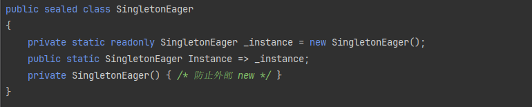

# 2.工厂模式

### 核心：在父类中提供一个创建对象的方法，允许子类决定实例化对象的类型
###           将“实例化具体产品”的决策委托给子类（或具体实现）。意图是把创建行为封装，让父类或客户端通过抽象接口来获取产品而不直接 new 具体类型。
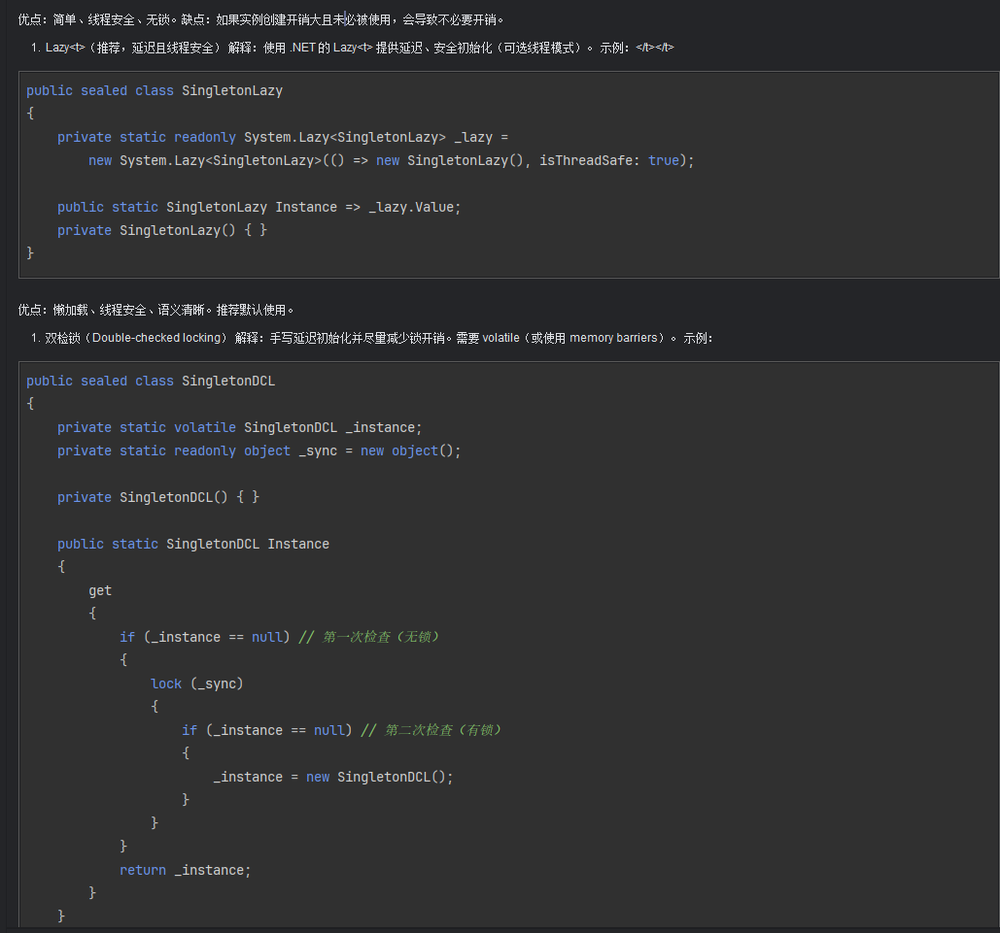
#### 经典实现：有抽象创建者 Creator，它定义一个抽象工厂方法 FactoryMethod()，由 ConcreteCreator 创建 ConcreteProduct。客户端通过 Creator 使用产品，但无需关心产品具体类。
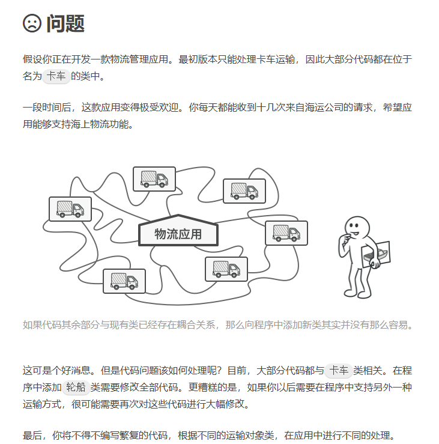

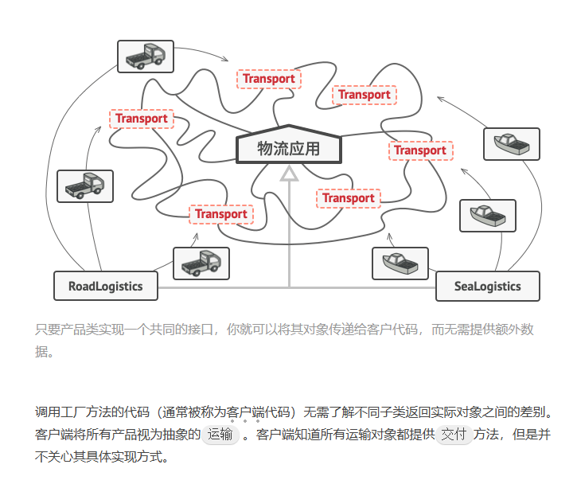
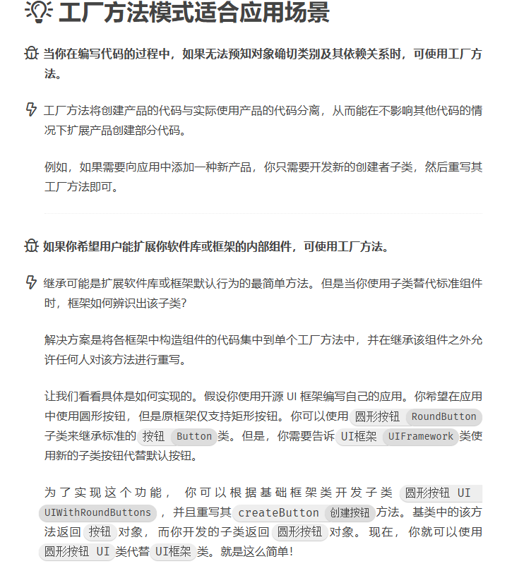

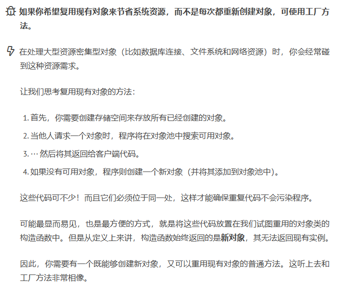


```C#
// Product 抽象  
public interface IProduct  //提供的接口  将产品的具体实现交给子类
{  
    void Use();  
}  
  
// 具体产品 Apublic class ConcreteProductA : IProduct  //子类对象A 继承IProduct接口
{  
    public void Use() => Console.WriteLine("Using Product A");   
}  
  
// 具体产品 Bpublic class ConcreteProductB : IProduct  //子类对象B 继承Iproduct接口
{  
    public void Use() => Console.WriteLine("Using Product B");  
}  
  
// Creator 抽象（定义工厂方法）  
public abstract class Creator  //抽象创建者基类
{  
    // 工厂方法，由子类决定创建哪种产品  
    protected abstract IProduct FactoryMethod();  //抽象方法 提供给子类  子类必须重写  返回类型为产品基类
  
    
    public void DoWork()                          // 模板方法：使用创建出的产品   
    {        var product = FactoryMethod();  
        Console.Write("Creator used -> ");  
        product.Use();  
    }}  
  
// 具体 Creator：创建 ProductApublic class ConcreteCreatorA : Creator  //创建者子类A 
{  
    protected override IProduct FactoryMethod() => new ConcreteProductA();  //实现方法重写  创建产品A
}  
  
// 具体 Creator：创建 ProductBpublic class ConcreteCreatorB : Creator  //创建者子类B
{  
    protected override IProduct FactoryMethod() => new ConcreteProductB();  //实现方法重写  创建产品B
}  
  
// 使用  
class Program  
{  
    static void Main()  
    {        Creator c1 = new ConcreteCreatorA();  //实例化创建者子类A 父类装子类 符合里氏替换原则 
        Creator c2 = new ConcreteCreatorB();       //实例化创建者子类B 父类装子类 符合里氏替换原则 
        c1.DoWork(); // Using Product A            //用创建者基类的子类A的实例来调用创建者基类中的DoWork方法
                                                   //DoWork方法会调用由子类负责具体实现的方法 来得到对应产品
                                                   
        c2.DoWork(); // Using Product B            //用创建者基类的子类B的实例来调用创建者基类中的DoWork方法
                                                   //DoWork方法会调用由子类负责具体实现的方法 来得到对应产品
    }   
}
```

#### 变体
```C#
public class DelegatingCreator  
{  
    private readonly Func<IProduct> _factory;  
    public DelegatingCreator(Func<IProduct> factory) => _factory = factory;  
    public void DoWork() => _factory().Use();  
}  
// 注册时： new DelegatingCreator(() => new ConcreteProductA());
```

````ad-tip
Creator 隐藏了创建细节，客户端只通过 Creator 的接口使用产品。

适合需要在多个子类中改变产品创建方式的框架/基类设计场景（例如不同策略下创建不同的策略对象）。

即 创建一个基类产品 但不给出具体实现 需要添加什么对应实现 都可以随意添加 并用工厂对象来调用这些对应实现 来实现功能的额外拓展 以及 功能的复用

#### 打个比方 ： 购物 在起初  有 以物易物 和 实体货币交互 这两种方式  再之后 来了个新人 提出了网上购物的方式  这时就可以通过拓展原有接口  并 声明对应工厂方法  来调用这种方式  实现了拓展 并且 仍可以方便调用以前的方法
````

# 3.抽象工厂

### 是一种创建型设计模式， 它能创建一系列相关的对象， 而无需指定其具体类。

### 定义一组创建相关对象的方法（例如 CreateButton、CreateCheckbox）。每个具体工厂返回同一风格的产品族。

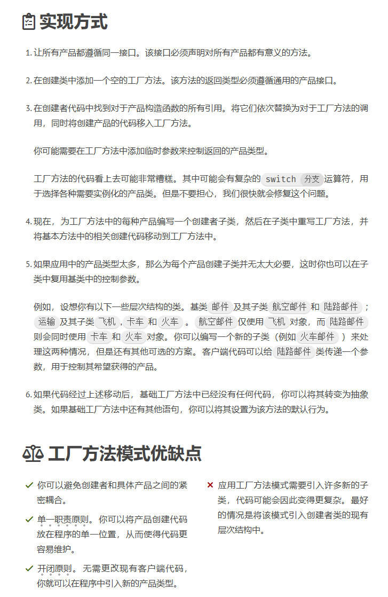
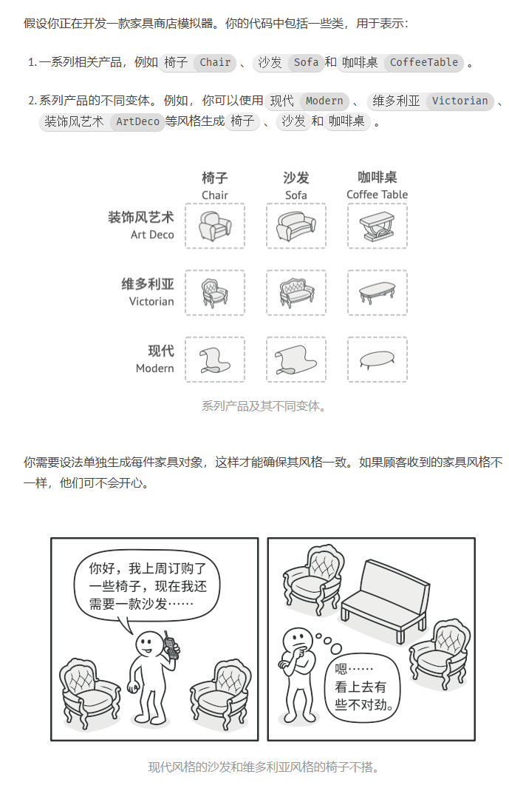

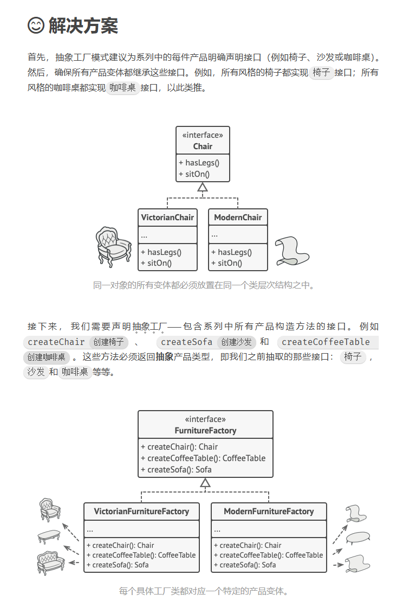
```C#
// 抽象产品  
public interface IButton { void Paint(); }       //按钮接口基类
public interface ICheckbox { void Paint(); }     //复选框接口基类
  
// Windows 产品  
public class WindowsButton : IButton { public void Paint() => Console.WriteLine("Windows Button"); }         //WINDOWS系统下的 按钮的具体实现
public class WindowsCheckbox : ICheckbox { public void Paint() => Console.WriteLine("Windows Checkbox"); }   //WINDOWS系统下的 复选框的具体实现
  
// Mac 产品  
public class MacButton : IButton { public void Paint() => Console.WriteLine("Mac Button"); }                 //IOS系统下的 按钮的具体实现
public class MacCheckbox : ICheckbox { public void Paint() => Console.WriteLine("Mac Checkbox"); }           //IOS系统下的 复选框的具体实现
  
// 抽象工厂  
public interface IGUIFactory                                                                                 //工厂基类
{  
    IButton CreateButton();                                                                                  //工厂接口基类提供的待子类实现的按钮方法
    ICheckbox CreateCheckbox();                                                                              //工厂接口基类提供的带子类实现的复选框方法
}  
  
// 具体工厂 Windowspublic class WindowsFactory : IGUIFactory                                                  //WINDOWS系统下的工厂方法 继承基类工厂接口
{   
    public IButton CreateButton() => new WindowsButton();                                                    //将基类待实现的方法导向 WINDOWS系统下 对按钮的具体实现 
    public ICheckbox CreateCheckbox() => new WindowsCheckbox();                                              //将基类待实现的方法导向 WINDOWS系统下 对复选框的具体实现 
}  
  
// 具体工厂 Macpublic class MacFactory : IGUIFactory                                                          //IOS系统下的工厂方法 继承基类工厂接口
{  
    public IButton CreateButton() => new MacButton();                                                        //将基类待实现的方法导向 IOS系统下 对按钮的具体实现 
    public ICheckbox CreateCheckbox() => new MacCheckbox();                                                  //将基类待实现的方法导向 IOS系统下 对复选框的具体实现 
}  
  
// 客户端  
public class Application                                                                                      //提供给外部的具体端口
{  
    private readonly IButton _button;                                                                         //用来存储最终需要实现的按钮对象效果
    private readonly ICheckbox _checkbox;                                                                     //用来存储最终需要实现的复选框对象效果
  
    public Application(IGUIFactory factory)                                                                   //交互端口（客户端）构造函数  只需要传入对应的工厂类型 即可创建对应工厂方案的 所有实现
    {        
        _button = factory.CreateButton();  
        _checkbox = factory.CreateCheckbox();  
    }  
    public void Paint()                                                                                       //绘制方法 调用传入进来的具体效果的具体实现
    {        
        _button.Paint();  
        _checkbox.Paint();  
    }
}  
  
// 使用  
class Program2  
{  
    static void Main()  
    {        
             IGUIFactory factory = new WindowsFactory(); // 或 new MacFactory()                                 //用基类工厂类型来装子类工厂 并将其实例化
             var app = new Application(factory);                                                                //之后传给客户端  识别工厂类型 来调用工厂类型内 对应的成套方法
             app.Paint();                                                                                       //调用客户端中的绘制方法
    }
}
```


````ad-tip
抽象工厂将“创建多个相关对象”的职责集中，确保产品之间一致（同一风格）。

# 客户端只依赖抽象工厂与抽象产品接口，切换工厂即可切换整套组件。

### 梳理逻辑 ： 

#### 1.首先  创建 产品基类 （假设有很多种类型 比如 按钮 单选框 复选框 文本格式 背景边框等）  分别为他们创建基类

#### 2.出于不同风格 为同一风格的产品 集中创建具体实现 

#### 3.创建工厂基类接口 里面申明具体产品的待实现方法 等待子类工厂实现 达成风格统一化

#### 4.创建具体同一风格的工厂 里面实现基类接口的方法  并将实现 引向 对应风格产品的具体实现 （即步骤二创建的那些） 有几种风格 创建几种工厂

#### 5.创建暴露给外部的端口 内部声明 需要承接最终实现的对象容器 并创建构造函数 以便只需要切换传入的实参（具体工厂类型） 就可以整体切换最终实现效果的集合  并暴露给外部方法 来具体调用对应集合内的产品的具体实现

###### 构造函数部分 可以理解成 得到产品集合的整体框架 而非其内部的具体实现（空有架子 无实现本身） 暴露给外部的方法 才是最终实现效果
````

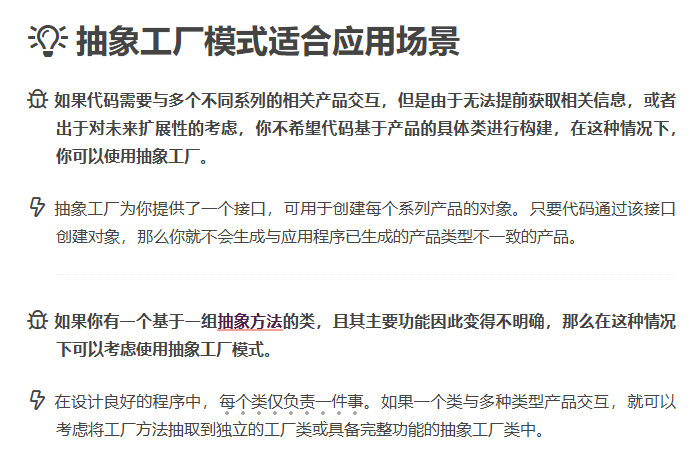
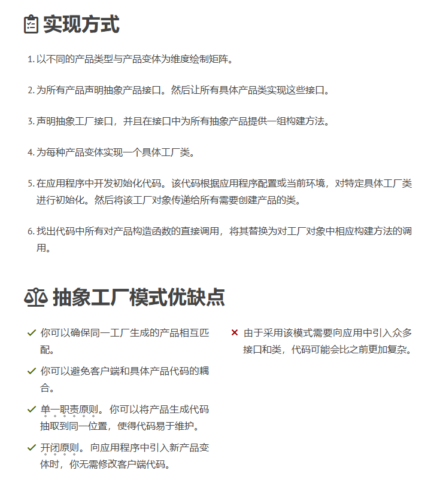

# 4.生成器模式


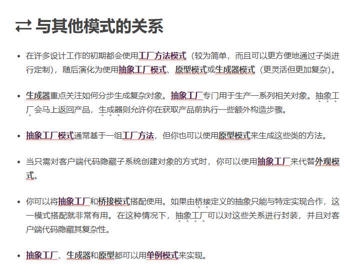
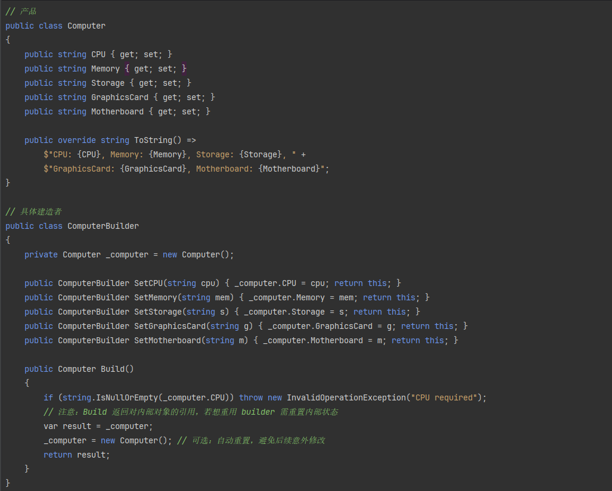


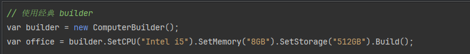
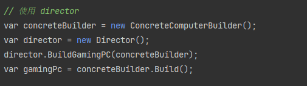


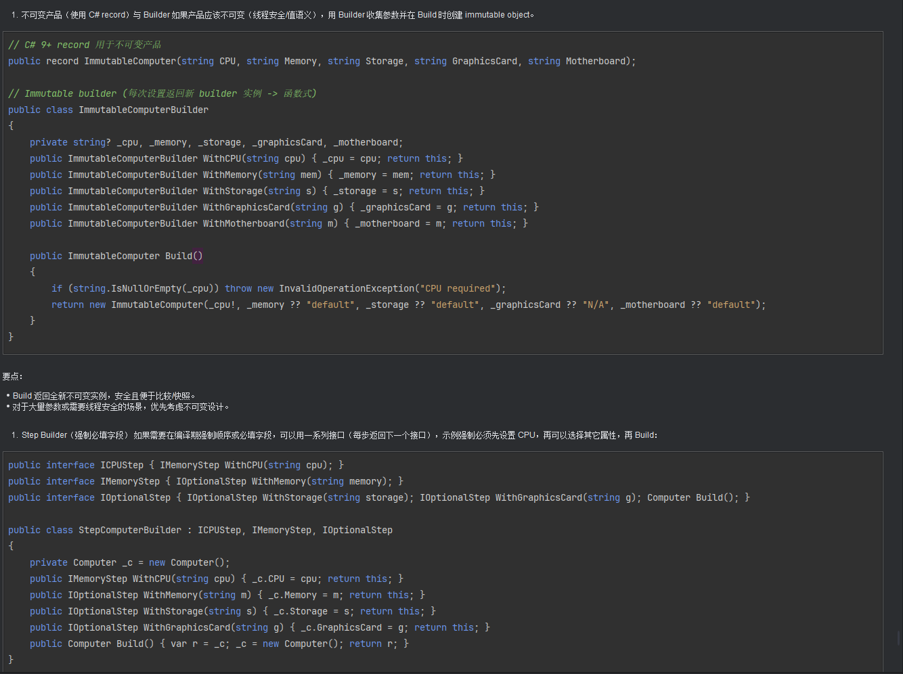


# 5.原型模式

### 适用场景 ：
#### 如果你需要复制一些对象， 同时又希望代码独立于这些对象所属的具体类， 可以使用原型模式。

#### 如果子类的区别仅在于其对象的初始化方式， 那么你可以使用该模式来减少子类的数量。 别人创建这些子类的目的可能是为了创建特定类型的对象。
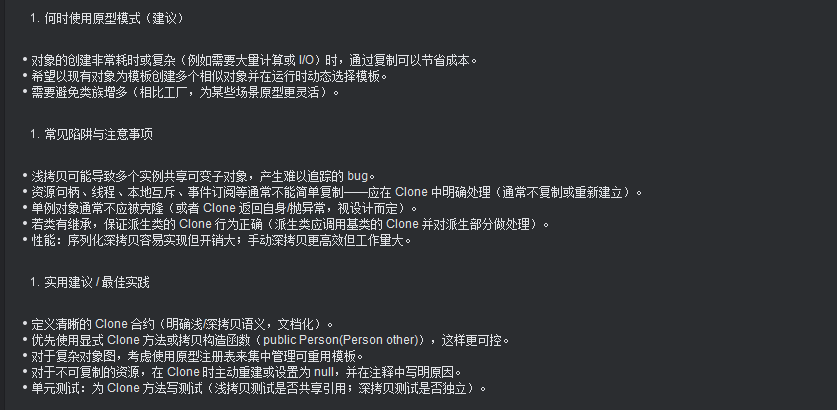
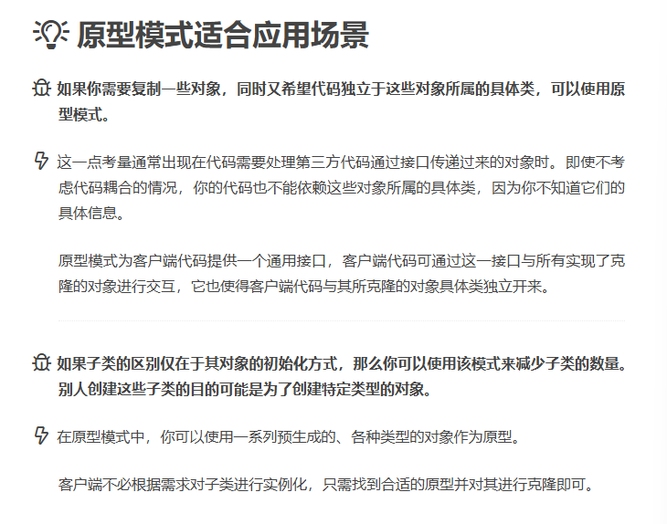

### 优点：

#### 1.可以克隆对象， 而无需与它们所属的具体类相耦合。
#### 2.可以克隆预生成原型， 避免反复运行初始化代码
#### 3.可以更方便地生成复杂对象。
#### 4.可以用继承以外的方式来处理复杂对象的不同配置

### ：缺点

#### 克隆包含循环引用的复杂对象可能会非常麻烦。


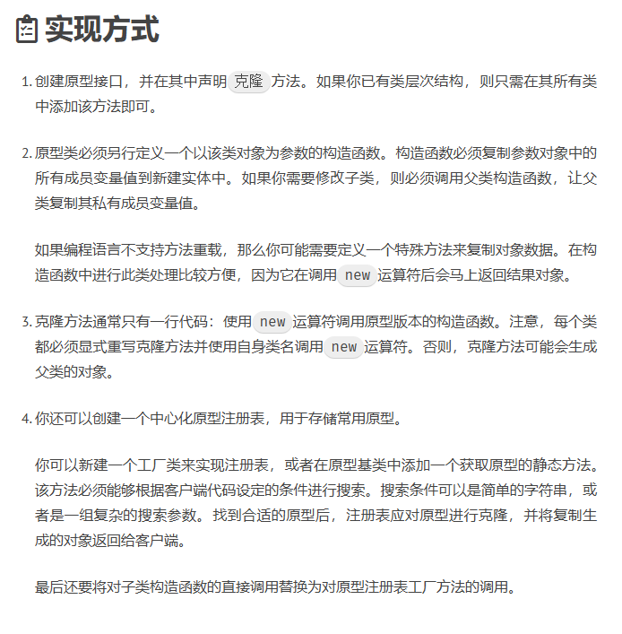
#### 实例

```C#
using System;  
  
namespace PrototypeDemo  
{  
    // 一个有可变子对象的类  
    public class Address  
    {  
        public string City { get; set; }  
        public string Street { get; set; }  
        public override string ToString() => $"{Street}, {City}";  
    }  
    // 原型接口（泛型更安全）  
    public interface IPrototype<T>  
    {       
        T Clone(); // 语义：返回一个副本（说明是浅拷贝还是深拷贝）  
    }  
  
    // 使用 MemberwiseClone 的浅拷贝示例  
    public class PersonShallow : IPrototype<PersonShallow>  
    {        
        public string Name { get; set; }  
        public Address Address { get; set; }  
  
        public PersonShallow Clone()  
        {            
            // MemberwiseClone 返回 object，需要转换  
            return (PersonShallow)MemberwiseClone();  
        }  
        public override string ToString() => $"{Name}, {Address}";  
    }  
    public class Program  
    {  
        static void Main()  
        {            
            var original = new PersonShallow  
            {  
                Name = "Alice",  
                Address = new Address { City = "Beijing", Street = "Chaoyang Rd" }  
            };  
            var clone = original.Clone();  
            clone.Name = "Bob";  
            clone.Address.Street = "Wangfujing Rd"; // 修改子对象  
  
            Console.WriteLine("Original: " + original); // Address 会被改变（浅拷贝）  
            Console.WriteLine("Clone   : " + clone);  
        }    
    }
}
```

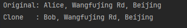

````ad-tip
这里Name没变是因为 string 是特殊类型的引用类型  为string类型赋值 等于是创建新的string字段 创建了新的引用
````

# 适配器模式

### 创建意图： 使接口不兼容的对象能够相互合作

````ad-tip
通常表现为 一个类或者对象 不继承某个接口 在不改变的原本代码的情况下 为它添加适配器 （转接头 类比NS插头日式转中式）

适配器继承新接口 适配器内含有可以存储老对象/类的容器 并且适配器的构造函数 参数要求输入老的对象/类 并重写接口中方法 完成对老对象/类的调用

 
````

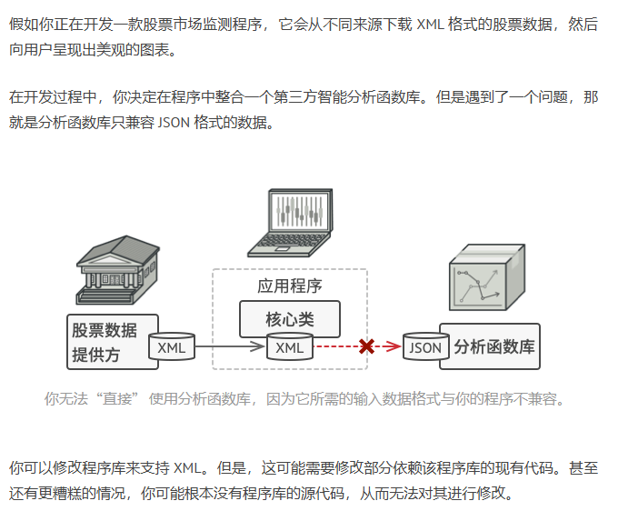

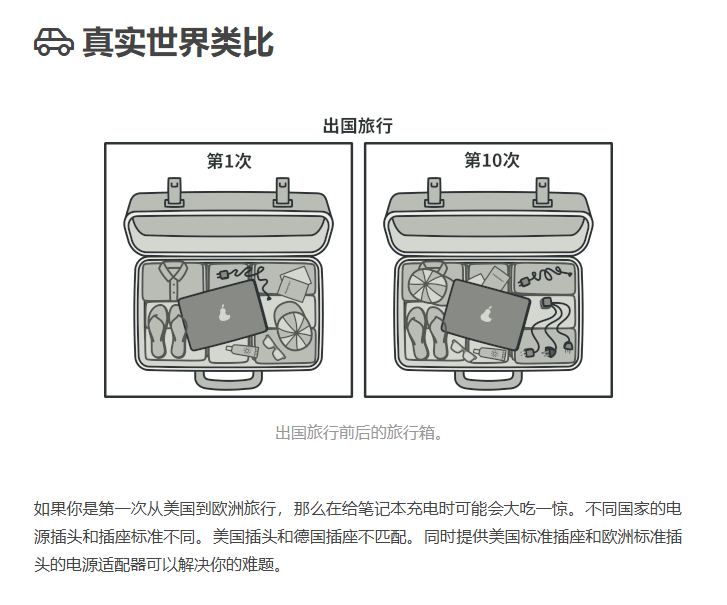

#### 优点：
#####   单一职责原则_你可以将接口或数据转换代码从程序主要业务逻辑中分离。
#####   开闭原则。 只要客户端代码通过客户端接口与适配器进行交互， 你就能在不修改现有客户端代码的情况下在程序中添加新类型的适配器。

#### 缺点：
##### 代码整体复杂度增加， 因为你需要新增一系列接口和类。 有时直接更改服务类使其与其他代码兼容会更简单。


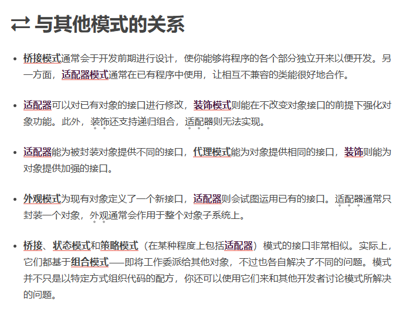

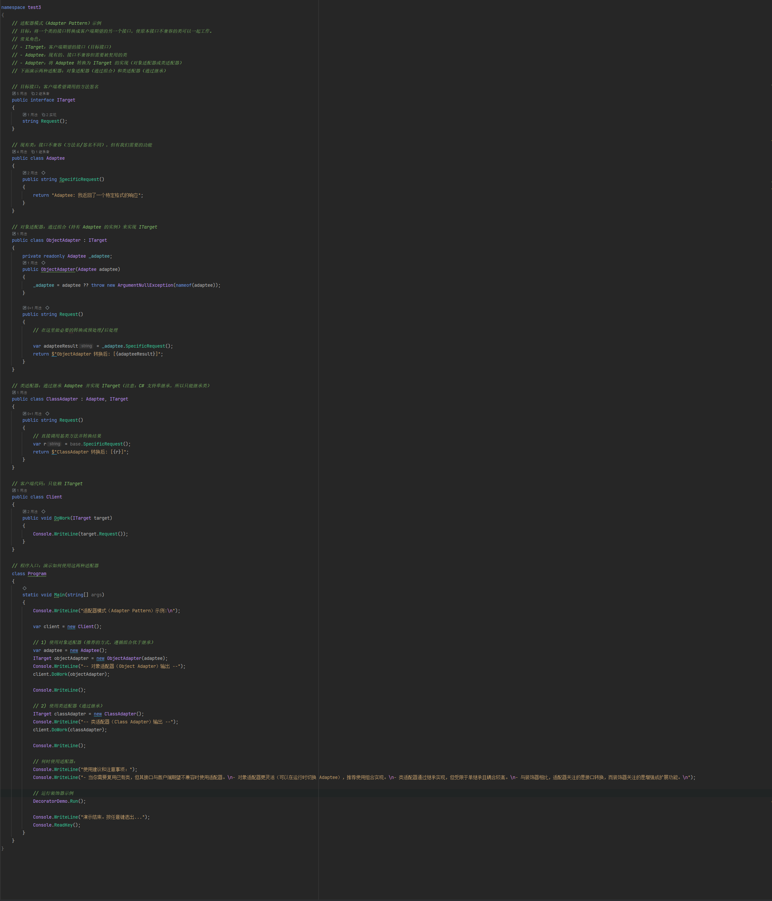


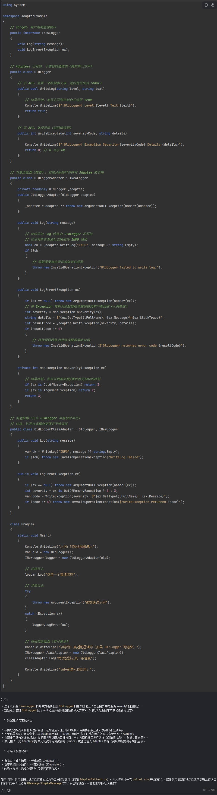


# 装饰器模式 

### 意图：  允许你通过将对象放入包含行为的特殊封装对象中来为原对象绑定新的行为。

````ad-tip
装饰器模式 主要作用是 用来为对象创造新的行为


````

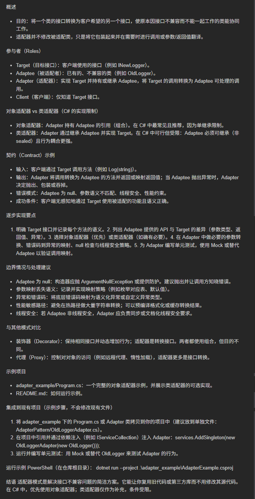

#### 优点：

##### 1.无需创建新子类即可扩展对象的行为。
##### 2.可以在运行时添加或删除对象的功能。
##### 3.可以用多个装饰封装对象来组合几种行为。
##### 4._单一职责原则_。 你可以将实现了许多不同行为的一个大类拆分为多个较小的类。

#### 缺点：

##### 1.在封装器栈中删除特定封装器比较困难。
##### 2.实现行为不受装饰栈顺序影响的装饰比较困难。
##### 3.各层的初始化配置代码看上去可能会很糟糕。


#### 应用场景

##### 1.如果你希望在无需修改代码的情况下即可使用对象， 且希望在运行时为对象新增额外的行为， 可以使用装饰模式。
##### 2.如果用继承来扩展对象行为的方案难以实现或者根本不可行， 你可以使用该模式。

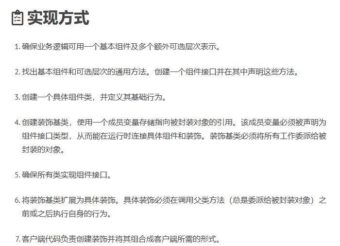


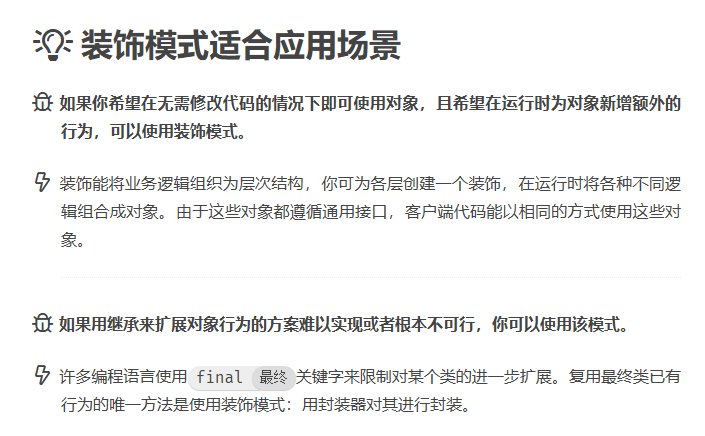


