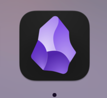

<!-- more -->

<div align="center"  style="font-size:1.4em;"><h2><strong> 语法演示</strong></h2></div>


直接复制可以粘贴文件，但是不要随便移动文件和文件夹，自己跟随的插件不好用，数字可以控制大小




使用ad- 可以出现特殊提示块
````ad-example
collapse: true
```Csharp

Console.log("Hello World")

```
运行结果
```
Hello World
```
````

左边有插入模板
ctrl+6可以[^1]插入自增[^2]

`command+.`可以切换源码模式(win下不知道对应什么，可以从快捷键自己设置)

右边有git的相关配置
remotely save 可以同步到onedrive 全端都可以同步，但是注意一个端同步完了再同步另一个，同步机制和onedrive类似

模板之类的用到再去看文档
我自己有几个 模板 和 字典提示 在res下，是适配我自己的打包博客来的，你自己用的话不习惯和不用的改一下

日历可以用来写日报周报，但是我不用就只是当时配置了，不写就当个挂件


[^1]: 角标
[^2]: 的角标

## 其他的markdown通用语法看[这一篇](https://publish.obsidian.md/chinesehelp/01+2021%E6%96%B0%E6%95%99%E7%A8%8B/Obsidian%E7%AC%94%E8%AE%B0%E4%B8%AD%E7%9A%84%E9%82%A3%E4%BA%9BMD%E8%AF%AD%E6%B3%95+by+%E8%9A%95%E5%AD%90)就足够了，剩下的都不用管，我复制到了下面可以直接看在这里面的形态


我们目前支持以下MD语法：

---

### 标题

# 这是标题 1

## 这是标题 2

### 这是标题 3

#### 这是标题 4

##### 这是标题 5

###### 这是标题 6

---

### 重点

*本行文字为斜体*  
_这行也是斜体_

**本行文本为粗体**  
**这行也是粗体** 

_您 **可以** 合并两种效果_

---

### 清单

- 项目 1
- 项目 2
    - 项目 2a
    - 项目 2b

1. 项目 1
2. 项目 2
3. 项目 3
    1. 项目 3a
    2. 项目 3b

---

### 图像


---

### 链接

[http://obsidian.md](http://obsidian.md) - automatic!  
[Obsidian](http://obsidian.md)

---

### 块引用

> 人类面临着越来越复杂和紧迫的问题，如何有效地处理这些问题，关系到社会的稳定和持续进步。

- Doug Engelbart, 1961

---

### 内联代码

一行文本中 `单引号` 内的文本将被格式化为代码。

---

### 代码块

Syntax highlight is supported with the language specified after the first set of backticks. We use prismjs for syntax highlighting, a list of supported languages can be found [at their site](https://prismjs.com/#supported-languages)

```js
function fancyAlert(arg) {
  if(arg) {
    $.facebox({div:'#foo'})
  }
}
```

```
Text indented with a tab is formatted like this, and will also look like a code block in preview. 
```

---

### 任务列表

- [x] 支持 [#标签](https://publish.obsidian.md/#标签), [链接](https://publish.obsidian.md/#), **格式**
- [x] 需要列表语法 (支持无序和有序列表)
- [x] 这是一个完成的项目
- [ ] 这是一个未完成的项目
- [ ] 点击复选框可以切换任务的进展情况

---

### 表格

您可以通过组合单词列表并用连成字符 `-` 分割行，然后用竖线 `|` 分隔列来创建表格：

|表头1|表头2|
|---|--:|
|单元格1中的内容|单元格2中的内容|
|第1列中的内容|第2列中的内容|

---

|可以有冒号对齐表格|另一个长标题示例|
|:--|--:|
|使用`:`的效果|这是右对齐效果|

---

### 删除线

用两个波浪号包含任何单词 (例如 ~~这个~~) 将被标注删除线。

---

### 脚注

这是一个简单的脚注效果，[[1]](https://publish.obsidian.md/#fn-1-b2007feffe4b19e8) 这是一个较长的脚注。[[2]](https://publish.obsidian.md/#fn-2-b2007feffe4b19e8)

您还可以使用内部脚注。 [[3]](https://publish.obsidian.md/#fn-3-b2007feffe4b19e8)

### 数学公式

## Obsidian 特定格式

### 高亮文本

使用两边空格加两个等号包含  ==需要高亮的文本== .

### 内部链接

使用双层方括号包含文本，可以链接到页面： [Internal link](https://publish.obsidian.md/chinesehelp/Internal+link).

### 内部嵌入

使用感叹号和内部链接的格式来嵌入其它文件 (阅读有关 [Embed files](https://publish.obsidian.md/chinesehelp/Embed+files) 的更多信息).

obsidian

在本文档中，obsidian是值基于[Electron](https://publish.obsidian.md/chinesehelp/01+2021%E6%96%B0%E6%95%99%E7%A8%8B/Electron)一款笔记软件。  
其他的含义有黑曜石，是一种矿石，可见于许多游戏中。

## 开发者笔记

因为使用了稍微个性的语法组合，我们努力在不破坏任何现有格式的情况下获得最大的功能。它是一个广泛的通用标记，增加了一些GitHub 风格的Markdown(GFM)功能， LaTex支持，以及我们选择的嵌入语法。您可以在 [Embed files](https://publish.obsidian.md/chinesehelp/Embed+files) 页面了解到更多信息。

---

1. 有意义！[↩︎](https://publish.obsidian.md/#fnref-1-b2007feffe4b19e8)
    
2. 这里有多个段落和代码。
    
    Indent paragraphs to include them in the footnote.
    
    `{ my code }`
    
    Add as many paragraphs as you like.[↩︎](https://publish.obsidian.md/#fnref-2-b2007feffe4b19e8)
    
3. 请注意，尖帽子符号在括号以外才生效 [↩︎](https://publish.obsidian.md/#fnref-3-b2007feffe4b19e8)


✓